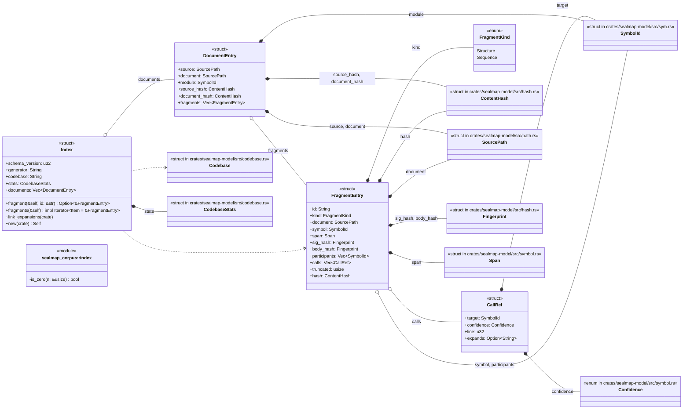
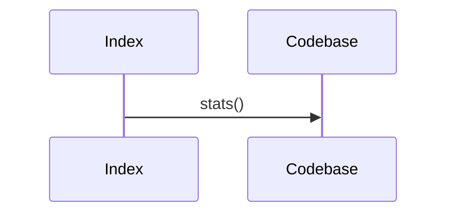
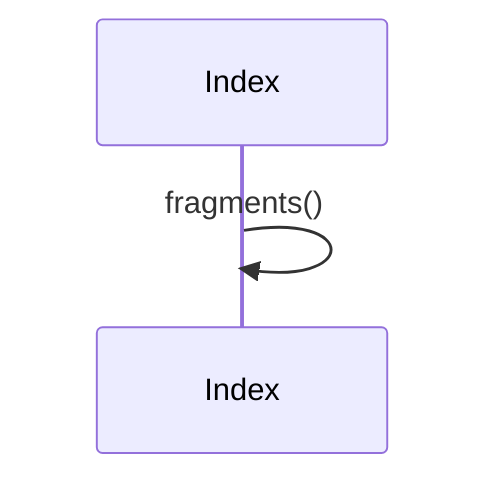

# `sym:cargo sealmap_corpus . index/` · crates/sealmap-corpus/src/index.rs
> `_index.json`: the merge map for orchestrating agents.

## structure

## `sym:cargo sealmap_corpus . index/Index#new().`
`pub(crate) fn new(cb: &Codebase) -> Self` · L101-L109

## `sym:cargo sealmap_corpus . index/Index#link_expansions().`
`pub(crate) fn link_expansions(&mut self)` · L111-L125
> Fill in [`CallRef::expands`] once all fragments are known.

## `sym:cargo sealmap_corpus . index/Index#fragment().`
`pub fn fragment(&self, id: &str) -> Option<&FragmentEntry>` · L132-L135
> Look up a fragment by id.

