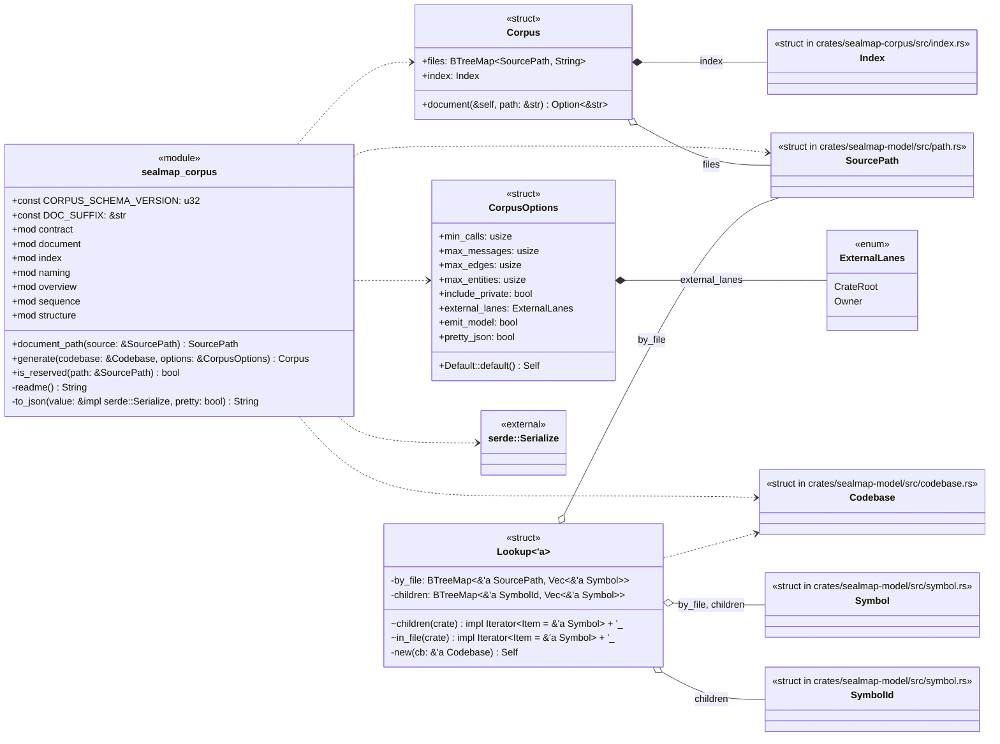
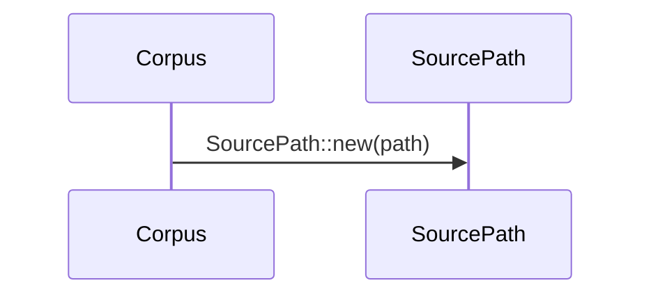
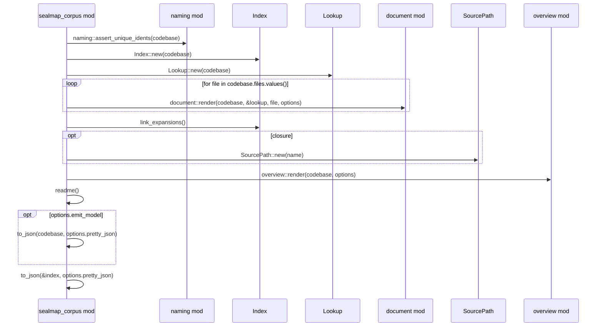
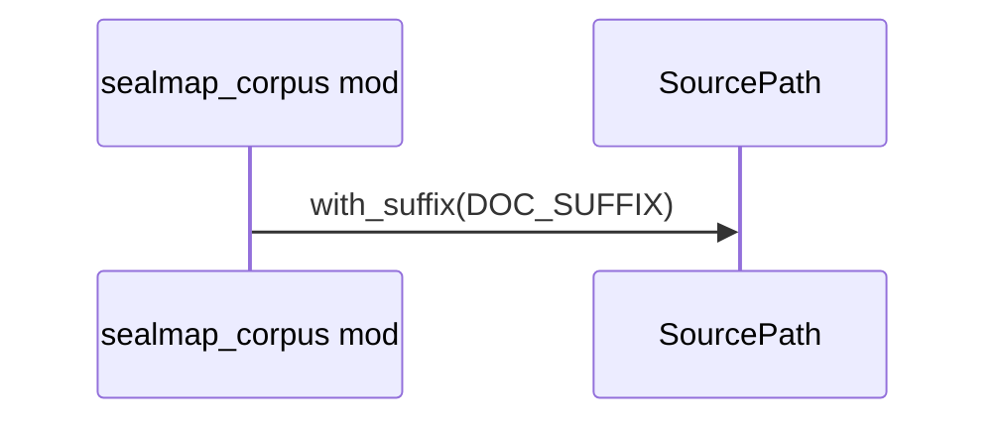
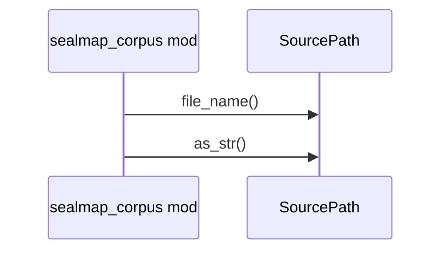
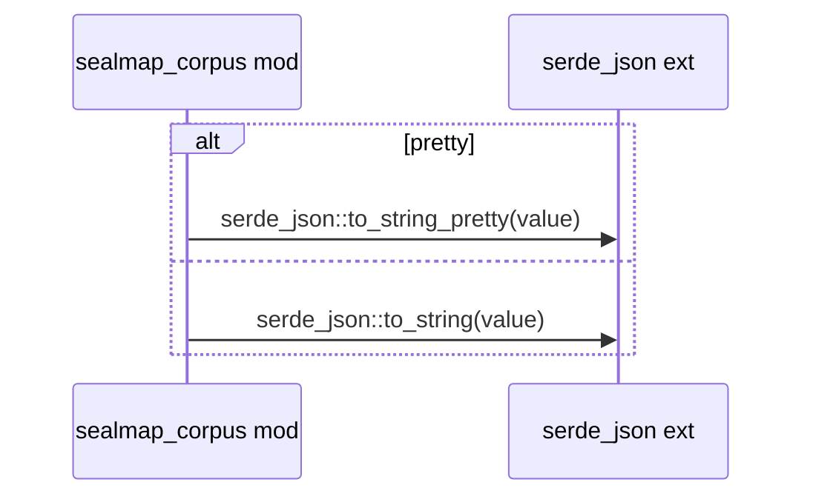

# `sealmap_corpus` · crates/sealmap-corpus/src/lib.rs
> Projects a [`Codebase`] into a **contract-enforced, 1:1 corpus** of dense Mermaid diagrams plus machine-readable metadata, designed to be read by LLM agents an…

## structure

## `sealmap_corpus::Corpus::document`
`pub fn document(&self, path: &str) -> Option<&str>` · L166-L169
> Contents of a generated file by relative path.

## `sealmap_corpus::generate`
`pub fn generate(codebase: &Codebase, options: &CorpusOptions) -> Corpus` · L172-L193
> Generate the full corpus in memory.

## `sealmap_corpus::document_path`
`pub fn document_path(source: &SourcePath) -> SourcePath` · L230-L233
> Map a source path to its document path (`src/a.rs` → `src/a.rs.md`).

## `sealmap_corpus::is_reserved`
`pub fn is_reserved(path: &SourcePath) -> bool` · L235-L238
> `true` for corpus-level files (`_index.json`, ...).

## `sealmap_corpus::to_json`
`fn to_json(value: &impl serde::Serialize, pretty: bool) -> String` · L240-L245

