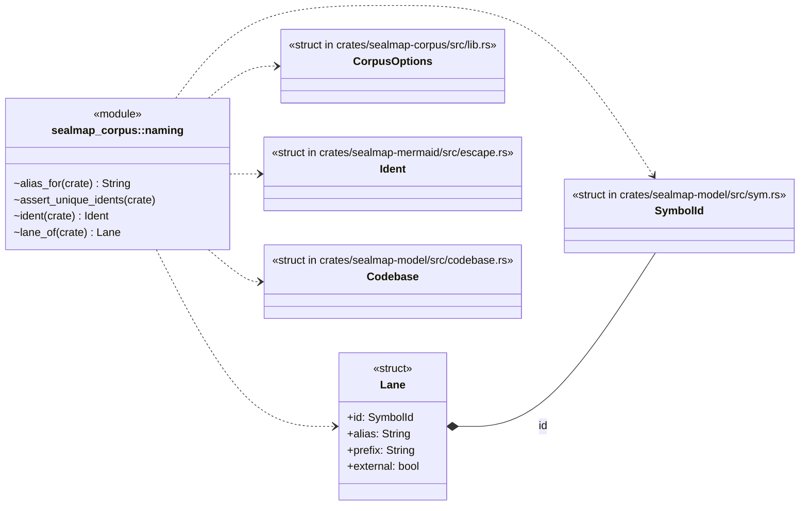
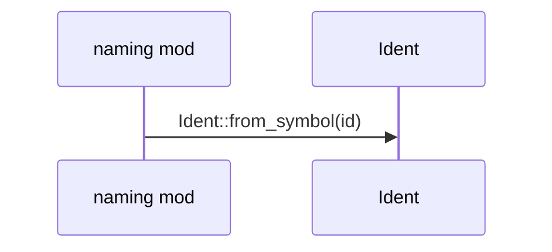
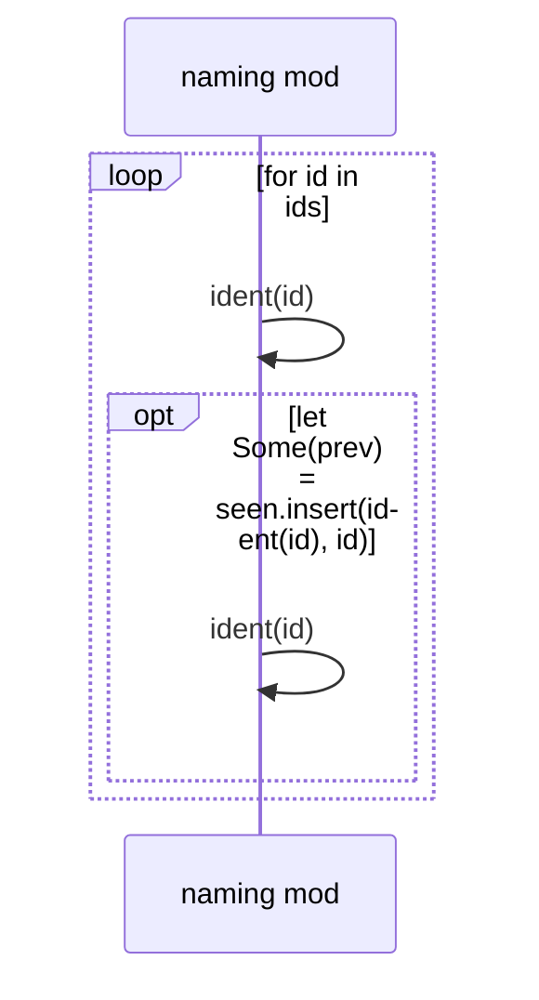
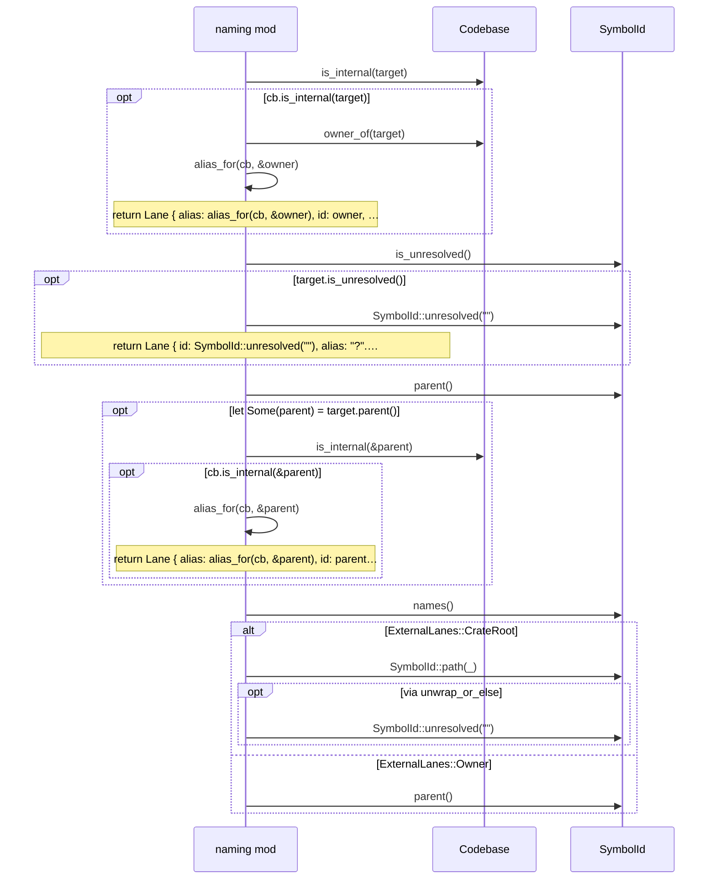
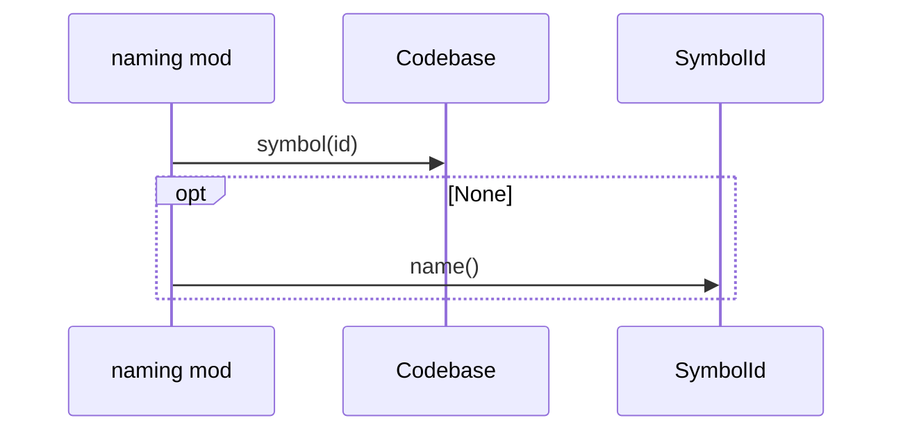

# `sym:cargo sealmap_corpus . naming/` · crates/sealmap-corpus/src/naming.rs
> Stable ids, short labels and sequence lanes.

## structure

## `sym:cargo sealmap_corpus . naming/ident().`
`pub(crate) fn ident(id: &SymbolId) -> Ident` · L8-L12
> Diagram id for a symbol (stable across all documents), derived from the id's structure by [`Ident::from_symbol`].

## `sym:cargo sealmap_corpus . naming/assert_unique_idents().`
`pub(crate) fn assert_unique_idents(cb: &Codebase)` · L14-L31
> Every symbol and relation endpoint must get its own diagram id: a shared id would silently merge two nodes in every diagram both appear in, and break merge-by-…

## `sym:cargo sealmap_corpus . naming/lane_of().`
`pub(crate) fn lane_of(cb: &Codebase, target: &SymbolId, opts: &CorpusOptions) -> Lane` · L42-L71

## `sym:cargo sealmap_corpus . naming/alias_for().`
`pub(crate) fn alias_for(cb: &Codebase, id: &SymbolId) -> String` · L73-L80
> Alias for an internal lane: type name, or module name for modules.

