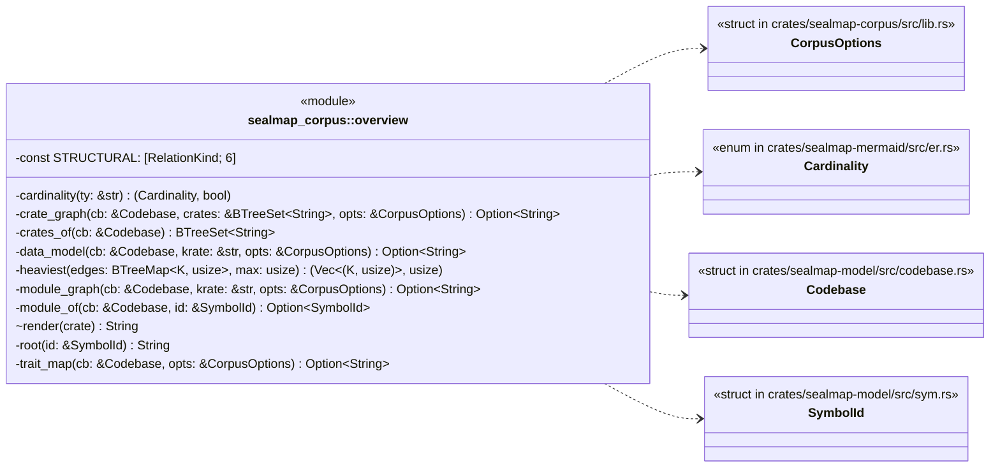
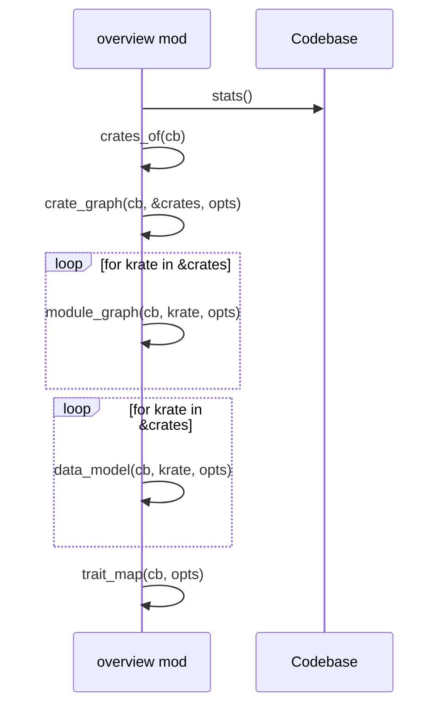
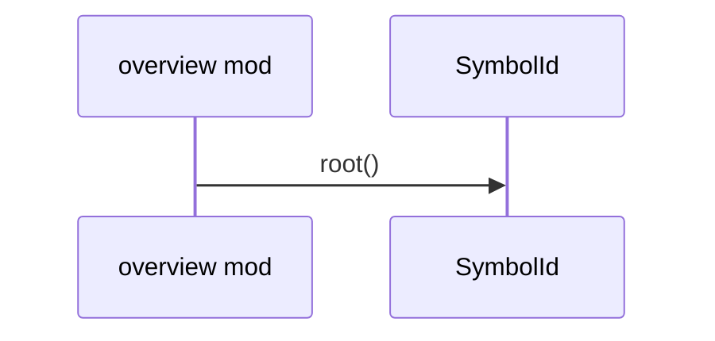
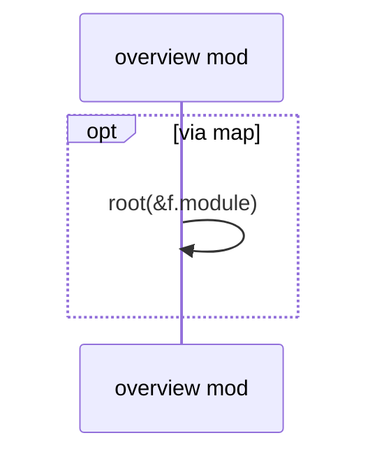
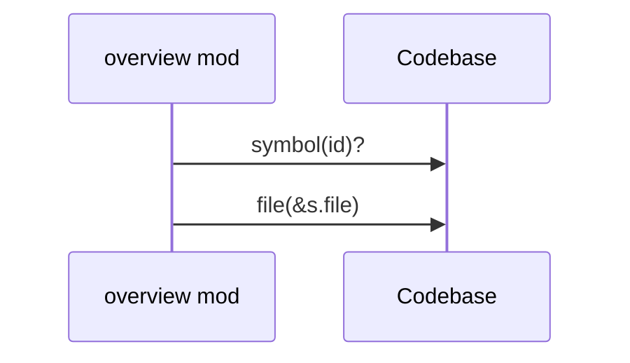
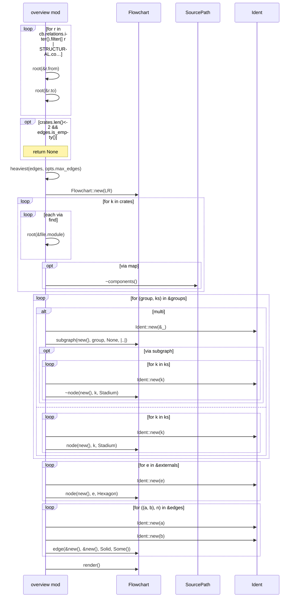
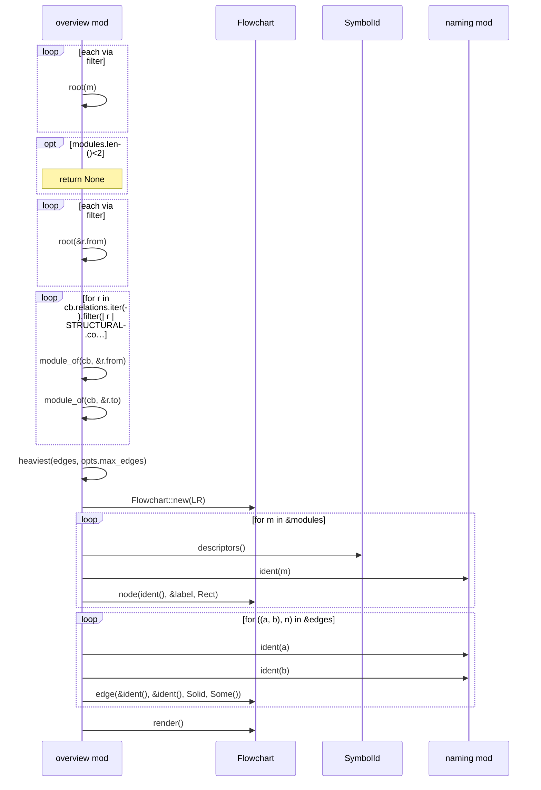
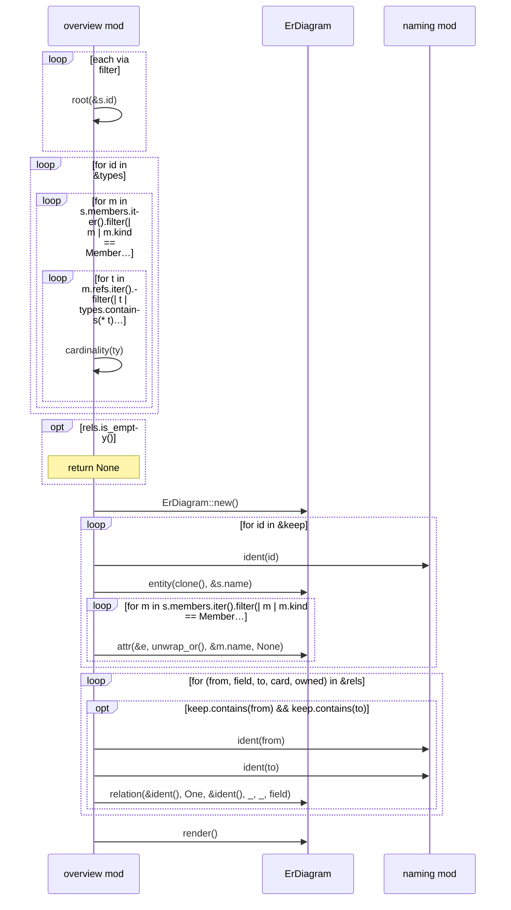
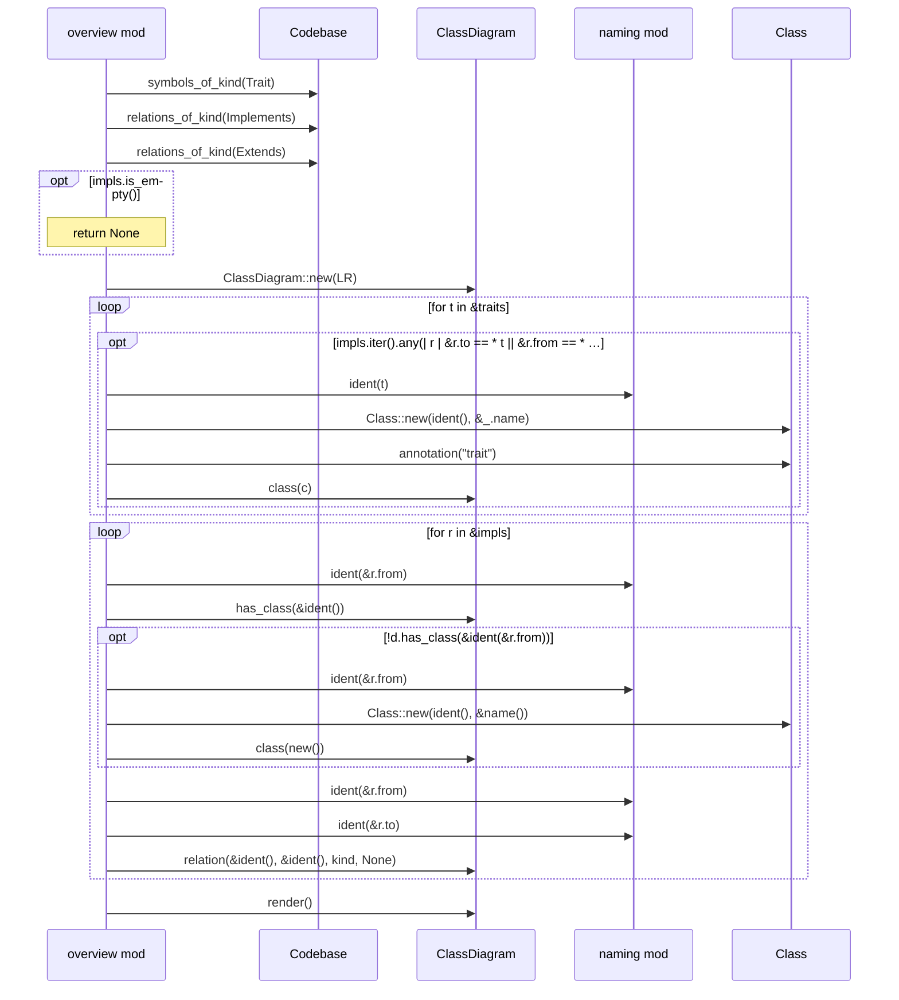

# `sym:cargo sealmap_corpus . overview/` · crates/sealmap-corpus/src/overview.rs
> `_overview.md`: cross-cutting diagrams for the whole codebase.

## structure

## `sym:cargo sealmap_corpus . overview/render().`
`pub(crate) fn render(cb: &Codebase, opts: &CorpusOptions) -> String` · L14-L42

## `sym:cargo sealmap_corpus . overview/root().`
`fn root(id: &SymbolId) -> String` · L44-L46

## `sym:cargo sealmap_corpus . overview/crates_of().`
`fn crates_of(cb: &Codebase) -> BTreeSet<String>` · L48-L50

## `sym:cargo sealmap_corpus . overview/module_of().`
`fn module_of(cb: &Codebase, id: &SymbolId) -> Option<SymbolId>` · L52-L56
> Module that physically contains a symbol (its file's module).

## `sym:cargo sealmap_corpus . overview/crate_graph().`
`fn crate_graph(cb: &Codebase, crates: &BTreeSet<String>, opts: &CorpusOptions) -> Option<String>` · L77-L129

## `sym:cargo sealmap_corpus . overview/module_graph().`
`fn module_graph(cb: &Codebase, krate: &str, opts: &CorpusOptions) -> Option<String>` · L131-L164

## `sym:cargo sealmap_corpus . overview/data_model().`
`fn data_model(cb: &Codebase, krate: &str, opts: &CorpusOptions) -> Option<String>` · L166-L212

## `sym:cargo sealmap_corpus . overview/trait_map().`
`fn trait_map(cb: &Codebase, opts: &CorpusOptions) -> Option<String>` · L230-L261

