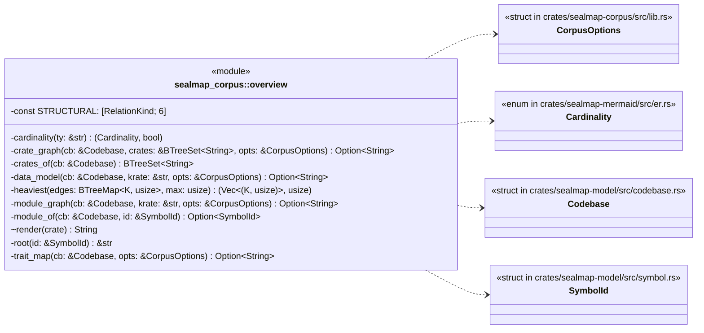
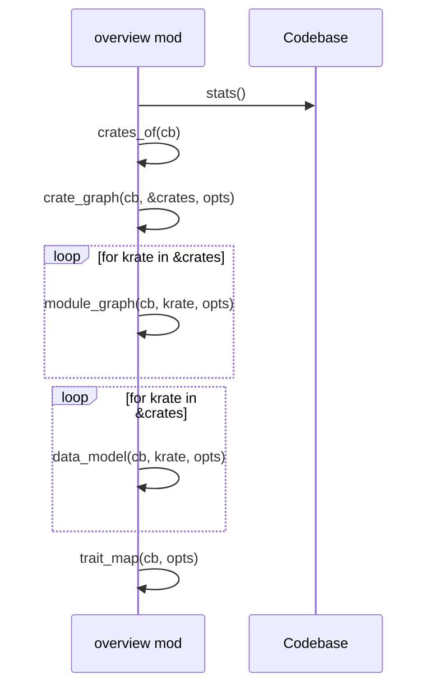
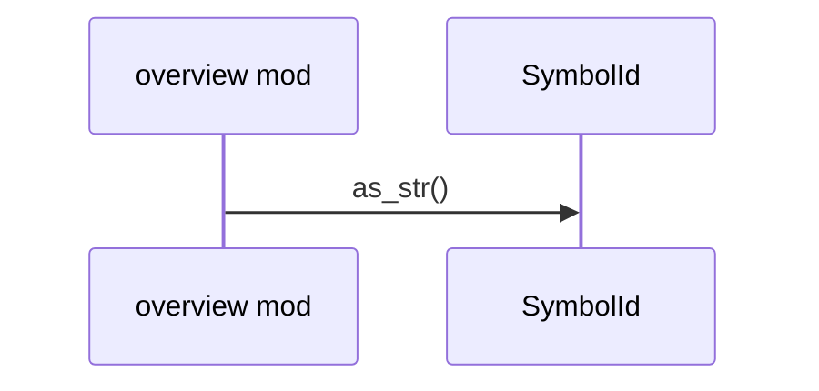
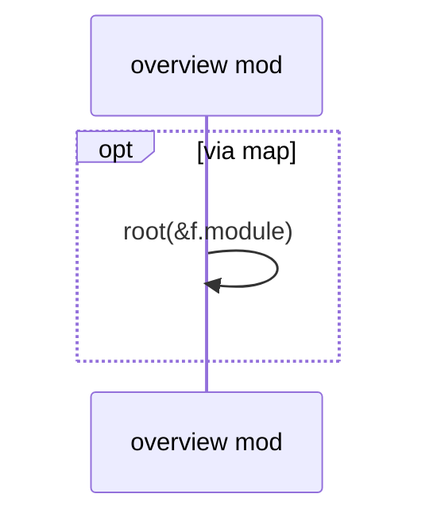
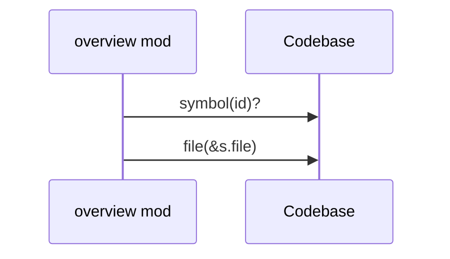
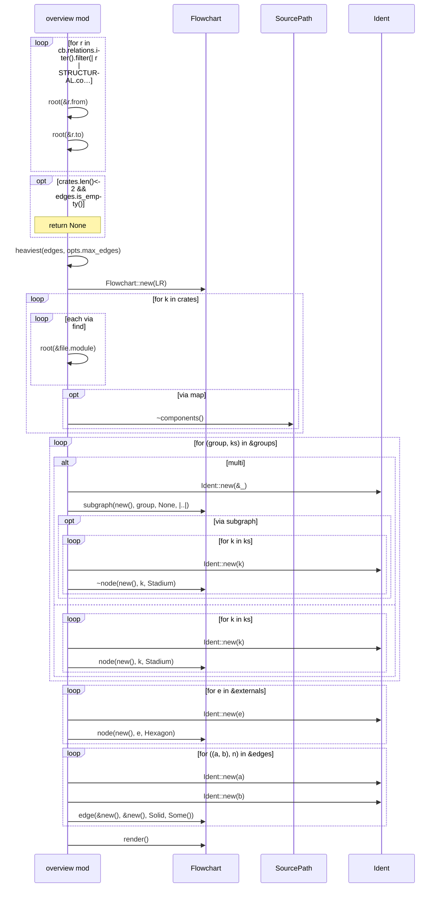
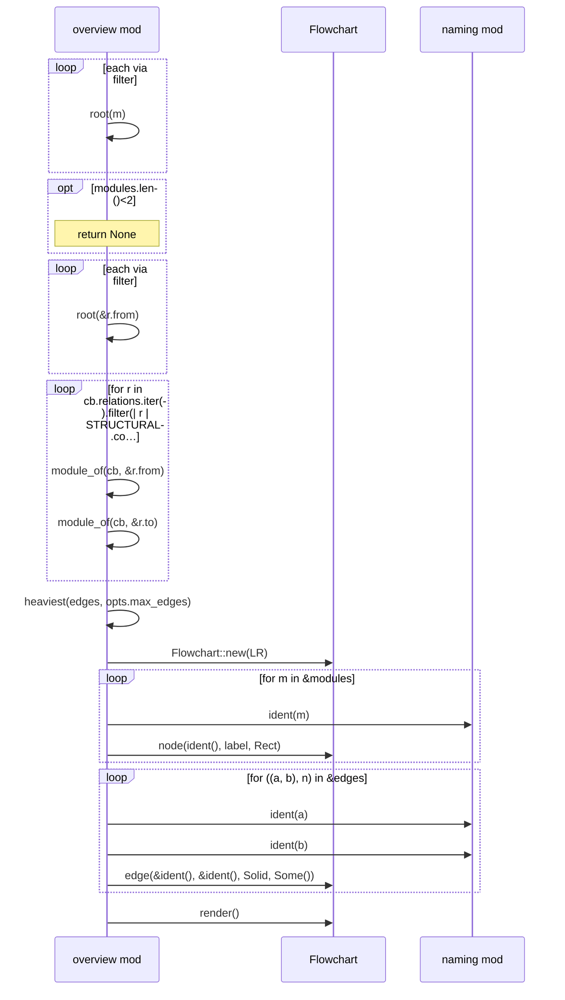
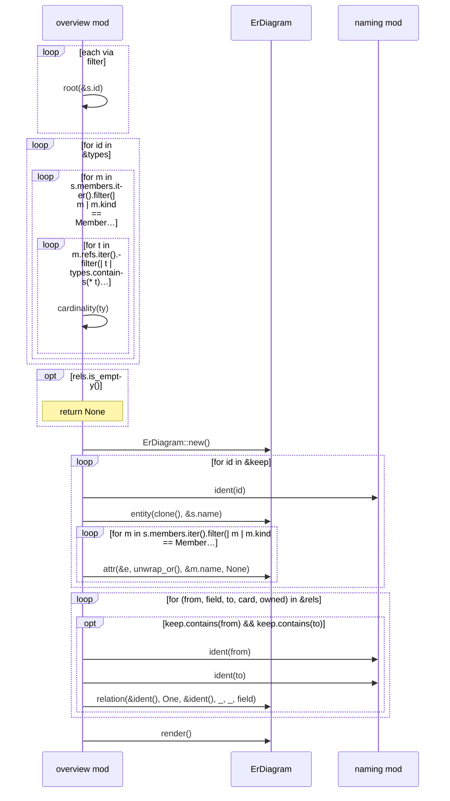

# `sealmap_corpus::overview` · crates/sealmap-corpus/src/overview.rs
> `_overview.md`: cross-cutting diagrams for the whole codebase.

## structure

## `sealmap_corpus::overview::render`
`pub(crate) fn render(cb: &Codebase, opts: &CorpusOptions) -> String` · L14-L42

## `sealmap_corpus::overview::root`
`fn root(id: &SymbolId) -> &str` · L44-L46

## `sealmap_corpus::overview::crates_of`
`fn crates_of(cb: &Codebase) -> BTreeSet<String>` · L48-L50

## `sealmap_corpus::overview::module_of`
`fn module_of(cb: &Codebase, id: &SymbolId) -> Option<SymbolId>` · L52-L56
> Module that physically contains a symbol (its file's module).

## `sealmap_corpus::overview::crate_graph`
`fn crate_graph(cb: &Codebase, crates: &BTreeSet<String>, opts: &CorpusOptions) -> Option<String>` · L77-L128

## `sealmap_corpus::overview::module_graph`
`fn module_graph(cb: &Codebase, krate: &str, opts: &CorpusOptions) -> Option<String>` · L130-L162

## `sealmap_corpus::overview::data_model`
`fn data_model(cb: &Codebase, krate: &str, opts: &CorpusOptions) -> Option<String>` · L164-L210

## `sealmap_corpus::overview::trait_map`
`fn trait_map(cb: &Codebase, opts: &CorpusOptions) -> Option<String>` · L228-L259

