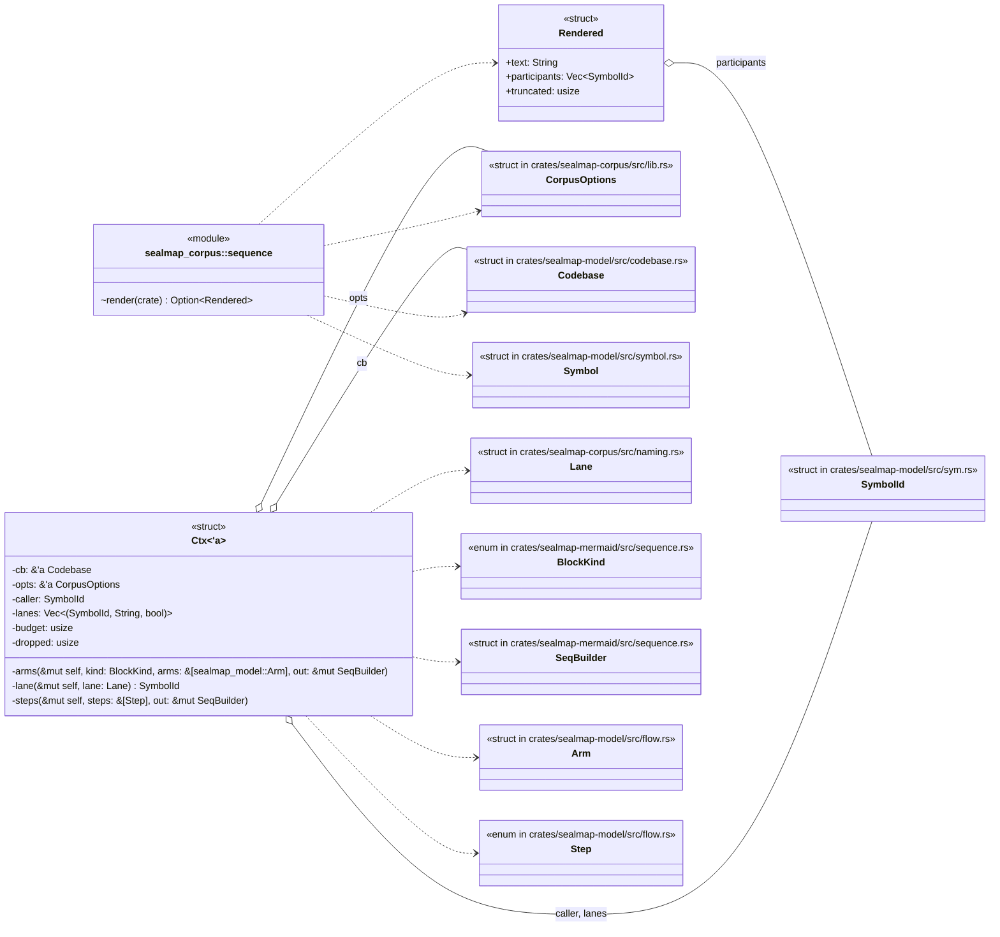
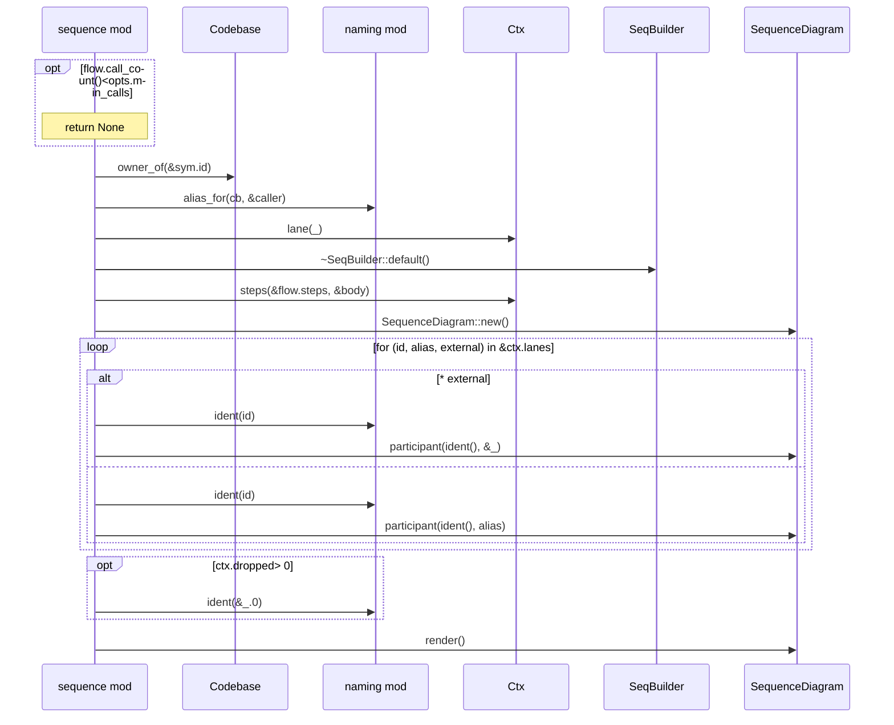
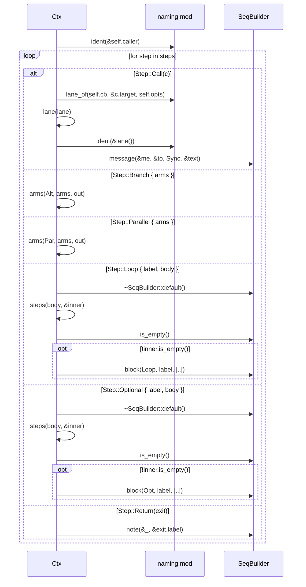
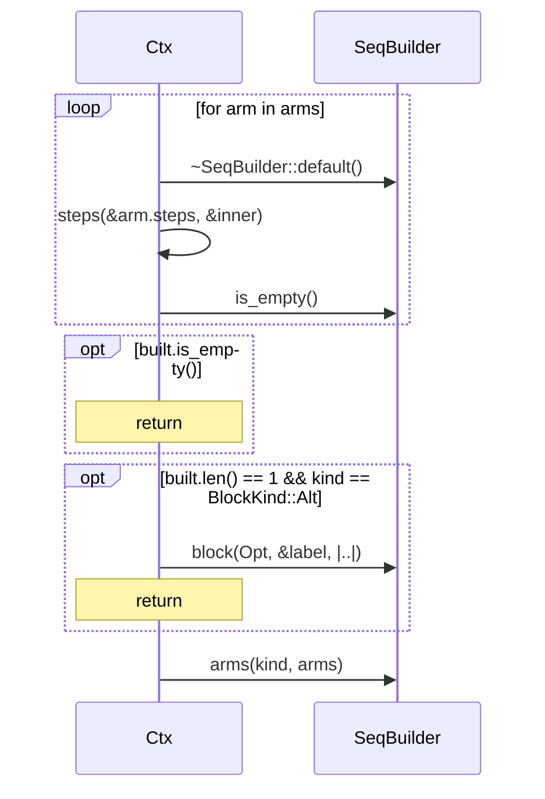

# `sym:cargo sealmap_corpus . sequence/` · crates/sealmap-corpus/src/sequence.rs
> Flow → `sequenceDiagram`.

## structure

## `sym:cargo sealmap_corpus . sequence/render().`
`pub(crate) fn render(cb: &Codebase, sym: &Symbol, opts: &CorpusOptions) -> Option<Rendered>` · L17-L47

## `sym:cargo sealmap_corpus . sequence/Ctx#steps().`
`fn steps(&mut self, steps: &[Step], out: &mut SeqBuilder)` · L66-L123

## `sym:cargo sealmap_corpus . sequence/Ctx#arms().`
`fn arms(&mut self, kind: BlockKind, arms: &[sealmap_model::Arm], out: &mut SeqBuilder)` · L125-L155

