# `sym:cargo sealmap_dense .` · crates/sealmap-dense/src/lib.rs
> The compact **agent projection** of a [`sealmap_model::Codebase`]: what an LLM agent reads instead of the source, or instead of a Mermaid corpus, when it needs…

## structure
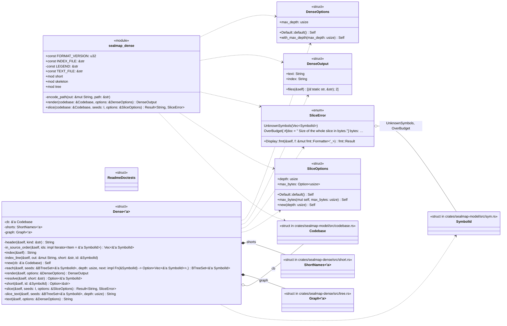

## `sym:cargo sealmap_dense . Dense#new().`
`pub fn new(cb: &'a Codebase) -> Self` · L286-L289
> Index `cb`: assign short names and read the call graph from the flows.
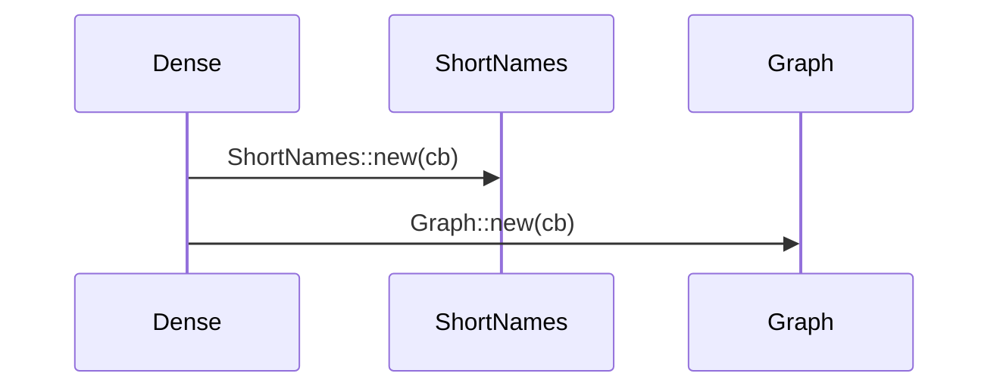

## `sym:cargo sealmap_dense . Dense#short().`
`pub fn short(&self, id: &SymbolId) -> Option<&str>` · L291-L294
> The short name of a symbol, or `None` if `id` is not in the codebase.
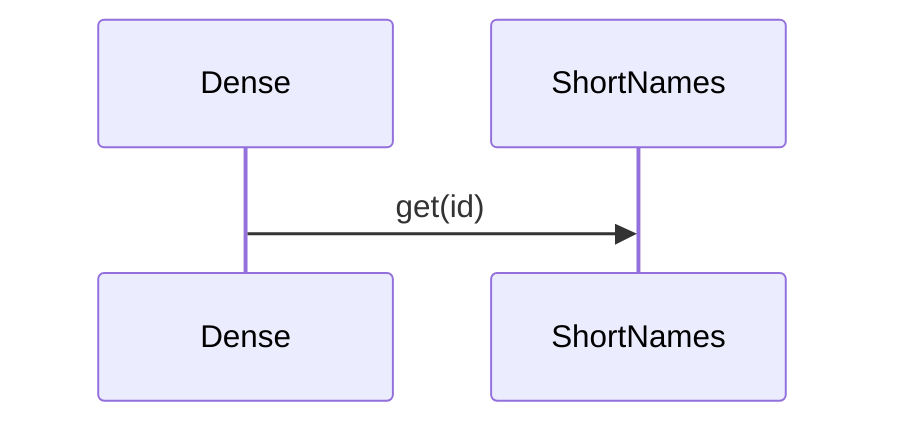

## `sym:cargo sealmap_dense . Dense#resolve().`
`pub fn resolve(&self, short: &str) -> Option<&'a SymbolId>` · L296-L299
> The symbol a short name stands for.
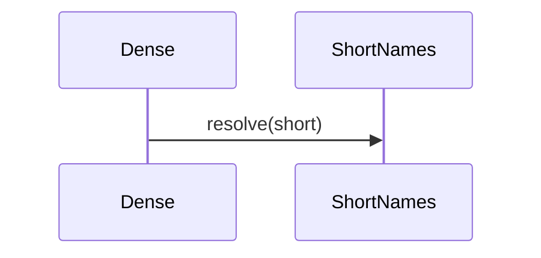

## `sym:cargo sealmap_dense . Dense#render().`
`pub fn render(&self, options: &DenseOptions) -> DenseOutput` · L301-L304
> The full projection: [`text`](Self::text) and [`index`](Self::index).
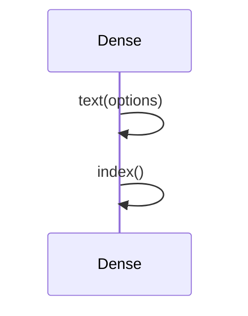

## `sym:cargo sealmap_dense . Dense#index().`
`pub fn index(&self) -> String` · L306-L313
> The `_index.txt` text: every symbol, ordered by short name.
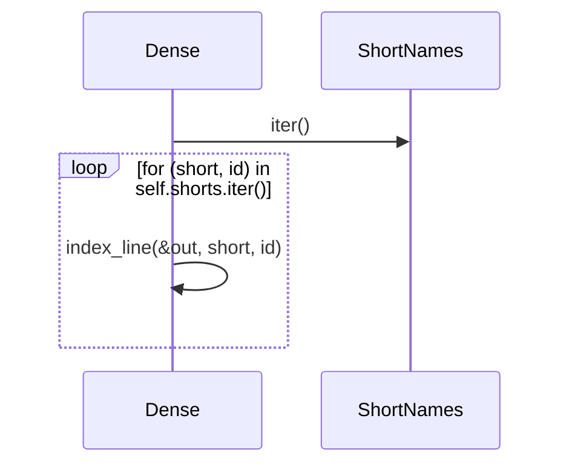

## `sym:cargo sealmap_dense . Dense#text().`
`pub fn text(&self, options: &DenseOptions) -> String` · L315-L336
> Skeleton lines for every symbol, then the call trees.
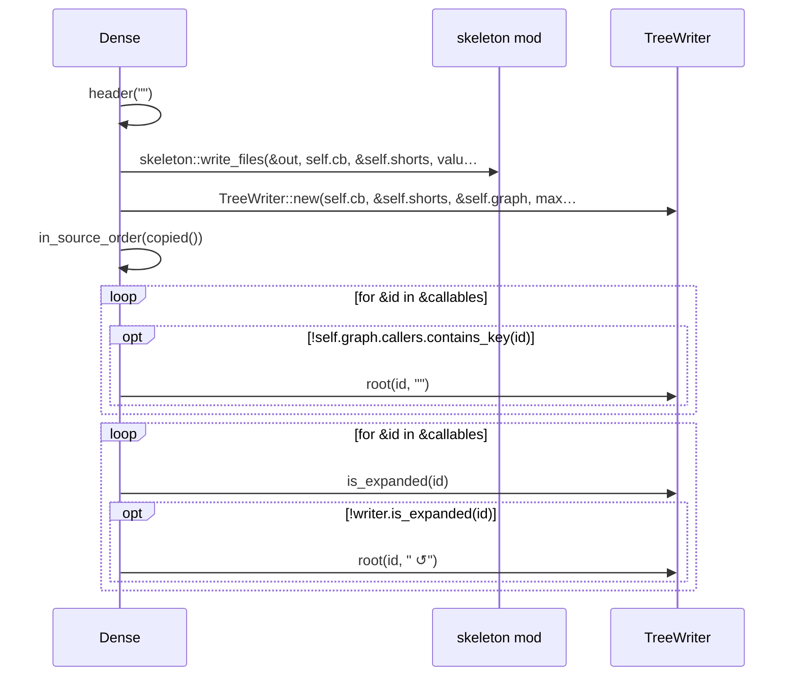

## `sym:cargo sealmap_dense . Dense#slice().`
`pub fn slice<'s, I>(&self, seeds: I, options: &SliceOptions) -> Result<String, SliceError> where I: IntoIterator<Item = &'s SymbolId>,` · L338-L377
> The dense text for `seeds` plus their callees and callers to `options.depth` call levels: skeleton lines, call trees from each seed, caller trees up to each se…
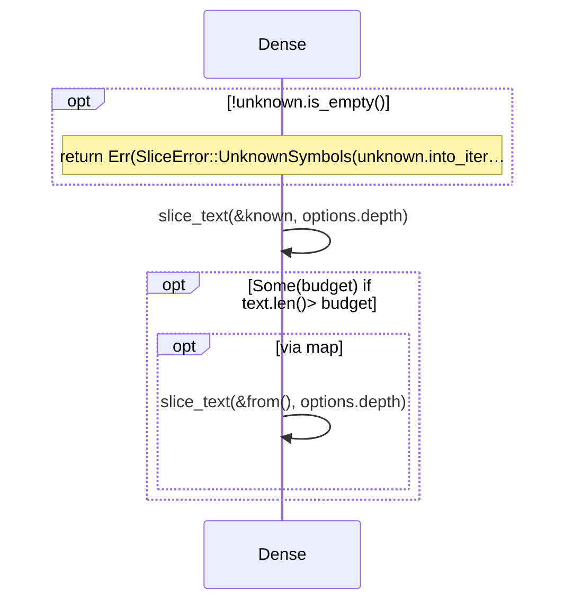

## `sym:cargo sealmap_dense . Dense#slice_text().`
`fn slice_text(&self, seeds: &BTreeSet<&'a SymbolId>, depth: usize) -> String` · L379-L414
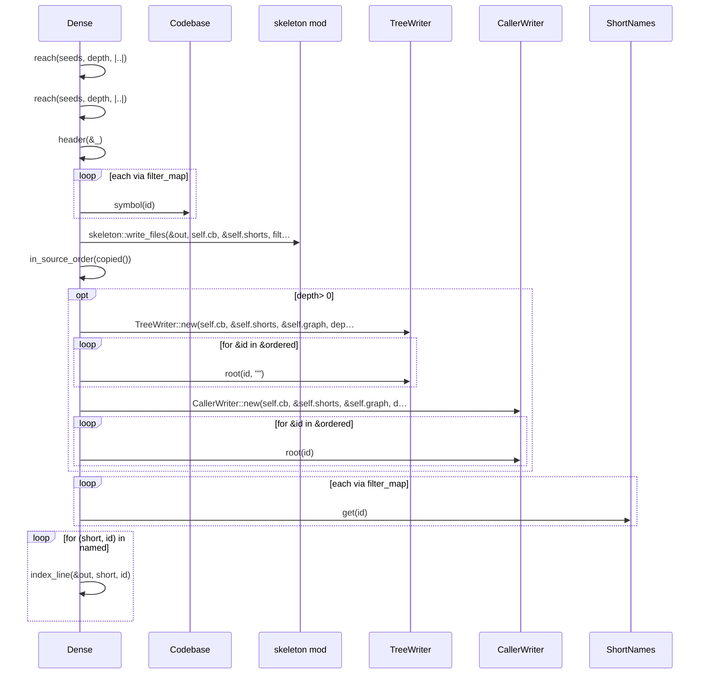

## `sym:cargo sealmap_dense . Dense#in_source_order().`
`fn in_source_order(&self, ids: impl Iterator<Item = &'a SymbolId>) -> Vec<&'a SymbolId>` · L441-L448
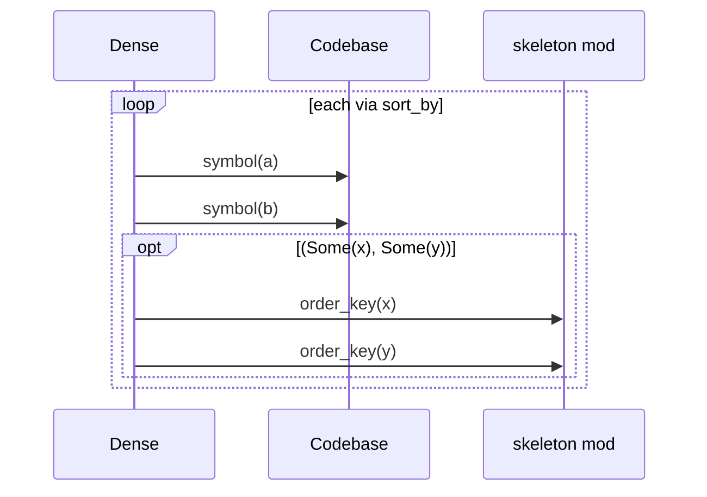

## `sym:cargo sealmap_dense . Dense#header().`
`fn header(&self, kind: &str) -> String` · L450-L452
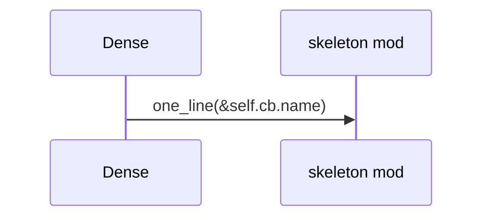

## `sym:cargo sealmap_dense . Dense#index_line().`
`fn index_line(&self, out: &mut String, short: &str, id: &SymbolId)` · L454-L465
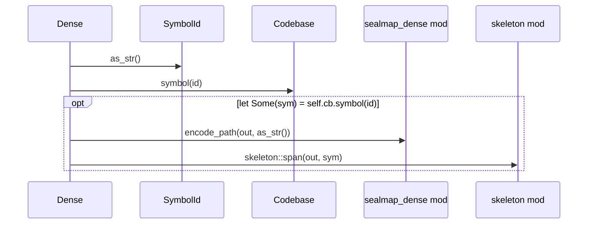

## `sym:cargo sealmap_dense . render().`
`pub fn render(codebase: &Codebase, options: &DenseOptions) -> DenseOutput` · L468-L471
> The full projection of `codebase` in one call; see [`Dense::render`].
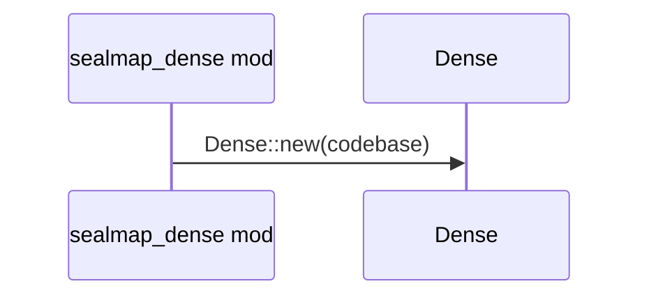

## `sym:cargo sealmap_dense . slice().`
`pub fn slice<'s, I>(codebase: &Codebase, seeds: I, options: &SliceOptions) -> Result<String, SliceError> where I: IntoIterator<Item = &'s SymbolId>,` · L473-L484
> One slice of `codebase` in one call; see [`Dense::slice`].

