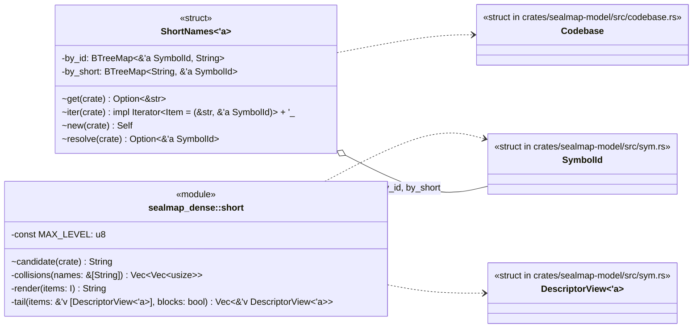
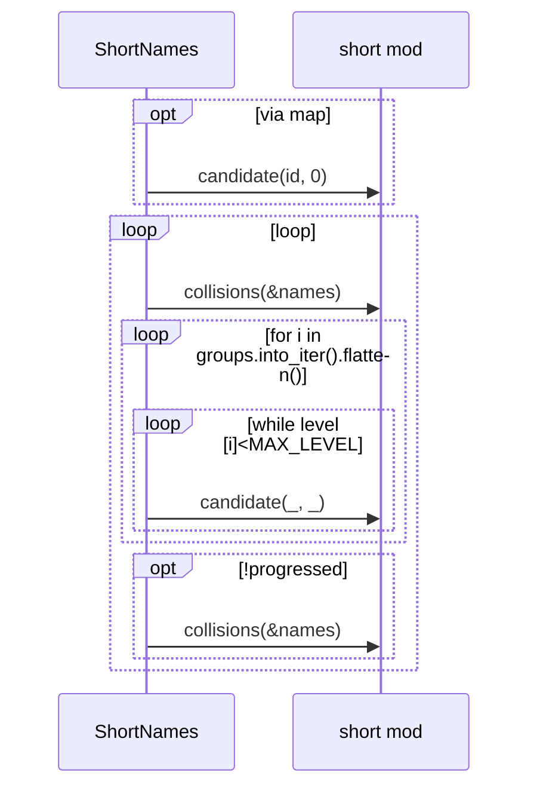
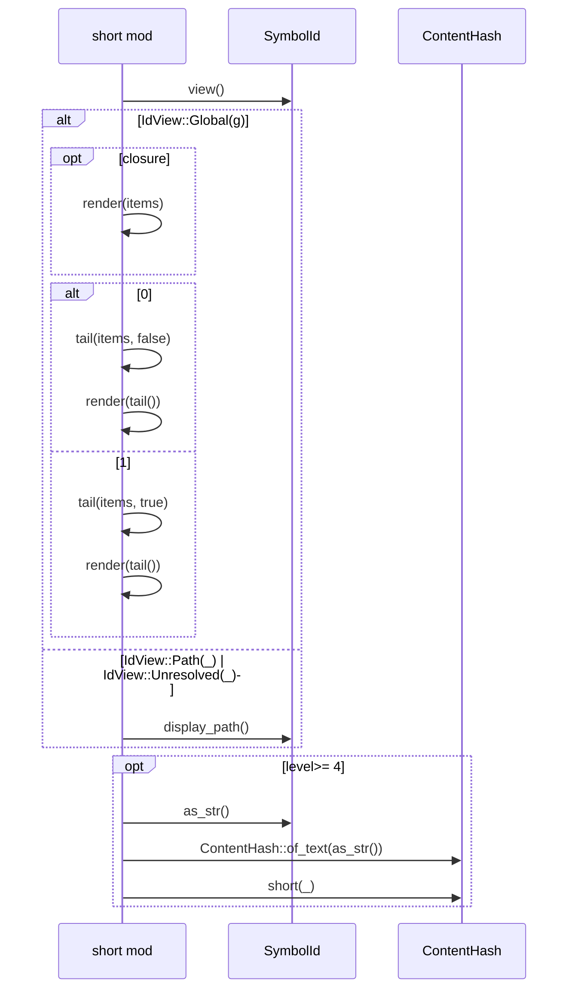

# `sym:cargo sealmap_dense . short/` · crates/sealmap-dense/src/short.rs
> Short names: the compact, per-output handles the dense text uses in place of full `sym:` ids.

## structure

## `sym:cargo sealmap_dense . short/ShortNames#new().`
`pub(crate) fn new(cb: &'a Codebase) -> Self` · L35-L76
> Assign a unique short name to every symbol of `cb`.

## `sym:cargo sealmap_dense . short/candidate().`
`pub(crate) fn candidate(id: &SymbolId, level: u8) -> String` · L103-L139
> The short name of `id` at `level` (see the module docs).

