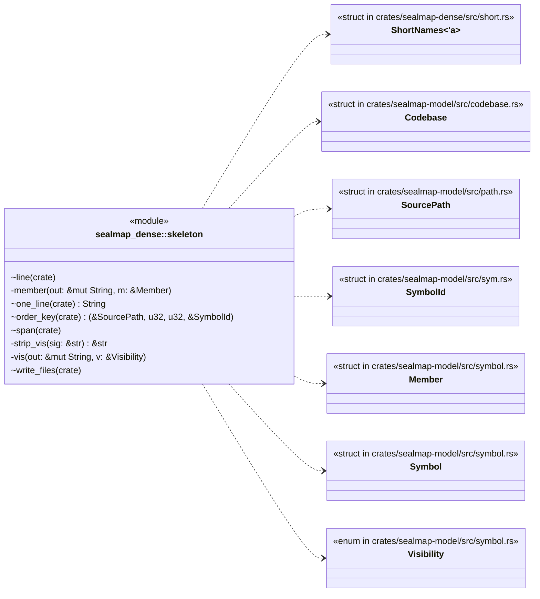
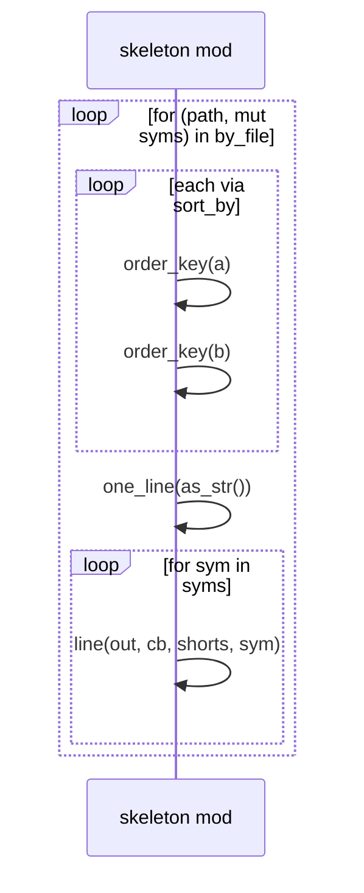
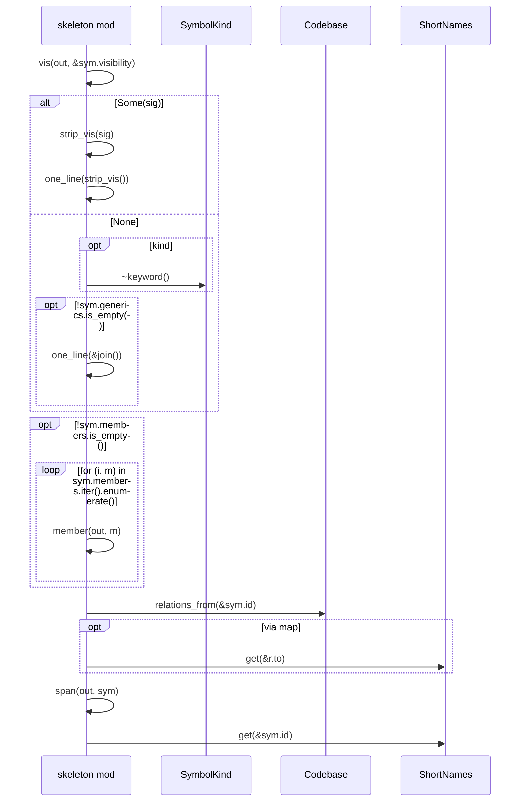
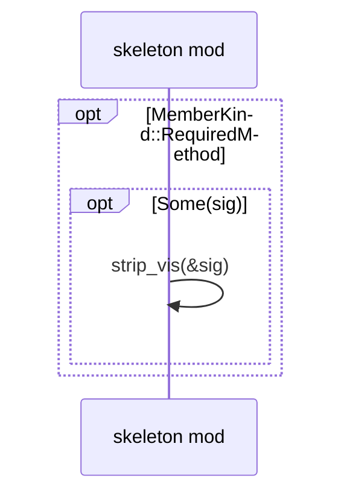
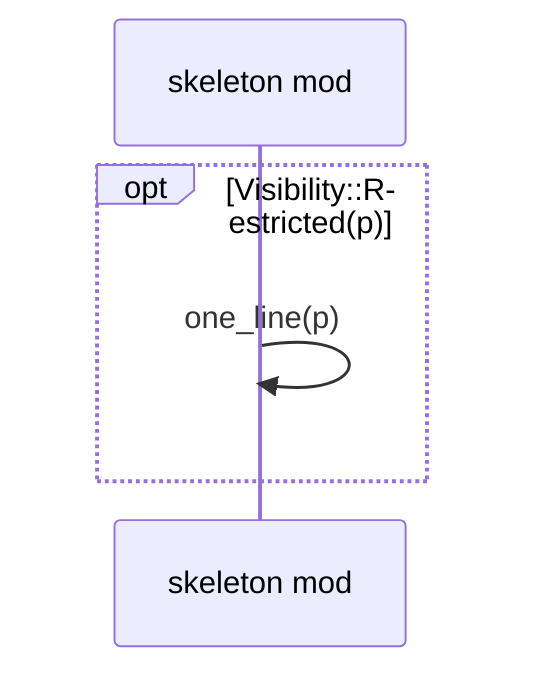

# `sym:cargo sealmap_dense . skeleton/` · crates/sealmap-dense/src/skeleton.rs
> Skeleton lines: one Rust-like line per symbol, grouped by file in source order.

## structure

## `sym:cargo sealmap_dense . skeleton/write_files().`
`pub(crate) fn write_files<'a>(out: &mut String, cb: &Codebase, shorts: &ShortNames<'_>, symbols: impl IntoIterator<Item = &'a Symbol>,)` · L16-L37
> Write `symbols` as `## <path>` sections, each listing its symbols in source order.

## `sym:cargo sealmap_dense . skeleton/line().`
`pub(crate) fn line(out: &mut String, cb: &Codebase, shorts: &ShortNames<'_>, sym: &Symbol)` · L39-L82
> `<vis> <signature or kind name><members><impls> L<a>-<b> @<short>`.

## `sym:cargo sealmap_dense . skeleton/member().`
`fn member(out: &mut String, m: &Member)` · L92-L133

## `sym:cargo sealmap_dense . skeleton/vis().`
`fn vis(out: &mut String, v: &Visibility)` · L135-L149
> Write the Rust spelling of a visibility, with its trailing space.

