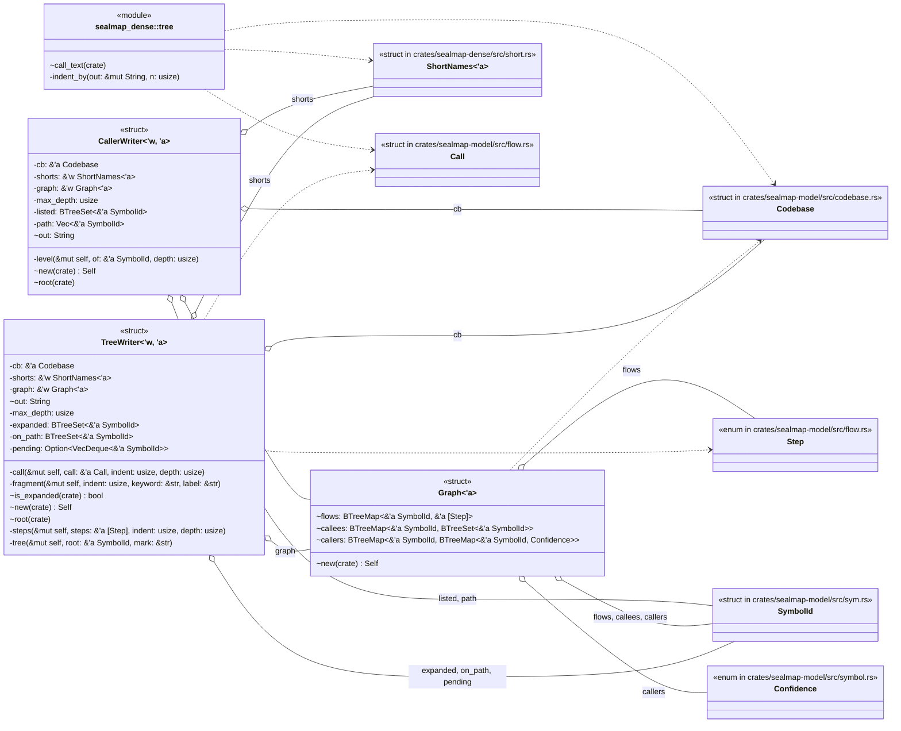
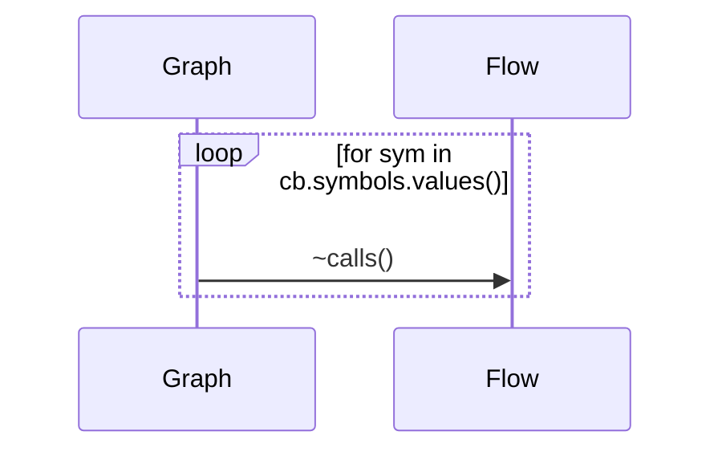
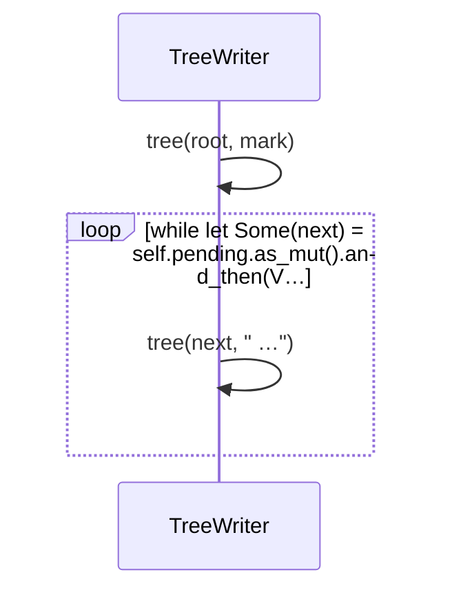
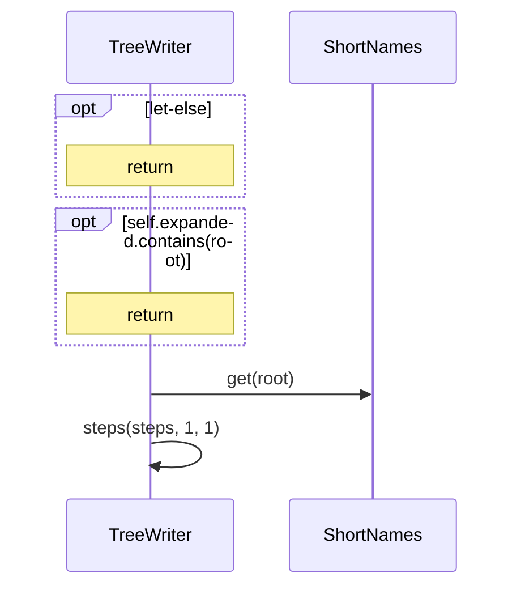
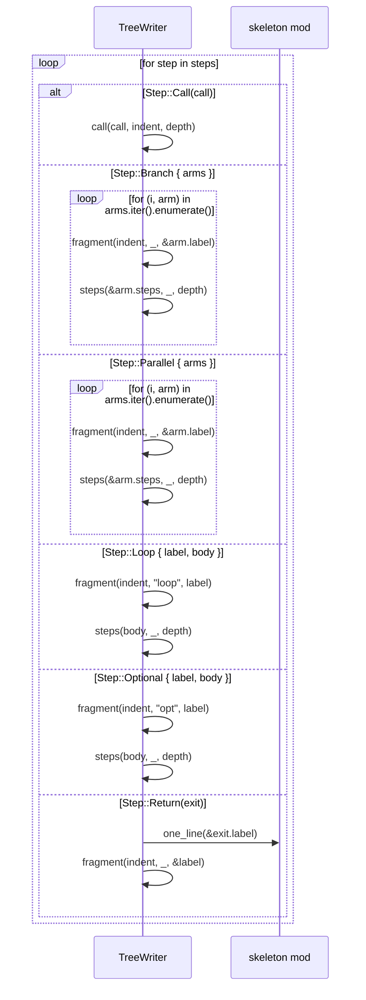
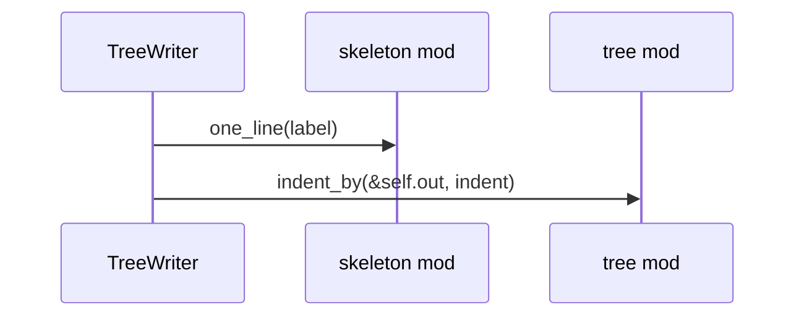
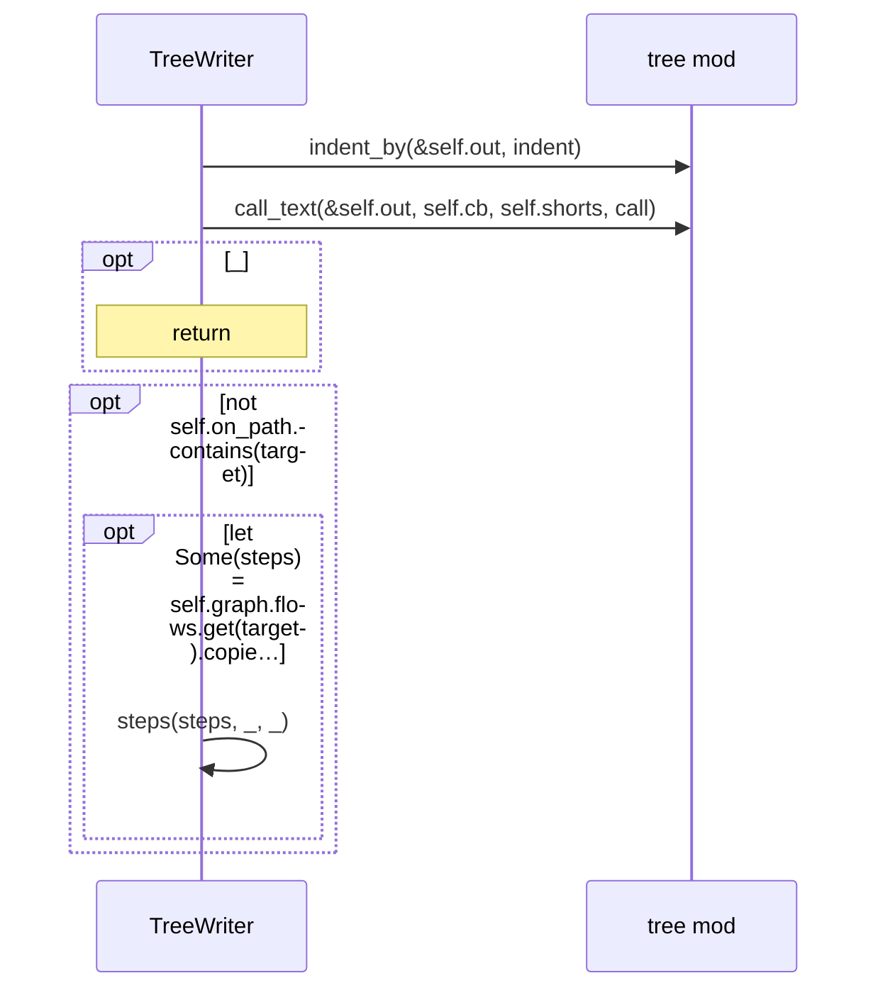
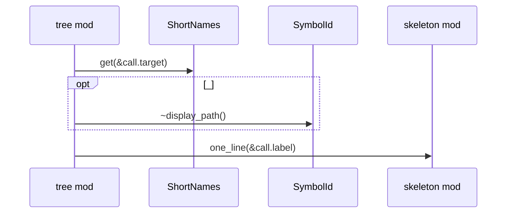
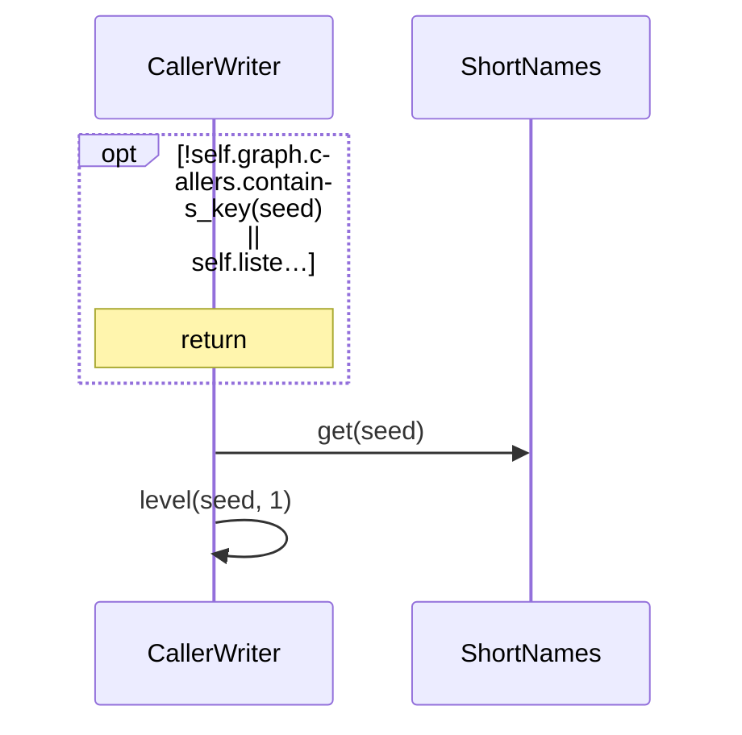
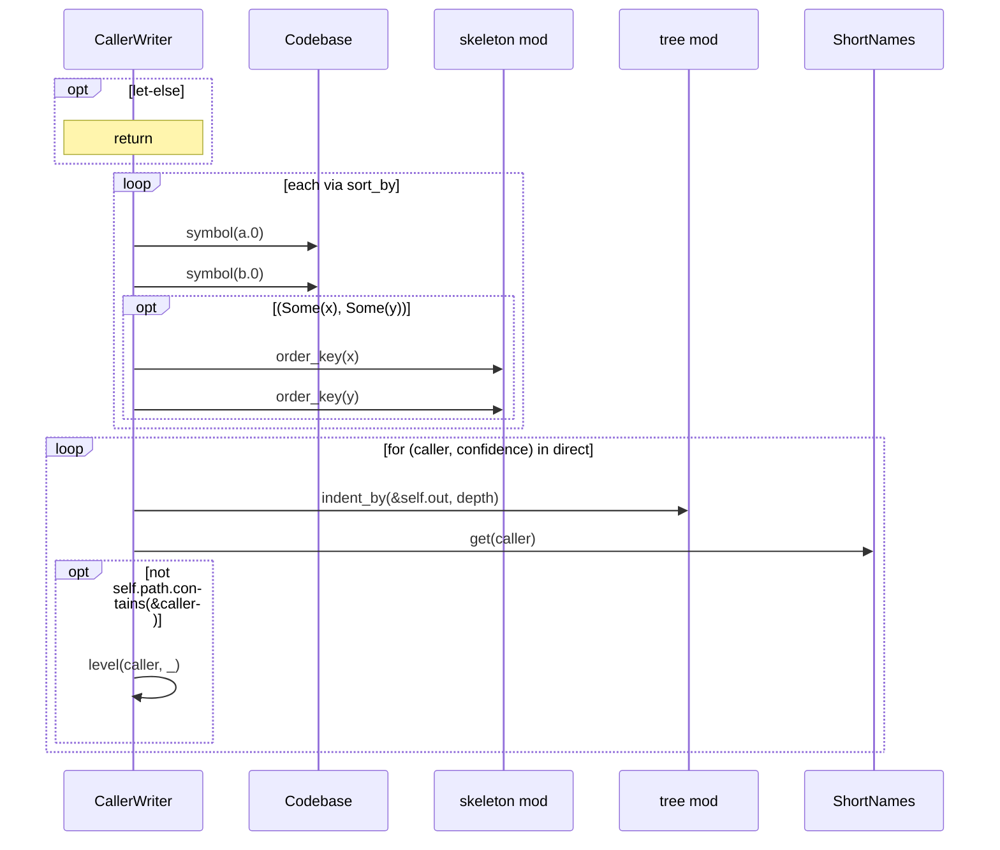

# `sym:cargo sealmap_dense . tree/` · crates/sealmap-dense/src/tree.rs
> Indented call trees.

## structure

## `sym:cargo sealmap_dense . tree/Graph#new().`
`pub(crate) fn new(cb: &'a Codebase) -> Self` · L30-L47

## `sym:cargo sealmap_dense . tree/TreeWriter#root().`
`pub(crate) fn root(&mut self, root: &'a SymbolId, mark: &str)` · L88-L97
> A tree rooted at `root`, its header followed by `mark` (`""` for an entry point or a slice seed, `" ↺"` for a callable only cycles reach); then, in the full pr…

## `sym:cargo sealmap_dense . tree/TreeWriter#tree().`
`fn tree(&mut self, root: &'a SymbolId, mark: &str)` · L99-L111

## `sym:cargo sealmap_dense . tree/TreeWriter#steps().`
`fn steps(&mut self, steps: &'a [Step], indent: usize, depth: usize)` · L113-L144

## `sym:cargo sealmap_dense . tree/TreeWriter#fragment().`
`fn fragment(&mut self, indent: usize, keyword: &str, label: &str)` · L146-L158
> `<indent><keyword> <label>`; an `else` labelled `else` is written once.

## `sym:cargo sealmap_dense . tree/TreeWriter#call().`
`fn call(&mut self, call: &'a Call, indent: usize, depth: usize)` · L160-L190

## `sym:cargo sealmap_dense . tree/call_text().`
`pub(crate) fn call_text(out: &mut String, cb: &Codebase, shorts: &ShortNames<'_>, call: &Call)` · L193-L224
> `<confidence><name><args><.await><?>`: `~` inferred, `?` external, nothing for exact.

## `sym:cargo sealmap_dense . tree/CallerWriter#root().`
`pub(crate) fn root(&mut self, seed: &'a SymbolId)` · L242-L254
> The callers of `seed` to `max_depth` levels; nothing if it has none or was already listed.

## `sym:cargo sealmap_dense . tree/CallerWriter#level().`
`fn level(&mut self, of: &'a SymbolId, depth: usize)` · L256-L287

