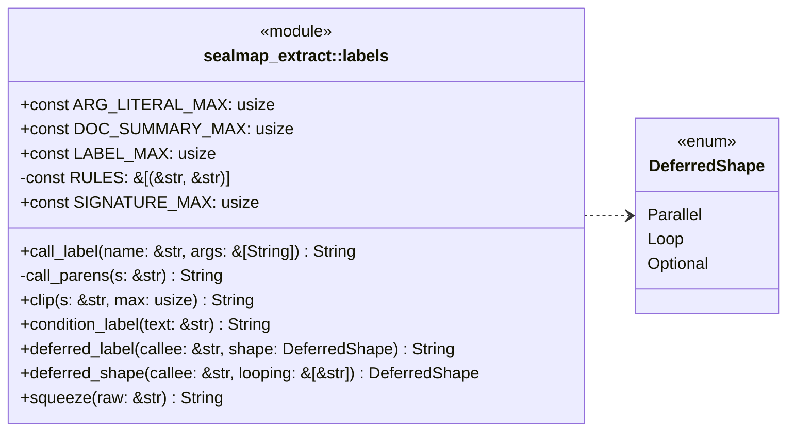
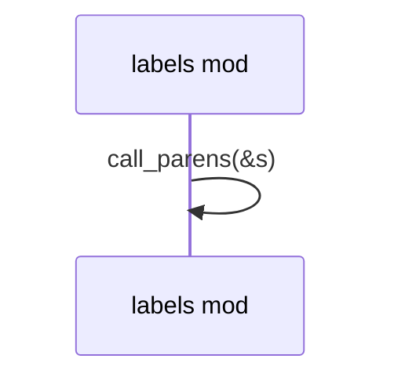
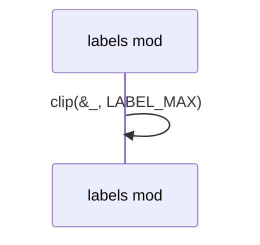

# `sym:cargo sealmap_extract . labels/` · crates/sealmap-extract/src/labels.rs
> Label rules: how source text becomes the short strings on diagram arrows and fragments.

## structure

## `sym:cargo sealmap_extract . labels/squeeze().`
`pub fn squeeze(raw: &str) -> String` · L56-L79
> Apply the spacing rules until the string stops changing.

## `sym:cargo sealmap_extract . labels/call_label().`
`pub fn call_label(name: &str, args: &[String]) -> String` · L113-L118
> The message for a call: `name(arg, arg)`, clipped to [`LABEL_MAX`].

## `sym:cargo sealmap_extract . labels/condition_label().`
`pub fn condition_label(text: &str) -> String` · L120-L124
> The label for a condition (`if` / `while` guard), clipped as if it were prefixed with `if ` so that the guard and the `if` arm agree.

