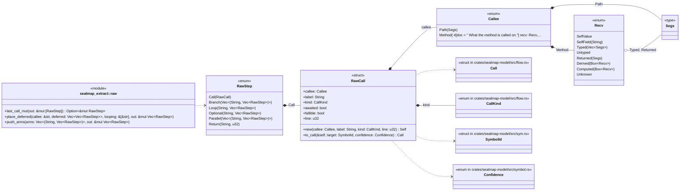
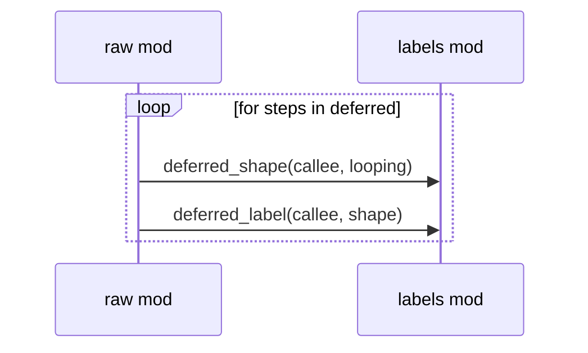

# `sym:cargo sealmap_extract . raw/` · crates/sealmap-extract/src/raw.rs
> The raw flow IR: what a language adapter records while walking a function body, before any name is resolved.

## structure

## `sym:cargo sealmap_extract . raw/place_deferred().`
`pub fn place_deferred(callee: &str, deferred: Vec<Vec<RawStep>>, looping: &[&str], out: &mut Vec<RawStep>)` · L155-L171
> Place the bodies of closures passed to `callee` after the call itself, since they run during (not before) it.

