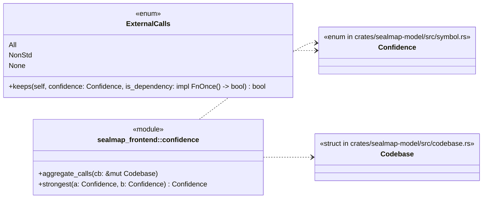
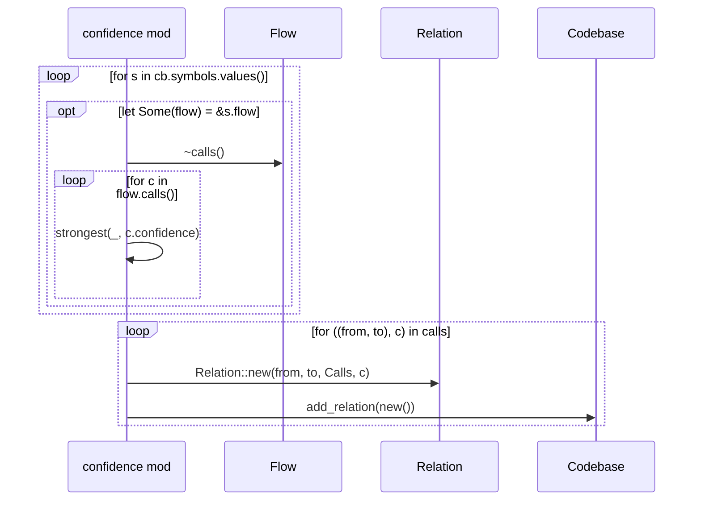

# `sym:cargo sealmap_frontend . confidence/` · crates/sealmap-frontend/src/confidence.rs
> The confidence lattice, the external-call policy and call-edge aggregation.

## structure

## `sym:cargo sealmap_frontend . confidence/aggregate_calls().`
`pub fn aggregate_calls(cb: &mut Codebase)` · L63-L79
> Add one [`RelationKind::Calls`] relation per distinct (caller, target) pair found in the flows of `cb`, with the strongest confidence among the calls behind it.

