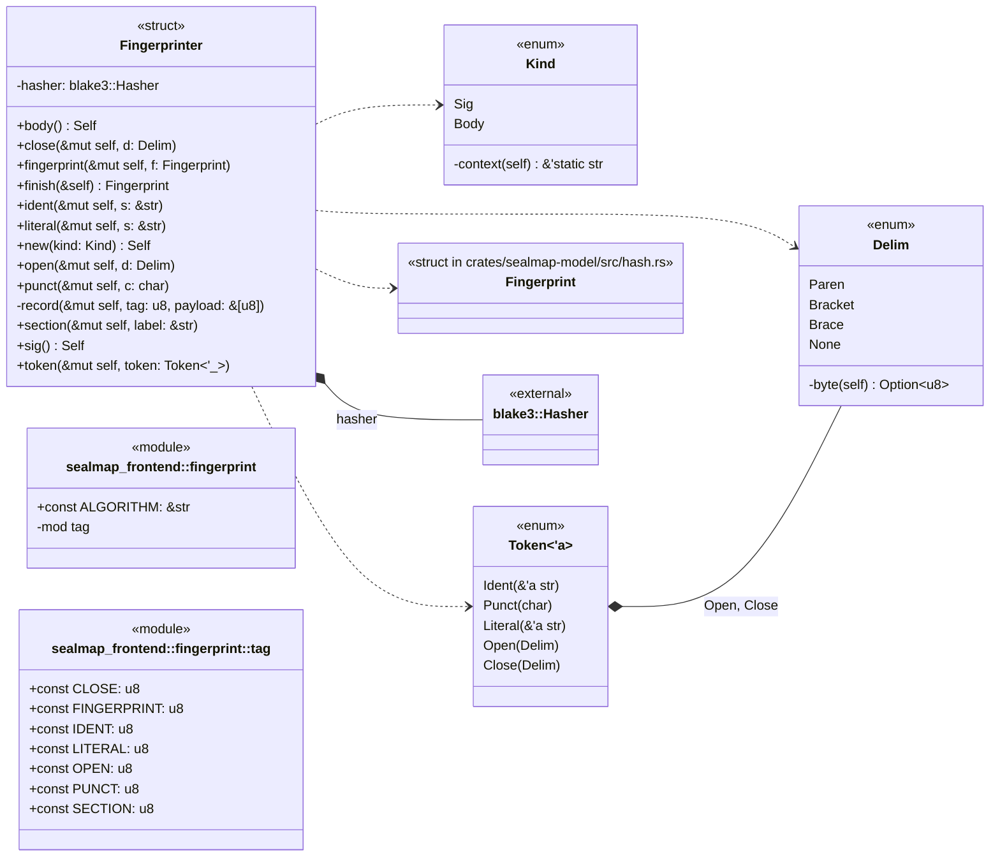
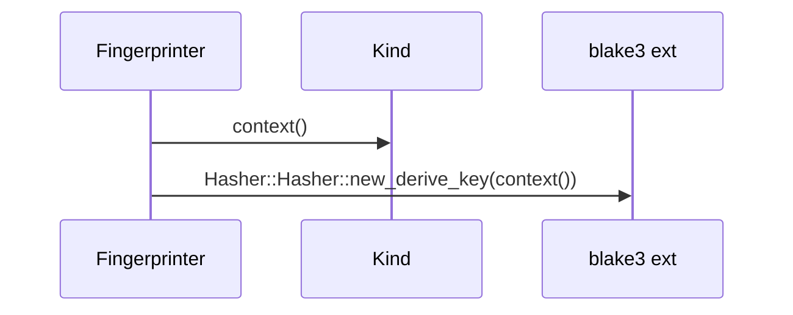
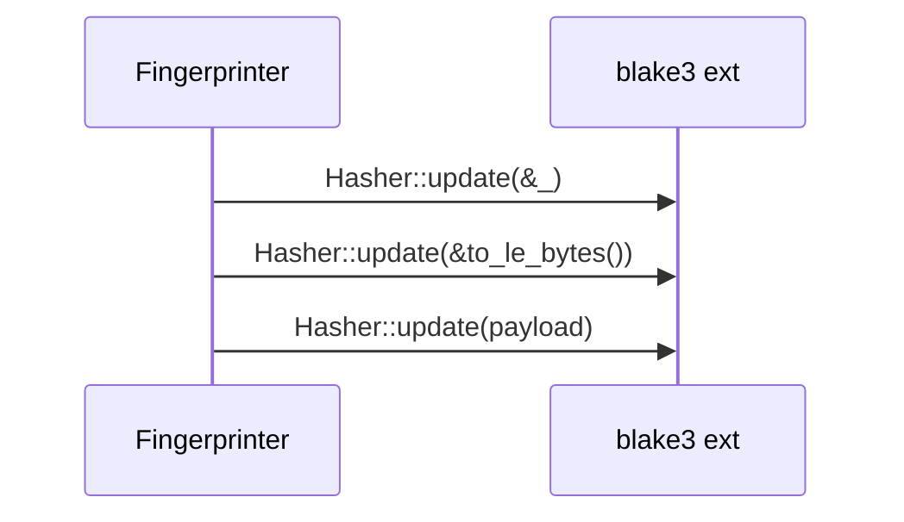
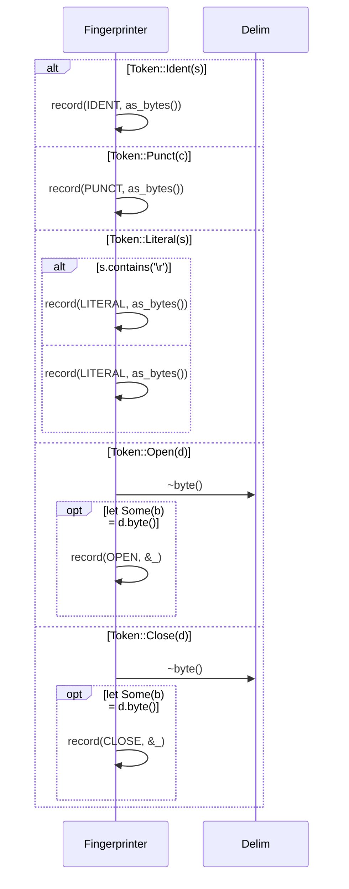
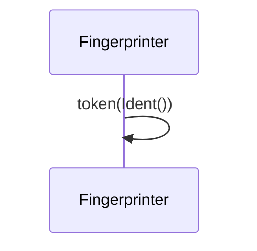
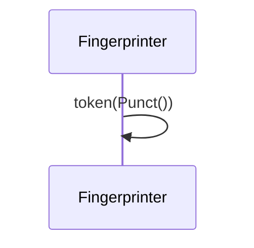
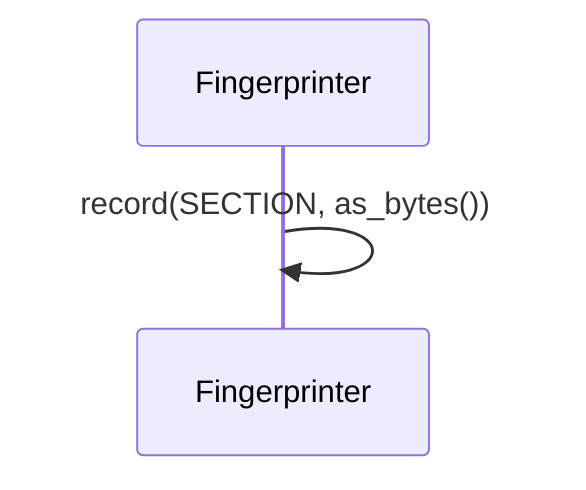
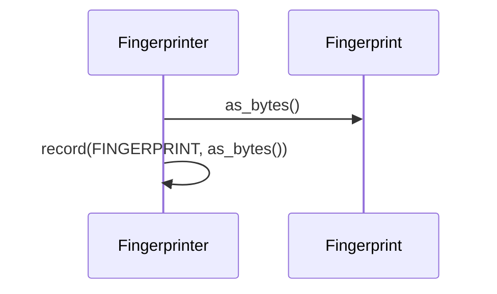
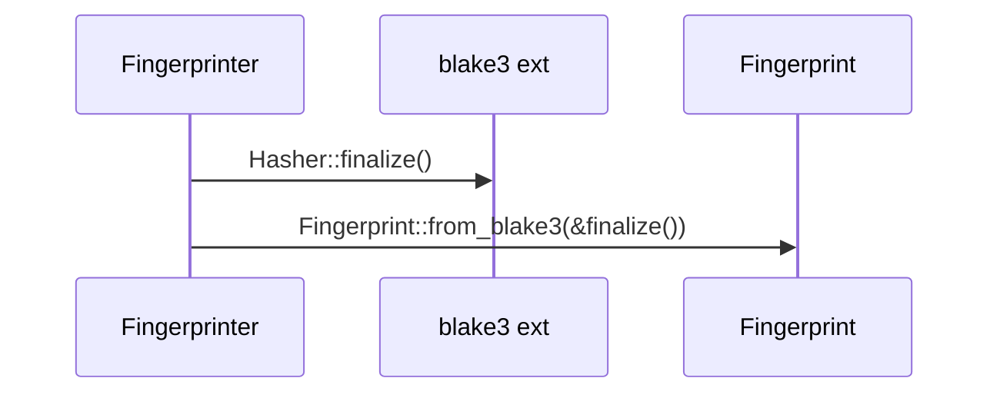

# `sym:cargo sealmap_frontend . fingerprint/` · crates/sealmap-frontend/src/fingerprint.rs
> Per-symbol fingerprints: `sig_hash` (the contract) and `body_hash` (the implementation).

## structure

## `sym:cargo sealmap_frontend . fingerprint/Fingerprinter#new().`
`pub fn new(kind: Kind) -> Self` · L162-L165
> A fingerprinter for `kind`.

## `sym:cargo sealmap_frontend . fingerprint/Fingerprinter#record().`
`fn record(&mut self, tag: u8, payload: &[u8])` · L177-L182

## `sym:cargo sealmap_frontend . fingerprint/Fingerprinter#token().`
`pub fn token(&mut self, token: Token<'_>)` · L184-L208
> Feed one token.

## `sym:cargo sealmap_frontend . fingerprint/Fingerprinter#ident().`
`pub fn ident(&mut self, s: &str)` · L210-L213
> Feed an identifier.

## `sym:cargo sealmap_frontend . fingerprint/Fingerprinter#punct().`
`pub fn punct(&mut self, c: char)` · L215-L218
> Feed a punctuation character.

## `sym:cargo sealmap_frontend . fingerprint/Fingerprinter#literal().`
`pub fn literal(&mut self, s: &str)` · L220-L223
> Feed a literal.

## `sym:cargo sealmap_frontend . fingerprint/Fingerprinter#open().`
`pub fn open(&mut self, d: Delim)` · L225-L228
> Open a group.

## `sym:cargo sealmap_frontend . fingerprint/Fingerprinter#close().`
`pub fn close(&mut self, d: Delim)` · L230-L233
> Close a group.

## `sym:cargo sealmap_frontend . fingerprint/Fingerprinter#section().`
`pub fn section(&mut self, label: &str)` · L235-L240
> Mark the start of a named part (`"attrs"`, `"generics"`, ...), so tokens cannot drift from one part into the next without changing the fingerprint.

## `sym:cargo sealmap_frontend . fingerprint/Fingerprinter#fingerprint().`
`pub fn fingerprint(&mut self, f: Fingerprint)` · L242-L246
> Fold in a nested symbol's fingerprint (how a module's `body_hash` covers its members without re-reading their tokens).

## `sym:cargo sealmap_frontend . fingerprint/Fingerprinter#finish().`
`pub fn finish(&self) -> Fingerprint` · L248-L251
> The fingerprint.

