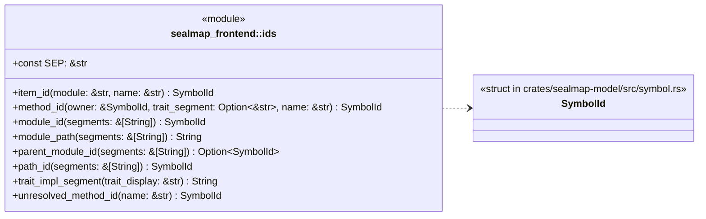
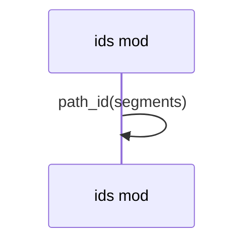
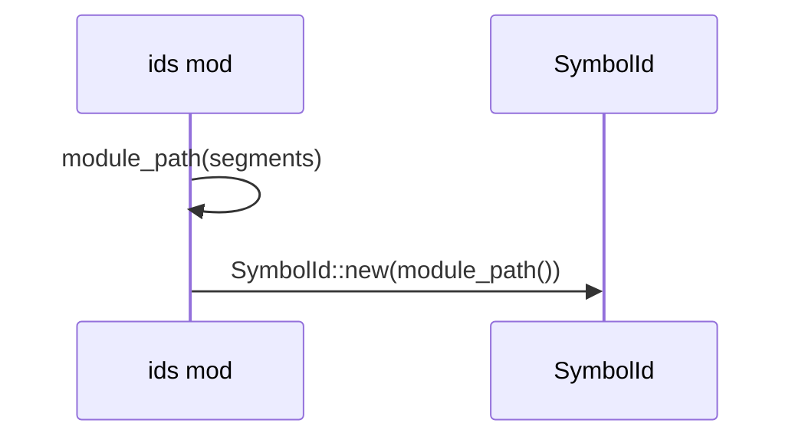
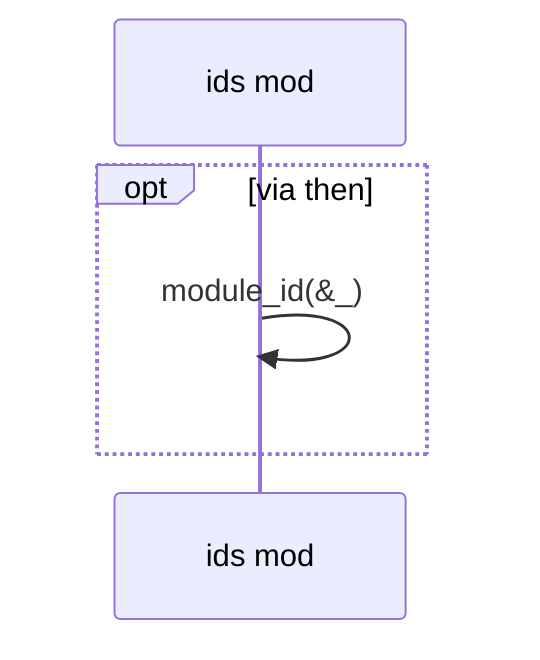
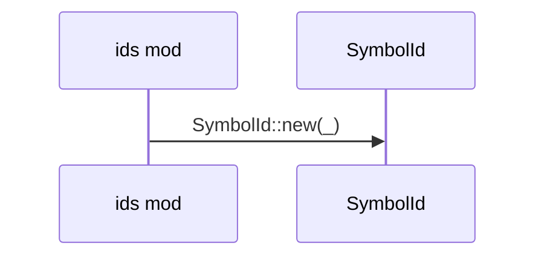
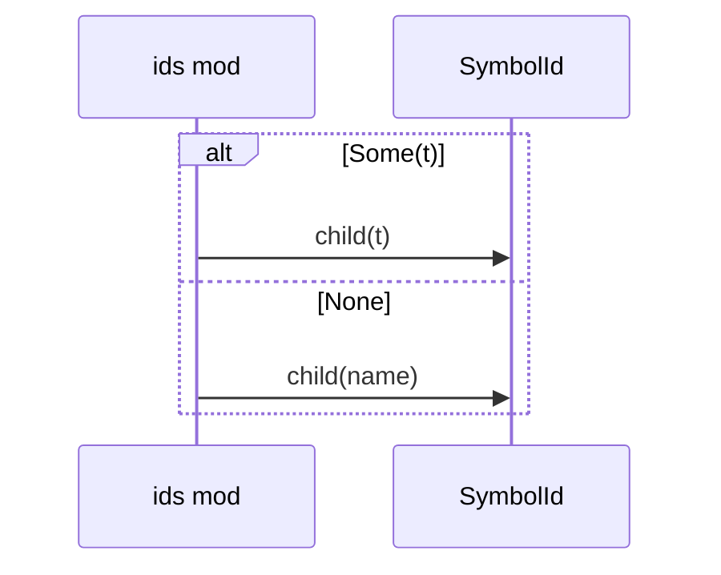

# `sealmap_frontend::ids` · crates/sealmap-frontend/src/ids.rs
> The symbol-id builder.

## structure

## `sealmap_frontend::ids::module_id`
`pub fn module_id(segments: &[String]) -> SymbolId` · L29-L32
> The id of the module at `segments`.

## `sealmap_frontend::ids::path_id`
`pub fn path_id(segments: &[String]) -> SymbolId` · L34-L38
> The id spelled by a path as written (`["serde_json", "to_string"]` → `serde_json::to_string`); used for targets outside the analysed code.

## `sealmap_frontend::ids::parent_module_id`
`pub fn parent_module_id(segments: &[String]) -> Option<SymbolId>` · L40-L43
> The id of the enclosing module of the module at `segments`, if it has one.

## `sealmap_frontend::ids::item_id`
`pub fn item_id(module: &str, name: &str) -> SymbolId` · L45-L48
> The id of item `name` declared in `module` (a [`module_path()`]).

## `sealmap_frontend::ids::method_id`
`pub fn method_id(owner: &SymbolId, trait_segment: Option<&str>, name: &str) -> SymbolId` · L57-L64
> The id of method `name` on `owner`, under a [`trait_impl_segment`] when it implements a trait.

## `sealmap_frontend::ids::unresolved_method_id`
`pub fn unresolved_method_id(name: &str) -> SymbolId` · L66-L70
> The placeholder target of a method call whose receiver could not be resolved (`?::name`).

