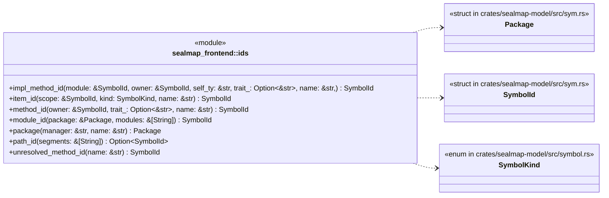
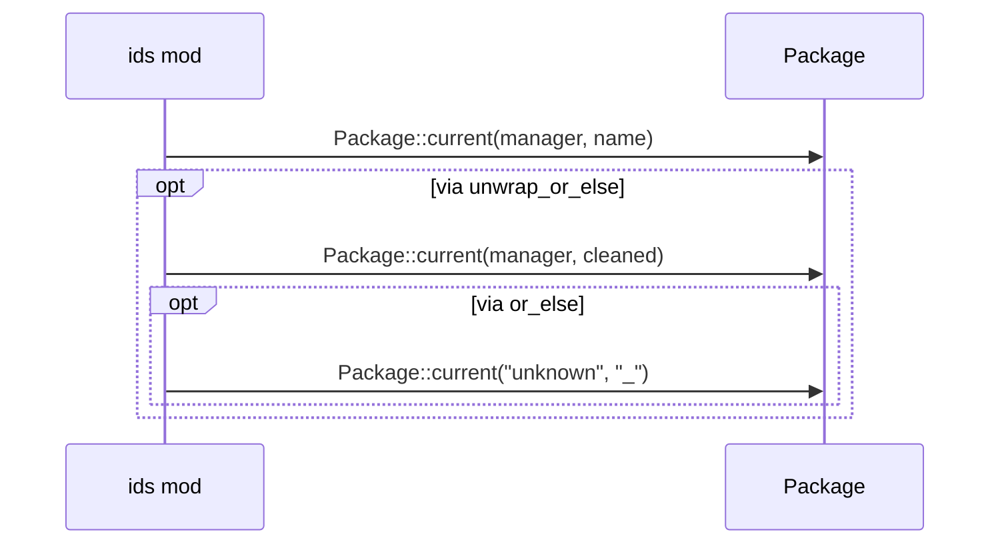
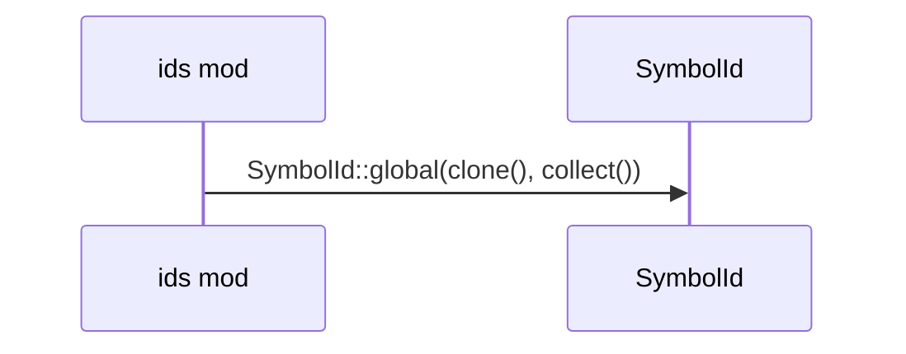
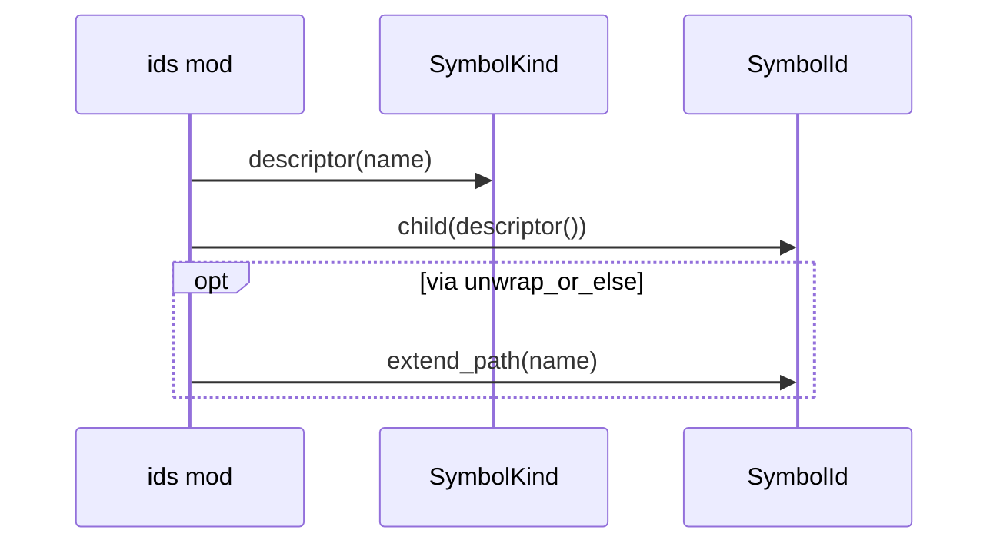
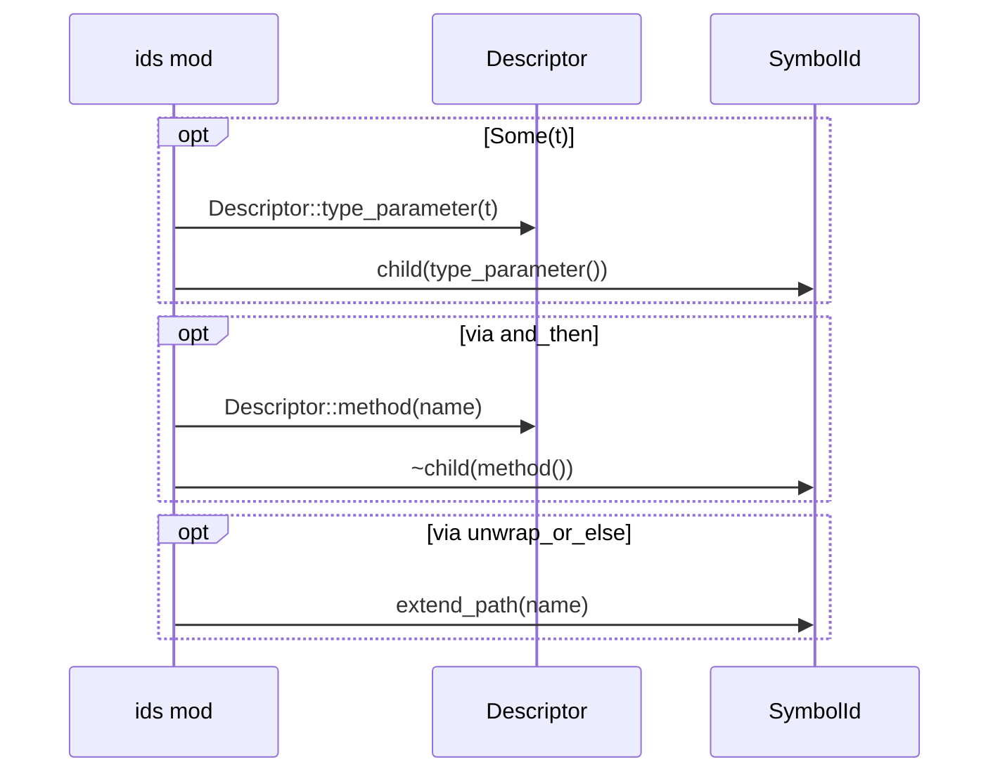
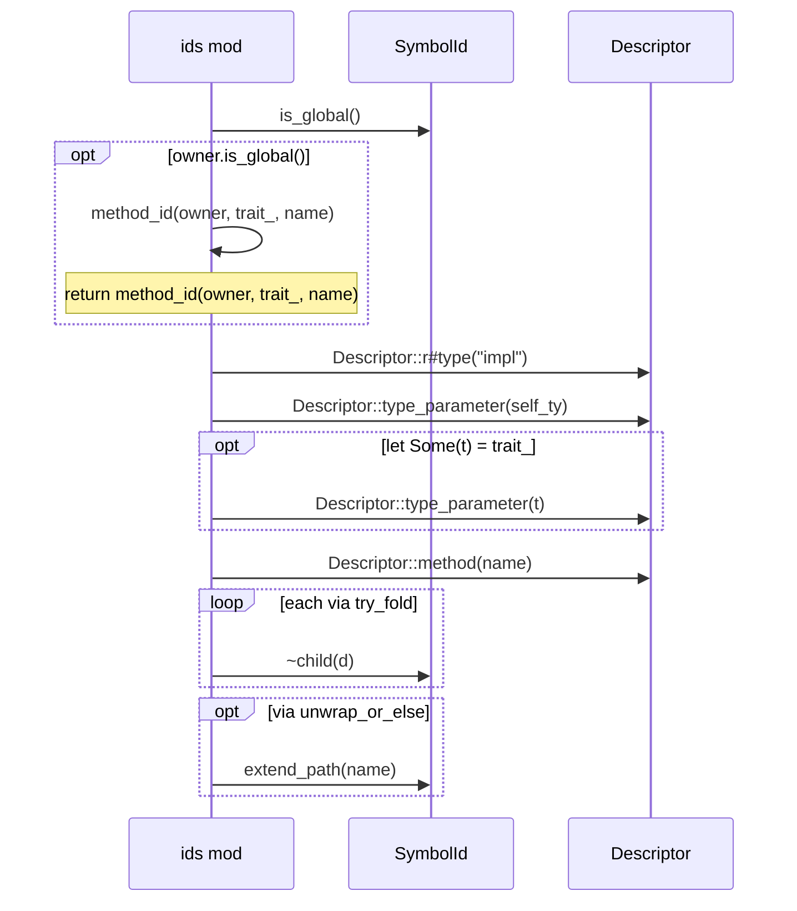
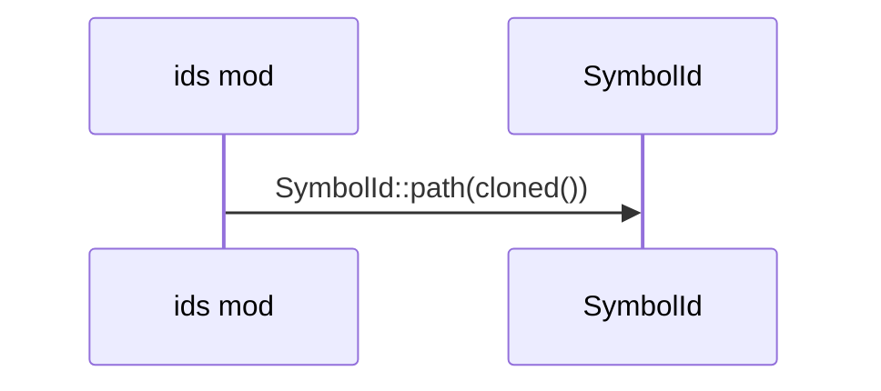
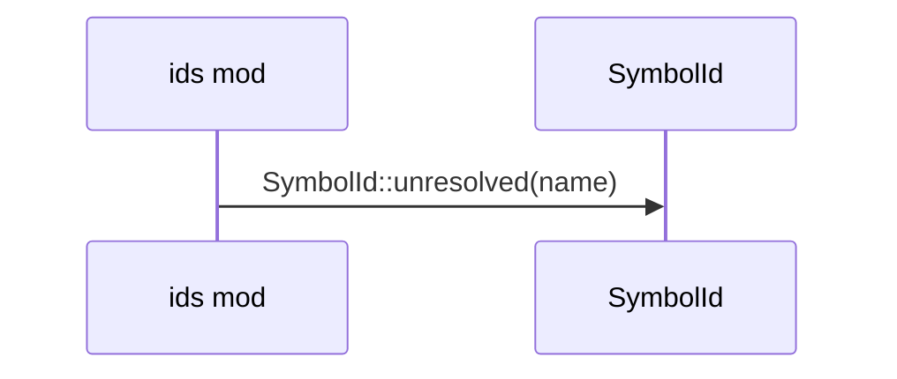

# `sym:cargo sealmap_frontend . ids/` · crates/sealmap-frontend/src/ids.rs
> The symbol-id builder.

## structure

## `sym:cargo sealmap_frontend . ids/package().`
`pub fn package(manager: &str, name: &str) -> Package` · L52-L64
> The package for `name` under `manager` (`cargo`, `npm`) at the current tree.

## `sym:cargo sealmap_frontend . ids/module_id().`
`pub fn module_id(package: &Package, modules: &[String]) -> SymbolId` · L66-L70
> The id of the module at `modules` (the path below the package root; empty for the root itself).

## `sym:cargo sealmap_frontend . ids/item_id().`
`pub fn item_id(scope: &SymbolId, kind: SymbolKind, name: &str) -> SymbolId` · L72-L77
> The id of item `name` of `kind` declared in `scope` (a module, or a type for associated items).

## `sym:cargo sealmap_frontend . ids/method_id().`
`pub fn method_id(owner: &SymbolId, trait_: Option<&str>, name: &str) -> SymbolId` · L79-L88
> The id of method `name` owned by `owner` (a type or trait), under a `[Trait]` descriptor when it implements `trait_` (spelled as written).

## `sym:cargo sealmap_frontend . ids/impl_method_id().`
`pub fn impl_method_id(module: &SymbolId, owner: &SymbolId, self_ty: &str, trait_: Option<&str>, name: &str,) -> SymbolId` · L90-L111
> The id of method `name` in an impl block found in `module`.

## `sym:cargo sealmap_frontend . ids/path_id().`
`pub fn path_id(segments: &[String]) -> Option<SymbolId>` · L113-L118
> The id of a path as written whose kinds are unknown (`["serde_json", "to_string"]` → `sym:extern serde_json::to_string`).

## `sym:cargo sealmap_frontend . ids/unresolved_method_id().`
`pub fn unresolved_method_id(name: &str) -> SymbolId` · L120-L124
> The placeholder target of a method call whose receiver could not be resolved (`sym:? name`).

