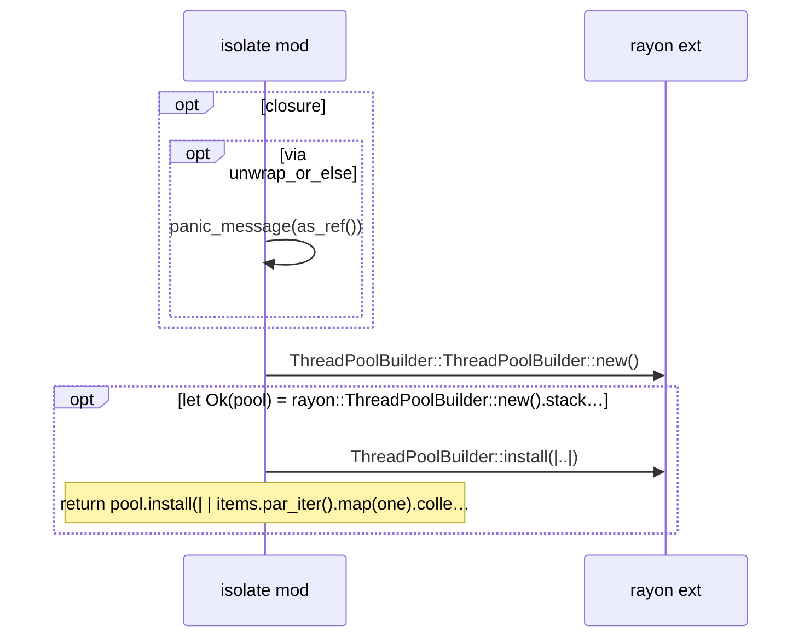

# `sym:cargo sealmap_frontend . isolate/` · crates/sealmap-frontend/src/isolate.rs
> Per-file collection on big stacks with a panic guard.

## structure

```mermaid
classDiagram
  direction LR
  class sealmap_frontend__isolate["sealmap_frontend::isolate"] {
    <<module>>
    +const COLLECT_STACK_BYTES: usize
    +map_isolated(items: &[T], stack_bytes: usize, job: F, on_panic: P) Vec#lt;R#gt;
    +panic_message(payload: &#40;dyn Any + Send#41;) String
  }
```

## `sym:cargo sealmap_frontend . isolate/map_isolated().`
`pub fn map_isolated<T, R, F, P>(items: &[T], stack_bytes: usize, job: F, on_panic: P) -> Vec<R> where T: Sync, R: Send, F: Fn(&T) -> R + Sync, P: Fn(&T, String) -> R + Sync,` · L31-L65
> Map `job` over `items`, in input order, on threads with `stack_bytes` of stack.

