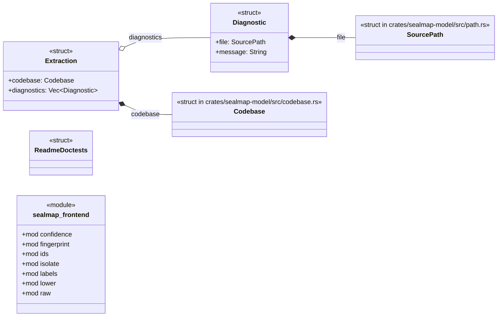

# `sym:cargo sealmap_frontend .` · crates/sealmap-frontend/src/lib.rs
> The language-neutral half of a sealmap frontend.

## structure

```mermaid
classDiagram
  direction LR
  class sealmap_frontend___tDiagnostic["Diagnostic"] {
    <<struct>>
    +file: SourcePath
    +message: String
  }
  class sealmap_frontend___tExtraction["Extraction"] {
    <<struct>>
    +codebase: Codebase
    +diagnostics: Vec#lt;Diagnostic#gt;
  }
  class sealmap_frontend___tReadmeDoctests["ReadmeDoctests"] {
    <<struct>>
  }
  class sealmap_frontend {
    <<module>>
    +mod confidence
    +mod fingerprint
    +mod ids
    +mod isolate
    +mod labels
    +mod lower
    +mod raw
  }
  class sealmap_model__path___tSourcePath["SourcePath"] {
    <<struct in crates/sealmap-model/src/path.rs>>
  }
  class sealmap_model__codebase___tCodebase["Codebase"] {
    <<struct in crates/sealmap-model/src/codebase.rs>>
  }
  sealmap_frontend___tDiagnostic *-- sealmap_model__path___tSourcePath : file
  sealmap_frontend___tExtraction o-- sealmap_frontend___tDiagnostic : diagnostics
  sealmap_frontend___tExtraction *-- sealmap_model__codebase___tCodebase : codebase
```
