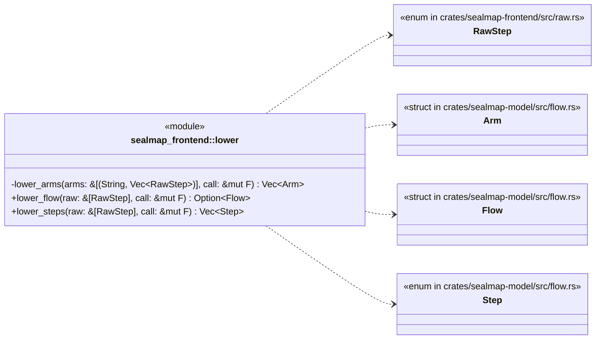
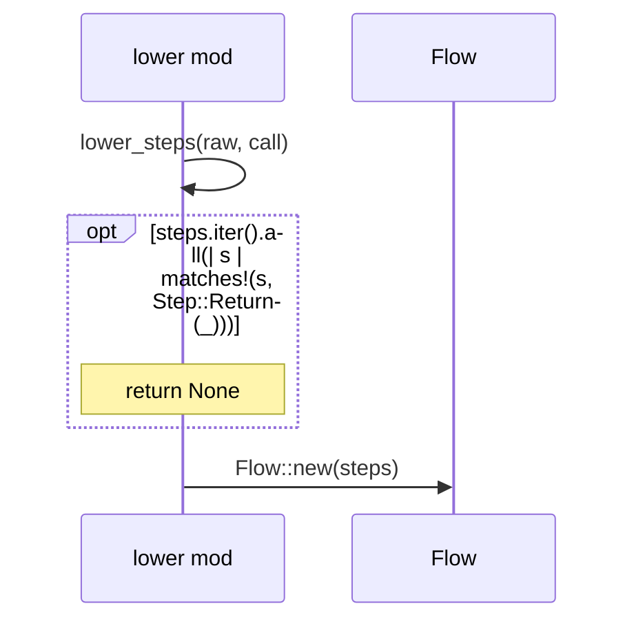
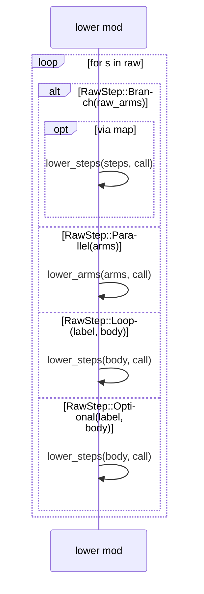
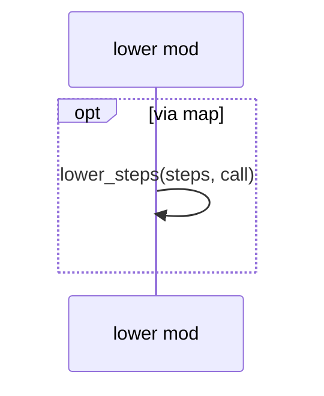

# `sym:cargo sealmap_frontend . lower/` · crates/sealmap-frontend/src/lower.rs
> Flow normalisation: lower a raw flow to a model [`Flow`] once calls can be resolved.

## structure

## `sym:cargo sealmap_frontend . lower/lower_flow().`
`pub fn lower_flow<F>(raw: &[RawStep], call: &mut F) -> Option<Flow> where F: FnMut(&RawCall) -> Option<Call>,` · L34-L50
> Lower `raw` to a [`Flow`], resolving each call with `call` (which returns `None` to drop it).

## `sym:cargo sealmap_frontend . lower/lower_steps().`
`pub fn lower_steps<F>(raw: &[RawStep], call: &mut F) -> Vec<Step> where F: FnMut(&RawCall) -> Option<Call>,` · L52-L110
> Lower a step list without the top-level rules of [`lower_flow`].

## `sym:cargo sealmap_frontend . lower/lower_arms().`
`fn lower_arms<F>(arms: &[(String, Vec<RawStep>)], call: &mut F) -> Vec<Arm> where F: FnMut(&RawCall) -> Option<Call>,` · L112-L120

