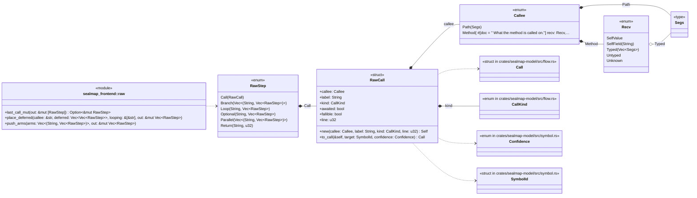

# `sealmap_frontend::raw` · crates/sealmap-frontend/src/raw.rs
> The raw flow IR: what a frontend records while walking a function body, before any name is resolved.

## structure

```mermaid
classDiagram
  direction LR
  class sealmap_frontend__raw__Callee["Callee"] {
    <<enum>>
    Path#40;Segs#41;
    Method#123; #35;[doc = #quot; What the method is called on.#quot;] recv: Recv,…
  }
  class sealmap_frontend__raw__RawCall["RawCall"] {
    <<struct>>
    +callee: Callee
    +label: String
    +kind: CallKind
    +awaited: bool
    +fallible: bool
    +line: u32
    +new(callee: Callee, label: String, kind: CallKind, line: u32) Self
    +to_call(&self, target: SymbolId, confidence: Confidence) Call
  }
  class sealmap_frontend__raw__RawStep["RawStep"] {
    <<enum>>
    Call#40;RawCall#41;
    Branch#40;Vec#lt;#40;String, Vec#lt;RawStep#gt;#41;#gt;#41;
    Loop#40;String, Vec#lt;RawStep#gt;#41;
    Optional#40;String, Vec#lt;RawStep#gt;#41;
    Parallel#40;Vec#lt;#40;String, Vec#lt;RawStep#gt;#41;#gt;#41;
    Return#40;String, u32#41;
  }
  class sealmap_frontend__raw__Recv["Recv"] {
    <<enum>>
    SelfValue
    SelfField#40;String#41;
    Typed#40;Vec#lt;Segs#gt;#41;
    Untyped
    Unknown
  }
  class sealmap_frontend__raw__Segs["Segs"] {
    <<type>>
  }
  class sealmap_frontend__raw["sealmap_frontend::raw"] {
    <<module>>
    +last_call_mut(out: &mut [RawStep]) Option#lt;&mut RawStep#gt;
    +place_deferred(callee: &str, deferred: Vec#lt;Vec#lt;RawStep#gt;#gt;, looping: &[&str], out: &mut Vec#lt;RawStep#gt;)
    +push_arms(arms: Vec#lt;#40;String, Vec#lt;RawStep#gt;#41;#gt;, out: &mut Vec#lt;RawStep#gt;)
  }
  class sealmap_model__flow__Call["Call"] {
    <<struct in crates/sealmap-model/src/flow.rs>>
  }
  class sealmap_model__flow__CallKind["CallKind"] {
    <<enum in crates/sealmap-model/src/flow.rs>>
  }
  class sealmap_model__symbol__Confidence["Confidence"] {
    <<enum in crates/sealmap-model/src/symbol.rs>>
  }
  class sealmap_model__symbol__SymbolId["SymbolId"] {
    <<struct in crates/sealmap-model/src/symbol.rs>>
  }
  sealmap_frontend__raw ..> sealmap_frontend__raw__RawStep
  sealmap_frontend__raw__Callee *-- sealmap_frontend__raw__Recv : Method
  sealmap_frontend__raw__Callee *-- sealmap_frontend__raw__Segs : Path
  sealmap_frontend__raw__RawCall *-- sealmap_frontend__raw__Callee : callee
  sealmap_frontend__raw__RawCall ..> sealmap_model__flow__Call
  sealmap_frontend__raw__RawCall *-- sealmap_model__flow__CallKind : kind
  sealmap_frontend__raw__RawCall ..> sealmap_model__symbol__Confidence
  sealmap_frontend__raw__RawCall ..> sealmap_model__symbol__SymbolId
  sealmap_frontend__raw__RawStep *-- sealmap_frontend__raw__RawCall : Call
  sealmap_frontend__raw__Recv o-- sealmap_frontend__raw__Segs : Typed
```
