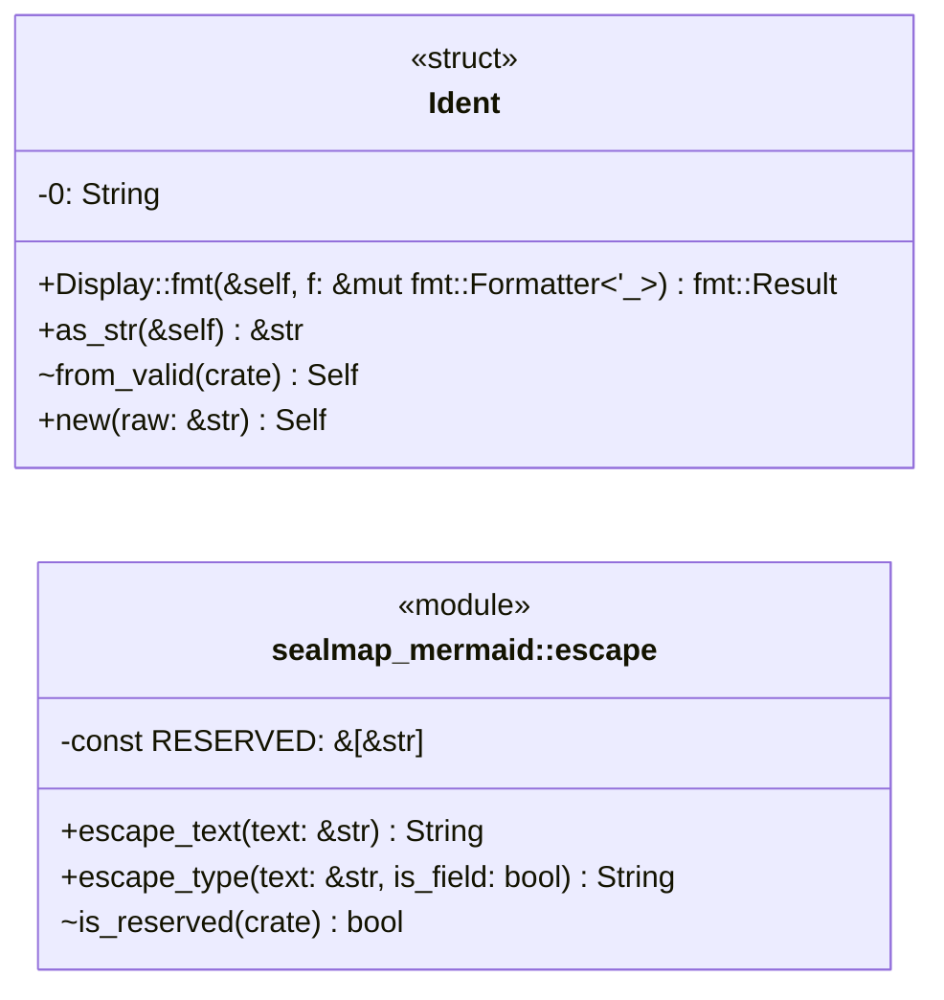
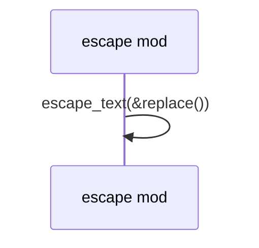

# `sym:cargo sealmap_mermaid . escape/` · crates/sealmap-mermaid/src/escape.rs

## structure

## `sym:cargo sealmap_mermaid . escape/escape_type().`
`pub fn escape_type(text: &str, is_field: bool) -> String` · L129-L160
> Escape a type or member text for a class-diagram body.

