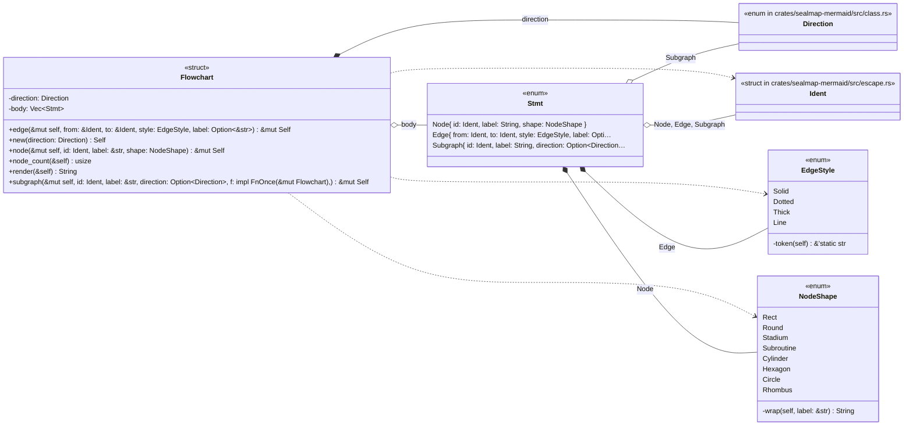
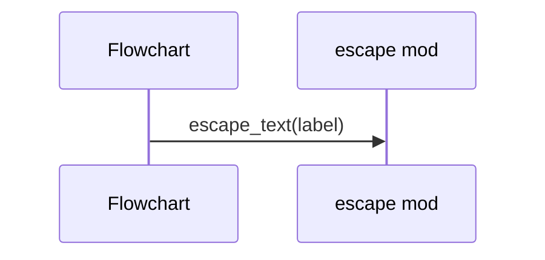
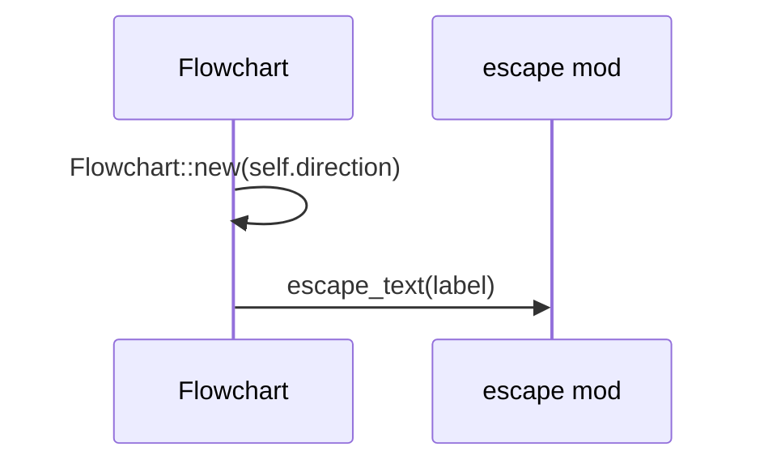
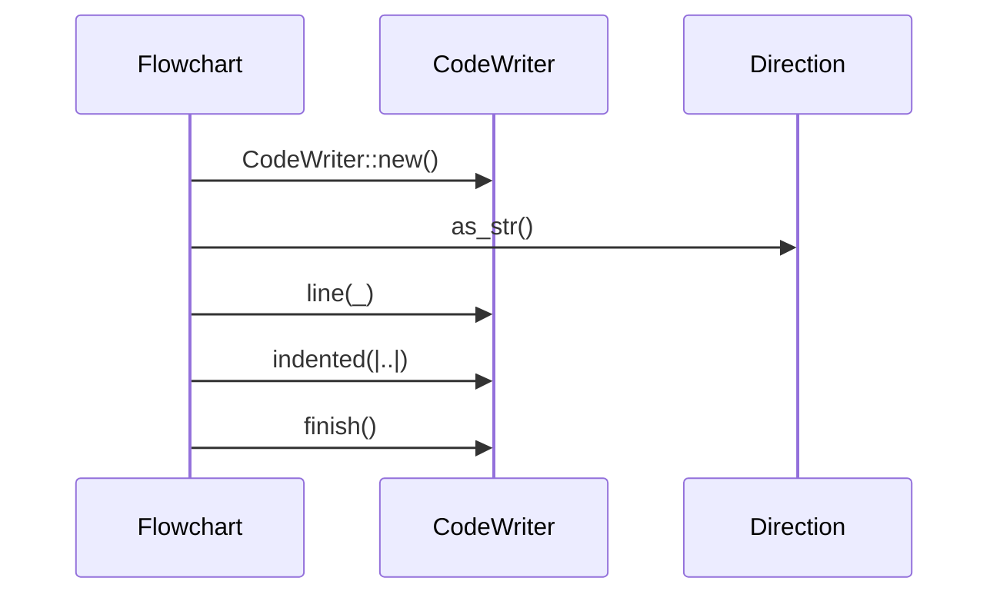

# `sym:cargo sealmap_mermaid . flowchart/` · crates/sealmap-mermaid/src/flowchart.rs

## structure

## `sym:cargo sealmap_mermaid . flowchart/Flowchart#node().`
`pub fn node(&mut self, id: Ident, label: &str, shape: NodeShape) -> &mut Self` · L108-L112
> Declare a node.

## `sym:cargo sealmap_mermaid . flowchart/Flowchart#subgraph().`
`pub fn subgraph(&mut self, id: Ident, label: &str, direction: Option<Direction>, f: impl FnOnce(&mut Flowchart),) -> &mut Self` · L125-L137
> Add a subgraph; `f` fills it.

## `sym:cargo sealmap_mermaid . flowchart/Flowchart#render().`
`pub fn render(&self) -> String` · L153-L184
> Render to Mermaid text.

