# `sym:cargo sealmap_mermaid . sequence/` · crates/sealmap-mermaid/src/sequence.rs

## structure
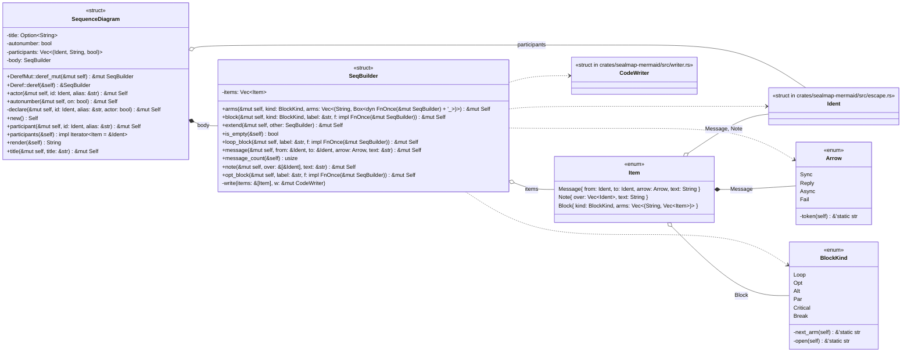

## `sym:cargo sealmap_mermaid . sequence/SeqBuilder#message().`
`pub fn message(&mut self, from: &Ident, to: &Ident, arrow: Arrow, text: &str) -> &mut Self` · L85-L89
> `from ->> to: text` (or another arrow).
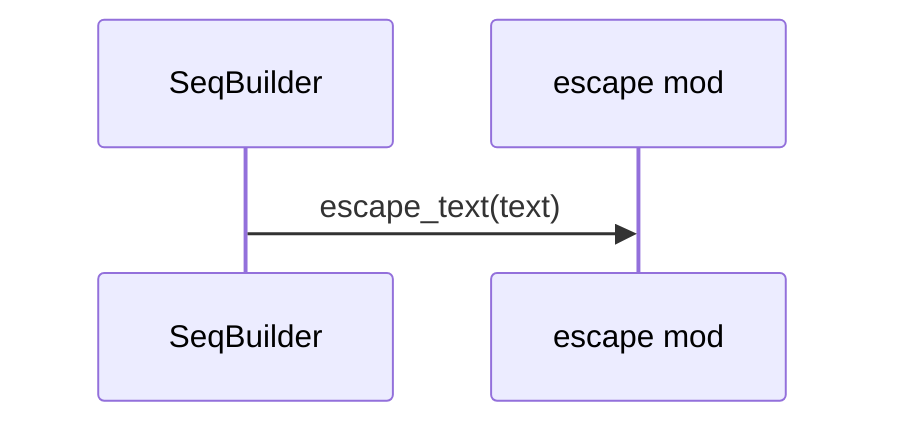

## `sym:cargo sealmap_mermaid . sequence/SeqBuilder#note().`
`pub fn note(&mut self, over: &[&Ident], text: &str) -> &mut Self` · L91-L97
> `Note over a,b: text` (one or two participants; `right of` when only one is given would be ambiguous for merging, so `over` is always used).

## `sym:cargo sealmap_mermaid . sequence/SeqBuilder#block().`
`pub fn block(&mut self, kind: BlockKind, label: &str, f: impl FnOnce(&mut SeqBuilder)) -> &mut Self` · L99-L105
> A single-arm fragment (`loop`, `opt`, `break`).
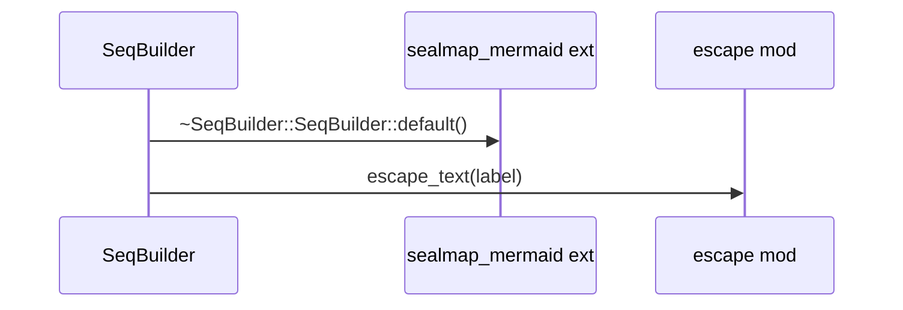

## `sym:cargo sealmap_mermaid . sequence/SeqBuilder#loop_block().`
`pub fn loop_block(&mut self, label: &str, f: impl FnOnce(&mut SeqBuilder)) -> &mut Self` · L107-L110
> Shorthand for `block(BlockKind::Loop, ..)`.
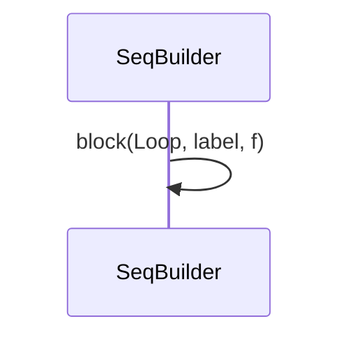

## `sym:cargo sealmap_mermaid . sequence/SeqBuilder#opt_block().`
`pub fn opt_block(&mut self, label: &str, f: impl FnOnce(&mut SeqBuilder)) -> &mut Self` · L112-L115
> Shorthand for `block(BlockKind::Opt, ..)`.
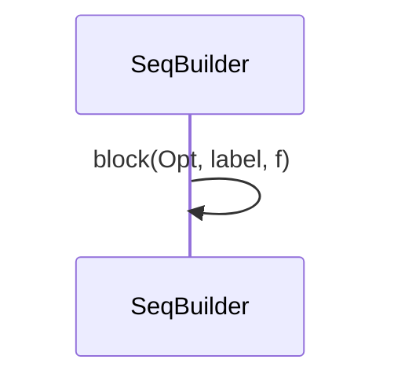

## `sym:cargo sealmap_mermaid . sequence/SeqBuilder#arms().`
`pub fn arms(&mut self, kind: BlockKind, arms: Vec<(String, Box<dyn FnOnce(&mut SeqBuilder) + '_>)>) -> &mut Self` · L117-L146
> A multi-arm fragment (`alt`/`else`, `par`/`and`, `critical`/`option`).
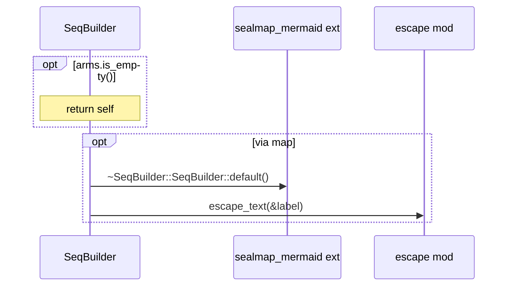

## `sym:cargo sealmap_mermaid . sequence/SeqBuilder#write().`
`fn write(items: &[Item], w: &mut CodeWriter)` · L175-L195
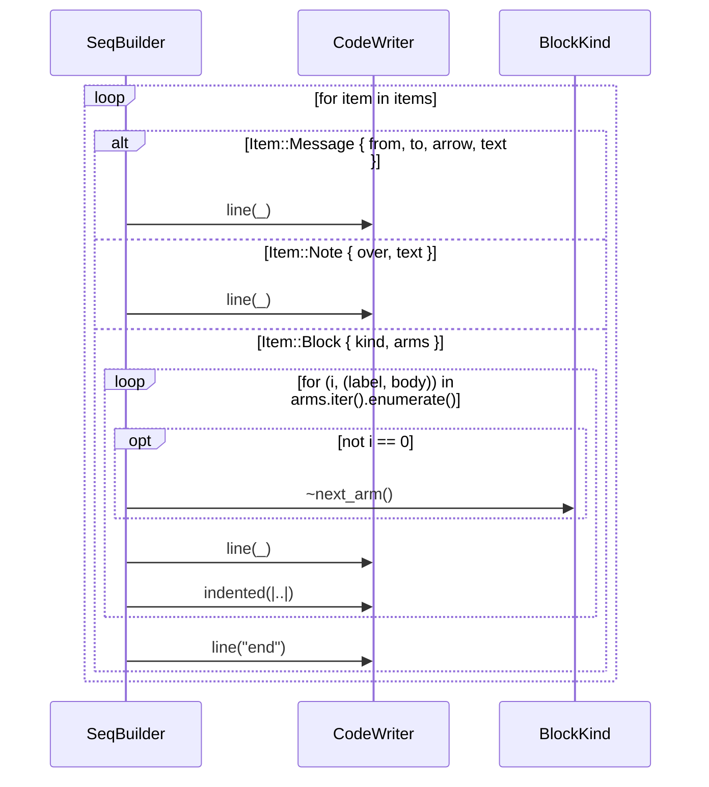

## `sym:cargo sealmap_mermaid . sequence/SequenceDiagram#title().`
`pub fn title(&mut self, title: &str) -> &mut Self` · L218-L222
> Set the diagram title.
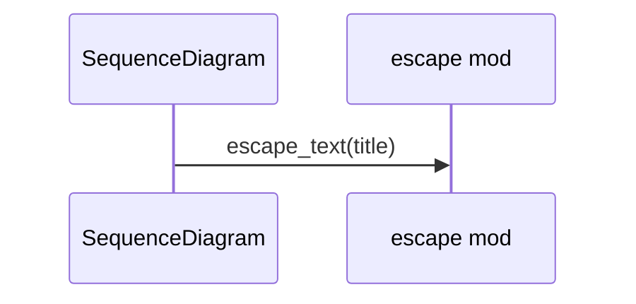

## `sym:cargo sealmap_mermaid . sequence/SequenceDiagram#participant().`
`pub fn participant(&mut self, id: Ident, alias: &str) -> &mut Self` · L230-L234
> Declare a participant lane with a display alias.
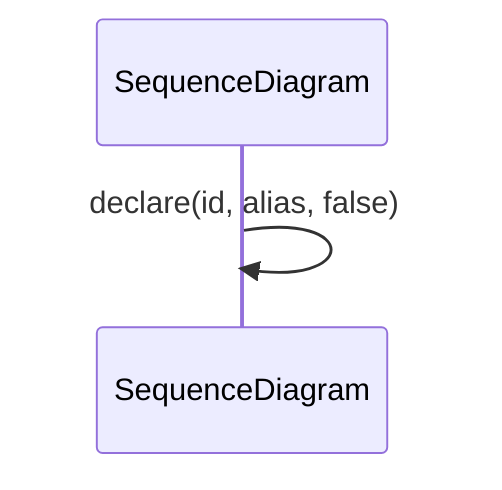

## `sym:cargo sealmap_mermaid . sequence/SequenceDiagram#actor().`
`pub fn actor(&mut self, id: Ident, alias: &str) -> &mut Self` · L236-L239
> Declare an actor lane (stick figure), e.g.
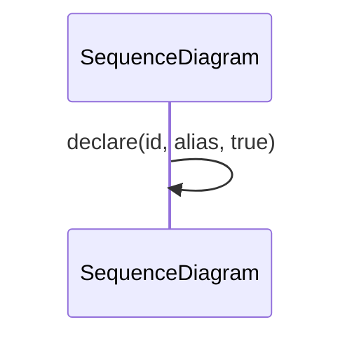

## `sym:cargo sealmap_mermaid . sequence/SequenceDiagram#declare().`
`fn declare(&mut self, id: Ident, alias: &str, actor: bool) -> &mut Self` · L241-L246
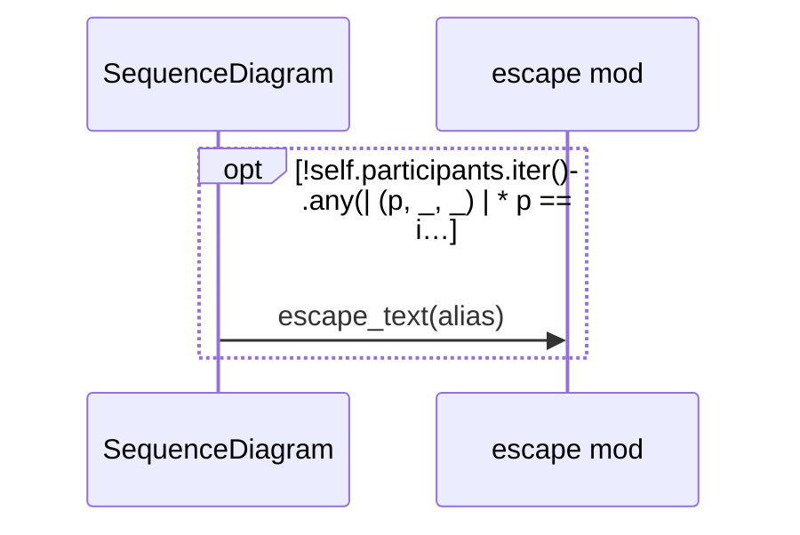

## `sym:cargo sealmap_mermaid . sequence/SequenceDiagram#render().`
`pub fn render(&self) -> String` · L253-L275
> Render to Mermaid text.
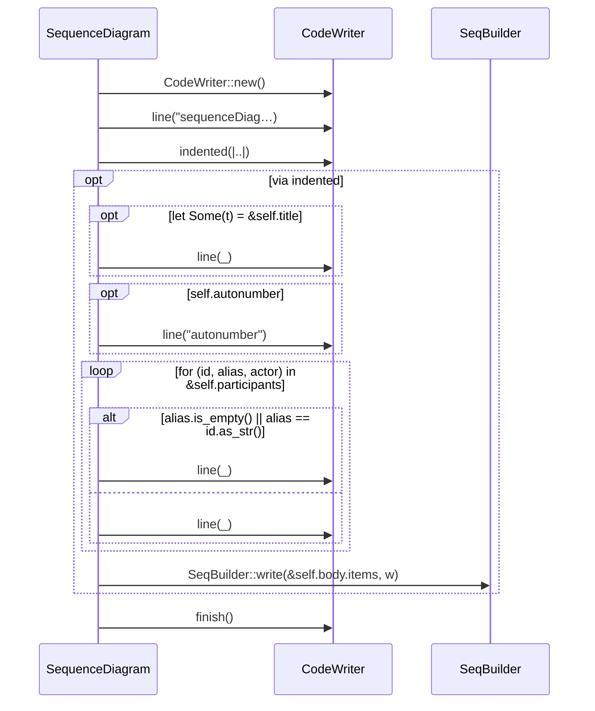
