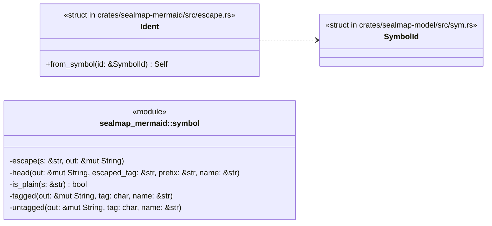
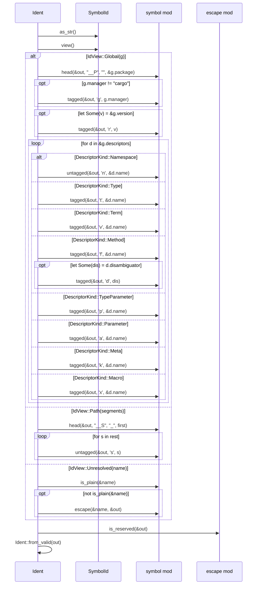
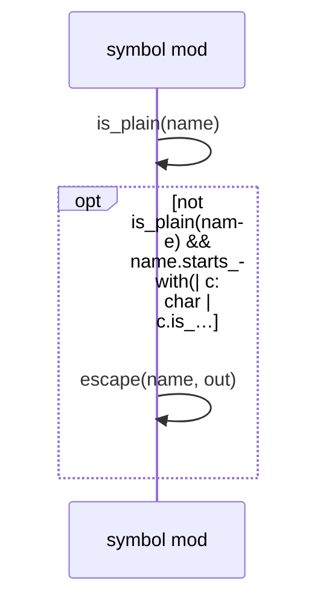
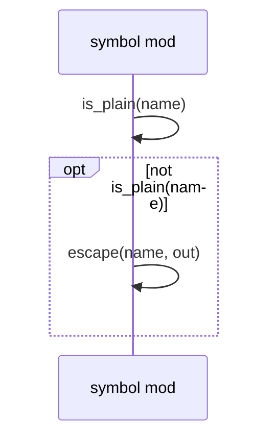

# `sym:cargo sealmap_mermaid . symbol/` · crates/sealmap-mermaid/src/symbol.rs
> Injective diagram ids for `sym:` symbol ids (feature `model`).

## structure

## `sym:cargo sealmap_mermaid . escape/Ident#from_symbol().`
`pub fn from_symbol(id: &SymbolId) -> Self` · L10-L108
> The diagram id of a symbol, derived from the structure of its [`SymbolId`] by an **injective** encoding: two different ids never share a diagram id, by constru…

## `sym:cargo sealmap_mermaid . symbol/head().`
`fn head(out: &mut String, escaped_tag: &str, prefix: &str, name: &str)` · L130-L140
> The first name: `prefix` + the name when plain and starting with a letter, otherwise `escaped_tag` + the escaped name.

## `sym:cargo sealmap_mermaid . symbol/tagged().`
`fn tagged(out: &mut String, tag: char, name: &str)` · L142-L152
> `___` + tag + plain name, or `___` + upper-case tag + escaped name.

## `sym:cargo sealmap_mermaid . symbol/untagged().`
`fn untagged(out: &mut String, tag: char, name: &str)` · L154-L164
> `__` + plain name, or the escaped tagged form (`tag` upper-cased).

