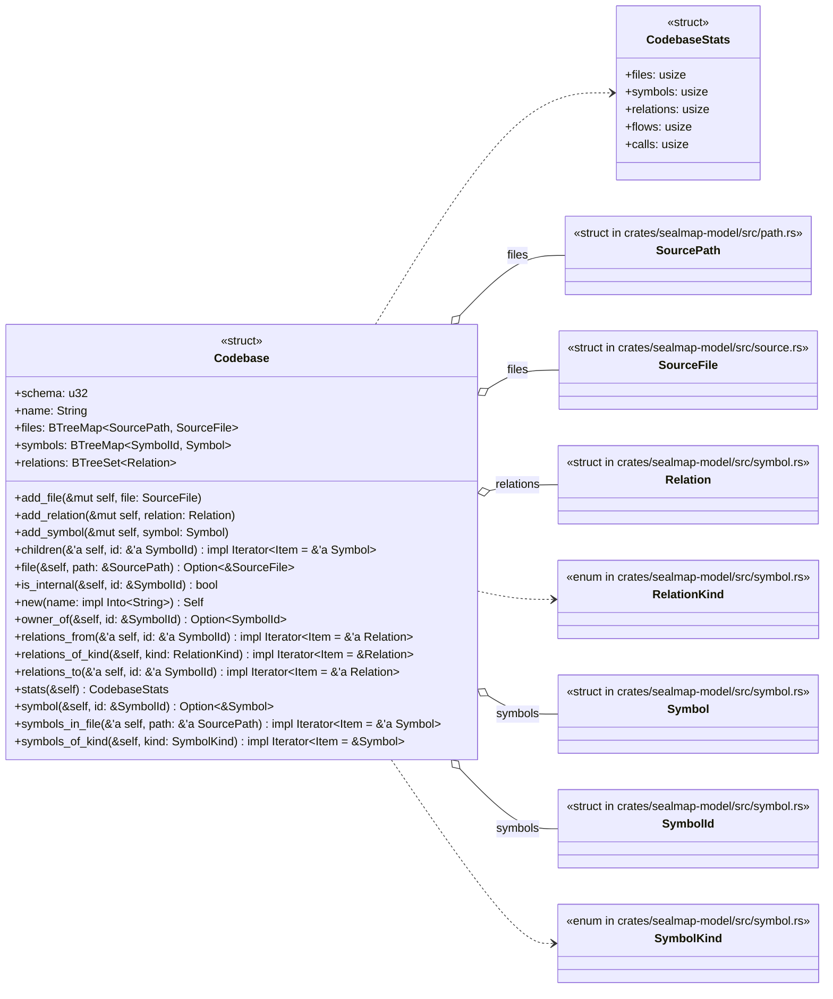
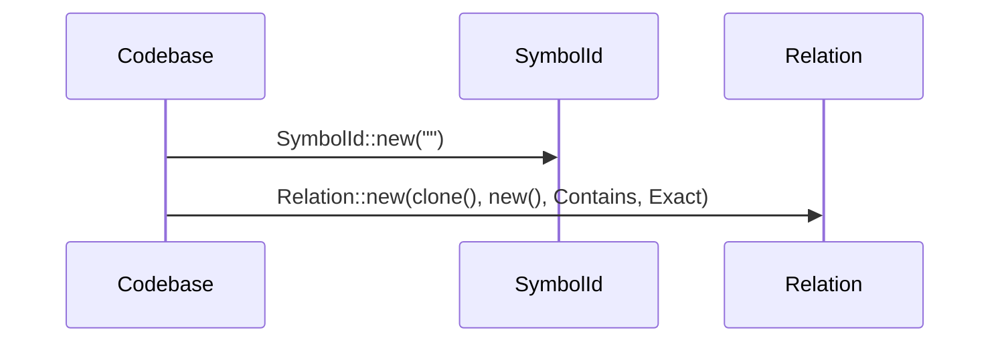
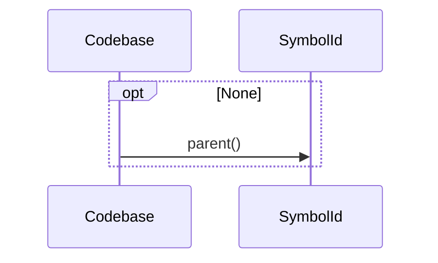
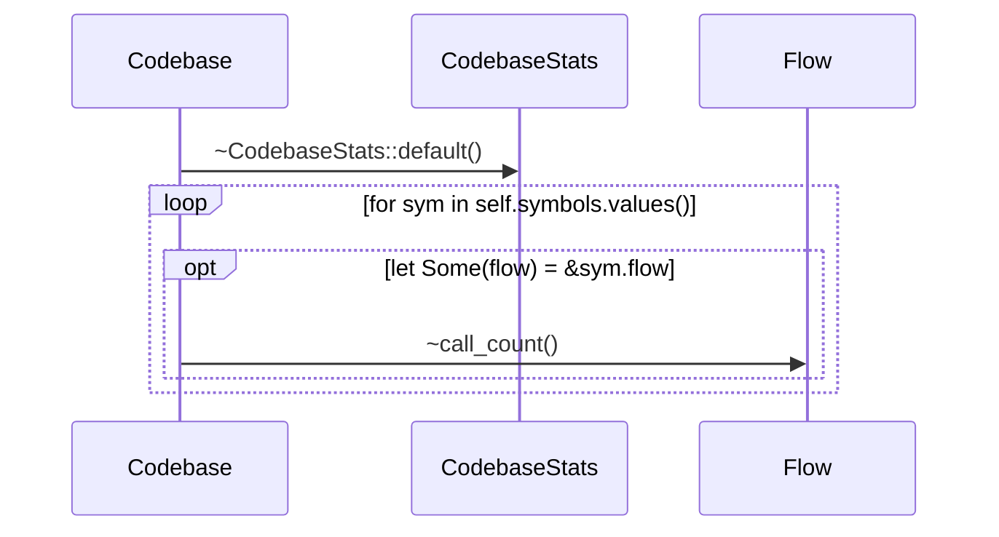

# `sealmap_model::codebase` · crates/sealmap-model/src/codebase.rs

## structure

## `sealmap_model::codebase::Codebase::relations_from`
`pub fn relations_from<'a>(&'a self, id: &'a SymbolId) -> impl Iterator<Item = &'a Relation>` · L95-L102
> Relations whose source is `id`.

## `sealmap_model::codebase::Codebase::owner_of`
`pub fn owner_of(&self, id: &SymbolId) -> Option<SymbolId>` · L114-L125
> The innermost *type* that owns `id` (the type for a method), or the module for free items.

## `sealmap_model::codebase::Codebase::stats`
`pub fn stats(&self) -> CodebaseStats` · L127-L142
> Summary counts.

