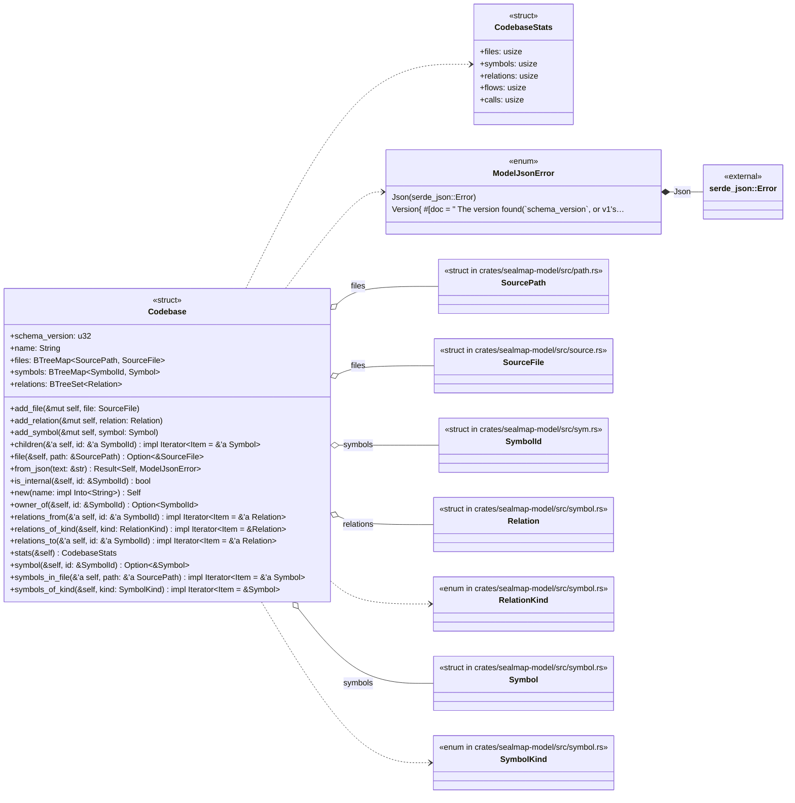
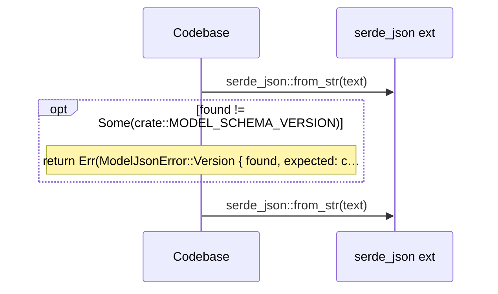
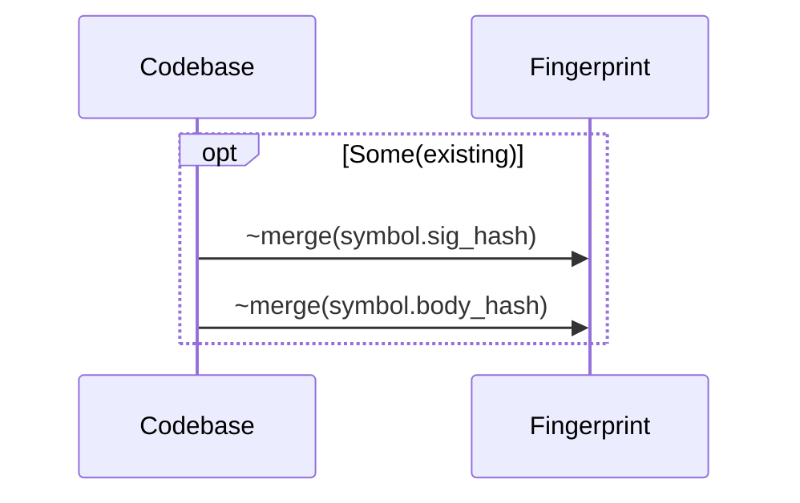
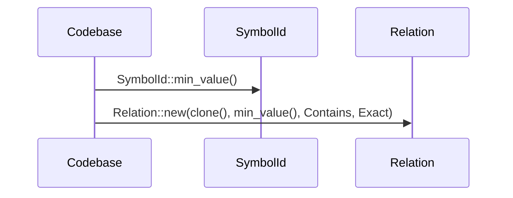
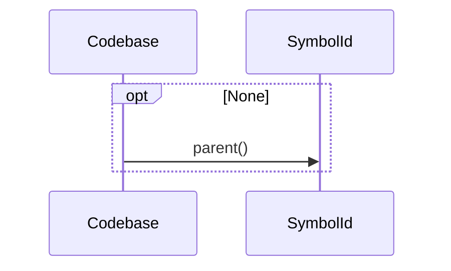
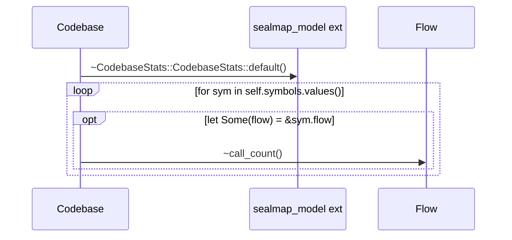

# `sym:cargo sealmap_model . codebase/` · crates/sealmap-model/src/codebase.rs

## structure

## `sym:cargo sealmap_model . codebase/Codebase#from_json().`
`pub fn from_json(text: &str) -> Result<Self, ModelJsonError>` · L35-L59
> Read a model serialised as JSON, refusing any schema version other than [`MODEL_SCHEMA_VERSION`](crate::MODEL_SCHEMA_VERSION).

## `sym:cargo sealmap_model . codebase/Codebase#add_symbol().`
`pub fn add_symbol(&mut self, symbol: Symbol)` · L66-L87
> Add a symbol.

## `sym:cargo sealmap_model . codebase/Codebase#relations_from().`
`pub fn relations_from<'a>(&'a self, id: &'a SymbolId) -> impl Iterator<Item = &'a Relation>` · L126-L133
> Relations whose source is `id`.

## `sym:cargo sealmap_model . codebase/Codebase#owner_of().`
`pub fn owner_of(&self, id: &SymbolId) -> Option<SymbolId>` · L145-L156
> The innermost *type* that owns `id` (the type for a method), or the module for free items.

## `sym:cargo sealmap_model . codebase/Codebase#stats().`
`pub fn stats(&self) -> CodebaseStats` · L158-L173
> Summary counts.

