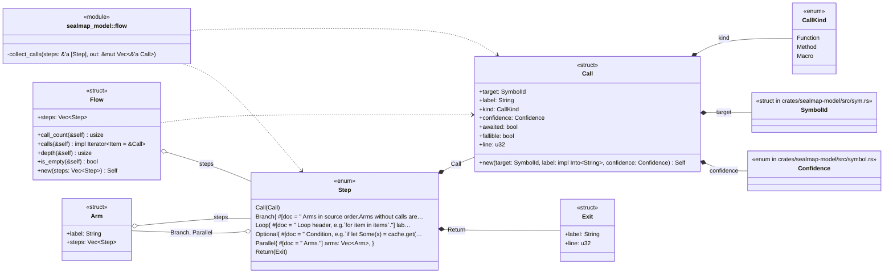
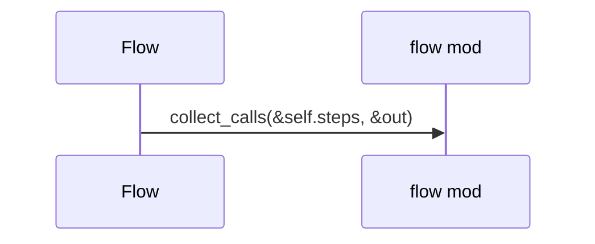
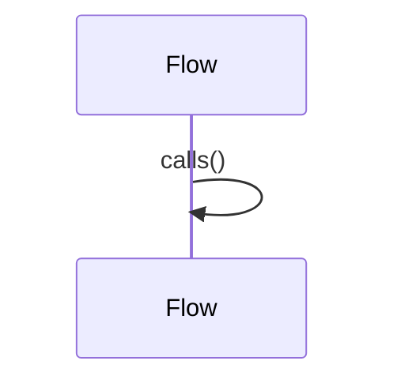
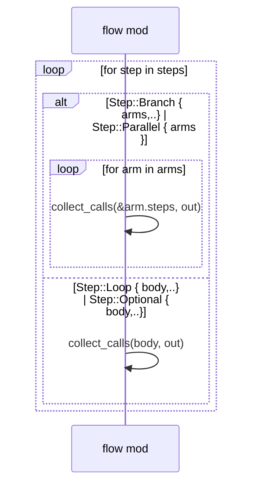

# `sym:cargo sealmap_model . flow/` · crates/sealmap-model/src/flow.rs
> Ordered call/control flow of a function body: the raw material for sequence diagrams.

## structure

## `sym:cargo sealmap_model . flow/Flow#calls().`
`pub fn calls(&self) -> impl Iterator<Item = &Call>` · L54-L59
> Every call in depth-first source order.

## `sym:cargo sealmap_model . flow/Flow#call_count().`
`pub fn call_count(&self) -> usize` · L61-L64
> Number of calls in the whole tree.

## `sym:cargo sealmap_model . flow/collect_calls().`
`fn collect_calls<'a>(steps: &'a [Step], out: &mut Vec<&'a Call>)` · L84-L97

