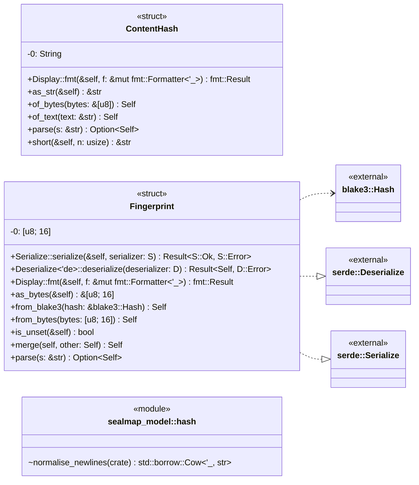
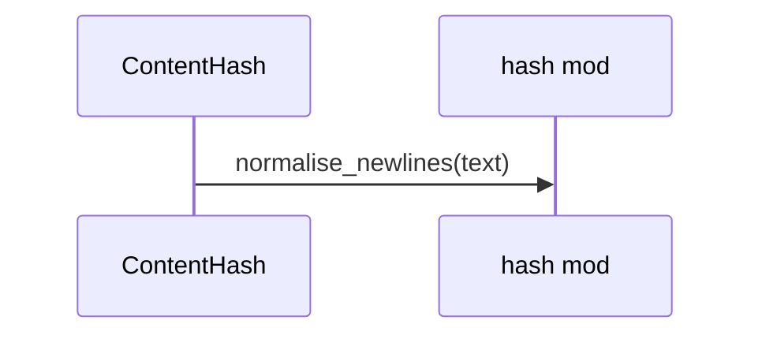
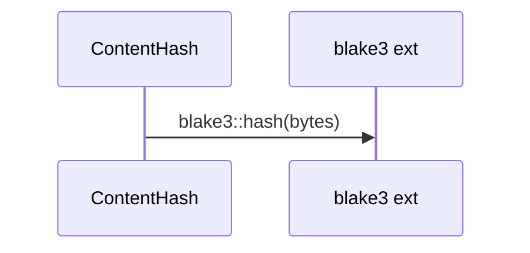
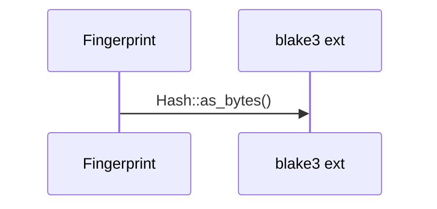
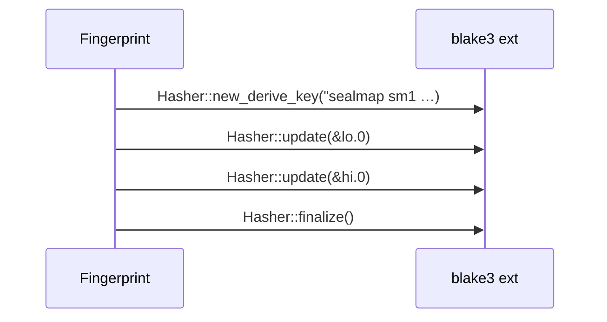
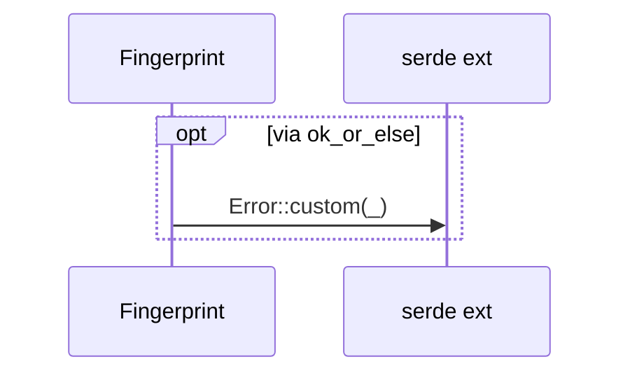

# `sym:cargo sealmap_model . hash/` · crates/sealmap-model/src/hash.rs

## structure

## `sym:cargo sealmap_model . hash/ContentHash#of_text().`
`pub fn of_text(text: &str) -> Self` · L24-L28
> Hash `text` after normalising line endings.

## `sym:cargo sealmap_model . hash/ContentHash#of_bytes().`
`pub fn of_bytes(bytes: &[u8]) -> Self` · L30-L33
> Hash raw bytes with no normalisation.

## `sym:cargo sealmap_model . hash/Fingerprint#from_blake3().`
`pub fn from_blake3(hash: &blake3::Hash) -> Self` · L96-L101
> Truncate a full BLAKE3 digest.

## `sym:cargo sealmap_model . hash/Fingerprint#merge().`
`pub fn merge(self, other: Self) -> Self` · L126-L144
> Fold two fingerprints of the same symbol into one, independent of their order.

## `` sym:cargo sealmap_model . hash/Fingerprint#[`Deserialize<'de>`]deserialize(). ``
`fn deserialize<D: serde::Deserializer<'de>>(deserializer: D) -> Result<Self, D::Error>` · L164-L167

