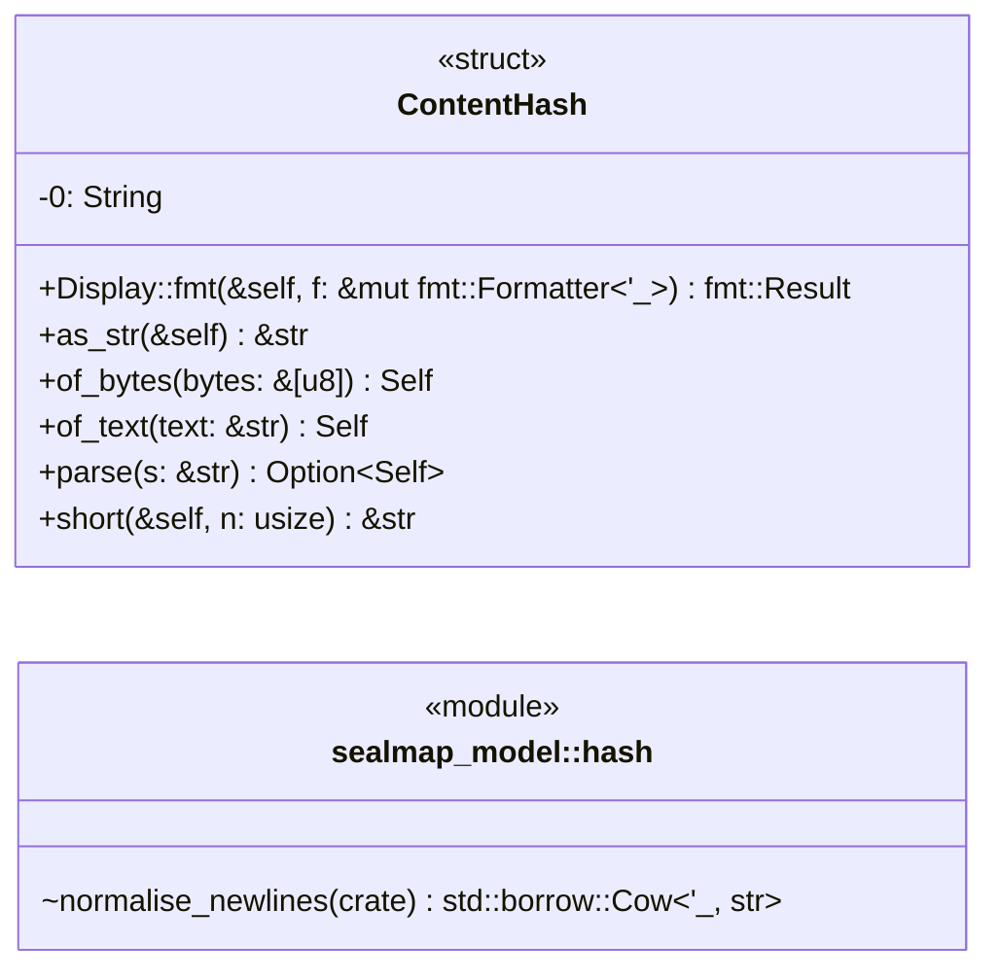
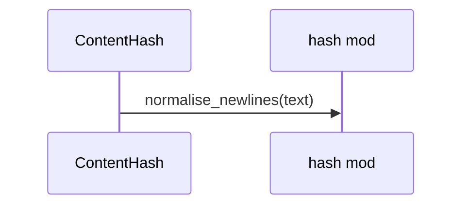
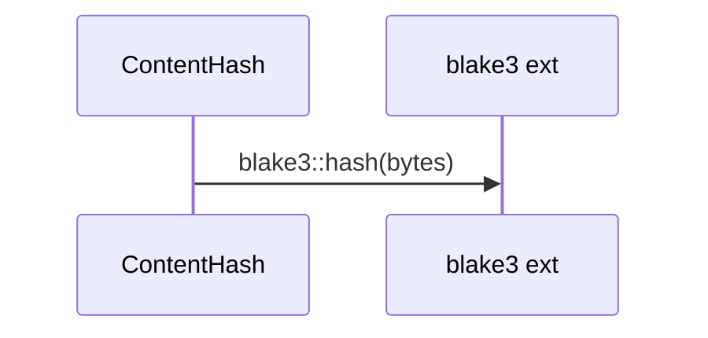

# `sealmap_model::hash` · crates/sealmap-model/src/hash.rs

## structure

## `sealmap_model::hash::ContentHash::of_text`
`pub fn of_text(text: &str) -> Self` · L24-L28
> Hash `text` after normalising line endings.

## `sealmap_model::hash::ContentHash::of_bytes`
`pub fn of_bytes(bytes: &[u8]) -> Self` · L30-L33
> Hash raw bytes with no normalisation.

