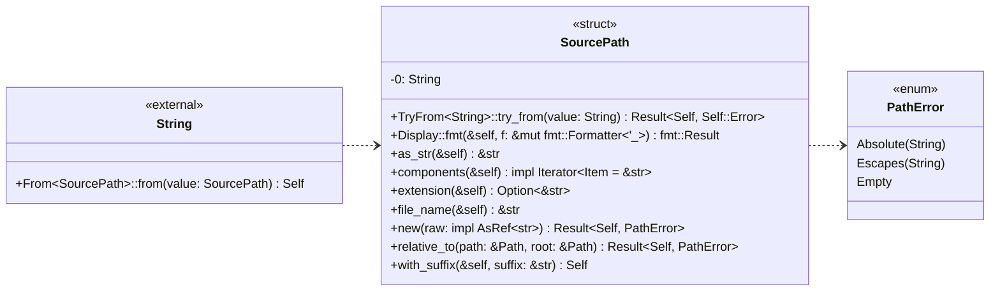
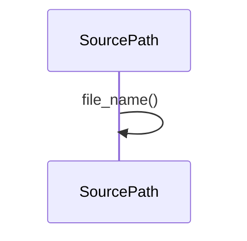

# `sealmap_model::path` · crates/sealmap-model/src/path.rs

## structure

## `sealmap_model::path::SourcePath::extension`
`pub fn extension(&self) -> Option<&str>` · L96-L100
> The extension without the dot, if any.

