# `sym:cargo sealmap_model . sym/` · crates/sealmap-model/src/sym.rs
> The `sym:` symbol-id grammar.

## structure
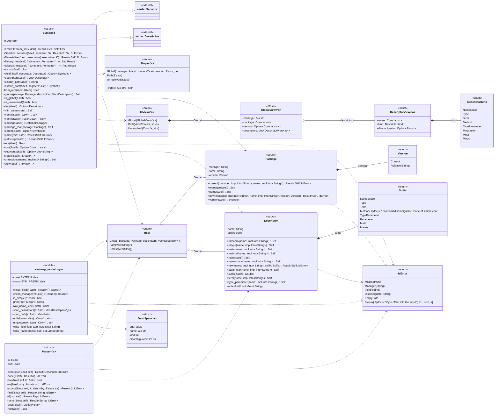

## `sym:cargo sealmap_model . sym/Package#new().`
`pub fn new(manager: impl Into<String>, name: impl Into<String>, version: Version) -> Result<Self, IdError>` · L220-L236
> A package with an explicit version.
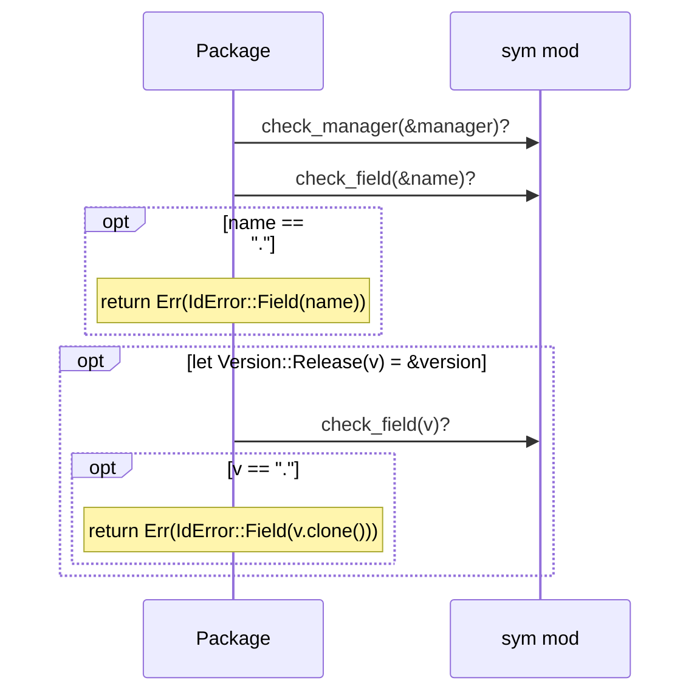

## `sym:cargo sealmap_model . sym/Descriptor#write().`
`fn write(&self, out: &mut String)` · L335-L364
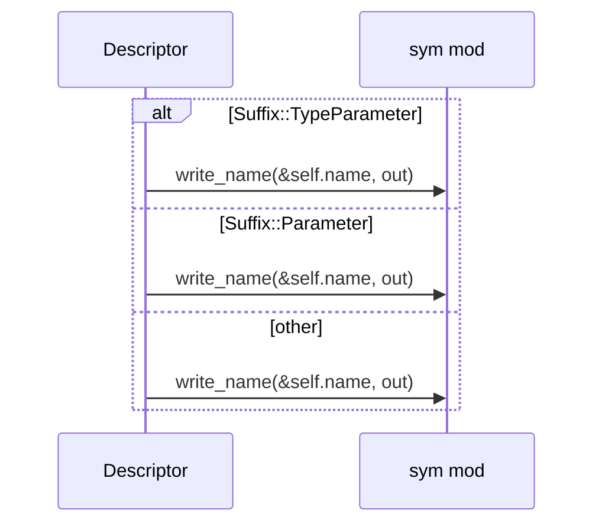

## `sym:cargo sealmap_model . sym/SymbolId#from_repr().`
`fn from_repr(repr: &Repr) -> Self` · L399-L401
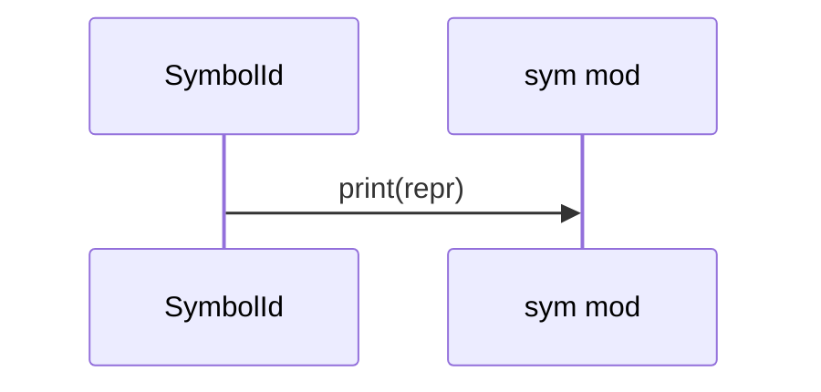

## `sym:cargo sealmap_model . sym/SymbolId#parse().`
`pub fn parse(text: &str) -> Result<Self, IdError>` · L432-L444
> Parse the canonical form.
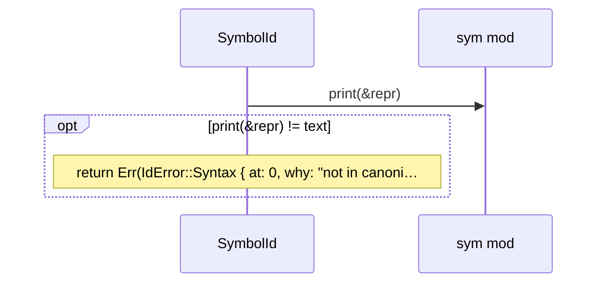

## `sym:cargo sealmap_model . sym/SymbolId#shape().`
`fn shape(&self) -> Shape<'_>` · L460-L462
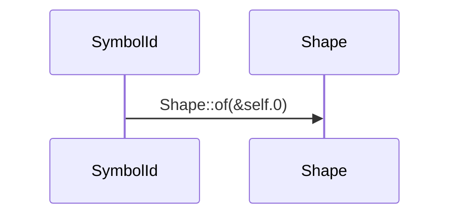

## `sym:cargo sealmap_model . sym/SymbolId#is_global().`
`pub fn is_global(&self) -> bool` · L464-L467
> `true` for global (kind-explicit) ids.
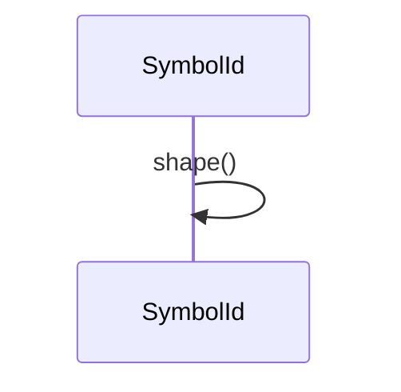

## `sym:cargo sealmap_model . sym/SymbolId#is_unresolved().`
`pub fn is_unresolved(&self) -> bool` · L469-L472
> `true` for [`SymbolId::unresolved`] ids.


## `sym:cargo sealmap_model . sym/SymbolId#package().`
`pub fn package(&self) -> Option<Package>` · L474-L480
> The package of a global id.
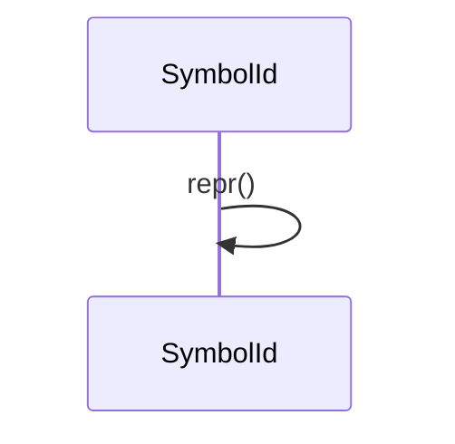

## `sym:cargo sealmap_model . sym/SymbolId#descriptors().`
`pub fn descriptors(&self) -> Vec<Descriptor>` · L482-L488
> The descriptors of a global id (empty for the other forms).


## `sym:cargo sealmap_model . sym/SymbolId#segments().`
`pub fn segments(&self) -> Option<Vec<String>>` · L490-L496
> The segments of a path id.


## `sym:cargo sealmap_model . sym/SymbolId#last().`
`pub fn last(&self) -> Option<Descriptor>` · L498-L501
> The last descriptor of a global id.
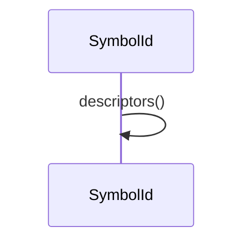

## `sym:cargo sealmap_model . sym/SymbolId#name().`
`pub fn name(&self) -> Cow<'_, str>` · L503-L519
> The short name: the last descriptor's name, the package name of a package root, the last path segment, or the unresolved method name.
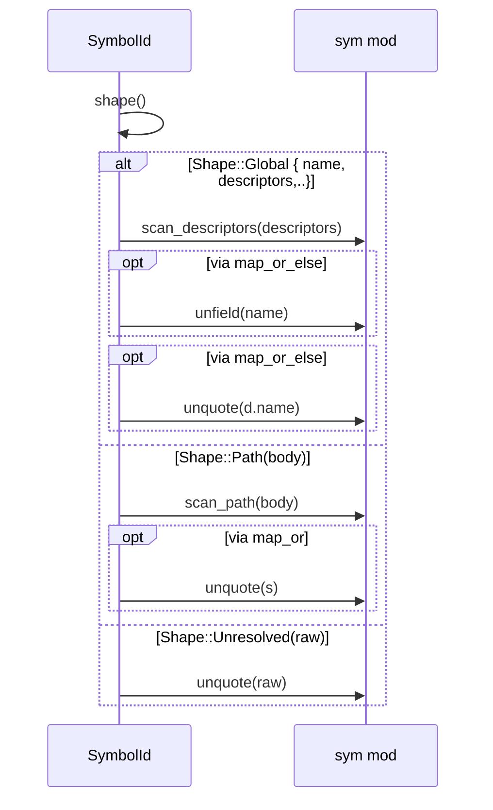

## `sym:cargo sealmap_model . sym/SymbolId#root().`
`pub fn root(&self) -> Option<Cow<'_, str>>` · L521-L529
> The first name: the package name, or the first path segment.
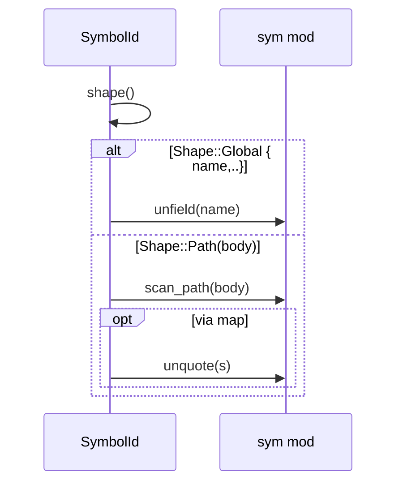

## `sym:cargo sealmap_model . sym/SymbolId#parent().`
`pub fn parent(&self) -> Option<SymbolId>` · L531-L572
> The enclosing definition.
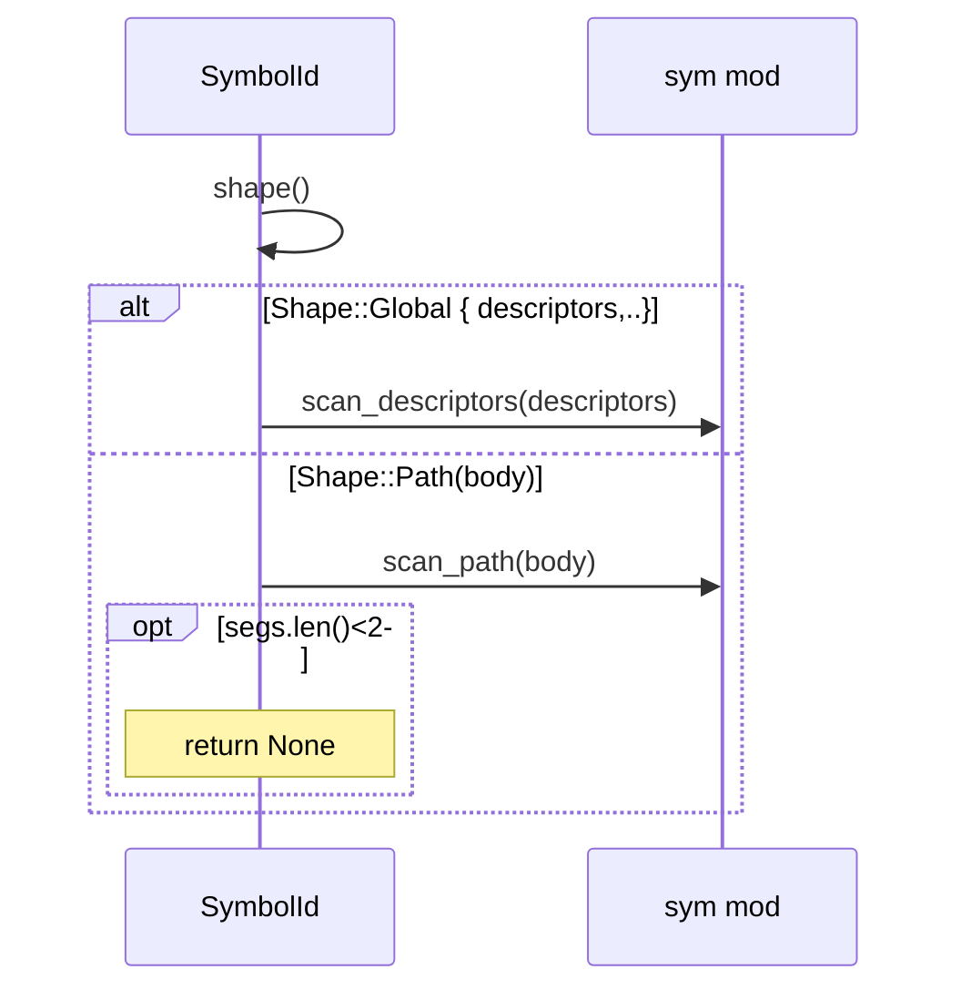

## `sym:cargo sealmap_model . sym/SymbolId#child().`
`pub fn child(&self, descriptor: Descriptor) -> Option<SymbolId>` · L574-L585
> Append a descriptor to a global id.
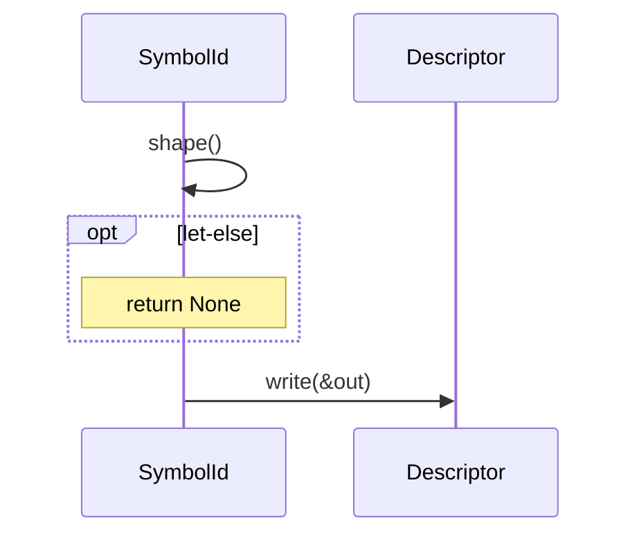

## `sym:cargo sealmap_model . sym/SymbolId#names().`
`pub fn names(&self) -> Vec<Cow<'_, str>>` · L587-L597
> Every name in order: package and descriptor names for a global id, the segments of a path id, the name of an unresolved id.
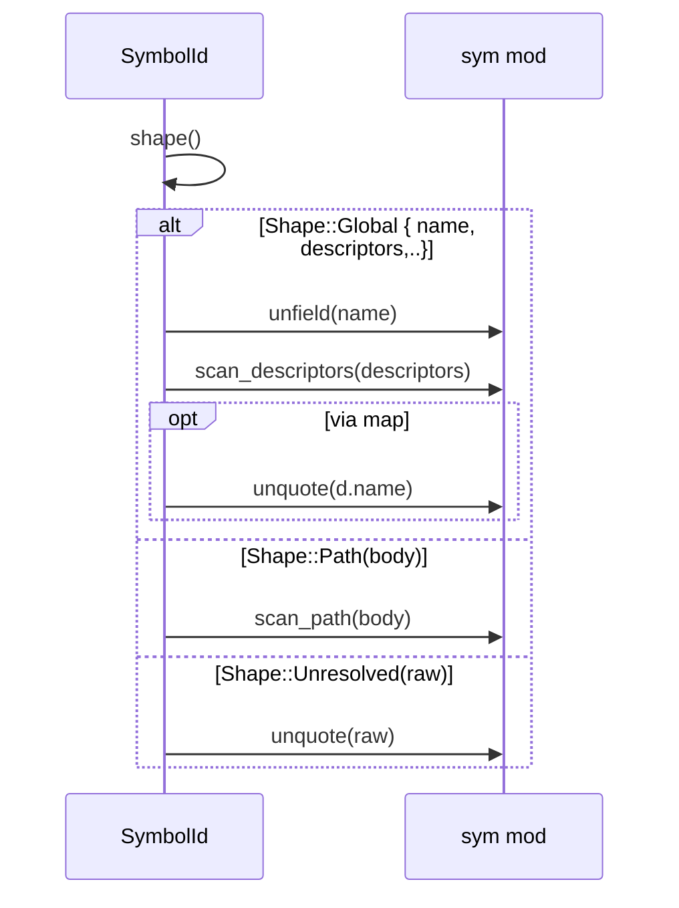

## `sym:cargo sealmap_model . sym/SymbolId#extend_path().`
`pub fn extend_path(&self, segment: &str) -> SymbolId` · L599-L613
> Continue an id with a segment of unknown kind: the result is a path id made of [`names`](Self::names) plus `segment`.


## `sym:cargo sealmap_model . sym/SymbolId#view().`
`pub fn view(&self) -> IdView<'_>` · L615-L661
> A borrowed view of the id's parts.
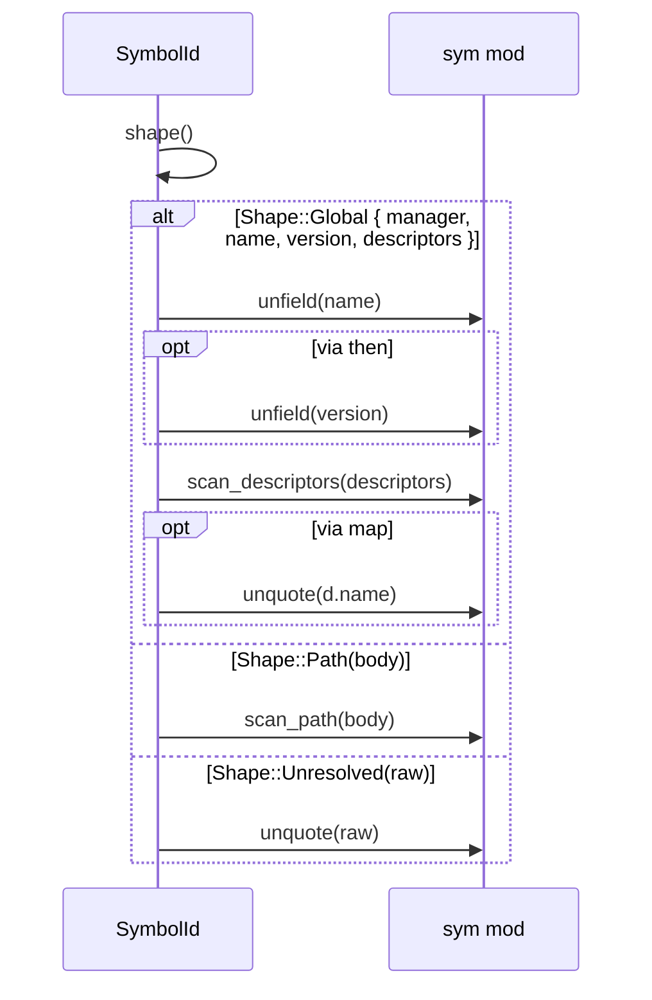

## `sym:cargo sealmap_model . sym/SymbolId#display_path().`
`pub fn display_path(&self) -> String` · L663-L667
> The names joined by `::`, for human-facing labels.


## `sym:cargo sealmap_model . sym/print().`
`fn print(repr: &Repr) -> String` · L702-L738
> The canonical text of `repr`.
```mermaid
sequenceDiagram
  participant sealmap_model__sym as sym mod
  alt Repr::Global { package, descriptors }
    sealmap_model__sym->>sealmap_model__sym: write_field(&package.name, &out)
    opt Version::Release(v)
      sealmap_model__sym->>sealmap_model__sym: write_field(v, &out)
    end
  else Repr::Path(segs)
    loop for (i, s) in segs.iter().enumerate()
      sealmap_model__sym->>sealmap_model__sym: write_name(s, &out)
    end
  else Repr::Unresolved(n)
    sealmap_model__sym->>sealmap_model__sym: write_name(n, &out)
  end
```

## `sym:cargo sealmap_model . sym/raw_name_len().`
`fn raw_name_len(s: &str) -> usize` · L862-L880
> The length of the raw name at the start of `s` (quoted or simple).
```mermaid
sequenceDiagram
  participant sealmap_model__sym as sym mod
  opt b.first() == Some(&b'#96;')
    loop while i<b.len()
      opt b [i] == b'#96;'
        Note over sealmap_model__sym: return i + 1
      end
    end
    Note over sealmap_model__sym: return b.len()
  end
  loop each via find
    sealmap_model__sym->>sealmap_model__sym: is_simple(c)
  end
```

## `sym:cargo sealmap_model . sym/scan_descriptors().`
`fn scan_descriptors(s: &str) -> Vec<DescSpan<'_>>` · L882-L908
```mermaid
sequenceDiagram
  participant sealmap_model__sym as sym mod
  loop while pos<s.len()
    alt open @ (b'['| b'(')
      sealmap_model__sym->>sealmap_model__sym: raw_name_len(&_)
    else _
      sealmap_model__sym->>sealmap_model__sym: raw_name_len(rest)
    end
  end
```

## `sym:cargo sealmap_model . sym/scan_path().`
`fn scan_path(s: &str) -> Vec<&str>` · L910-L923
```mermaid
sequenceDiagram
  participant sealmap_model__sym as sym mod
  loop loop
    sealmap_model__sym->>sealmap_model__sym: raw_name_len(&_)
    opt not s [pos..].starts_with(#quot;::#quot;)
      Note over sealmap_model__sym: return out
    end
  end
```

## `sym:cargo sealmap_model . sym/Parser#peek().`
`fn peek(&self) -> Option<char>` · L955-L957
```mermaid
sequenceDiagram
  participant sealmap_model__sym___tParser as Parser
  sealmap_model__sym___tParser->>sealmap_model__sym___tParser: rest()
```

## `sym:cargo sealmap_model . sym/Parser#eat().`
`fn eat(&mut self, lit: &str) -> bool` · L959-L966
```mermaid
sequenceDiagram
  participant sealmap_model__sym___tParser as Parser
  sealmap_model__sym___tParser->>sealmap_model__sym___tParser: rest()
```

## `sym:cargo sealmap_model . sym/Parser#expect().`
`fn expect(&mut self, lit: &str, why: &'static str) -> Result<(), IdError>` · L968-L970
```mermaid
sequenceDiagram
  participant sealmap_model__sym___tParser as Parser
  sealmap_model__sym___tParser->>sealmap_model__sym___tParser: eat(lit)
  opt not self.eat(lit)
    sealmap_model__sym___tParser->>sealmap_model__sym___tParser: err(why)
  end
```

## `sym:cargo sealmap_model . sym/Parser#done().`
`fn done(&self) -> Result<(), IdError>` · L972-L974
```mermaid
sequenceDiagram
  participant sealmap_model__sym___tParser as Parser
  opt not self.pos == self.s.len()
    sealmap_model__sym___tParser->>sealmap_model__sym___tParser: err(#quot;unexpected t…)
  end
```

## `sym:cargo sealmap_model . sym/Parser#id().`
`fn id(mut self) -> Result<Repr, IdError>` · L976-L1011
```mermaid
sequenceDiagram
  participant sealmap_model__sym___tParser as Parser
  participant sealmap_model__sym___tPackage as Package
  sealmap_model__sym___tParser->>sealmap_model__sym___tParser: eat(SYM_PREFIX)
  opt !self.eat(SYM_PREFIX)
    Note over sealmap_model__sym___tParser: return Err(IdError::MissingPrefix)
  end
  sealmap_model__sym___tParser->>sealmap_model__sym___tParser: eat(#quot;? #quot;)
  opt self.eat(#quot;? #quot;)
    sealmap_model__sym___tParser->>sealmap_model__sym___tParser: name()?
    sealmap_model__sym___tParser->>sealmap_model__sym___tParser: done()?
    Note over sealmap_model__sym___tParser: return Ok(Repr::Unresolved(name))
  end
  sealmap_model__sym___tParser->>sealmap_model__sym___tParser: eat(#quot;extern #quot;)
  opt self.eat(#quot;extern #quot;)
    sealmap_model__sym___tParser->>sealmap_model__sym___tParser: name()?
    loop while self.eat(#quot;::#quot;)
      sealmap_model__sym___tParser->>sealmap_model__sym___tParser: eat(#quot;::#quot;)
      sealmap_model__sym___tParser->>sealmap_model__sym___tParser: name()?
    end
    sealmap_model__sym___tParser->>sealmap_model__sym___tParser: done()?
    Note over sealmap_model__sym___tParser: return Ok(Repr::Path(segs))
  end
  sealmap_model__sym___tParser->>sealmap_model__sym___tParser: field()?
  sealmap_model__sym___tParser->>sealmap_model__sym___tParser: expect(#quot; #quot;, #quot;expected a s…)?
  sealmap_model__sym___tParser->>sealmap_model__sym___tParser: field()?
  sealmap_model__sym___tParser->>sealmap_model__sym___tParser: expect(#quot; #quot;, #quot;expected a s…)?
  sealmap_model__sym___tParser->>sealmap_model__sym___tParser: field()?
  sealmap_model__sym___tParser->>sealmap_model__sym___tPackage: Package::new(manager, name, version)?
  opt self.pos<self.s.len()
    sealmap_model__sym___tParser->>sealmap_model__sym___tParser: expect(#quot; #quot;, #quot;expected a s…)?
    opt self.pos == self.s.len()
      sealmap_model__sym___tParser->>sealmap_model__sym___tParser: err(#quot;expected a d…)
      Note over sealmap_model__sym___tParser: return Err(self.err(#quot;expected a descriptor#quot;))
    end
    loop while self.pos<self.s.len()
      sealmap_model__sym___tParser->>sealmap_model__sym___tParser: descriptor()?
    end
  end
```

## `sym:cargo sealmap_model . sym/Parser#field().`
`fn field(&mut self) -> Result<String, IdError>` · L1013-L1036
> A package field, up to (not including) the next single space or the end.
```mermaid
sequenceDiagram
  participant sealmap_model__sym___tParser as Parser
  loop loop
    sealmap_model__sym___tParser->>sealmap_model__sym___tParser: rest()
  end
  opt out.is_empty()
    sealmap_model__sym___tParser->>sealmap_model__sym___tParser: err(#quot;empty packag…)
    Note over sealmap_model__sym___tParser: return Err(self.err(#quot;empty package field#quot;))
  end
```

## `sym:cargo sealmap_model . sym/Parser#name().`
`fn name(&mut self) -> Result<String, IdError>` · L1038-L1071
```mermaid
sequenceDiagram
  participant sealmap_model__sym___tParser as Parser
  sealmap_model__sym___tParser->>sealmap_model__sym___tParser: eat(#quot;#96;#quot;)
  opt self.eat(#quot;#96;#quot;)
    loop loop
      sealmap_model__sym___tParser->>sealmap_model__sym___tParser: peek()
      alt None
        sealmap_model__sym___tParser->>sealmap_model__sym___tParser: err(#quot;unterminated…)
        Note over sealmap_model__sym___tParser: return Err(self.err(#quot;unterminated quoted name#quot;))
      else Some('#96;')
        sealmap_model__sym___tParser->>sealmap_model__sym___tParser: rest()
        opt not self.rest().starts_with(#quot;#96;#96;#quot;)
          opt !out.is_empty() && out.chars().all(is_simple)
            sealmap_model__sym___tParser->>sealmap_model__sym___tParser: err(#quot;a simple nam…)
            Note over sealmap_model__sym___tParser: return Err(self.err(#quot;a simple name must not be quoted#quot;))
          end
          Note over sealmap_model__sym___tParser: return Ok(out)
        end
      end
    end
  end
  loop while self.peek().is_some_and(is_simple)
    sealmap_model__sym___tParser->>sealmap_model__sym___tParser: peek()
  end
  opt self.pos == start
    sealmap_model__sym___tParser->>sealmap_model__sym___tParser: err(#quot;expected a n…)
    Note over sealmap_model__sym___tParser: return Err(self.err(#quot;expected a name#quot;))
  end
```

## `sym:cargo sealmap_model . sym/Parser#descriptor().`
`fn descriptor(&mut self) -> Result<Descriptor, IdError>` · L1073-L1106
```mermaid
sequenceDiagram
  participant sealmap_model__sym___tParser as Parser
  participant sealmap_model__sym___tDescriptor as Descriptor
  sealmap_model__sym___tParser->>sealmap_model__sym___tParser: eat(#quot;[#quot;)
  opt self.eat(#quot;[#quot;)
    sealmap_model__sym___tParser->>sealmap_model__sym___tParser: name()?
    sealmap_model__sym___tParser->>sealmap_model__sym___tParser: expect(#quot;]#quot;, #quot;expected #96;]#96;#quot;)?
    sealmap_model__sym___tParser->>sealmap_model__sym___tDescriptor: Descriptor::type_parameter(name)
    Note over sealmap_model__sym___tParser: return Ok(Descriptor::type_parameter(name))
  end
  sealmap_model__sym___tParser->>sealmap_model__sym___tParser: eat(#quot;(#quot;)
  opt self.eat(#quot;(#quot;)
    sealmap_model__sym___tParser->>sealmap_model__sym___tParser: name()?
    sealmap_model__sym___tParser->>sealmap_model__sym___tParser: expect(#quot;)#quot;, #quot;expected #96;)#96;#quot;)?
    sealmap_model__sym___tParser->>sealmap_model__sym___tDescriptor: Descriptor::parameter(name)
    Note over sealmap_model__sym___tParser: return Ok(Descriptor::parameter(name))
  end
  sealmap_model__sym___tParser->>sealmap_model__sym___tParser: name()?
  sealmap_model__sym___tParser->>sealmap_model__sym___tParser: peek()
  alt Some('(')
    loop while self.peek().is_some_and(is_simple)
      sealmap_model__sym___tParser->>sealmap_model__sym___tParser: peek()
    end
    sealmap_model__sym___tParser->>sealmap_model__sym___tParser: expect(#quot;).#quot;, #quot;expected #96;).…)?
    sealmap_model__sym___tParser->>sealmap_model__sym___tDescriptor: Descriptor::new(name, _)
    Note over sealmap_model__sym___tParser: return Descriptor::new(name, Suffix::Method { disambigu…
  else _
    sealmap_model__sym___tParser->>sealmap_model__sym___tParser: err(#quot;expected a d…)
    Note over sealmap_model__sym___tParser: return Err(self.err(#quot;expected a descriptor suffix#quot;))
  end
```
