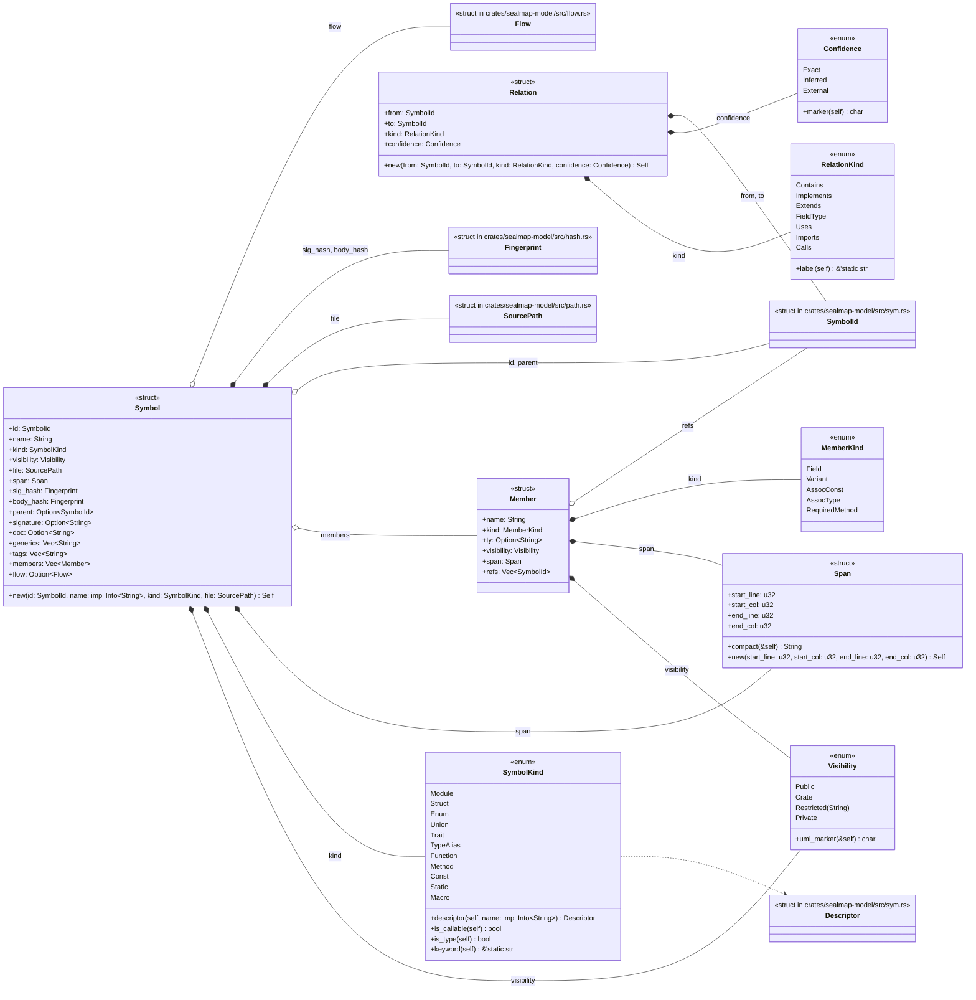
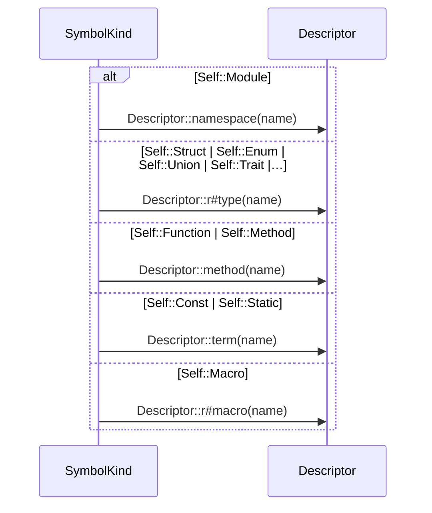
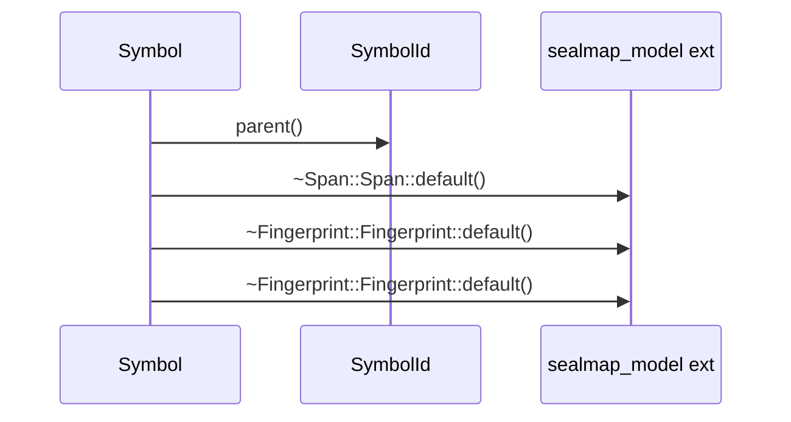

# `sym:cargo sealmap_model . symbol/` · crates/sealmap-model/src/symbol.rs

## structure

## `sym:cargo sealmap_model . symbol/SymbolKind#descriptor().`
`pub fn descriptor(self, name: impl Into<String>) -> Descriptor` · L52-L69
> The `sym:` descriptor for a symbol of this kind called `name`: a namespace for modules, a type for structs, enums, unions, traits and aliases, a method for fun…

## `sym:cargo sealmap_model . symbol/Symbol#new().`
`pub fn new(id: SymbolId, name: impl Into<String>, kind: SymbolKind, file: SourcePath) -> Self` · L232-L253
> A symbol with only the required fields set; everything else empty / private, and both fingerprints unset ([`Fingerprint::is_unset`]).

