# `sym:cargo sealmap_rust . collect/` · crates/sealmap-rust/src/collect.rs
> Pass 1: parse one file with `syn` and collect unresolved raw data.

## structure

```mermaid
classDiagram
  direction LR
  class sealmap_rust__collect___tCollector["Collector#lt;'a#gt;"] {
    <<struct>>
    -opts: &'a RustOptions
    -raw: &'a mut RawFile
    -item(&mut self, module: &Segs, item: &Item, fold: &mut Fingerprinter)
    -local_uses(&mut self, module: &Segs, block: &Block)
    -module(&mut self, path: Segs, attrs: &[Attribute], syn_vis: Option#lt;&syn::Visibility#gt;, items: &[Item], span: Span, vis: Visibility,) #40;Fingerprint, Fingerprint#41;
    -push_item(&mut self, it: RawItem, fold: &mut Fingerprinter)
    -skip(&self, attrs: &[Attribute]) bool
  }
  class sealmap_rust__collect___tFlowWalker["FlowWalker"] {
    <<struct>>
    -env: BTreeMap#lt;String, Recv#gt;
    -depth: u32
    -arg(&mut self, a: &Expr, out: &mut Vec#lt;RawStep#gt;, deferred: &mut Vec#lt;Vec#lt;RawStep#gt;#gt;)
    -bind(&mut self, pat: &Pat, init: Option#lt;&Expr#gt;)
    -bind_destructured(&mut self, pat: &Pat, scrutinee: &Expr, iterated: bool)
    -block(&mut self, b: &Block) Vec#lt;RawStep#gt;
    -cond(&mut self, cond: &Expr, out: &mut Vec#lt;RawStep#gt;)
    -expr(&mut self, e: &Expr, out: &mut Vec#lt;RawStep#gt;)
    -expr_inner(&mut self, e: &Expr, out: &mut Vec#lt;RawStep#gt;)
    -forget(&mut self, pat: &Pat)
    -mac(&mut self, m: &syn::Macro, out: &mut Vec#lt;RawStep#gt;)
    -new(env: BTreeMap#lt;String, Recv#gt;) Self
    -origin(&self, e: &Expr) Recv
    -recv(&self, e: &Expr) Recv
    -stmts(&mut self, stmts: &[Stmt], out: &mut Vec#lt;RawStep#gt;)
    -sub(&mut self, e: &Expr) Vec#lt;RawStep#gt;
    -sub_block(&mut self, b: &Block) Vec#lt;RawStep#gt;
  }
  class sealmap_rust__collect___tShape["Shape#lt;'a#gt;"] {
    <<enum>>
    Fields#40;&'a Fields#41;
    Named#40;&'a syn::FieldsNamed#41;
    Variants#40;&'a Punctuated#lt;syn::Variant, syn::Token![,]#gt;#41;
  }
  class sealmap_rust__collect["sealmap_rust::collect"] {
    <<module>>
    -const LOOPING: &[&str]
    ~const MAX_EXPR_DEPTH: u32
    -arg_sketch(e: &Expr) String
    -call(callee: Callee, name: &str, args: &Punctuated#lt;Expr, syn::Token![,]#gt;, kind: CallKind, span: PmSpan) RawStep
    -callable(mut sig: Fingerprinter, attrs: &[Attribute], vis: Option#lt;&syn::Visibility#gt;, signature: &syn::Signature, block: &Block,) #40;Fingerprint, Fingerprint#41;
    ~collect_file(crate) RawFile
    -cond_label(cond: &Expr) String
    -constructed_type(e: &Expr) Option#lt;Segs#gt;
    -data_type(item: &Item, generics: &Generics, shape: Shape#lt;'_#gt;) #40;Fingerprint, Fingerprint#41;
    -doc_of(attrs: &[Attribute]) Option#lt;String#gt;
    ~failed_file(crate) RawFile
    -fields_of(fields: &Fields) Vec#lt;RawMember#gt;
    -first_path(ty: &Type) Option#lt;Segs#gt;
    -flatten_use(tree: &UseTree, prefix: &mut Segs, out: &mut Vec#lt;RawUse#gt;)
    -fn_tags(sig: &syn::Signature, attrs: &[Attribute]) Vec#lt;String#gt;
    -fold_member(fold: &mut Fingerprinter, keyword: &str, name: &str, sig: Fingerprint, body: Fingerprint)
    -generics_of(g: &Generics) Vec#lt;String#gt;
    -impl_header(fp: &mut Fingerprinter, i: &syn::ItemImpl)
    -is_call(e: &Expr) bool
    -is_test_attr(a: &Attribute) bool
    -item_attrs(item: &Item) &[Attribute]
    -param_names(g: &Generics) Vec#lt;String#gt;
    -params_of(sig: &syn::Signature) BTreeMap#lt;String, Recv#gt;
    ~path_segs(crate) Segs
    -pattern_names(pat: &Pat, out: &mut Vec#lt;String#gt;)
    -peel(pat: &Pat, refs: &[Segs], iterated: bool) Option#lt;Vec#lt;Segs#gt;#gt;
    -sig_refs(sig: &syn::Signature, out: &mut Vec#lt;Segs#gt;)
    -span_of(s: PmSpan) Span
    -tags_of(attrs: &[Attribute]) Vec#lt;String#gt;
    -trait_hashes(t: &syn::ItemTrait) #40;Fingerprint, Fingerprint#41;
    -trait_text(p: &syn::Path) String
    -turbofish_refs(args: &Punctuated#lt;syn::GenericArgument, syn::Token![,]#gt;) Option#lt;Vec#lt;Segs#gt;#gt;
    -type_refs(ty: &Type, out: &mut Vec#lt;Segs#gt;)
    -value(keyword: &str, attrs: &[Attribute], vis: &syn::Visibility, mutability: Option#lt;&syn::StaticMutability#gt;, ident: &syn::Ident, ty: &Type, expr: &Expr,) #40;Fingerprint, Fingerprint#41;
    -vis_of(v: &syn::Visibility) Visibility
    -vis_prefix(v: &syn::Visibility) String
  }
  class sealmap_extract__fingerprint___tFingerprinter["Fingerprinter"] {
    <<struct in crates/sealmap-extract/src/fingerprint.rs>>
  }
  class sealmap_model__flow___tCallKind["CallKind"] {
    <<enum in crates/sealmap-model/src/flow.rs>>
  }
  class sealmap_model__hash___tFingerprint["Fingerprint"] {
    <<struct in crates/sealmap-model/src/hash.rs>>
  }
  class sealmap_model__path___tSourcePath["SourcePath"] {
    <<struct in crates/sealmap-model/src/path.rs>>
  }
  class sealmap_model__symbol___tSpan["Span"] {
    <<struct in crates/sealmap-model/src/symbol.rs>>
  }
  class sealmap_model__symbol___tVisibility["Visibility"] {
    <<enum in crates/sealmap-model/src/symbol.rs>>
  }
  class sealmap_rust___tRustOptions["RustOptions"] {
    <<struct in crates/sealmap-rust/src/lib.rs>>
  }
  class sealmap_rust__layout___tFileRole["FileRole"] {
    <<struct in crates/sealmap-rust/src/layout.rs>>
  }
  class sealmap_rust__raw___tRawFile["RawFile"] {
    <<struct in crates/sealmap-rust/src/raw.rs>>
  }
  class sealmap_rust__raw___tRawMember["RawMember"] {
    <<struct in crates/sealmap-rust/src/raw.rs>>
  }
  class sealmap_rust__raw___tRawUse["RawUse"] {
    <<struct in crates/sealmap-rust/src/raw.rs>>
  }
  class _Callee["Callee"] {
    <<external>>
  }
  class _RawStep["RawStep"] {
    <<external>>
  }
  class _Recv["Recv"] {
    <<external>>
  }
  class _Segs["Segs"] {
    <<external>>
  }
  class _proc_macro2__Span["proc_macro2::Span"] {
    <<external>>
  }
  class _syn__Attribute["syn::Attribute"] {
    <<external>>
  }
  class _syn__Block["syn::Block"] {
    <<external>>
  }
  class _syn__Expr["syn::Expr"] {
    <<external>>
  }
  class _syn__Fields["syn::Fields"] {
    <<external>>
  }
  class _syn__GenericArgument["syn::GenericArgument"] {
    <<external>>
  }
  class _syn__Generics["syn::Generics"] {
    <<external>>
  }
  class _syn__Ident["syn::Ident"] {
    <<external>>
  }
  class _syn__Item["syn::Item"] {
    <<external>>
  }
  class _syn__ItemImpl["syn::ItemImpl"] {
    <<external>>
  }
  class _syn__ItemTrait["syn::ItemTrait"] {
    <<external>>
  }
  class _syn__Pat["syn::Pat"] {
    <<external>>
  }
  class _syn__Path["syn::Path"] {
    <<external>>
  }
  class _syn__Signature["syn::Signature"] {
    <<external>>
  }
  class _syn__StaticMutability["syn::StaticMutability"] {
    <<external>>
  }
  class _syn__Token["syn::Token"] {
    <<external>>
  }
  class _syn__Type["syn::Type"] {
    <<external>>
  }
  class _syn__UseTree["syn::UseTree"] {
    <<external>>
  }
  class _syn__Visibility["syn::Visibility"] {
    <<external>>
  }
  class _syn__punctuated__Punctuated["syn::punctuated::Punctuated"] {
    <<external>>
  }
  class sealmap_rust__raw___tRawItem["RawItem"] {
    <<struct in crates/sealmap-rust/src/raw.rs>>
  }
  class _syn__Macro["syn::Macro"] {
    <<external>>
  }
  class _syn__Stmt["syn::Stmt"] {
    <<external>>
  }
  class _syn__FieldsNamed["syn::FieldsNamed"] {
    <<external>>
  }
  class _syn__Variant["syn::Variant"] {
    <<external>>
  }
  sealmap_rust__collect ..> sealmap_extract__fingerprint___tFingerprinter
  sealmap_rust__collect ..> sealmap_model__flow___tCallKind
  sealmap_rust__collect ..> sealmap_model__hash___tFingerprint
  sealmap_rust__collect ..> sealmap_model__path___tSourcePath
  sealmap_rust__collect ..> sealmap_model__symbol___tSpan
  sealmap_rust__collect ..> sealmap_model__symbol___tVisibility
  sealmap_rust__collect ..> sealmap_rust___tRustOptions
  sealmap_rust__collect ..> sealmap_rust__collect___tShape
  sealmap_rust__collect ..> sealmap_rust__layout___tFileRole
  sealmap_rust__collect ..> sealmap_rust__raw___tRawFile
  sealmap_rust__collect ..> sealmap_rust__raw___tRawMember
  sealmap_rust__collect ..> sealmap_rust__raw___tRawUse
  sealmap_rust__collect ..> _Callee
  sealmap_rust__collect ..> _RawStep
  sealmap_rust__collect ..> _Recv
  sealmap_rust__collect ..> _Segs
  sealmap_rust__collect ..> _proc_macro2__Span
  sealmap_rust__collect ..> _syn__Attribute
  sealmap_rust__collect ..> _syn__Block
  sealmap_rust__collect ..> _syn__Expr
  sealmap_rust__collect ..> _syn__Fields
  sealmap_rust__collect ..> _syn__GenericArgument
  sealmap_rust__collect ..> _syn__Generics
  sealmap_rust__collect ..> _syn__Ident
  sealmap_rust__collect ..> _syn__Item
  sealmap_rust__collect ..> _syn__ItemImpl
  sealmap_rust__collect ..> _syn__ItemTrait
  sealmap_rust__collect ..> _syn__Pat
  sealmap_rust__collect ..> _syn__Path
  sealmap_rust__collect ..> _syn__Signature
  sealmap_rust__collect ..> _syn__StaticMutability
  sealmap_rust__collect ..> _syn__Token
  sealmap_rust__collect ..> _syn__Type
  sealmap_rust__collect ..> _syn__UseTree
  sealmap_rust__collect ..> _syn__Visibility
  sealmap_rust__collect ..> _syn__punctuated__Punctuated
  sealmap_rust__collect___tCollector ..> sealmap_extract__fingerprint___tFingerprinter
  sealmap_rust__collect___tCollector ..> sealmap_model__hash___tFingerprint
  sealmap_rust__collect___tCollector ..> sealmap_model__symbol___tSpan
  sealmap_rust__collect___tCollector ..> sealmap_model__symbol___tVisibility
  sealmap_rust__collect___tCollector o-- sealmap_rust___tRustOptions : opts
  sealmap_rust__collect___tCollector o-- sealmap_rust__raw___tRawFile : raw
  sealmap_rust__collect___tCollector ..> sealmap_rust__raw___tRawItem
  sealmap_rust__collect___tCollector ..> _Segs
  sealmap_rust__collect___tCollector ..> _syn__Attribute
  sealmap_rust__collect___tCollector ..> _syn__Block
  sealmap_rust__collect___tCollector ..> _syn__Item
  sealmap_rust__collect___tCollector ..> _syn__Visibility
  sealmap_rust__collect___tFlowWalker ..> _RawStep
  sealmap_rust__collect___tFlowWalker o-- _Recv : env
  sealmap_rust__collect___tFlowWalker ..> _syn__Block
  sealmap_rust__collect___tFlowWalker ..> _syn__Expr
  sealmap_rust__collect___tFlowWalker ..> _syn__Macro
  sealmap_rust__collect___tFlowWalker ..> _syn__Pat
  sealmap_rust__collect___tFlowWalker ..> _syn__Stmt
  sealmap_rust__collect___tShape *-- _syn__Fields : Fields
  sealmap_rust__collect___tShape *-- _syn__FieldsNamed : Named
  sealmap_rust__collect___tShape *-- _syn__Token : Variants
  sealmap_rust__collect___tShape *-- _syn__Variant : Variants
  sealmap_rust__collect___tShape *-- _syn__punctuated__Punctuated : Variants
```

## `sym:cargo sealmap_rust . collect/collect_file().`
`pub(crate) fn collect_file(path: &SourcePath, role: &FileRole, text: &str, opts: &RustOptions) -> RawFile` · L32-L55
> Parse `text` and collect everything pass 2 needs.
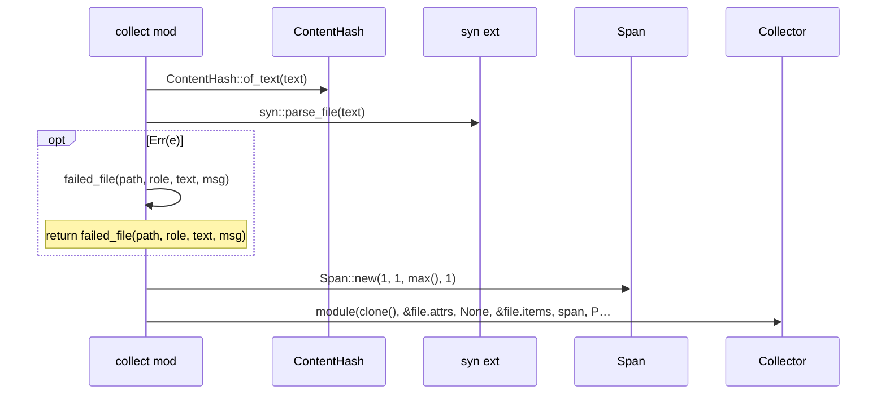
```mermaid
sequenceDiagram
  participant sealmap_rust__collect as collect mod
  participant sealmap_model__hash___tContentHash as ContentHash
  participant _syn as syn ext
  participant sealmap_model__symbol___tSpan as Span
  participant sealmap_rust__collect___tCollector as Collector
  sealmap_rust__collect->>sealmap_model__hash___tContentHash: ContentHash::of_text(text)
  sealmap_rust__collect->>_syn: syn::parse_file(text)
  opt Err(e)
    sealmap_rust__collect->>sealmap_rust__collect: failed_file(path, role, text, msg)
    Note over sealmap_rust__collect: return failed_file(path, role, text, msg)
  end
  sealmap_rust__collect->>sealmap_model__symbol___tSpan: Span::new(1, 1, max(), 1)
  sealmap_rust__collect->>sealmap_rust__collect___tCollector: module(clone(), &file.attrs, None, &file.items, span, P…
```

## `sym:cargo sealmap_rust . collect/failed_file().`
`pub(crate) fn failed_file(path: &SourcePath, role: &FileRole, text: &str, error: String) -> RawFile` · L57-L82
> The stand-in for a file that could not be collected (parse error or an internal panic): just its module symbol, tagged `parse_error`, so the 1:1 contract still…
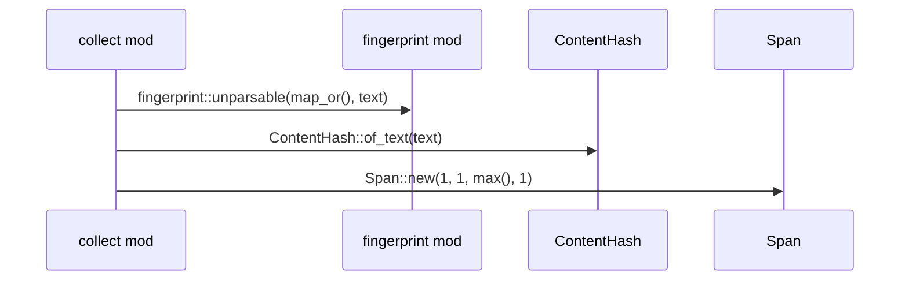
```mermaid
sequenceDiagram
  participant sealmap_rust__collect as collect mod
  participant sealmap_rust__fingerprint as fingerprint mod
  participant sealmap_model__hash___tContentHash as ContentHash
  participant sealmap_model__symbol___tSpan as Span
  sealmap_rust__collect->>sealmap_rust__fingerprint: fingerprint::unparsable(map_or(), text)
  sealmap_rust__collect->>sealmap_model__hash___tContentHash: ContentHash::of_text(text)
  sealmap_rust__collect->>sealmap_model__symbol___tSpan: Span::new(1, 1, max(), 1)
```

## `sym:cargo sealmap_rust . collect/Collector#module().`
`fn module(&mut self, path: Segs, attrs: &[Attribute], syn_vis: Option<&syn::Visibility>, items: &[Item], span: Span, vis: Visibility,) -> (Fingerprint, Fingerprint)` · L90-L153
> Collect a module and everything in it.
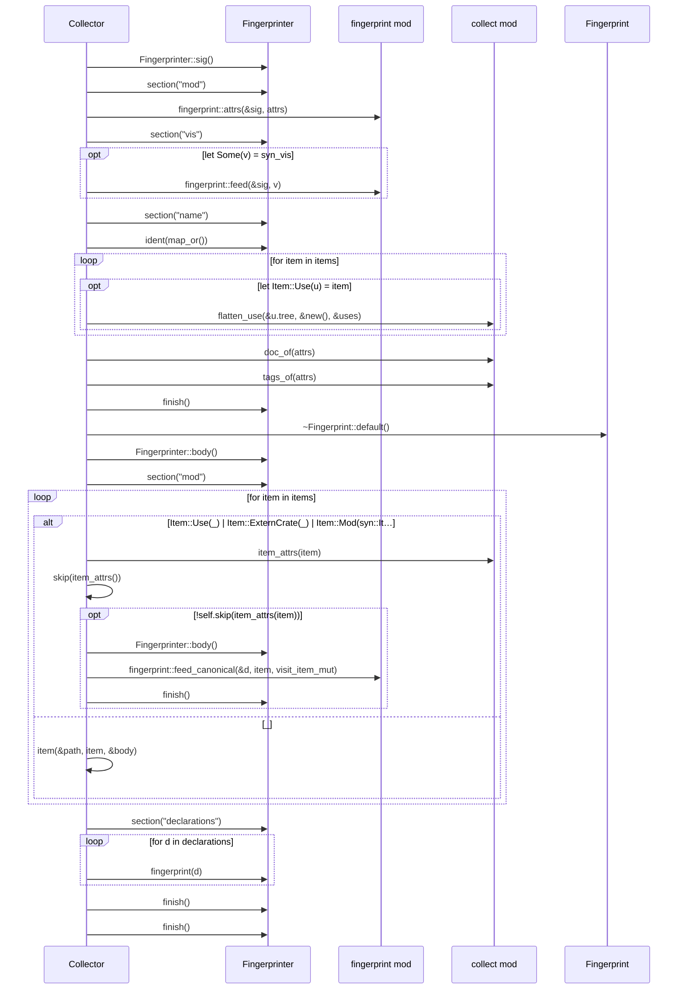
```mermaid
sequenceDiagram
  participant sealmap_rust__collect___tCollector as Collector
  participant sealmap_extract__fingerprint___tFingerprinter as Fingerprinter
  participant sealmap_rust__fingerprint as fingerprint mod
  participant sealmap_rust__collect as collect mod
  participant sealmap_model__hash___tFingerprint as Fingerprint
  sealmap_rust__collect___tCollector->>sealmap_extract__fingerprint___tFingerprinter: Fingerprinter::sig()
  sealmap_rust__collect___tCollector->>sealmap_extract__fingerprint___tFingerprinter: section(#quot;mod#quot;)
  sealmap_rust__collect___tCollector->>sealmap_rust__fingerprint: fingerprint::attrs(&sig, attrs)
  sealmap_rust__collect___tCollector->>sealmap_extract__fingerprint___tFingerprinter: section(#quot;vis#quot;)
  opt let Some(v) = syn_vis
    sealmap_rust__collect___tCollector->>sealmap_rust__fingerprint: fingerprint::feed(&sig, v)
  end
  sealmap_rust__collect___tCollector->>sealmap_extract__fingerprint___tFingerprinter: section(#quot;name#quot;)
  sealmap_rust__collect___tCollector->>sealmap_extract__fingerprint___tFingerprinter: ident(map_or())
  loop for item in items
    opt let Item::Use(u) = item
      sealmap_rust__collect___tCollector->>sealmap_rust__collect: flatten_use(&u.tree, &new(), &uses)
    end
  end
  sealmap_rust__collect___tCollector->>sealmap_rust__collect: doc_of(attrs)
  sealmap_rust__collect___tCollector->>sealmap_rust__collect: tags_of(attrs)
  sealmap_rust__collect___tCollector->>sealmap_extract__fingerprint___tFingerprinter: finish()
  sealmap_rust__collect___tCollector->>sealmap_model__hash___tFingerprint: ~Fingerprint::default()
  sealmap_rust__collect___tCollector->>sealmap_extract__fingerprint___tFingerprinter: Fingerprinter::body()
  sealmap_rust__collect___tCollector->>sealmap_extract__fingerprint___tFingerprinter: section(#quot;mod#quot;)
  loop for item in items
    alt Item::Use(_) | Item::ExternCrate(_) | Item::Mod(syn::It…
      sealmap_rust__collect___tCollector->>sealmap_rust__collect: item_attrs(item)
      sealmap_rust__collect___tCollector->>sealmap_rust__collect___tCollector: skip(item_attrs())
      opt !self.skip(item_attrs(item))
        sealmap_rust__collect___tCollector->>sealmap_extract__fingerprint___tFingerprinter: Fingerprinter::body()
        sealmap_rust__collect___tCollector->>sealmap_rust__fingerprint: fingerprint::feed_canonical(&d, item, visit_item_mut)
        sealmap_rust__collect___tCollector->>sealmap_extract__fingerprint___tFingerprinter: finish()
      end
    else _
      sealmap_rust__collect___tCollector->>sealmap_rust__collect___tCollector: item(&path, item, &body)
    end
  end
  sealmap_rust__collect___tCollector->>sealmap_extract__fingerprint___tFingerprinter: section(#quot;declarations#quot;)
  loop for d in declarations
    sealmap_rust__collect___tCollector->>sealmap_extract__fingerprint___tFingerprinter: fingerprint(d)
  end
  sealmap_rust__collect___tCollector->>sealmap_extract__fingerprint___tFingerprinter: finish()
  sealmap_rust__collect___tCollector->>sealmap_extract__fingerprint___tFingerprinter: finish()
```

## `sym:cargo sealmap_rust . collect/Collector#local_uses().`
`fn local_uses(&mut self, module: &Segs, block: &Block)` · L155-L176
> Add the `use` declarations inside a function body to `module`'s imports.
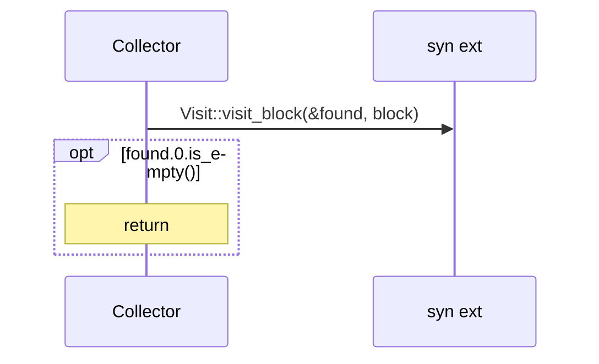
```mermaid
sequenceDiagram
  participant sealmap_rust__collect___tCollector as Collector
  participant _syn as syn ext
  sealmap_rust__collect___tCollector->>_syn: Visit::visit_block(&found, block)
  opt found.0.is_empty()
    Note over sealmap_rust__collect___tCollector: return
  end
```

## `sym:cargo sealmap_rust . collect/Collector#push_item().`
`fn push_item(&mut self, it: RawItem, fold: &mut Fingerprinter)` · L178-L182
> Record a collected item and fold it into its module's body.
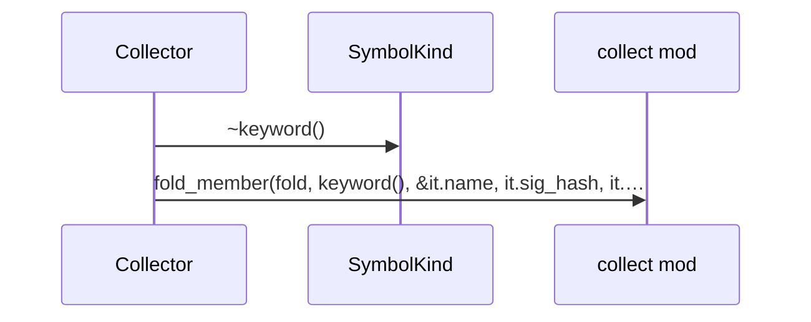
```mermaid
sequenceDiagram
  participant sealmap_rust__collect___tCollector as Collector
  participant sealmap_model__symbol___tSymbolKind as SymbolKind
  participant sealmap_rust__collect as collect mod
  sealmap_rust__collect___tCollector->>sealmap_model__symbol___tSymbolKind: ~keyword()
  sealmap_rust__collect___tCollector->>sealmap_rust__collect: fold_member(fold, keyword(), &it.name, it.sig_hash, it.…
```

## `sym:cargo sealmap_rust . collect/Collector#skip().`
`fn skip(&self, attrs: &[Attribute]) -> bool` · L184-L186
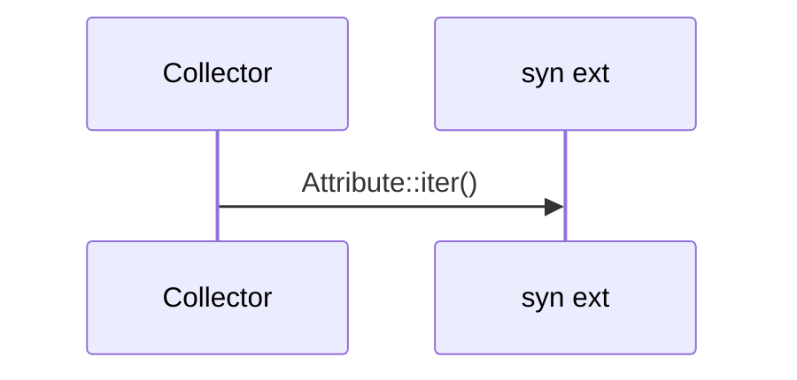
```mermaid
sequenceDiagram
  participant sealmap_rust__collect___tCollector as Collector
  participant _syn as syn ext
  sealmap_rust__collect___tCollector->>_syn: Attribute::iter()
```

## `sym:cargo sealmap_rust . collect/Collector#item().`
`fn item(&mut self, module: &Segs, item: &Item, fold: &mut Fingerprinter)` · L188-L485
> Collect one item of `module`, folding what it contributes into the module's body fingerprint `fold`.

```mermaid
sequenceDiagram
  participant sealmap_rust__collect___tCollector as Collector
  participant sealmap_rust__collect as collect mod
  participant sealmap_model__hash___tFingerprint as Fingerprint
  participant sealmap_rust__tidy as tidy mod
  participant sealmap_extract__labels as labels mod
  participant sealmap_extract__fingerprint___tFingerprinter as Fingerprinter
  participant sealmap_rust__fingerprint as fingerprint mod
  participant sealmap_rust__collect___tFlowWalker as FlowWalker
  opt closure
    sealmap_rust__collect___tCollector->>sealmap_rust__collect: vis_of(vis)
    sealmap_rust__collect___tCollector->>sealmap_rust__collect: span_of(span)
    sealmap_rust__collect___tCollector->>sealmap_rust__collect: doc_of(attrs)
    sealmap_rust__collect___tCollector->>sealmap_rust__collect: tags_of(attrs)
    sealmap_rust__collect___tCollector->>sealmap_model__hash___tFingerprint: ~Fingerprint::default()
    sealmap_rust__collect___tCollector->>sealmap_model__hash___tFingerprint: ~Fingerprint::default()
  end
  alt Item::Mod(m)
    sealmap_rust__collect___tCollector->>sealmap_rust__collect___tCollector: skip(&m.attrs)
    opt self.skip(&m.attrs)
      Note over sealmap_rust__collect___tCollector: return
    end
    opt let Some((_, items)) = &m.content
      sealmap_rust__collect___tCollector->>sealmap_rust__collect: span_of(span())
      sealmap_rust__collect___tCollector->>sealmap_rust__collect: vis_of(&m.vis)
      sealmap_rust__collect___tCollector->>sealmap_rust__collect___tCollector: module(path, &m.attrs, Some(), items, span_of(), vis_of…
      sealmap_rust__collect___tCollector->>sealmap_rust__collect: fold_member(fold, #quot;mod#quot;, &to_string(), sig, body)
    end
  else Item::Struct(s)
    sealmap_rust__collect___tCollector->>sealmap_rust__collect___tCollector: skip(&s.attrs)
    opt self.skip(&s.attrs)
      Note over sealmap_rust__collect___tCollector: return
    end
    sealmap_rust__collect___tCollector->>sealmap_rust__collect: generics_of(&s.generics)
    sealmap_rust__collect___tCollector->>sealmap_rust__collect: param_names(&s.generics)
    sealmap_rust__collect___tCollector->>sealmap_rust__collect: fields_of(&s.fields)
    sealmap_rust__collect___tCollector->>sealmap_rust__collect: data_type(item, &s.generics, Fields())
    sealmap_rust__collect___tCollector->>sealmap_rust__collect___tCollector: push_item(it, fold)
  else Item::Union(u)
    sealmap_rust__collect___tCollector->>sealmap_rust__collect: generics_of(&u.generics)
    sealmap_rust__collect___tCollector->>sealmap_rust__collect: param_names(&u.generics)
    sealmap_rust__collect___tCollector->>sealmap_rust__collect: fields_of(&Named())
    sealmap_rust__collect___tCollector->>sealmap_rust__collect: data_type(item, &u.generics, Named())
    sealmap_rust__collect___tCollector->>sealmap_rust__collect___tCollector: push_item(it, fold)
  else Item::Enum(e)
    sealmap_rust__collect___tCollector->>sealmap_rust__collect___tCollector: skip(&e.attrs)
    opt self.skip(&e.attrs)
      Note over sealmap_rust__collect___tCollector: return
    end
    sealmap_rust__collect___tCollector->>sealmap_rust__collect: generics_of(&e.generics)
    sealmap_rust__collect___tCollector->>sealmap_rust__collect: param_names(&e.generics)
    loop for v in &e.variants
      loop for f in v.fields.iter()
        sealmap_rust__collect___tCollector->>sealmap_rust__collect: type_refs(&f.ty, &refs)
      end
      alt Fields::Unnamed(u)
        sealmap_rust__collect___tCollector->>sealmap_rust__tidy: tokens(u)
        sealmap_rust__collect___tCollector->>sealmap_extract__labels: squeeze(&tokens())
      else Fields::Named(n)
        sealmap_rust__collect___tCollector->>sealmap_rust__tidy: tokens(n)
        sealmap_rust__collect___tCollector->>sealmap_extract__labels: squeeze(&tokens())
        sealmap_rust__collect___tCollector->>sealmap_extract__labels: clip(&squeeze(), LABEL_MAX)
      end
      sealmap_rust__collect___tCollector->>sealmap_rust__collect: span_of(span())
    end
    sealmap_rust__collect___tCollector->>sealmap_rust__collect: data_type(item, &e.generics, Variants())
    sealmap_rust__collect___tCollector->>sealmap_rust__collect___tCollector: push_item(it, fold)
  else Item::Trait(t)
    sealmap_rust__collect___tCollector->>sealmap_rust__collect___tCollector: skip(&t.attrs)
    opt self.skip(&t.attrs)
      Note over sealmap_rust__collect___tCollector: return
    end
    sealmap_rust__collect___tCollector->>sealmap_rust__collect: generics_of(&t.generics)
    sealmap_rust__collect___tCollector->>sealmap_rust__collect: param_names(&t.generics)
    loop for b in &t.supertraits
      opt let TypeParamBound::Trait(tb) = b
        sealmap_rust__collect___tCollector->>sealmap_rust__collect: path_segs(&tb.path)
      end
    end
    loop for ti in &t.items
      alt TraitItem::Fn(f)
        sealmap_rust__collect___tCollector->>sealmap_rust__tidy: tokens(&f.sig)
        sealmap_rust__collect___tCollector->>sealmap_extract__labels: clip(&tokens(), SIG_MAX)
        sealmap_rust__collect___tCollector->>sealmap_rust__collect: sig_refs(&f.sig, &refs)
        alt Some(block)
          sealmap_rust__collect___tCollector->>sealmap_rust__collect: params_of(&f.sig)
          sealmap_rust__collect___tCollector->>sealmap_extract__fingerprint___tFingerprinter: Fingerprinter::sig()
          sealmap_rust__collect___tCollector->>sealmap_extract__fingerprint___tFingerprinter: section(#quot;trait#quot;)
          sealmap_rust__collect___tCollector->>sealmap_extract__fingerprint___tFingerprinter: ident(&to_string())
          sealmap_rust__collect___tCollector->>sealmap_rust__fingerprint: fingerprint::feed(&sig_fp, &t.generics)
          sealmap_rust__collect___tCollector->>sealmap_rust__fingerprint: fingerprint::feed(&sig_fp, &t.generics.where_clause)
          sealmap_rust__collect___tCollector->>sealmap_rust__collect: callable(sig_fp, &f.attrs, None, &f.sig, block)
          sealmap_rust__collect___tCollector->>sealmap_rust__collect___tCollector: local_uses(module, block)
          sealmap_rust__collect___tCollector->>sealmap_rust__collect: span_of(span())
          sealmap_rust__collect___tCollector->>sealmap_rust__collect: doc_of(&f.attrs)
          sealmap_rust__collect___tCollector->>sealmap_rust__collect: generics_of(&f.sig.generics)
          sealmap_rust__collect___tCollector->>sealmap_rust__collect: param_names(&f.sig.generics)
          sealmap_rust__collect___tCollector->>sealmap_rust__collect: fn_tags(&f.sig, &f.attrs)
          sealmap_rust__collect___tCollector->>sealmap_rust__collect___tFlowWalker: FlowWalker::new(params)
        else None
          sealmap_rust__collect___tCollector->>sealmap_rust__collect: span_of(span())
          sealmap_rust__collect___tCollector->>sealmap_rust__collect: param_names(&f.sig.generics)
        end
      else TraitItem::Type(ty)
        opt via then
          sealmap_rust__collect___tCollector->>sealmap_rust__tidy: tokens(&ty.bounds)
          sealmap_rust__collect___tCollector->>sealmap_extract__labels: squeeze(&tokens())
        end
        sealmap_rust__collect___tCollector->>sealmap_rust__collect: span_of(span())
      else TraitItem::Const(k)
        sealmap_rust__collect___tCollector->>sealmap_rust__collect: type_refs(&k.ty, &refs)
        sealmap_rust__collect___tCollector->>sealmap_rust__tidy: tokens(&k.ty)
        sealmap_rust__collect___tCollector->>sealmap_rust__collect: span_of(span())
      end
    end
    sealmap_rust__collect___tCollector->>sealmap_rust__collect: trait_hashes(t)
    sealmap_rust__collect___tCollector->>sealmap_rust__collect___tCollector: push_item(it, fold)
  else Item::Type(t)
    sealmap_rust__collect___tCollector->>sealmap_rust__collect: generics_of(&t.generics)
    sealmap_rust__collect___tCollector->>sealmap_rust__collect: param_names(&t.generics)
    sealmap_rust__collect___tCollector->>sealmap_rust__tidy: tokens(&t.ty)
    sealmap_rust__collect___tCollector->>sealmap_extract__labels: clip(&_, SIG_MAX)
    sealmap_rust__collect___tCollector->>sealmap_rust__collect: type_refs(&t.ty, &it.sig_refs)
    sealmap_rust__collect___tCollector->>sealmap_extract__fingerprint___tFingerprinter: Fingerprinter::sig()
    sealmap_rust__collect___tCollector->>sealmap_extract__fingerprint___tFingerprinter: section(#quot;type#quot;)
    sealmap_rust__collect___tCollector->>sealmap_rust__fingerprint: fingerprint::feed(&sig, item)
    sealmap_rust__collect___tCollector->>sealmap_extract__fingerprint___tFingerprinter: Fingerprinter::body()
    sealmap_rust__collect___tCollector->>sealmap_extract__fingerprint___tFingerprinter: section(#quot;type#quot;)
    sealmap_rust__collect___tCollector->>sealmap_rust__fingerprint: fingerprint::feed(&body, &t.generics)
    sealmap_rust__collect___tCollector->>sealmap_rust__fingerprint: fingerprint::feed(&body, &t.generics.where_clause)
    sealmap_rust__collect___tCollector->>sealmap_rust__fingerprint: fingerprint::feed(&body, &t.ty)
    sealmap_rust__collect___tCollector->>sealmap_extract__fingerprint___tFingerprinter: finish()
    sealmap_rust__collect___tCollector->>sealmap_extract__fingerprint___tFingerprinter: finish()
  else Item::Fn(f)
    opt self.skip(&f.attrs)
      Note over sealmap_rust__collect___tCollector: return
    end
  else Item::Impl(i)
    opt self.skip(&i.attrs)
      Note over sealmap_rust__collect___tCollector: return
    end
  end
  Note over sealmap_rust__collect___tCollector: +65 more calls in _index.json
```

## `sym:cargo sealmap_rust . collect/trait_text().`
`fn trait_text(p: &syn::Path) -> String` · L488-L501
> The trait of an impl as written, which becomes part of its methods' ids (`Db#[`From<String>`]from().`).
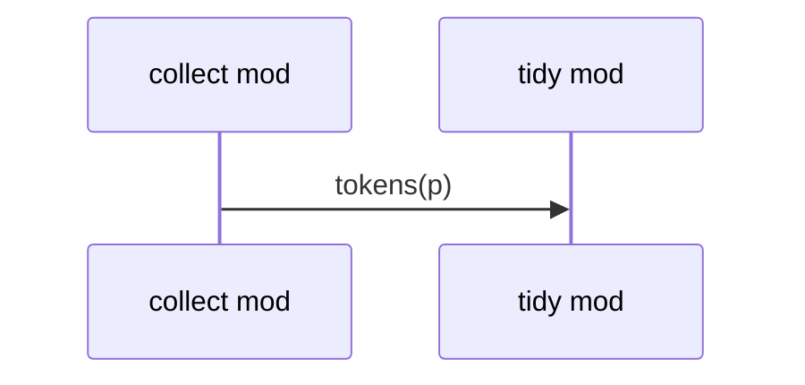
```mermaid
sequenceDiagram
  participant sealmap_rust__collect as collect mod
  participant sealmap_rust__tidy as tidy mod
  sealmap_rust__collect->>sealmap_rust__tidy: tokens(p)
```

## `sym:cargo sealmap_rust . collect/fold_member().`
`fn fold_member(fold: &mut Fingerprinter, keyword: &str, name: &str, sig: Fingerprint, body: Fingerprint)` · L515-L521
> Fold a member's identity and fingerprints into its container's body.
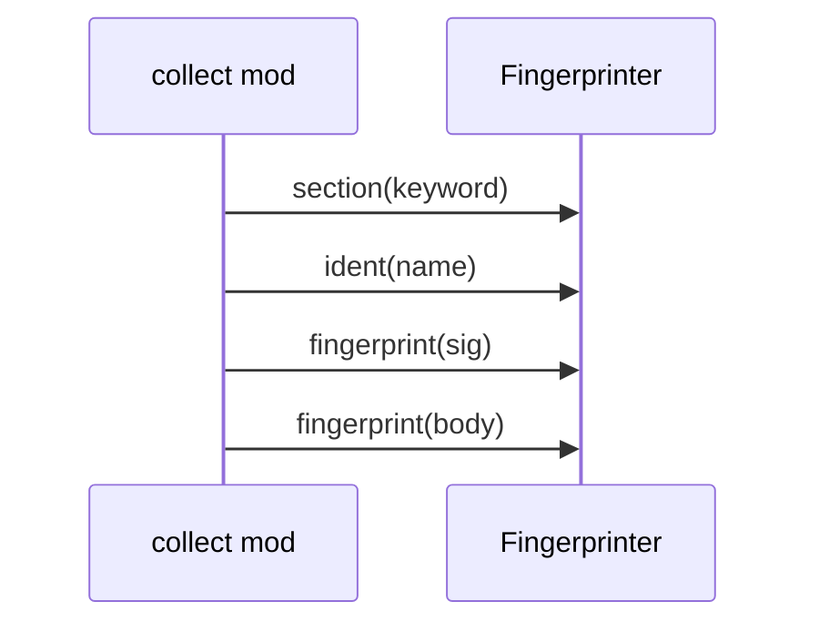
```mermaid
sequenceDiagram
  participant sealmap_rust__collect as collect mod
  participant sealmap_extract__fingerprint___tFingerprinter as Fingerprinter
  sealmap_rust__collect->>sealmap_extract__fingerprint___tFingerprinter: section(keyword)
  sealmap_rust__collect->>sealmap_extract__fingerprint___tFingerprinter: ident(name)
  sealmap_rust__collect->>sealmap_extract__fingerprint___tFingerprinter: fingerprint(sig)
  sealmap_rust__collect->>sealmap_extract__fingerprint___tFingerprinter: fingerprint(body)
```

## `sym:cargo sealmap_rust . collect/callable().`
`fn callable(mut sig: Fingerprinter, attrs: &[Attribute], vis: Option<&syn::Visibility>, signature: &syn::Signature, block: &Block,) -> (Fingerprint, Fingerprint)` · L523-L544
> A function or method: `sig` already holds its context (the impl or trait header, if any); the attributes, visibility and signature are added.
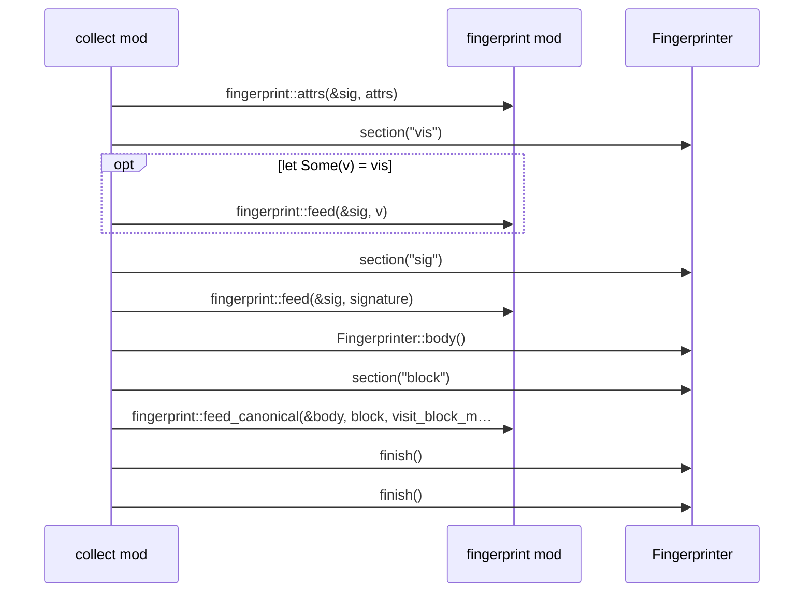
```mermaid
sequenceDiagram
  participant sealmap_rust__collect as collect mod
  participant sealmap_rust__fingerprint as fingerprint mod
  participant sealmap_extract__fingerprint___tFingerprinter as Fingerprinter
  sealmap_rust__collect->>sealmap_rust__fingerprint: fingerprint::attrs(&sig, attrs)
  sealmap_rust__collect->>sealmap_extract__fingerprint___tFingerprinter: section(#quot;vis#quot;)
  opt let Some(v) = vis
    sealmap_rust__collect->>sealmap_rust__fingerprint: fingerprint::feed(&sig, v)
  end
  sealmap_rust__collect->>sealmap_extract__fingerprint___tFingerprinter: section(#quot;sig#quot;)
  sealmap_rust__collect->>sealmap_rust__fingerprint: fingerprint::feed(&sig, signature)
  sealmap_rust__collect->>sealmap_extract__fingerprint___tFingerprinter: Fingerprinter::body()
  sealmap_rust__collect->>sealmap_extract__fingerprint___tFingerprinter: section(#quot;block#quot;)
  sealmap_rust__collect->>sealmap_rust__fingerprint: fingerprint::feed_canonical(&body, block, visit_block_m…
  sealmap_rust__collect->>sealmap_extract__fingerprint___tFingerprinter: finish()
  sealmap_rust__collect->>sealmap_extract__fingerprint___tFingerprinter: finish()
```

## `sym:cargo sealmap_rust . collect/impl_header().`
`fn impl_header(fp: &mut Fingerprinter, i: &syn::ItemImpl)` · L546-L562
> The header of an impl block (attributes, `unsafe`, generics, trait, self type, `where`), part of each of its methods' contract.
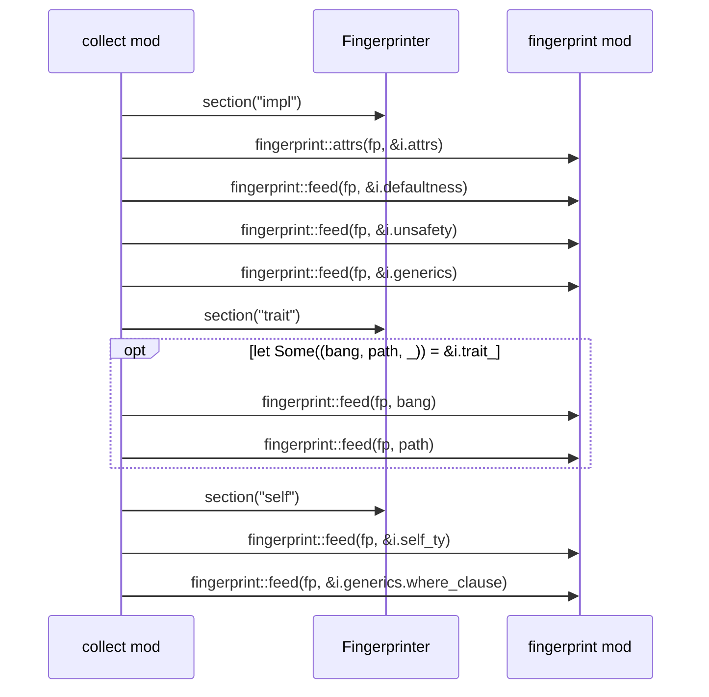
```mermaid
sequenceDiagram
  participant sealmap_rust__collect as collect mod
  participant sealmap_extract__fingerprint___tFingerprinter as Fingerprinter
  participant sealmap_rust__fingerprint as fingerprint mod
  sealmap_rust__collect->>sealmap_extract__fingerprint___tFingerprinter: section(#quot;impl#quot;)
  sealmap_rust__collect->>sealmap_rust__fingerprint: fingerprint::attrs(fp, &i.attrs)
  sealmap_rust__collect->>sealmap_rust__fingerprint: fingerprint::feed(fp, &i.defaultness)
  sealmap_rust__collect->>sealmap_rust__fingerprint: fingerprint::feed(fp, &i.unsafety)
  sealmap_rust__collect->>sealmap_rust__fingerprint: fingerprint::feed(fp, &i.generics)
  sealmap_rust__collect->>sealmap_extract__fingerprint___tFingerprinter: section(#quot;trait#quot;)
  opt let Some((bang, path, _)) = &i.trait_
    sealmap_rust__collect->>sealmap_rust__fingerprint: fingerprint::feed(fp, bang)
    sealmap_rust__collect->>sealmap_rust__fingerprint: fingerprint::feed(fp, path)
  end
  sealmap_rust__collect->>sealmap_extract__fingerprint___tFingerprinter: section(#quot;self#quot;)
  sealmap_rust__collect->>sealmap_rust__fingerprint: fingerprint::feed(fp, &i.self_ty)
  sealmap_rust__collect->>sealmap_rust__fingerprint: fingerprint::feed(fp, &i.generics.where_clause)
```

## `sym:cargo sealmap_rust . collect/data_type().`
`fn data_type(item: &Item, generics: &Generics, shape: Shape<'_>) -> (Fingerprint, Fingerprint)` · L571-L612
> A struct, enum or union: the whole declaration is the contract; the shape (generics and fields or variants, without the name) is the body.
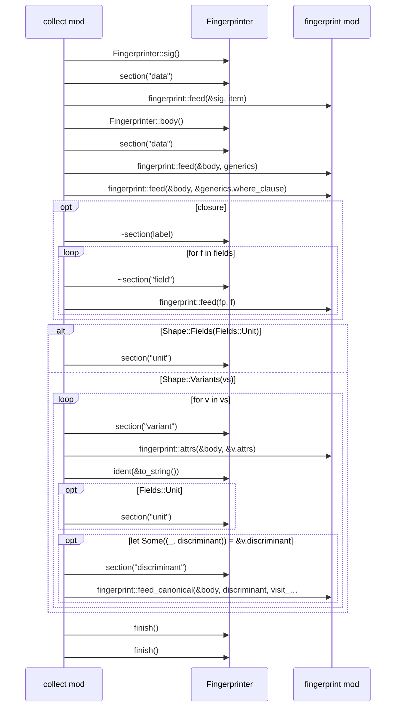
```mermaid
sequenceDiagram
  participant sealmap_rust__collect as collect mod
  participant sealmap_extract__fingerprint___tFingerprinter as Fingerprinter
  participant sealmap_rust__fingerprint as fingerprint mod
  sealmap_rust__collect->>sealmap_extract__fingerprint___tFingerprinter: Fingerprinter::sig()
  sealmap_rust__collect->>sealmap_extract__fingerprint___tFingerprinter: section(#quot;data#quot;)
  sealmap_rust__collect->>sealmap_rust__fingerprint: fingerprint::feed(&sig, item)
  sealmap_rust__collect->>sealmap_extract__fingerprint___tFingerprinter: Fingerprinter::body()
  sealmap_rust__collect->>sealmap_extract__fingerprint___tFingerprinter: section(#quot;data#quot;)
  sealmap_rust__collect->>sealmap_rust__fingerprint: fingerprint::feed(&body, generics)
  sealmap_rust__collect->>sealmap_rust__fingerprint: fingerprint::feed(&body, &generics.where_clause)
  opt closure
    sealmap_rust__collect->>sealmap_extract__fingerprint___tFingerprinter: ~section(label)
    loop for f in fields
      sealmap_rust__collect->>sealmap_extract__fingerprint___tFingerprinter: ~section(#quot;field#quot;)
      sealmap_rust__collect->>sealmap_rust__fingerprint: fingerprint::feed(fp, f)
    end
  end
  alt Shape::Fields(Fields::Unit)
    sealmap_rust__collect->>sealmap_extract__fingerprint___tFingerprinter: section(#quot;unit#quot;)
  else Shape::Variants(vs)
    loop for v in vs
      sealmap_rust__collect->>sealmap_extract__fingerprint___tFingerprinter: section(#quot;variant#quot;)
      sealmap_rust__collect->>sealmap_rust__fingerprint: fingerprint::attrs(&body, &v.attrs)
      sealmap_rust__collect->>sealmap_extract__fingerprint___tFingerprinter: ident(&to_string())
      opt Fields::Unit
        sealmap_rust__collect->>sealmap_extract__fingerprint___tFingerprinter: section(#quot;unit#quot;)
      end
      opt let Some((_, discriminant)) = &v.discriminant
        sealmap_rust__collect->>sealmap_extract__fingerprint___tFingerprinter: section(#quot;discriminant#quot;)
        sealmap_rust__collect->>sealmap_rust__fingerprint: fingerprint::feed_canonical(&body, discriminant, visit_…
      end
    end
  end
  sealmap_rust__collect->>sealmap_extract__fingerprint___tFingerprinter: finish()
  sealmap_rust__collect->>sealmap_extract__fingerprint___tFingerprinter: finish()
```

## `sym:cargo sealmap_rust . collect/trait_hashes().`
`fn trait_hashes(t: &syn::ItemTrait) -> (Fingerprint, Fingerprint)` · L614-L651
> A trait: the header plus every member's signature is the contract; every member in full (default bodies included) is the body.
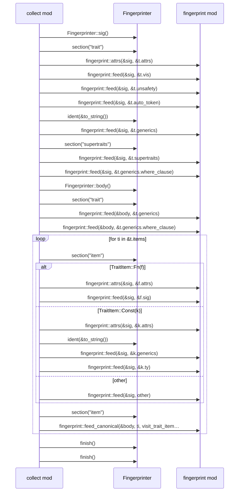
```mermaid
sequenceDiagram
  participant sealmap_rust__collect as collect mod
  participant sealmap_extract__fingerprint___tFingerprinter as Fingerprinter
  participant sealmap_rust__fingerprint as fingerprint mod
  sealmap_rust__collect->>sealmap_extract__fingerprint___tFingerprinter: Fingerprinter::sig()
  sealmap_rust__collect->>sealmap_extract__fingerprint___tFingerprinter: section(#quot;trait#quot;)
  sealmap_rust__collect->>sealmap_rust__fingerprint: fingerprint::attrs(&sig, &t.attrs)
  sealmap_rust__collect->>sealmap_rust__fingerprint: fingerprint::feed(&sig, &t.vis)
  sealmap_rust__collect->>sealmap_rust__fingerprint: fingerprint::feed(&sig, &t.unsafety)
  sealmap_rust__collect->>sealmap_rust__fingerprint: fingerprint::feed(&sig, &t.auto_token)
  sealmap_rust__collect->>sealmap_extract__fingerprint___tFingerprinter: ident(&to_string())
  sealmap_rust__collect->>sealmap_rust__fingerprint: fingerprint::feed(&sig, &t.generics)
  sealmap_rust__collect->>sealmap_extract__fingerprint___tFingerprinter: section(#quot;supertraits#quot;)
  sealmap_rust__collect->>sealmap_rust__fingerprint: fingerprint::feed(&sig, &t.supertraits)
  sealmap_rust__collect->>sealmap_rust__fingerprint: fingerprint::feed(&sig, &t.generics.where_clause)
  sealmap_rust__collect->>sealmap_extract__fingerprint___tFingerprinter: Fingerprinter::body()
  sealmap_rust__collect->>sealmap_extract__fingerprint___tFingerprinter: section(#quot;trait#quot;)
  sealmap_rust__collect->>sealmap_rust__fingerprint: fingerprint::feed(&body, &t.generics)
  sealmap_rust__collect->>sealmap_rust__fingerprint: fingerprint::feed(&body, &t.generics.where_clause)
  loop for ti in &t.items
    sealmap_rust__collect->>sealmap_extract__fingerprint___tFingerprinter: section(#quot;item#quot;)
    alt TraitItem::Fn(f)
      sealmap_rust__collect->>sealmap_rust__fingerprint: fingerprint::attrs(&sig, &f.attrs)
      sealmap_rust__collect->>sealmap_rust__fingerprint: fingerprint::feed(&sig, &f.sig)
    else TraitItem::Const(k)
      sealmap_rust__collect->>sealmap_rust__fingerprint: fingerprint::attrs(&sig, &k.attrs)
      sealmap_rust__collect->>sealmap_extract__fingerprint___tFingerprinter: ident(&to_string())
      sealmap_rust__collect->>sealmap_rust__fingerprint: fingerprint::feed(&sig, &k.generics)
      sealmap_rust__collect->>sealmap_rust__fingerprint: fingerprint::feed(&sig, &k.ty)
    else other
      sealmap_rust__collect->>sealmap_rust__fingerprint: fingerprint::feed(&sig, other)
    end
    sealmap_rust__collect->>sealmap_extract__fingerprint___tFingerprinter: section(#quot;item#quot;)
    sealmap_rust__collect->>sealmap_rust__fingerprint: fingerprint::feed_canonical(&body, ti, visit_trait_item…
  end
  sealmap_rust__collect->>sealmap_extract__fingerprint___tFingerprinter: finish()
  sealmap_rust__collect->>sealmap_extract__fingerprint___tFingerprinter: finish()
```

## `sym:cargo sealmap_rust . collect/value().`
`fn value(keyword: &str, attrs: &[Attribute], vis: &syn::Visibility, mutability: Option<&syn::StaticMutability>, ident: &syn::Ident, ty: &Type, expr: &Expr,) -> (Fingerprint, Fingerprint)` · L653-L677
> A constant or static: everything but the value is the contract; the value is the body.
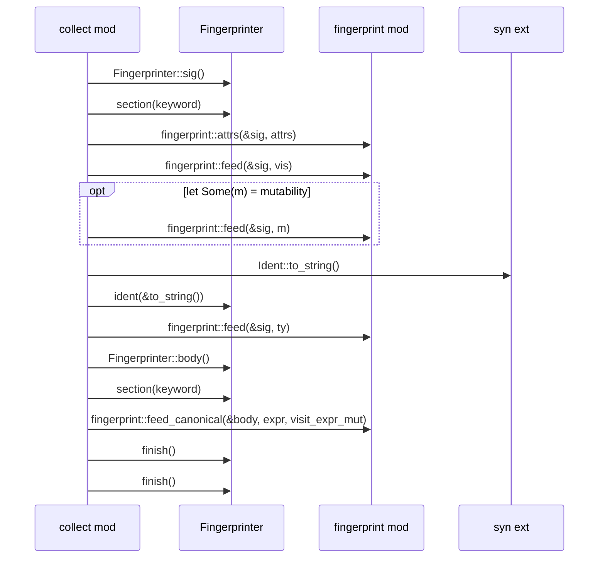
```mermaid
sequenceDiagram
  participant sealmap_rust__collect as collect mod
  participant sealmap_extract__fingerprint___tFingerprinter as Fingerprinter
  participant sealmap_rust__fingerprint as fingerprint mod
  participant _syn as syn ext
  sealmap_rust__collect->>sealmap_extract__fingerprint___tFingerprinter: Fingerprinter::sig()
  sealmap_rust__collect->>sealmap_extract__fingerprint___tFingerprinter: section(keyword)
  sealmap_rust__collect->>sealmap_rust__fingerprint: fingerprint::attrs(&sig, attrs)
  sealmap_rust__collect->>sealmap_rust__fingerprint: fingerprint::feed(&sig, vis)
  opt let Some(m) = mutability
    sealmap_rust__collect->>sealmap_rust__fingerprint: fingerprint::feed(&sig, m)
  end
  sealmap_rust__collect->>_syn: Ident::to_string()
  sealmap_rust__collect->>sealmap_extract__fingerprint___tFingerprinter: ident(&to_string())
  sealmap_rust__collect->>sealmap_rust__fingerprint: fingerprint::feed(&sig, ty)
  sealmap_rust__collect->>sealmap_extract__fingerprint___tFingerprinter: Fingerprinter::body()
  sealmap_rust__collect->>sealmap_extract__fingerprint___tFingerprinter: section(keyword)
  sealmap_rust__collect->>sealmap_rust__fingerprint: fingerprint::feed_canonical(&body, expr, visit_expr_mut)
  sealmap_rust__collect->>sealmap_extract__fingerprint___tFingerprinter: finish()
  sealmap_rust__collect->>sealmap_extract__fingerprint___tFingerprinter: finish()
```

## `sym:cargo sealmap_rust . collect/span_of().`
`fn span_of(s: PmSpan) -> Span` · L681-L684
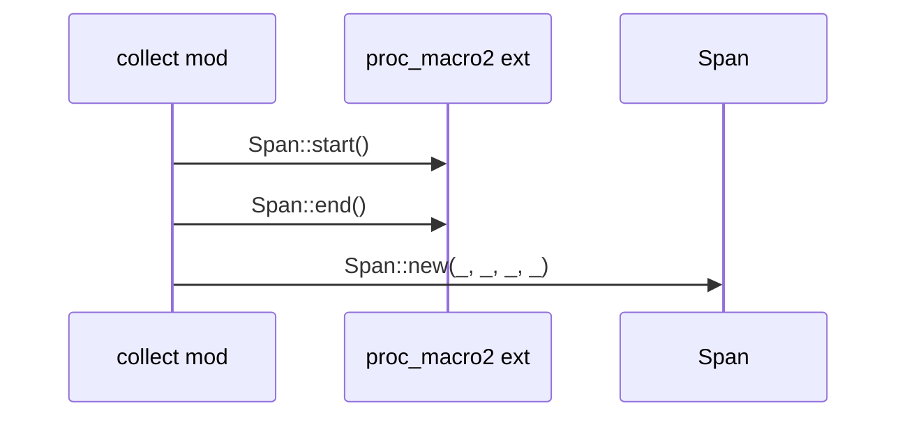
```mermaid
sequenceDiagram
  participant sealmap_rust__collect as collect mod
  participant _proc_macro2 as proc_macro2 ext
  participant sealmap_model__symbol___tSpan as Span
  sealmap_rust__collect->>_proc_macro2: Span::start()
  sealmap_rust__collect->>_proc_macro2: Span::end()
  sealmap_rust__collect->>sealmap_model__symbol___tSpan: Span::new(_, _, _, _)
```

## `sym:cargo sealmap_rust . collect/vis_of().`
`fn vis_of(v: &syn::Visibility) -> Visibility` · L686-L693
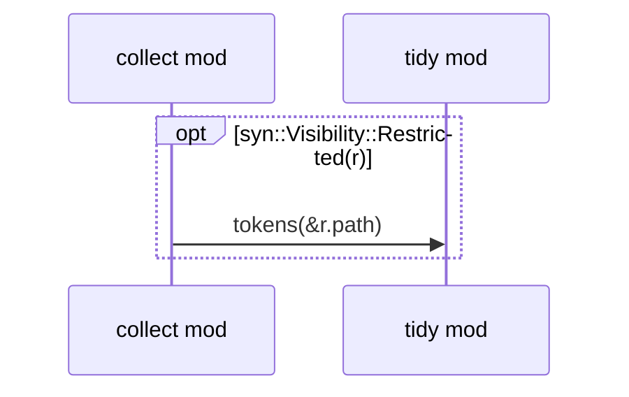
```mermaid
sequenceDiagram
  participant sealmap_rust__collect as collect mod
  participant sealmap_rust__tidy as tidy mod
  opt syn::Visibility::Restricted(r)
    sealmap_rust__collect->>sealmap_rust__tidy: tokens(&r.path)
  end
```

## `sym:cargo sealmap_rust . collect/vis_prefix().`
`fn vis_prefix(v: &syn::Visibility) -> String` · L695-L700
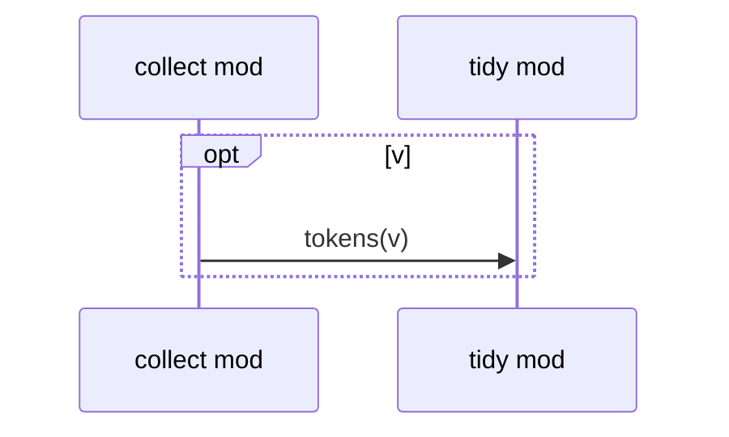
```mermaid
sequenceDiagram
  participant sealmap_rust__collect as collect mod
  participant sealmap_rust__tidy as tidy mod
  opt v
    sealmap_rust__collect->>sealmap_rust__tidy: tokens(v)
  end
```

## `sym:cargo sealmap_rust . collect/is_test_attr().`
`fn is_test_attr(a: &Attribute) -> bool` · L702-L708
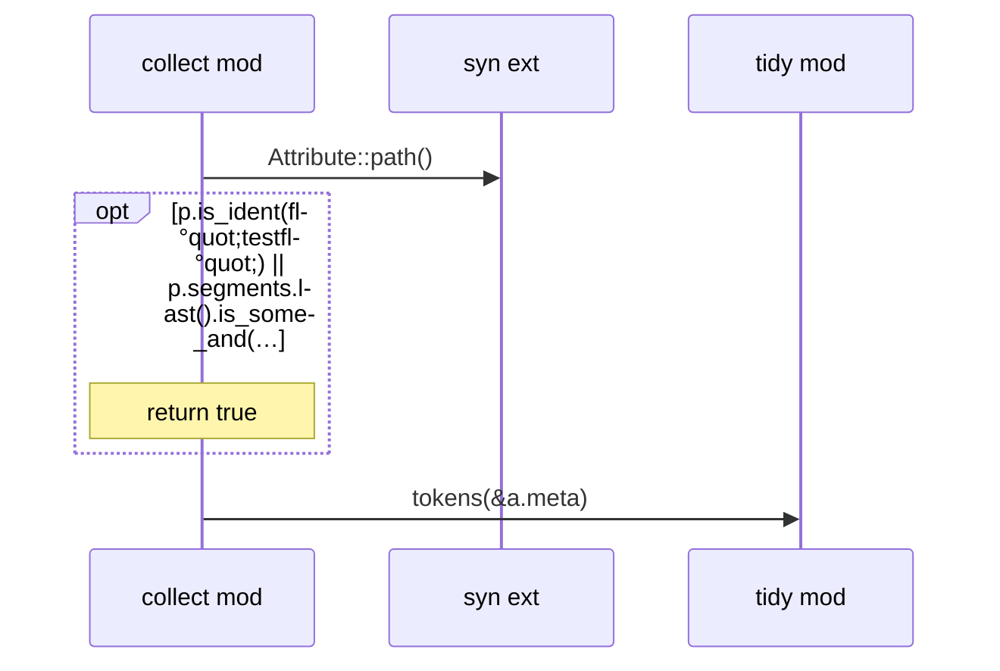
```mermaid
sequenceDiagram
  participant sealmap_rust__collect as collect mod
  participant _syn as syn ext
  participant sealmap_rust__tidy as tidy mod
  sealmap_rust__collect->>_syn: Attribute::path()
  opt p.is_ident(#quot;test#quot;) || p.segments.last().is_some_and(…
    Note over sealmap_rust__collect: return true
  end
  sealmap_rust__collect->>sealmap_rust__tidy: tokens(&a.meta)
```

## `sym:cargo sealmap_rust . collect/doc_of().`
`fn doc_of(attrs: &[Attribute]) -> Option<String>` · L710-L742
> First sentence of the doc comment, at most 160 chars.
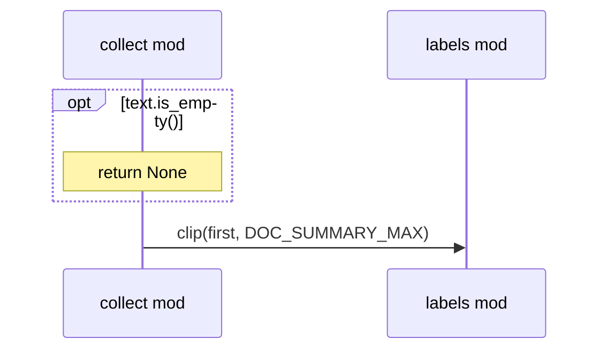
```mermaid
sequenceDiagram
  participant sealmap_rust__collect as collect mod
  participant sealmap_extract__labels as labels mod
  opt text.is_empty()
    Note over sealmap_rust__collect: return None
  end
  sealmap_rust__collect->>sealmap_extract__labels: clip(first, DOC_SUMMARY_MAX)
```

## `sym:cargo sealmap_rust . collect/tags_of().`
`fn tags_of(attrs: &[Attribute]) -> Vec<String>` · L744-L757
> Attributes worth keeping as tags.
```mermaid
sequenceDiagram
  participant sealmap_rust__collect as collect mod
  participant sealmap_rust__tidy as tidy mod
  participant sealmap_extract__labels as labels mod
  loop for a in attrs
    opt multi || KEEP.iter().any(| k | p.is_ident(k))
      sealmap_rust__collect->>sealmap_rust__tidy: tokens(&a.meta)
      sealmap_rust__collect->>sealmap_extract__labels: squeeze(&tokens())
      sealmap_rust__collect->>sealmap_extract__labels: clip(&t, LABEL_MAX)
    end
  end
```

## `sym:cargo sealmap_rust . collect/fn_tags().`
`fn fn_tags(sig: &syn::Signature, attrs: &[Attribute]) -> Vec<String>` · L759-L771
```mermaid
sequenceDiagram
  participant sealmap_rust__collect as collect mod
  sealmap_rust__collect->>sealmap_rust__collect: tags_of(attrs)
```

## `sym:cargo sealmap_rust . collect/generics_of().`
`fn generics_of(g: &Generics) -> Vec<String>` · L773-L782
```mermaid
sequenceDiagram
  participant sealmap_rust__collect as collect mod
  participant sealmap_rust__tidy as tidy mod
  participant sealmap_extract__labels as labels mod
  opt via map
    alt GenericParam::Type(t)
      sealmap_rust__collect->>sealmap_rust__tidy: tokens(t)
      sealmap_rust__collect->>sealmap_extract__labels: squeeze(&tokens())
    else GenericParam::Lifetime(l)
      sealmap_rust__collect->>sealmap_rust__tidy: tokens(l)
      sealmap_rust__collect->>sealmap_extract__labels: squeeze(&tokens())
    else GenericParam::Const(c)
      sealmap_rust__collect->>sealmap_rust__tidy: tokens(c)
      sealmap_rust__collect->>sealmap_extract__labels: squeeze(&tokens())
    end
  end
```

## `sym:cargo sealmap_rust . collect/fields_of().`
`fn fields_of(fields: &Fields) -> Vec<RawMember>` · L799-L817
```mermaid
sequenceDiagram
  participant sealmap_rust__collect as collect mod
  participant _syn as syn ext
  participant sealmap_rust__tidy as tidy mod
  sealmap_rust__collect->>_syn: Fields::iter()
  opt via map
    sealmap_rust__collect->>sealmap_rust__collect: type_refs(&f.ty, &refs)
    sealmap_rust__collect->>sealmap_rust__tidy: tokens(&f.ty)
    sealmap_rust__collect->>sealmap_rust__collect: vis_of(&f.vis)
    sealmap_rust__collect->>sealmap_rust__collect: span_of(span())
  end
```

## `sym:cargo sealmap_rust . collect/type_refs().`
`fn type_refs(ty: &Type, out: &mut Vec<Segs>)` · L823-L836
> Every path mentioned in a type, outermost first.
```mermaid
sequenceDiagram
  participant sealmap_rust__collect as collect mod
  participant _syn as syn ext
  sealmap_rust__collect->>_syn: Visit::visit_type(&V(), ty)
```

## `sym:cargo sealmap_rust . collect/sig_refs().`
`fn sig_refs(sig: &syn::Signature, out: &mut Vec<Segs>)` · L838-L847
```mermaid
sequenceDiagram
  participant sealmap_rust__collect as collect mod
  loop for input in &sig.inputs
    opt let FnArg::Typed(t) = input
      sealmap_rust__collect->>sealmap_rust__collect: type_refs(&t.ty, out)
    end
  end
  opt let syn::ReturnType::Type(_, ty) = &sig.output
    sealmap_rust__collect->>sealmap_rust__collect: type_refs(ty, out)
  end
```

## `sym:cargo sealmap_rust . collect/first_path().`
`fn first_path(ty: &Type) -> Option<Segs>` · L849-L858
> Outermost path of a type, looking through references and parens.
```mermaid
sequenceDiagram
  participant sealmap_rust__collect as collect mod
  alt Type::Path(p)
    sealmap_rust__collect->>sealmap_rust__collect: path_segs(&p.path)
  else Type::Reference(r)
    sealmap_rust__collect->>sealmap_rust__collect: first_path(&r.elem)
  else Type::Paren(p)
    sealmap_rust__collect->>sealmap_rust__collect: first_path(&p.elem)
  else Type::Group(g)
    sealmap_rust__collect->>sealmap_rust__collect: first_path(&g.elem)
  end
```

## `sym:cargo sealmap_rust . collect/params_of().`
`fn params_of(sig: &syn::Signature) -> BTreeMap<String, Recv>` · L860-L877
```mermaid
sequenceDiagram
  participant sealmap_rust__collect as collect mod
  loop for input in &sig.inputs
    opt FnArg::Typed(t)
      opt let Pat::Ident(id) = &* t.pat
        sealmap_rust__collect->>sealmap_rust__collect: type_refs(&t.ty, &refs)
      end
    end
  end
```

## `sym:cargo sealmap_rust . collect/flatten_use().`
`fn flatten_use(tree: &UseTree, prefix: &mut Segs, out: &mut Vec<RawUse>)` · L879-L912
```mermaid
sequenceDiagram
  participant sealmap_rust__collect as collect mod
  alt UseTree::Path(p)
    sealmap_rust__collect->>sealmap_rust__collect: flatten_use(&p.tree, prefix, out)
  else UseTree::Group(g)
    loop for t in &g.items
      sealmap_rust__collect->>sealmap_rust__collect: flatten_use(t, prefix, out)
    end
  end
```

## `sym:cargo sealmap_rust . collect/FlowWalker#block().`
`fn block(&mut self, b: &Block) -> Vec<RawStep>` · L954-L958
```mermaid
sequenceDiagram
  participant sealmap_rust__collect___tFlowWalker as FlowWalker
  sealmap_rust__collect___tFlowWalker->>sealmap_rust__collect___tFlowWalker: stmts(&b.stmts, &out)
```

## `sym:cargo sealmap_rust . collect/FlowWalker#stmts().`
`fn stmts(&mut self, stmts: &[Stmt], out: &mut Vec<RawStep>)` · L960-L980
```mermaid
sequenceDiagram
  participant sealmap_rust__collect___tFlowWalker as FlowWalker
  loop for s in stmts
    alt Stmt::Local(l)
      opt let Some(init) = &l.init
        sealmap_rust__collect___tFlowWalker->>sealmap_rust__collect___tFlowWalker: expr(&init.expr, out)
        opt let Some((_, diverge)) = &init.diverge
          sealmap_rust__collect___tFlowWalker->>sealmap_rust__collect___tFlowWalker: sub(diverge)
        end
      end
      sealmap_rust__collect___tFlowWalker->>sealmap_rust__collect___tFlowWalker: bind(&l.pat, map())
    else Stmt::Expr(e, _)
      sealmap_rust__collect___tFlowWalker->>sealmap_rust__collect___tFlowWalker: expr(e, out)
    else Stmt::Macro(m)
      sealmap_rust__collect___tFlowWalker->>sealmap_rust__collect___tFlowWalker: mac(&m.mac, out)
    end
  end
```

## `sym:cargo sealmap_rust . collect/FlowWalker#bind().`
`fn bind(&mut self, pat: &Pat, init: Option<&Expr>)` · L982-L1019
> Record the type of a `let` binding when it is evident.
```mermaid
sequenceDiagram
  participant sealmap_rust__collect___tFlowWalker as FlowWalker
  participant sealmap_rust__collect as collect mod
  alt Pat::Type(pt)
    alt Pat::Ident(id)
      sealmap_rust__collect___tFlowWalker->>sealmap_rust__collect: type_refs(&pt.ty, &refs)
    else _
      Note over sealmap_rust__collect___tFlowWalker: return
    end
  else other
    alt Some(e)
      sealmap_rust__collect___tFlowWalker->>sealmap_rust__collect___tFlowWalker: bind_destructured(other, e, false)
    else None
      sealmap_rust__collect___tFlowWalker->>sealmap_rust__collect___tFlowWalker: forget(other)
    end
    Note over sealmap_rust__collect___tFlowWalker: return
  end
  opt None if init.is_some()
    opt via map_or
      sealmap_rust__collect___tFlowWalker->>sealmap_rust__collect___tFlowWalker: origin(e)
    end
  end
```

## `sym:cargo sealmap_rust . collect/FlowWalker#bind_destructured().`
`fn bind_destructured(&mut self, pat: &Pat, scrutinee: &Expr, iterated: bool)` · L1021-L1045
> Bind the names a destructuring pattern (`Some(x)`, `(a, b)`, `Foo { bar, ..
```mermaid
sequenceDiagram
  participant sealmap_rust__collect___tFlowWalker as FlowWalker
  participant sealmap_rust__collect as collect mod
  sealmap_rust__collect___tFlowWalker->>sealmap_rust__collect: pattern_names(pat, &names)
  sealmap_rust__collect___tFlowWalker->>sealmap_rust__collect___tFlowWalker: origin(scrutinee)
  opt (Recv::Typed(refs), 1)
    sealmap_rust__collect___tFlowWalker->>sealmap_rust__collect: peel(pat, refs, iterated)
  end
```

## `sym:cargo sealmap_rust . collect/FlowWalker#origin().`
`fn origin(&self, e: &Expr) -> Recv` · L1047-L1087
> Where the value of `e` comes from, for [`Recv::Derived`]: the receiver at the root of its method chain, field accesses, `?`, `.await` and borrows, or the path …
```mermaid
sequenceDiagram
  participant sealmap_rust__collect___tFlowWalker as FlowWalker
  participant sealmap_rust__collect as collect mod
  alt Expr::Field(f)
    opt _
      sealmap_rust__collect___tFlowWalker->>sealmap_rust__collect___tFlowWalker: origin(&f.base)
    end
  else Expr::MethodCall(m)
    opt via and_then
      sealmap_rust__collect___tFlowWalker->>sealmap_rust__collect: turbofish_refs(&t.args)
    end
    opt None
      sealmap_rust__collect___tFlowWalker->>sealmap_rust__collect___tFlowWalker: origin(&m.receiver)
    end
  else Expr::Call(c)
    opt Expr::Path(p)
      sealmap_rust__collect___tFlowWalker->>sealmap_rust__collect: constructed_type(e)
      opt None
        opt via and_then
          opt syn::PathArguments::AngleBracketed(a)
            sealmap_rust__collect___tFlowWalker->>sealmap_rust__collect: turbofish_refs(&a.args)
          end
        end
        opt via map_or_else
          sealmap_rust__collect___tFlowWalker->>sealmap_rust__collect: path_segs(&p.path)
        end
      end
    end
  else Expr::Try(t)
    sealmap_rust__collect___tFlowWalker->>sealmap_rust__collect___tFlowWalker: origin(&t.expr)
  else Expr::Await(a)
    sealmap_rust__collect___tFlowWalker->>sealmap_rust__collect___tFlowWalker: origin(&a.base)
  else Expr::Paren(p)
    sealmap_rust__collect___tFlowWalker->>sealmap_rust__collect___tFlowWalker: origin(&p.expr)
  else Expr::Reference(r)
    sealmap_rust__collect___tFlowWalker->>sealmap_rust__collect___tFlowWalker: origin(&r.expr)
  else Expr::Unary(u)
    sealmap_rust__collect___tFlowWalker->>sealmap_rust__collect___tFlowWalker: origin(&u.expr)
  else Expr::Index(i)
    sealmap_rust__collect___tFlowWalker->>sealmap_rust__collect___tFlowWalker: origin(&i.expr)
  end
```

## `sym:cargo sealmap_rust . collect/FlowWalker#forget().`
`fn forget(&mut self, pat: &Pat)` · L1089-L1097
> Drop what is known about the names `pat` binds (a shadowing binding without a value).
```mermaid
sequenceDiagram
  participant sealmap_rust__collect___tFlowWalker as FlowWalker
  participant sealmap_rust__collect as collect mod
  sealmap_rust__collect___tFlowWalker->>sealmap_rust__collect: pattern_names(pat, &names)
```

## `sym:cargo sealmap_rust . collect/FlowWalker#sub().`
`fn sub(&mut self, e: &Expr) -> Vec<RawStep>` · L1099-L1103
```mermaid
sequenceDiagram
  participant sealmap_rust__collect___tFlowWalker as FlowWalker
  sealmap_rust__collect___tFlowWalker->>sealmap_rust__collect___tFlowWalker: expr(e, &out)
```

## `sym:cargo sealmap_rust . collect/FlowWalker#sub_block().`
`fn sub_block(&mut self, b: &Block) -> Vec<RawStep>` · L1105-L1110
```mermaid
sequenceDiagram
  participant sealmap_rust__collect___tFlowWalker as FlowWalker
  sealmap_rust__collect___tFlowWalker->>sealmap_rust__collect___tFlowWalker: block(b)
```

## `sym:cargo sealmap_rust . collect/FlowWalker#expr().`
`fn expr(&mut self, e: &Expr, out: &mut Vec<RawStep>)` · L1112-L1119
```mermaid
sequenceDiagram
  participant sealmap_rust__collect___tFlowWalker as FlowWalker
  opt self.depth>= MAX_EXPR_DEPTH
    Note over sealmap_rust__collect___tFlowWalker: return
  end
  sealmap_rust__collect___tFlowWalker->>sealmap_rust__collect___tFlowWalker: expr_inner(e, out)
```

## `sym:cargo sealmap_rust . collect/FlowWalker#expr_inner().`
`fn expr_inner(&mut self, e: &Expr, out: &mut Vec<RawStep>)` · L1121-L1328
```mermaid
sequenceDiagram
  participant sealmap_rust__collect___tFlowWalker as FlowWalker
  participant sealmap_rust__collect as collect mod
  participant sealmap_extract__raw as raw mod
  participant sealmap_rust__tidy as tidy mod
  participant sealmap_extract__labels as labels mod
  alt Expr::Call(c)
    loop for a in &c.args
      sealmap_rust__collect___tFlowWalker->>sealmap_rust__collect___tFlowWalker: arg(a, out, &deferred)
    end
    alt Expr::Path(p)
      sealmap_rust__collect___tFlowWalker->>sealmap_rust__collect: path_segs(&p.path)
      opt !name.starts_with(| ch: char | ch.is_uppercase())
        sealmap_rust__collect___tFlowWalker->>sealmap_rust__collect: call(Path(), &shown, &c.args, Function, span())
        sealmap_rust__collect___tFlowWalker->>sealmap_extract__raw: place_deferred(&name, deferred, LOOPING, out)
        Note over sealmap_rust__collect___tFlowWalker: return
      end
    else other
      sealmap_rust__collect___tFlowWalker->>sealmap_rust__collect___tFlowWalker: expr(other, out)
    end
    sealmap_rust__collect___tFlowWalker->>sealmap_extract__raw: place_deferred(#quot;#quot;, deferred, LOOPING, out)
  else Expr::MethodCall(m)
    sealmap_rust__collect___tFlowWalker->>sealmap_rust__collect___tFlowWalker: expr(&m.receiver, out)
    loop for a in &m.args
      sealmap_rust__collect___tFlowWalker->>sealmap_rust__collect___tFlowWalker: arg(a, out, &deferred)
    end
    sealmap_rust__collect___tFlowWalker->>sealmap_rust__collect___tFlowWalker: recv(&m.receiver)
    sealmap_rust__collect___tFlowWalker->>sealmap_rust__collect: call(_, &name, &m.args, Method, span())
    sealmap_rust__collect___tFlowWalker->>sealmap_extract__raw: place_deferred(&name, deferred, LOOPING, out)
  else Expr::Await(a)
    sealmap_rust__collect___tFlowWalker->>sealmap_rust__collect___tFlowWalker: expr(&a.base, out)
    sealmap_rust__collect___tFlowWalker->>sealmap_rust__collect: is_call(&a.base)
    opt is_call(&a.base)
      sealmap_rust__collect___tFlowWalker->>sealmap_extract__raw: last_call_mut(out)
    end
  else Expr::Try(t)
    sealmap_rust__collect___tFlowWalker->>sealmap_rust__collect___tFlowWalker: expr(&t.expr, out)
    sealmap_rust__collect___tFlowWalker->>sealmap_rust__collect: is_call(&t.expr)
    opt is_call(&t.expr)
      sealmap_rust__collect___tFlowWalker->>sealmap_extract__raw: last_call_mut(out)
    end
  else Expr::If(i)
    loop while let Some(ifx) = cur.take()
      sealmap_rust__collect___tFlowWalker->>sealmap_rust__collect: cond_label(&ifx.cond)
      sealmap_rust__collect___tFlowWalker->>sealmap_rust__collect___tFlowWalker: cond(&ifx.cond, &cond_steps)
      sealmap_rust__collect___tFlowWalker->>sealmap_rust__collect___tFlowWalker: sub_block(&ifx.then_branch)
      alt Some(Expr::Block(b))
        sealmap_rust__collect___tFlowWalker->>sealmap_rust__collect___tFlowWalker: sub_block(&b.block)
      else Some(other)
        sealmap_rust__collect___tFlowWalker->>sealmap_rust__collect___tFlowWalker: sub(other)
      end
    end
    sealmap_rust__collect___tFlowWalker->>sealmap_extract__raw: push_arms(arms, out)
  else Expr::Match(m)
    sealmap_rust__collect___tFlowWalker->>sealmap_rust__collect___tFlowWalker: expr(&m.expr, out)
    opt via map
      sealmap_rust__collect___tFlowWalker->>sealmap_rust__tidy: tokens(&a.pat)
      sealmap_rust__collect___tFlowWalker->>sealmap_extract__labels: squeeze(&tokens())
      opt let Some((_, g)) = &a.guard
        sealmap_rust__collect___tFlowWalker->>sealmap_rust__tidy: tokens(g)
        sealmap_rust__collect___tFlowWalker->>sealmap_extract__labels: squeeze(&tokens())
      end
      sealmap_rust__collect___tFlowWalker->>sealmap_rust__collect___tFlowWalker: bind_destructured(&a.pat, &m.expr, false)
      sealmap_rust__collect___tFlowWalker->>sealmap_rust__collect___tFlowWalker: sub(&a.body)
      sealmap_rust__collect___tFlowWalker->>sealmap_extract__labels: clip(&label, LABEL_MAX)
    end
  else Expr::ForLoop(f)
    sealmap_rust__collect___tFlowWalker->>sealmap_rust__collect___tFlowWalker: expr(&f.expr, out)
    sealmap_rust__collect___tFlowWalker->>sealmap_rust__tidy: tokens(&f.pat)
    sealmap_rust__collect___tFlowWalker->>sealmap_extract__labels: squeeze(&tokens())
    sealmap_rust__collect___tFlowWalker->>sealmap_rust__tidy: tokens(&f.expr)
    sealmap_rust__collect___tFlowWalker->>sealmap_extract__labels: squeeze(&tokens())
    sealmap_rust__collect___tFlowWalker->>sealmap_extract__labels: clip(&_, LABEL_MAX)
    sealmap_rust__collect___tFlowWalker->>sealmap_rust__collect___tFlowWalker: bind_destructured(&f.pat, &f.expr, true)
    sealmap_rust__collect___tFlowWalker->>sealmap_rust__collect___tFlowWalker: sub_block(&f.body)
  else Expr::While(w)
    sealmap_rust__collect___tFlowWalker->>sealmap_rust__collect: cond_label(&w.cond)
    sealmap_rust__collect___tFlowWalker->>sealmap_extract__labels: clip(&_, LABEL_MAX)
    sealmap_rust__collect___tFlowWalker->>sealmap_rust__collect___tFlowWalker: cond(&w.cond, &body)
    sealmap_rust__collect___tFlowWalker->>sealmap_rust__collect___tFlowWalker: sub_block(&w.body)
  else Expr::Loop(l)
    sealmap_rust__collect___tFlowWalker->>sealmap_rust__collect___tFlowWalker: sub_block(&l.body)
  else Expr::Block(b)
    sealmap_rust__collect___tFlowWalker->>sealmap_rust__collect___tFlowWalker: stmts(&b.block.stmts, out)
  else Expr::Unsafe(b)
    sealmap_rust__collect___tFlowWalker->>sealmap_rust__collect___tFlowWalker: stmts(&b.block.stmts, out)
  else Expr::Async(b)
    sealmap_rust__collect___tFlowWalker->>sealmap_rust__collect___tFlowWalker: stmts(&b.block.stmts, out)
  else Expr::TryBlock(b)
    sealmap_rust__collect___tFlowWalker->>sealmap_rust__collect___tFlowWalker: stmts(&b.block.stmts, out)
  else Expr::Const(b)
    sealmap_rust__collect___tFlowWalker->>sealmap_rust__collect___tFlowWalker: stmts(&b.block.stmts, out)
  else Expr::Closure(c)
    sealmap_rust__collect___tFlowWalker->>sealmap_rust__collect___tFlowWalker: sub(&c.body)
  else Expr::Return(r)
    opt let Some(e) = &r.expr
      sealmap_rust__collect___tFlowWalker->>sealmap_rust__collect___tFlowWalker: expr(e, out)
    end
    opt via map_or_else
      sealmap_rust__collect___tFlowWalker->>sealmap_rust__tidy: tokens(e)
      sealmap_rust__collect___tFlowWalker->>sealmap_extract__labels: squeeze(&tokens())
      sealmap_rust__collect___tFlowWalker->>sealmap_extract__labels: clip(&_, LABEL_MAX)
    end
  else Expr::Macro(m)
    sealmap_rust__collect___tFlowWalker->>sealmap_rust__collect___tFlowWalker: mac(&m.mac, out)
  else Expr::Binary(b)
    sealmap_rust__collect___tFlowWalker->>sealmap_rust__collect___tFlowWalker: expr(&b.left, out)
    sealmap_rust__collect___tFlowWalker->>sealmap_rust__collect___tFlowWalker: expr(&b.right, out)
  else Expr::Assign(a)
    sealmap_rust__collect___tFlowWalker->>sealmap_rust__collect___tFlowWalker: expr(&a.right, out)
    sealmap_rust__collect___tFlowWalker->>sealmap_rust__collect___tFlowWalker: expr(&a.left, out)
  else Expr::Unary(u)
    sealmap_rust__collect___tFlowWalker->>sealmap_rust__collect___tFlowWalker: expr(&u.expr, out)
  else Expr::Paren(p)
    sealmap_rust__collect___tFlowWalker->>sealmap_rust__collect___tFlowWalker: expr(&p.expr, out)
  else Expr::Group(g)
    sealmap_rust__collect___tFlowWalker->>sealmap_rust__collect___tFlowWalker: expr(&g.expr, out)
  else Expr::Reference(r)
    sealmap_rust__collect___tFlowWalker->>sealmap_rust__collect___tFlowWalker: expr(&r.expr, out)
  else Expr::Field(f)
    sealmap_rust__collect___tFlowWalker->>sealmap_rust__collect___tFlowWalker: expr(&f.base, out)
  else Expr::Index(i)
    sealmap_rust__collect___tFlowWalker->>sealmap_rust__collect___tFlowWalker: expr(&i.expr, out)
    sealmap_rust__collect___tFlowWalker->>sealmap_rust__collect___tFlowWalker: expr(&i.index, out)
  else Expr::Cast(c)
    sealmap_rust__collect___tFlowWalker->>sealmap_rust__collect___tFlowWalker: expr(&c.expr, out)
  else Expr::Let(l)
    sealmap_rust__collect___tFlowWalker->>sealmap_rust__collect___tFlowWalker: expr(&l.expr, out)
  else Expr::Tuple(t)
    loop each via for_each
      sealmap_rust__collect___tFlowWalker->>sealmap_rust__collect___tFlowWalker: expr(e, out)
    end
  else Expr::Array(a)
    loop each via for_each
      sealmap_rust__collect___tFlowWalker->>sealmap_rust__collect___tFlowWalker: expr(e, out)
    end
  else Expr::Repeat(r)
    sealmap_rust__collect___tFlowWalker->>sealmap_rust__collect___tFlowWalker: expr(&r.expr, out)
  else Expr::Range(r)
    opt let Some(s) = &r.start
      sealmap_rust__collect___tFlowWalker->>sealmap_rust__collect___tFlowWalker: expr(s, out)
    end
    opt let Some(e) = &r.end
      sealmap_rust__collect___tFlowWalker->>sealmap_rust__collect___tFlowWalker: expr(e, out)
    end
  else Expr::Struct(s)
    loop for f in &s.fields
      sealmap_rust__collect___tFlowWalker->>sealmap_rust__collect___tFlowWalker: expr(&f.expr, out)
    end
    opt let Some(rest) = &s.rest
      sealmap_rust__collect___tFlowWalker->>sealmap_rust__collect___tFlowWalker: expr(rest, out)
    end
  else Expr::Break(b)
    opt let Some(e) = &b.expr
      sealmap_rust__collect___tFlowWalker->>sealmap_rust__collect___tFlowWalker: expr(e, out)
    end
  else Expr::Yield(y)
    opt let Some(e) = &y.expr
      sealmap_rust__collect___tFlowWalker->>sealmap_rust__collect___tFlowWalker: expr(e, out)
    end
  end
```

## `sym:cargo sealmap_rust . collect/FlowWalker#cond().`
`fn cond(&mut self, cond: &Expr, out: &mut Vec<RawStep>)` · L1330-L1336
> Condition of `if` / `while`: `let` scrutinee or boolean expression.
```mermaid
sequenceDiagram
  participant sealmap_rust__collect___tFlowWalker as FlowWalker
  sealmap_rust__collect___tFlowWalker->>sealmap_rust__collect___tFlowWalker: expr(cond, out)
  opt let Expr::Let(l) = cond
    sealmap_rust__collect___tFlowWalker->>sealmap_rust__collect___tFlowWalker: bind(&l.pat, Some())
  end
```

## `sym:cargo sealmap_rust . collect/FlowWalker#arg().`
`fn arg(&mut self, a: &Expr, out: &mut Vec<RawStep>, deferred: &mut Vec<Vec<RawStep>>)` · L1338-L1358
> Walk a call argument.
```mermaid
sequenceDiagram
  participant sealmap_rust__collect___tFlowWalker as FlowWalker
  alt Expr::Closure(c)
    sealmap_rust__collect___tFlowWalker->>sealmap_rust__collect___tFlowWalker: sub(&c.body)
  else Expr::Async(b)
    sealmap_rust__collect___tFlowWalker->>sealmap_rust__collect___tFlowWalker: sub_block(&b.block)
  else other
    sealmap_rust__collect___tFlowWalker->>sealmap_rust__collect___tFlowWalker: expr(other, out)
  end
```

## `sym:cargo sealmap_rust . collect/FlowWalker#mac().`
`fn mac(&mut self, m: &syn::Macro, out: &mut Vec<RawStep>)` · L1360-L1372
> Calls inside macro arguments (`vec![f()]`, `assert!(g())`, `format!("{}", h())`).
```mermaid
sequenceDiagram
  participant sealmap_rust__collect___tFlowWalker as FlowWalker
  participant _syn as syn ext
  sealmap_rust__collect___tFlowWalker->>_syn: Macro::parse_body_with(parser)
  alt let Ok(args) = m.parse_body_with(parser)
    loop for a in &args
      sealmap_rust__collect___tFlowWalker->>sealmap_rust__collect___tFlowWalker: expr(a, out)
    end
  else if let Ok(stmts) = m.parse_body_with(Block::parse_withi…
    sealmap_rust__collect___tFlowWalker->>_syn: Macro::parse_body_with(parse_within)
    sealmap_rust__collect___tFlowWalker->>sealmap_rust__collect___tFlowWalker: stmts(&stmts, out)
  end
```

## `sym:cargo sealmap_rust . collect/FlowWalker#recv().`
`fn recv(&self, e: &Expr) -> Recv` · L1374-L1390
```mermaid
sequenceDiagram
  participant sealmap_rust__collect___tFlowWalker as FlowWalker
  alt Expr::Paren(p)
    sealmap_rust__collect___tFlowWalker->>sealmap_rust__collect___tFlowWalker: recv(&p.expr)
  else Expr::Reference(r)
    sealmap_rust__collect___tFlowWalker->>sealmap_rust__collect___tFlowWalker: recv(&r.expr)
  else Expr::Unary(u)
    sealmap_rust__collect___tFlowWalker->>sealmap_rust__collect___tFlowWalker: recv(&u.expr)
  end
```

## `sym:cargo sealmap_rust . collect/turbofish_refs().`
`fn turbofish_refs(args: &Punctuated<syn::GenericArgument, syn::Token![,]>) -> Option<Vec<Segs>>` · L1417-L1428
> The type paths of a turbofish with exactly one type argument (`::<Config>`, `::<Vec<Job>>`).
```mermaid
sequenceDiagram
  participant sealmap_rust__collect as collect mod
  participant _syn as syn ext
  sealmap_rust__collect->>_syn: Punctuated::iter()
  opt let-else
    Note over sealmap_rust__collect: return None
  end
  sealmap_rust__collect->>sealmap_rust__collect: type_refs(ty, &refs)
```

## `sym:cargo sealmap_rust . collect/pattern_names().`
`fn pattern_names(pat: &Pat, out: &mut Vec<String>)` · L1430-L1442
> The names a pattern binds, in source order.
```mermaid
sequenceDiagram
  participant sealmap_rust__collect as collect mod
  participant _syn as syn ext
  sealmap_rust__collect->>_syn: Visit::visit_pat(&Names(), pat)
```

## `sym:cargo sealmap_rust . collect/call().`
`fn call(callee: Callee, name: &str, args: &Punctuated<Expr, syn::Token![,]>, kind: CallKind, span: PmSpan) -> RawStep` · L1444-L1447
```mermaid
sequenceDiagram
  participant sealmap_rust__collect as collect mod
  participant _syn as syn ext
  participant sealmap_extract__labels as labels mod
  participant _proc_macro2 as proc_macro2 ext
  sealmap_rust__collect->>_syn: Punctuated::iter()
  sealmap_rust__collect->>sealmap_extract__labels: call_label(name, &sketch)
  sealmap_rust__collect->>_proc_macro2: Span::start()
```

## `sym:cargo sealmap_rust . collect/arg_sketch().`
`fn arg_sketch(e: &Expr) -> String` · L1449-L1469
> A compact stand-in for an argument: identifiers and short literals are kept, everything else becomes `_`.
```mermaid
sequenceDiagram
  participant sealmap_rust__collect as collect mod
  participant sealmap_rust__tidy as tidy mod
  participant sealmap_extract__labels as labels mod
  alt Expr::Lit(l)
    sealmap_rust__collect->>sealmap_rust__tidy: tokens(l)
    sealmap_rust__collect->>sealmap_extract__labels: clip(&tokens(), ARG_LITERAL_MAX)
  else Expr::Reference(r)
    sealmap_rust__collect->>sealmap_rust__collect: arg_sketch(&r.expr)
  else Expr::Field(f)
    alt syn::Member::Named(n)
      sealmap_rust__collect->>sealmap_rust__collect: arg_sketch(&f.base)
    else syn::Member::Unnamed(i)
      sealmap_rust__collect->>sealmap_rust__collect: arg_sketch(&f.base)
    end
  end
```

## `sym:cargo sealmap_rust . collect/cond_label().`
`fn cond_label(cond: &Expr) -> String` · L1471-L1477
```mermaid
sequenceDiagram
  participant sealmap_rust__collect as collect mod
  participant sealmap_rust__tidy as tidy mod
  participant sealmap_extract__labels as labels mod
  alt Expr::Let(l)
    sealmap_rust__collect->>sealmap_rust__tidy: tokens(&l.pat)
    sealmap_rust__collect->>sealmap_extract__labels: squeeze(&tokens())
    sealmap_rust__collect->>sealmap_rust__tidy: tokens(&l.expr)
    sealmap_rust__collect->>sealmap_extract__labels: squeeze(&tokens())
  else other
    sealmap_rust__collect->>sealmap_rust__tidy: tokens(other)
    sealmap_rust__collect->>sealmap_extract__labels: squeeze(&tokens())
  end
  sealmap_rust__collect->>sealmap_extract__labels: condition_label(&text)
```

## `sym:cargo sealmap_rust . collect/is_call().`
`fn is_call(e: &Expr) -> bool` · L1479-L1487
```mermaid
sequenceDiagram
  participant sealmap_rust__collect as collect mod
  alt Expr::Paren(p)
    sealmap_rust__collect->>sealmap_rust__collect: is_call(&p.expr)
  else Expr::Await(a)
    sealmap_rust__collect->>sealmap_rust__collect: is_call(&a.base)
  else Expr::Try(t)
    sealmap_rust__collect->>sealmap_rust__collect: is_call(&t.expr)
  end
```

## `sym:cargo sealmap_rust . collect/constructed_type().`
`fn constructed_type(e: &Expr) -> Option<Segs>` · L1489-L1507
> `Foo::new(..)`, `Foo { ..
```mermaid
sequenceDiagram
  participant sealmap_rust__collect as collect mod
  alt Expr::Call(c)
    opt Expr::Path(p) if p.path.segments.len()>= 2
      sealmap_rust__collect->>sealmap_rust__collect: path_segs(&p.path)
    end
  else Expr::Struct(s)
    sealmap_rust__collect->>sealmap_rust__collect: path_segs(&s.path)
  else Expr::Try(t)
    sealmap_rust__collect->>sealmap_rust__collect: constructed_type(&t.expr)
  else Expr::Await(a)
    sealmap_rust__collect->>sealmap_rust__collect: constructed_type(&a.base)
  else Expr::Paren(p)
    sealmap_rust__collect->>sealmap_rust__collect: constructed_type(&p.expr)
  else Expr::Reference(r)
    sealmap_rust__collect->>sealmap_rust__collect: constructed_type(&r.expr)
  end
```
