# `sealmap_rust::collect` · crates/sealmap-rust/src/collect.rs
> Pass 1: parse one file with `syn` and collect unresolved raw data.

## structure
```mermaid
classDiagram
  direction LR
  class sealmap_rust__collect__Collector["Collector#lt;'a#gt;"] {
    <<struct>>
    -opts: &'a RustOptions
    -raw: &'a mut RawFile
    -item(&mut self, module: &Segs, item: &Item)
    -module(&mut self, path: Segs, attrs: &[Attribute], items: &[Item], span: Span, vis: Visibility)
    -skip(&self, attrs: &[Attribute]) bool
  }
  class sealmap_rust__collect__FlowWalker["FlowWalker"] {
    <<struct>>
    -env: BTreeMap#lt;String, Recv#gt;
    -depth: u32
    -arg(&mut self, a: &Expr, out: &mut Vec#lt;RawStep#gt;, deferred: &mut Vec#lt;Vec#lt;RawStep#gt;#gt;)
    -bind(&mut self, pat: &Pat, init: Option#lt;&Expr#gt;)
    -block(&mut self, b: &Block) Vec#lt;RawStep#gt;
    -cond(&mut self, cond: &Expr, out: &mut Vec#lt;RawStep#gt;)
    -expr(&mut self, e: &Expr, out: &mut Vec#lt;RawStep#gt;)
    -expr_inner(&mut self, e: &Expr, out: &mut Vec#lt;RawStep#gt;)
    -flush_deferred(&self, callee: &str, deferred: Vec#lt;Vec#lt;RawStep#gt;#gt;, out: &mut Vec#lt;RawStep#gt;)
    -mac(&mut self, m: &syn::Macro, out: &mut Vec#lt;RawStep#gt;)
    -new(env: BTreeMap#lt;String, Recv#gt;) Self
    -recv(&self, e: &Expr) Recv
    -stmts(&mut self, stmts: &[Stmt], out: &mut Vec#lt;RawStep#gt;)
    -sub(&mut self, e: &Expr) Vec#lt;RawStep#gt;
    -sub_block(&mut self, b: &Block) Vec#lt;RawStep#gt;
  }
  class sealmap_rust__collect["sealmap_rust::collect"] {
    <<module>>
    -const LABEL_MAX: usize
    -const LOOPING: &[&str]
    ~const MAX_EXPR_DEPTH: u32
    -const SIG_MAX: usize
    -arg_sketch(e: &Expr) String
    -call(callee: Callee, name: &str, args: &Punctuated#lt;Expr, syn::Token![,]#gt;, kind: CallKind, span: PmSpan) RawStep
    ~collect_file(crate) RawFile
    -cond_label(cond: &Expr) String
    -constructed_type(e: &Expr) Option#lt;Segs#gt;
    -doc_of(attrs: &[Attribute]) Option#lt;String#gt;
    ~failed_file(crate) RawFile
    -fields_of(fields: &Fields) Vec#lt;RawMember#gt;
    -first_path(ty: &Type) Option#lt;Segs#gt;
    -flatten_use(tree: &UseTree, prefix: &mut Segs, out: &mut Vec#lt;RawUse#gt;)
    -fn_tags(sig: &syn::Signature, attrs: &[Attribute]) Vec#lt;String#gt;
    -generics_of(g: &Generics) Vec#lt;String#gt;
    -is_call(e: &Expr) bool
    -is_test_attr(a: &Attribute) bool
    -last_call_mut(out: &mut [RawStep]) Option#lt;&mut RawStep#gt;
    -params_of(sig: &syn::Signature) BTreeMap#lt;String, Recv#gt;
    ~path_segs(crate) Segs
    -push_arms(arms: Vec#lt;#40;String, Vec#lt;RawStep#gt;#41;#gt;, out: &mut Vec#lt;RawStep#gt;)
    -sig_refs(sig: &syn::Signature, out: &mut Vec#lt;Segs#gt;)
    -span_of(s: PmSpan) Span
    -tags_of(attrs: &[Attribute]) Vec#lt;String#gt;
    -type_refs(ty: &Type, out: &mut Vec#lt;Segs#gt;)
    -vis_of(v: &syn::Visibility) Visibility
    -vis_prefix(v: &syn::Visibility) String
  }
  class proc_macro2__Span["proc_macro2::Span"] {
    <<external>>
  }
  class sealmap_model__flow__CallKind["CallKind"] {
    <<enum in crates/sealmap-model/src/flow.rs>>
  }
  class sealmap_model__path__SourcePath["SourcePath"] {
    <<struct in crates/sealmap-model/src/path.rs>>
  }
  class sealmap_model__symbol__Span["Span"] {
    <<struct in crates/sealmap-model/src/symbol.rs>>
  }
  class sealmap_model__symbol__Visibility["Visibility"] {
    <<enum in crates/sealmap-model/src/symbol.rs>>
  }
  class sealmap_rust__RustOptions["RustOptions"] {
    <<struct in crates/sealmap-rust/src/lib.rs>>
  }
  class sealmap_rust__layout__FileRole["FileRole"] {
    <<struct in crates/sealmap-rust/src/layout.rs>>
  }
  class sealmap_rust__raw__Callee["Callee"] {
    <<enum in crates/sealmap-rust/src/raw.rs>>
  }
  class sealmap_rust__raw__RawFile["RawFile"] {
    <<struct in crates/sealmap-rust/src/raw.rs>>
  }
  class sealmap_rust__raw__RawMember["RawMember"] {
    <<struct in crates/sealmap-rust/src/raw.rs>>
  }
  class sealmap_rust__raw__RawStep["RawStep"] {
    <<enum in crates/sealmap-rust/src/raw.rs>>
  }
  class sealmap_rust__raw__RawUse["RawUse"] {
    <<struct in crates/sealmap-rust/src/raw.rs>>
  }
  class sealmap_rust__raw__Recv["Recv"] {
    <<enum in crates/sealmap-rust/src/raw.rs>>
  }
  class sealmap_rust__raw__Segs["Segs"] {
    <<type in crates/sealmap-rust/src/raw.rs>>
  }
  class syn__Attribute["syn::Attribute"] {
    <<external>>
  }
  class syn__Expr["syn::Expr"] {
    <<external>>
  }
  class syn__Fields["syn::Fields"] {
    <<external>>
  }
  class syn__Generics["syn::Generics"] {
    <<external>>
  }
  class syn__Path["syn::Path"] {
    <<external>>
  }
  class syn__Signature["syn::Signature"] {
    <<external>>
  }
  class syn__Token["syn::Token"] {
    <<external>>
  }
  class syn__Type["syn::Type"] {
    <<external>>
  }
  class syn__UseTree["syn::UseTree"] {
    <<external>>
  }
  class syn__Visibility["syn::Visibility"] {
    <<external>>
  }
  class syn__punctuated__Punctuated["syn::punctuated::Punctuated"] {
    <<external>>
  }
  class syn__Item["syn::Item"] {
    <<external>>
  }
  class syn__Block["syn::Block"] {
    <<external>>
  }
  class syn__Macro["syn::Macro"] {
    <<external>>
  }
  class syn__Pat["syn::Pat"] {
    <<external>>
  }
  class syn__Stmt["syn::Stmt"] {
    <<external>>
  }
  sealmap_rust__collect ..> proc_macro2__Span
  sealmap_rust__collect ..> sealmap_model__flow__CallKind
  sealmap_rust__collect ..> sealmap_model__path__SourcePath
  sealmap_rust__collect ..> sealmap_model__symbol__Span
  sealmap_rust__collect ..> sealmap_model__symbol__Visibility
  sealmap_rust__collect ..> sealmap_rust__RustOptions
  sealmap_rust__collect ..> sealmap_rust__layout__FileRole
  sealmap_rust__collect ..> sealmap_rust__raw__Callee
  sealmap_rust__collect ..> sealmap_rust__raw__RawFile
  sealmap_rust__collect ..> sealmap_rust__raw__RawMember
  sealmap_rust__collect ..> sealmap_rust__raw__RawStep
  sealmap_rust__collect ..> sealmap_rust__raw__RawUse
  sealmap_rust__collect ..> sealmap_rust__raw__Recv
  sealmap_rust__collect ..> sealmap_rust__raw__Segs
  sealmap_rust__collect ..> syn__Attribute
  sealmap_rust__collect ..> syn__Expr
  sealmap_rust__collect ..> syn__Fields
  sealmap_rust__collect ..> syn__Generics
  sealmap_rust__collect ..> syn__Path
  sealmap_rust__collect ..> syn__Signature
  sealmap_rust__collect ..> syn__Token
  sealmap_rust__collect ..> syn__Type
  sealmap_rust__collect ..> syn__UseTree
  sealmap_rust__collect ..> syn__Visibility
  sealmap_rust__collect ..> syn__punctuated__Punctuated
  sealmap_rust__collect__Collector ..> sealmap_model__symbol__Span
  sealmap_rust__collect__Collector ..> sealmap_model__symbol__Visibility
  sealmap_rust__collect__Collector o-- sealmap_rust__RustOptions : opts
  sealmap_rust__collect__Collector o-- sealmap_rust__raw__RawFile : raw
  sealmap_rust__collect__Collector ..> sealmap_rust__raw__Segs
  sealmap_rust__collect__Collector ..> syn__Attribute
  sealmap_rust__collect__Collector ..> syn__Item
  sealmap_rust__collect__FlowWalker ..> sealmap_rust__raw__RawStep
  sealmap_rust__collect__FlowWalker o-- sealmap_rust__raw__Recv : env
  sealmap_rust__collect__FlowWalker ..> syn__Block
  sealmap_rust__collect__FlowWalker ..> syn__Expr
  sealmap_rust__collect__FlowWalker ..> syn__Macro
  sealmap_rust__collect__FlowWalker ..> syn__Pat
  sealmap_rust__collect__FlowWalker ..> syn__Stmt
```

## `sealmap_rust::collect::collect_file`
`pub(crate) fn collect_file(path: &SourcePath, role: &FileRole, text: &str, opts: &RustOptions) -> RawFile` · L29-L52
> Parse `text` and collect everything pass 2 needs.


## `sealmap_rust::collect::failed_file`
`pub(crate) fn failed_file(path: &SourcePath, role: &FileRole, text: &str, error: String) -> RawFile` · L54-L76
> The stand-in for a file that could not be collected (parse error or an internal panic): just its module symbol, tagged `parse_error`, so the 1:1 contract still…
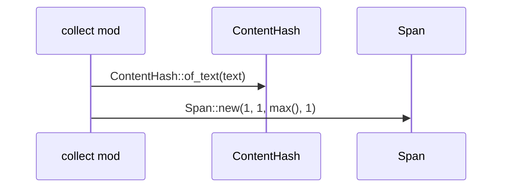

## `sealmap_rust::collect::Collector::module`
`fn module(&mut self, path: Segs, attrs: &[Attribute], items: &[Item], span: Span, vis: Visibility)` · L84-L102
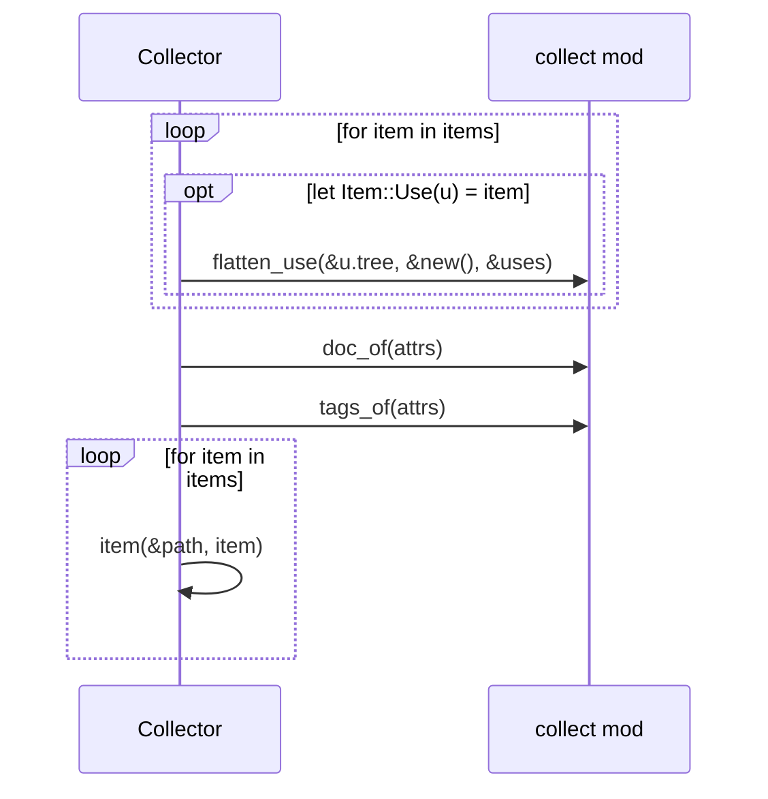

## `sealmap_rust::collect::Collector::skip`
`fn skip(&self, attrs: &[Attribute]) -> bool` · L104-L106
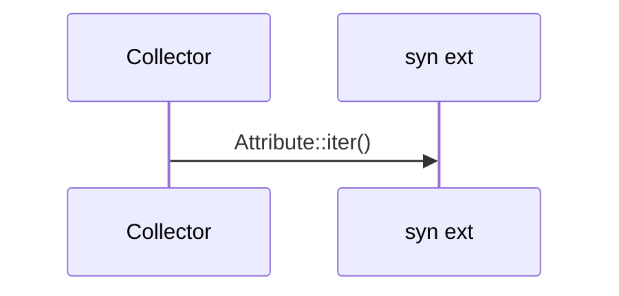

## `sealmap_rust::collect::Collector::item`
`fn item(&mut self, module: &Segs, item: &Item)` · L108-L322
```mermaid
sequenceDiagram
  participant sealmap_rust__collect__Collector as Collector
  participant sealmap_rust__collect as collect mod
  participant sealmap_rust__tidy as tidy mod
  participant sealmap_rust__collect__FlowWalker as FlowWalker
  opt closure
    sealmap_rust__collect__Collector->>sealmap_rust__collect: vis_of(vis)
    sealmap_rust__collect__Collector->>sealmap_rust__collect: span_of(span)
    sealmap_rust__collect__Collector->>sealmap_rust__collect: doc_of(attrs)
    sealmap_rust__collect__Collector->>sealmap_rust__collect: tags_of(attrs)
  end
  alt Item::Mod(m)
    sealmap_rust__collect__Collector->>sealmap_rust__collect__Collector: skip(&m.attrs)
    opt self.skip(&m.attrs)
      Note over sealmap_rust__collect__Collector: return
    end
    opt let Some((_, items)) = &m.content
      sealmap_rust__collect__Collector->>sealmap_rust__collect: span_of(span())
      sealmap_rust__collect__Collector->>sealmap_rust__collect: vis_of(&m.vis)
      sealmap_rust__collect__Collector->>sealmap_rust__collect__Collector: module(path, &m.attrs, items, span_of(), vis_of())
    end
  else Item::Struct(s)
    sealmap_rust__collect__Collector->>sealmap_rust__collect__Collector: skip(&s.attrs)
    opt self.skip(&s.attrs)
      Note over sealmap_rust__collect__Collector: return
    end
    sealmap_rust__collect__Collector->>sealmap_rust__collect: generics_of(&s.generics)
    sealmap_rust__collect__Collector->>sealmap_rust__collect: fields_of(&s.fields)
  else Item::Union(u)
    sealmap_rust__collect__Collector->>sealmap_rust__collect: generics_of(&u.generics)
    sealmap_rust__collect__Collector->>sealmap_rust__collect: fields_of(&Named())
  else Item::Enum(e)
    sealmap_rust__collect__Collector->>sealmap_rust__collect__Collector: skip(&e.attrs)
    opt self.skip(&e.attrs)
      Note over sealmap_rust__collect__Collector: return
    end
    sealmap_rust__collect__Collector->>sealmap_rust__collect: generics_of(&e.generics)
    loop for v in &e.variants
      loop for f in v.fields.iter()
        sealmap_rust__collect__Collector->>sealmap_rust__collect: type_refs(&f.ty, &refs)
      end
      alt Fields::Unnamed(u)
        sealmap_rust__collect__Collector->>sealmap_rust__tidy: tokens(u)
        sealmap_rust__collect__Collector->>sealmap_rust__tidy: squeeze(&tokens())
      else Fields::Named(n)
        sealmap_rust__collect__Collector->>sealmap_rust__tidy: tokens(n)
        sealmap_rust__collect__Collector->>sealmap_rust__tidy: squeeze(&tokens())
        sealmap_rust__collect__Collector->>sealmap_rust__tidy: clip(&squeeze(), LABEL_MAX)
      end
      sealmap_rust__collect__Collector->>sealmap_rust__collect: span_of(span())
    end
  else Item::Trait(t)
    sealmap_rust__collect__Collector->>sealmap_rust__collect__Collector: skip(&t.attrs)
    opt self.skip(&t.attrs)
      Note over sealmap_rust__collect__Collector: return
    end
    sealmap_rust__collect__Collector->>sealmap_rust__collect: generics_of(&t.generics)
    loop for b in &t.supertraits
      opt let TypeParamBound::Trait(tb) = b
        sealmap_rust__collect__Collector->>sealmap_rust__collect: path_segs(&tb.path)
      end
    end
    loop for ti in &t.items
      alt TraitItem::Fn(f)
        sealmap_rust__collect__Collector->>sealmap_rust__tidy: tokens(&f.sig)
        sealmap_rust__collect__Collector->>sealmap_rust__tidy: clip(&tokens(), SIG_MAX)
        sealmap_rust__collect__Collector->>sealmap_rust__collect: sig_refs(&f.sig, &refs)
        alt Some(block)
          sealmap_rust__collect__Collector->>sealmap_rust__collect: params_of(&f.sig)
          sealmap_rust__collect__Collector->>sealmap_rust__collect: span_of(span())
          sealmap_rust__collect__Collector->>sealmap_rust__collect: doc_of(&f.attrs)
          sealmap_rust__collect__Collector->>sealmap_rust__collect: generics_of(&f.sig.generics)
          sealmap_rust__collect__Collector->>sealmap_rust__collect: fn_tags(&f.sig, &f.attrs)
          sealmap_rust__collect__Collector->>sealmap_rust__collect__FlowWalker: FlowWalker::new(params)
        else None
          sealmap_rust__collect__Collector->>sealmap_rust__collect: span_of(span())
        end
      else TraitItem::Type(ty)
        opt via then
          sealmap_rust__collect__Collector->>sealmap_rust__tidy: tokens(&ty.bounds)
          sealmap_rust__collect__Collector->>sealmap_rust__tidy: squeeze(&tokens())
        end
        sealmap_rust__collect__Collector->>sealmap_rust__collect: span_of(span())
      else TraitItem::Const(k)
        sealmap_rust__collect__Collector->>sealmap_rust__collect: type_refs(&k.ty, &refs)
        sealmap_rust__collect__Collector->>sealmap_rust__tidy: tokens(&k.ty)
        sealmap_rust__collect__Collector->>sealmap_rust__collect: span_of(span())
      end
    end
  else Item::Type(t)
    sealmap_rust__collect__Collector->>sealmap_rust__collect: generics_of(&t.generics)
    sealmap_rust__collect__Collector->>sealmap_rust__tidy: tokens(&t.ty)
    sealmap_rust__collect__Collector->>sealmap_rust__tidy: clip(&_, SIG_MAX)
    sealmap_rust__collect__Collector->>sealmap_rust__collect: type_refs(&t.ty, &it.sig_refs)
  else Item::Fn(f)
    sealmap_rust__collect__Collector->>sealmap_rust__collect__Collector: skip(&f.attrs)
    opt self.skip(&f.attrs)
      Note over sealmap_rust__collect__Collector: return
    end
    sealmap_rust__collect__Collector->>sealmap_rust__collect: generics_of(&f.sig.generics)
    sealmap_rust__collect__Collector->>sealmap_rust__collect: vis_prefix(&f.vis)
    sealmap_rust__collect__Collector->>sealmap_rust__tidy: tokens(&f.sig)
    sealmap_rust__collect__Collector->>sealmap_rust__tidy: clip(&_, SIG_MAX)
    sealmap_rust__collect__Collector->>sealmap_rust__collect: fn_tags(&f.sig, &_)
    sealmap_rust__collect__Collector->>sealmap_rust__collect: sig_refs(&f.sig, &it.sig_refs)
    sealmap_rust__collect__Collector->>sealmap_rust__collect: params_of(&f.sig)
    sealmap_rust__collect__Collector->>sealmap_rust__collect__FlowWalker: FlowWalker::new(params_of())
  else Item::Const(k)
    sealmap_rust__collect__Collector->>sealmap_rust__tidy: tokens(&k.ty)
    sealmap_rust__collect__Collector->>sealmap_rust__tidy: clip(&_, SIG_MAX)
    sealmap_rust__collect__Collector->>sealmap_rust__collect: type_refs(&k.ty, &it.sig_refs)
  else Item::Static(s)
    sealmap_rust__collect__Collector->>sealmap_rust__tidy: tokens(&s.ty)
    sealmap_rust__collect__Collector->>sealmap_rust__tidy: clip(&_, SIG_MAX)
    sealmap_rust__collect__Collector->>sealmap_rust__collect: type_refs(&s.ty, &it.sig_refs)
  else Item::Impl(i)
    sealmap_rust__collect__Collector->>sealmap_rust__collect__Collector: skip(&i.attrs)
    opt self.skip(&i.attrs)
      Note over sealmap_rust__collect__Collector: return
    end
    sealmap_rust__collect__Collector->>sealmap_rust__collect: first_path(&i.self_ty)
    opt via map
      sealmap_rust__collect__Collector->>sealmap_rust__collect: path_segs(p)
      sealmap_rust__collect__Collector->>sealmap_rust__tidy: tokens(p)
    end
    loop for ii in &i.items
      opt let ImplItem::Fn(f) = ii
        sealmap_rust__collect__Collector->>sealmap_rust__collect__Collector: skip(&f.attrs)
        sealmap_rust__collect__Collector->>sealmap_rust__collect: sig_refs(&f.sig, &refs)
        opt not is_trait_impl
          sealmap_rust__collect__Collector->>sealmap_rust__collect: vis_of(&f.vis)
        end
        sealmap_rust__collect__Collector->>sealmap_rust__collect: span_of(span())
        sealmap_rust__collect__Collector->>sealmap_rust__collect: vis_prefix(&f.vis)
        sealmap_rust__collect__Collector->>sealmap_rust__tidy: tokens(&f.sig)
        sealmap_rust__collect__Collector->>sealmap_rust__tidy: clip(&_, SIG_MAX)
        sealmap_rust__collect__Collector->>sealmap_rust__collect: doc_of(&f.attrs)
        sealmap_rust__collect__Collector->>sealmap_rust__collect: generics_of(&f.sig.generics)
        sealmap_rust__collect__Collector->>sealmap_rust__collect: fn_tags(&f.sig, &f.attrs)
        sealmap_rust__collect__Collector->>sealmap_rust__collect: params_of(&f.sig)
        sealmap_rust__collect__Collector->>sealmap_rust__collect__FlowWalker: FlowWalker::new(params_of())
      end
    end
  end
```

## `sealmap_rust::collect::span_of`
`fn span_of(s: PmSpan) -> Span` · L327-L330
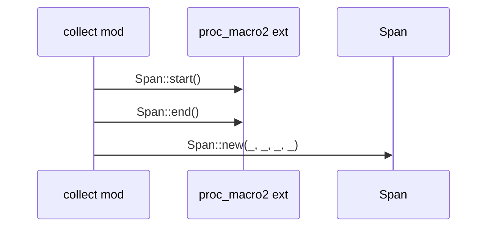

## `sealmap_rust::collect::vis_of`
`fn vis_of(v: &syn::Visibility) -> Visibility` · L332-L339
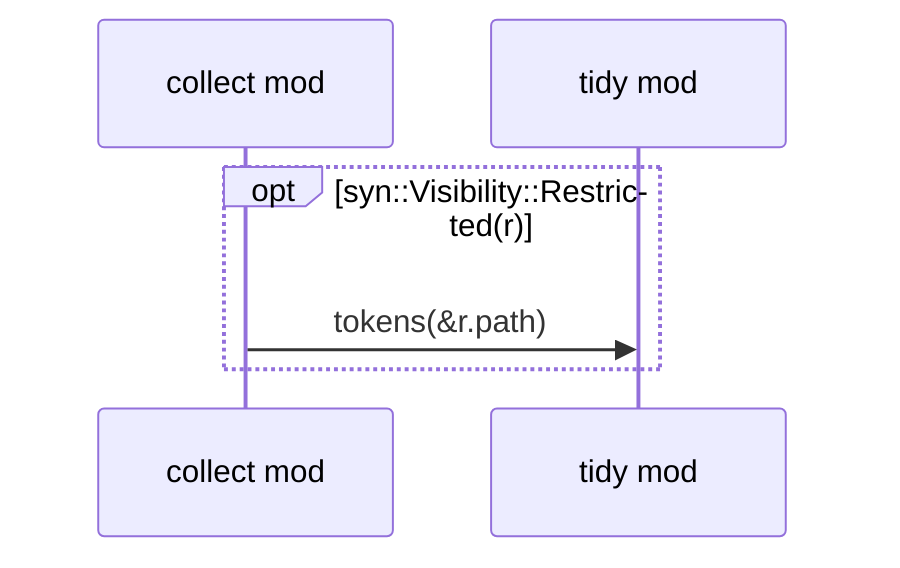

## `sealmap_rust::collect::vis_prefix`
`fn vis_prefix(v: &syn::Visibility) -> String` · L341-L346
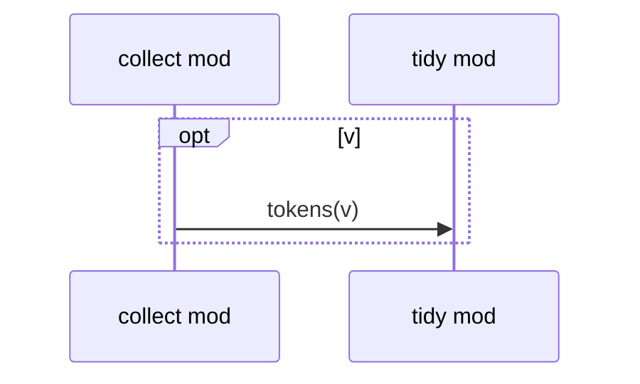

## `sealmap_rust::collect::is_test_attr`
`fn is_test_attr(a: &Attribute) -> bool` · L348-L354
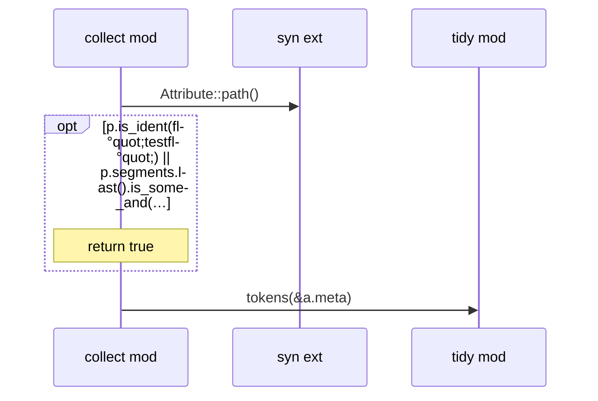

## `sealmap_rust::collect::doc_of`
`fn doc_of(attrs: &[Attribute]) -> Option<String>` · L356-L388
> First sentence of the doc comment, at most 160 chars.
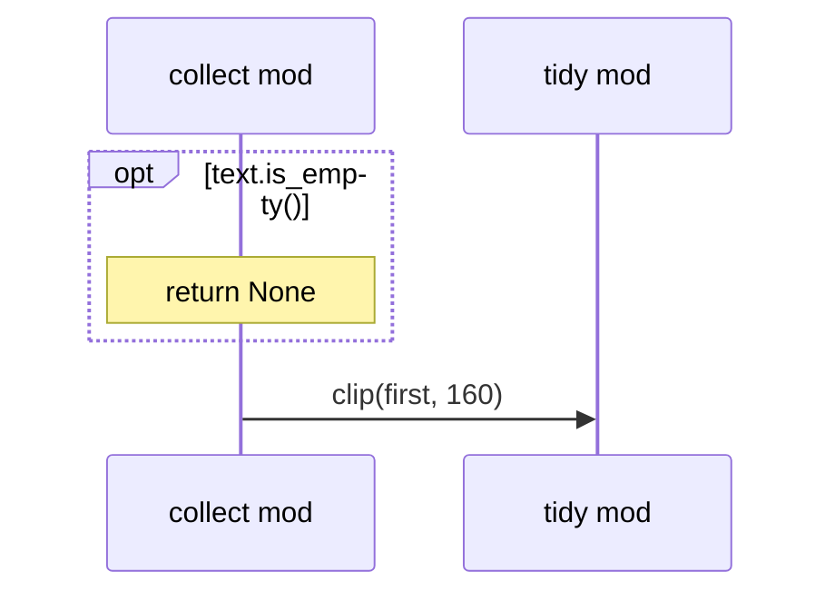

## `sealmap_rust::collect::tags_of`
`fn tags_of(attrs: &[Attribute]) -> Vec<String>` · L390-L403
> Attributes worth keeping as tags.
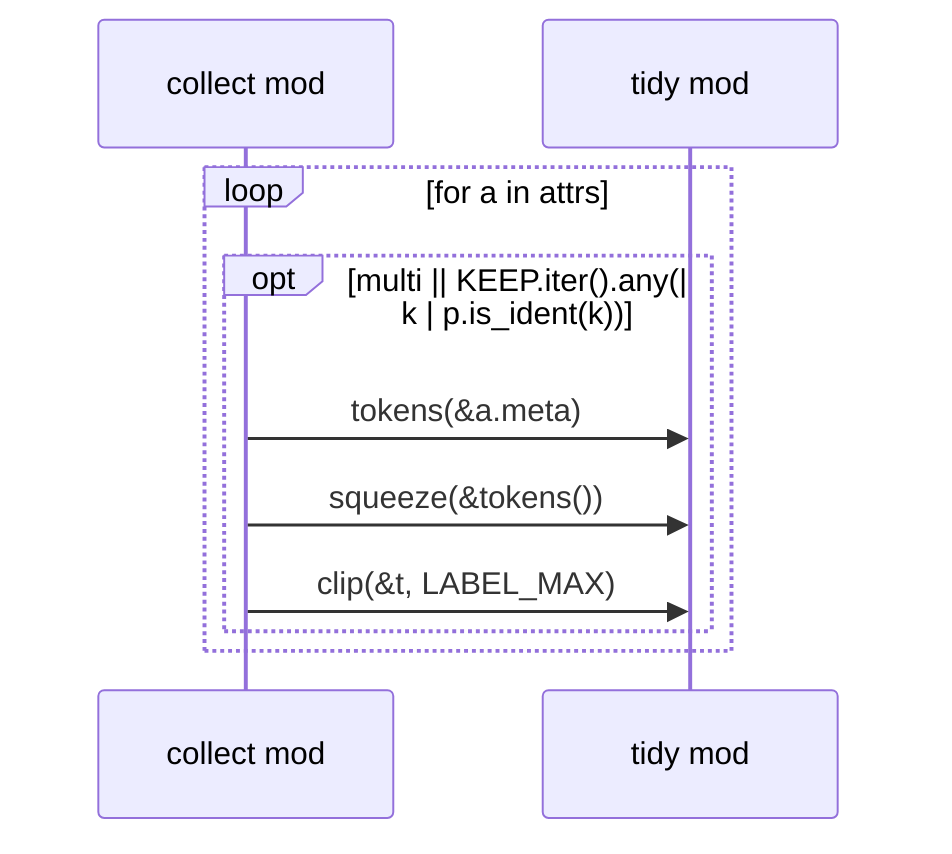

## `sealmap_rust::collect::fn_tags`
`fn fn_tags(sig: &syn::Signature, attrs: &[Attribute]) -> Vec<String>` · L405-L417
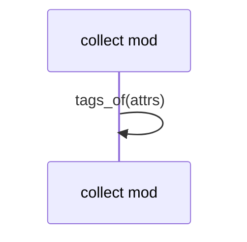

## `sealmap_rust::collect::generics_of`
`fn generics_of(g: &Generics) -> Vec<String>` · L419-L428
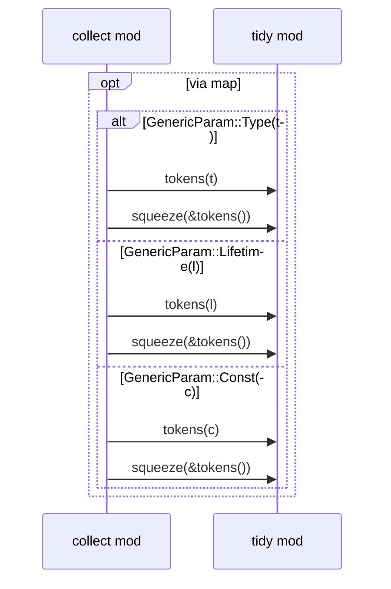

## `sealmap_rust::collect::fields_of`
`fn fields_of(fields: &Fields) -> Vec<RawMember>` · L430-L447
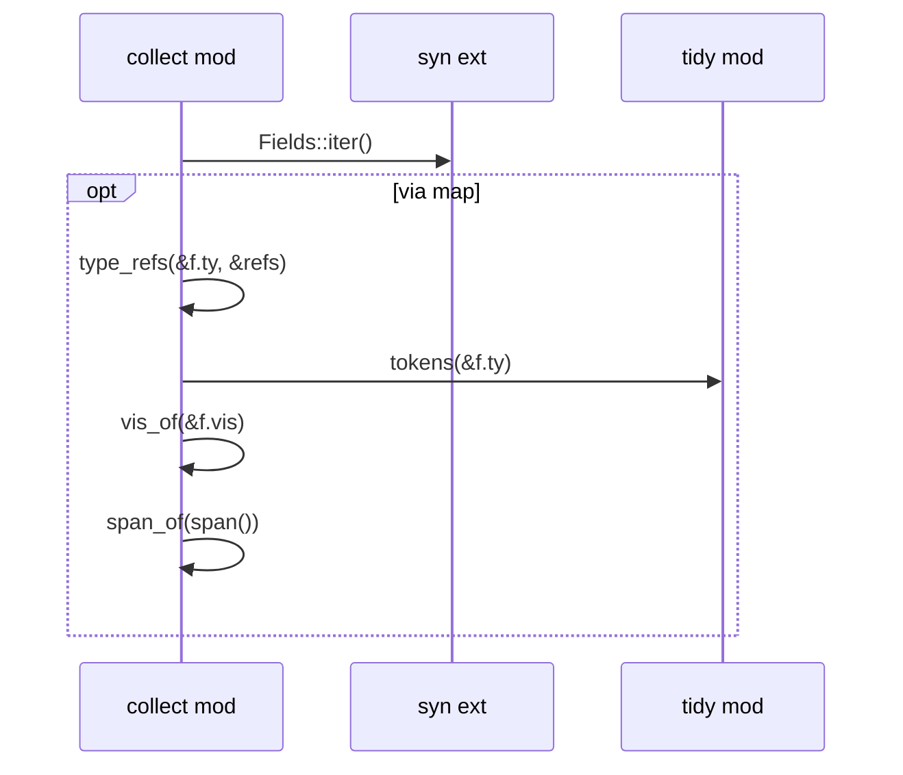

## `sealmap_rust::collect::type_refs`
`fn type_refs(ty: &Type, out: &mut Vec<Segs>)` · L453-L466
> Every path mentioned in a type, outermost first.
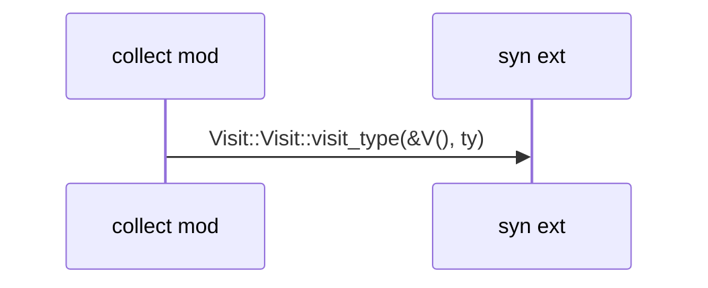

## `sealmap_rust::collect::sig_refs`
`fn sig_refs(sig: &syn::Signature, out: &mut Vec<Segs>)` · L468-L477
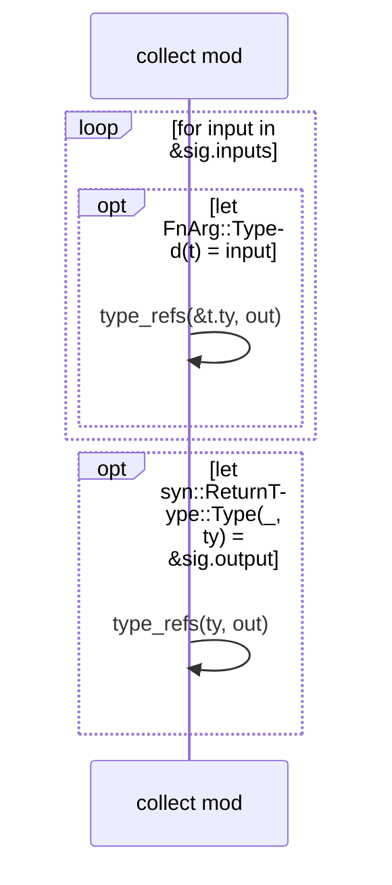

## `sealmap_rust::collect::first_path`
`fn first_path(ty: &Type) -> Option<Segs>` · L479-L488
> Outermost path of a type, looking through references and parens.
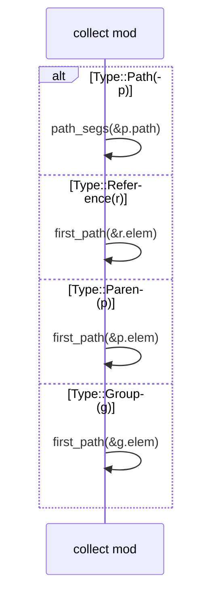

## `sealmap_rust::collect::params_of`
`fn params_of(sig: &syn::Signature) -> BTreeMap<String, Recv>` · L490-L507
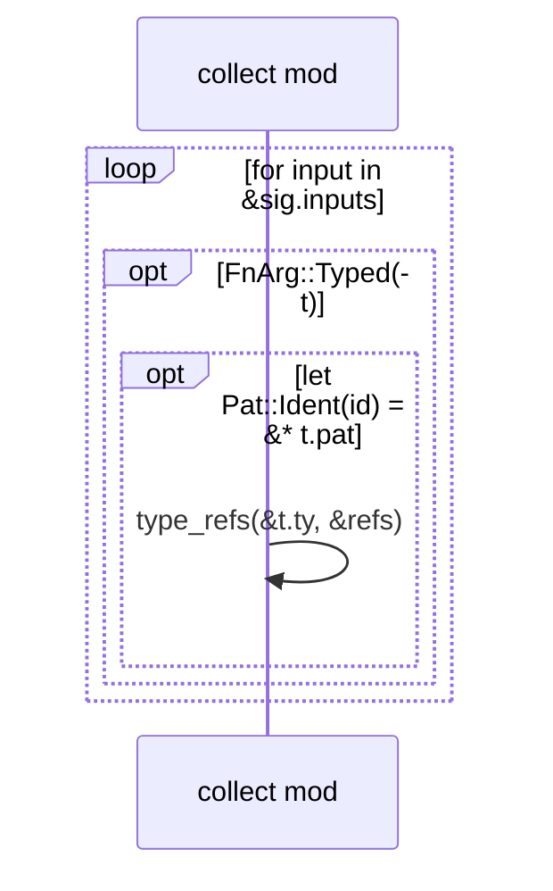

## `sealmap_rust::collect::flatten_use`
`fn flatten_use(tree: &UseTree, prefix: &mut Segs, out: &mut Vec<RawUse>)` · L509-L542
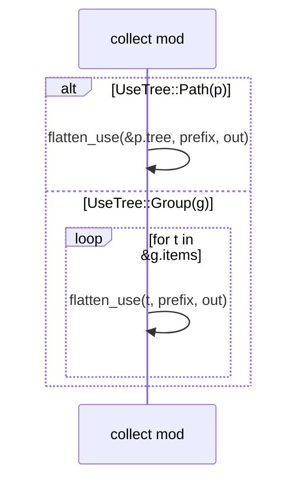

## `sealmap_rust::collect::FlowWalker::block`
`fn block(&mut self, b: &Block) -> Vec<RawStep>` · L584-L588
```mermaid
sequenceDiagram
  participant sealmap_rust__collect__FlowWalker as FlowWalker
  sealmap_rust__collect__FlowWalker->>sealmap_rust__collect__FlowWalker: stmts(&b.stmts, &out)
```

## `sealmap_rust::collect::FlowWalker::stmts`
`fn stmts(&mut self, stmts: &[Stmt], out: &mut Vec<RawStep>)` · L590-L610
```mermaid
sequenceDiagram
  participant sealmap_rust__collect__FlowWalker as FlowWalker
  loop for s in stmts
    alt Stmt::Local(l)
      opt let Some(init) = &l.init
        sealmap_rust__collect__FlowWalker->>sealmap_rust__collect__FlowWalker: expr(&init.expr, out)
        opt let Some((_, diverge)) = &init.diverge
          sealmap_rust__collect__FlowWalker->>sealmap_rust__collect__FlowWalker: sub(diverge)
        end
      end
      sealmap_rust__collect__FlowWalker->>sealmap_rust__collect__FlowWalker: bind(&l.pat, map())
    else Stmt::Expr(e, _)
      sealmap_rust__collect__FlowWalker->>sealmap_rust__collect__FlowWalker: expr(e, out)
    else Stmt::Macro(m)
      sealmap_rust__collect__FlowWalker->>sealmap_rust__collect__FlowWalker: mac(&m.mac, out)
    end
  end
```

## `sealmap_rust::collect::FlowWalker::bind`
`fn bind(&mut self, pat: &Pat, init: Option<&Expr>)` · L612-L640
> Record the type of a `let` binding when it is evident.
```mermaid
sequenceDiagram
  participant sealmap_rust__collect__FlowWalker as FlowWalker
  participant sealmap_rust__collect as collect mod
  alt Pat::Type(pt)
    alt Pat::Ident(id)
      sealmap_rust__collect__FlowWalker->>sealmap_rust__collect: type_refs(&pt.ty, &refs)
    else _
      Note over sealmap_rust__collect__FlowWalker: return
    end
  else _
    Note over sealmap_rust__collect__FlowWalker: return
  end
```

## `sealmap_rust::collect::FlowWalker::sub`
`fn sub(&mut self, e: &Expr) -> Vec<RawStep>` · L642-L646
```mermaid
sequenceDiagram
  participant sealmap_rust__collect__FlowWalker as FlowWalker
  sealmap_rust__collect__FlowWalker->>sealmap_rust__collect__FlowWalker: expr(e, &out)
```

## `sealmap_rust::collect::FlowWalker::sub_block`
`fn sub_block(&mut self, b: &Block) -> Vec<RawStep>` · L648-L653
```mermaid
sequenceDiagram
  participant sealmap_rust__collect__FlowWalker as FlowWalker
  sealmap_rust__collect__FlowWalker->>sealmap_rust__collect__FlowWalker: block(b)
```

## `sealmap_rust::collect::FlowWalker::expr`
`fn expr(&mut self, e: &Expr, out: &mut Vec<RawStep>)` · L655-L662
```mermaid
sequenceDiagram
  participant sealmap_rust__collect__FlowWalker as FlowWalker
  opt self.depth>= MAX_EXPR_DEPTH
    Note over sealmap_rust__collect__FlowWalker: return
  end
  sealmap_rust__collect__FlowWalker->>sealmap_rust__collect__FlowWalker: expr_inner(e, out)
```

## `sealmap_rust::collect::FlowWalker::expr_inner`
`fn expr_inner(&mut self, e: &Expr, out: &mut Vec<RawStep>)` · L664-L867
```mermaid
sequenceDiagram
  participant sealmap_rust__collect__FlowWalker as FlowWalker
  participant sealmap_rust__collect as collect mod
  participant sealmap_rust__tidy as tidy mod
  alt Expr::Call(c)
    loop for a in &c.args
      sealmap_rust__collect__FlowWalker->>sealmap_rust__collect__FlowWalker: arg(a, out, &deferred)
    end
    alt Expr::Path(p)
      sealmap_rust__collect__FlowWalker->>sealmap_rust__collect: path_segs(&p.path)
      opt !name.starts_with(| ch: char | ch.is_uppercase())
        sealmap_rust__collect__FlowWalker->>sealmap_rust__collect: call(Path(), &shown, &c.args, Function, span())
        sealmap_rust__collect__FlowWalker->>sealmap_rust__collect__FlowWalker: flush_deferred(&name, deferred, out)
        Note over sealmap_rust__collect__FlowWalker: return
      end
    else other
      sealmap_rust__collect__FlowWalker->>sealmap_rust__collect__FlowWalker: expr(other, out)
    end
    sealmap_rust__collect__FlowWalker->>sealmap_rust__collect__FlowWalker: flush_deferred(#quot;#quot;, deferred, out)
  else Expr::MethodCall(m)
    sealmap_rust__collect__FlowWalker->>sealmap_rust__collect__FlowWalker: expr(&m.receiver, out)
    loop for a in &m.args
      sealmap_rust__collect__FlowWalker->>sealmap_rust__collect__FlowWalker: arg(a, out, &deferred)
    end
    sealmap_rust__collect__FlowWalker->>sealmap_rust__collect__FlowWalker: recv(&m.receiver)
    sealmap_rust__collect__FlowWalker->>sealmap_rust__collect: call(_, &name, &m.args, Method, span())
    sealmap_rust__collect__FlowWalker->>sealmap_rust__collect__FlowWalker: flush_deferred(&name, deferred, out)
  else Expr::Await(a)
    sealmap_rust__collect__FlowWalker->>sealmap_rust__collect__FlowWalker: expr(&a.base, out)
    sealmap_rust__collect__FlowWalker->>sealmap_rust__collect: is_call(&a.base)
    opt is_call(&a.base)
      sealmap_rust__collect__FlowWalker->>sealmap_rust__collect: last_call_mut(out)
    end
  else Expr::Try(t)
    sealmap_rust__collect__FlowWalker->>sealmap_rust__collect__FlowWalker: expr(&t.expr, out)
    sealmap_rust__collect__FlowWalker->>sealmap_rust__collect: is_call(&t.expr)
    opt is_call(&t.expr)
      sealmap_rust__collect__FlowWalker->>sealmap_rust__collect: last_call_mut(out)
    end
  else Expr::If(i)
    loop while let Some(ifx) = cur.take()
      sealmap_rust__collect__FlowWalker->>sealmap_rust__collect: cond_label(&ifx.cond)
      sealmap_rust__collect__FlowWalker->>sealmap_rust__collect__FlowWalker: cond(&ifx.cond, &cond_steps)
      sealmap_rust__collect__FlowWalker->>sealmap_rust__collect__FlowWalker: sub_block(&ifx.then_branch)
      alt Some(Expr::Block(b))
        sealmap_rust__collect__FlowWalker->>sealmap_rust__collect__FlowWalker: sub_block(&b.block)
      else Some(other)
        sealmap_rust__collect__FlowWalker->>sealmap_rust__collect__FlowWalker: sub(other)
      end
    end
    sealmap_rust__collect__FlowWalker->>sealmap_rust__collect: push_arms(arms, out)
  else Expr::Match(m)
    sealmap_rust__collect__FlowWalker->>sealmap_rust__collect__FlowWalker: expr(&m.expr, out)
    opt via map
      sealmap_rust__collect__FlowWalker->>sealmap_rust__tidy: tokens(&a.pat)
      sealmap_rust__collect__FlowWalker->>sealmap_rust__tidy: squeeze(&tokens())
      opt let Some((_, g)) = &a.guard
        sealmap_rust__collect__FlowWalker->>sealmap_rust__tidy: tokens(g)
        sealmap_rust__collect__FlowWalker->>sealmap_rust__tidy: squeeze(&tokens())
      end
      sealmap_rust__collect__FlowWalker->>sealmap_rust__collect__FlowWalker: sub(&a.body)
      sealmap_rust__collect__FlowWalker->>sealmap_rust__tidy: clip(&label, LABEL_MAX)
    end
  else Expr::ForLoop(f)
    sealmap_rust__collect__FlowWalker->>sealmap_rust__collect__FlowWalker: expr(&f.expr, out)
    sealmap_rust__collect__FlowWalker->>sealmap_rust__tidy: tokens(&f.pat)
    sealmap_rust__collect__FlowWalker->>sealmap_rust__tidy: squeeze(&tokens())
    sealmap_rust__collect__FlowWalker->>sealmap_rust__tidy: tokens(&f.expr)
    sealmap_rust__collect__FlowWalker->>sealmap_rust__tidy: squeeze(&tokens())
    sealmap_rust__collect__FlowWalker->>sealmap_rust__tidy: clip(&_, LABEL_MAX)
    sealmap_rust__collect__FlowWalker->>sealmap_rust__collect__FlowWalker: sub_block(&f.body)
  else Expr::While(w)
    sealmap_rust__collect__FlowWalker->>sealmap_rust__collect: cond_label(&w.cond)
    sealmap_rust__collect__FlowWalker->>sealmap_rust__tidy: clip(&_, LABEL_MAX)
    sealmap_rust__collect__FlowWalker->>sealmap_rust__collect__FlowWalker: cond(&w.cond, &body)
    sealmap_rust__collect__FlowWalker->>sealmap_rust__collect__FlowWalker: sub_block(&w.body)
  else Expr::Loop(l)
    sealmap_rust__collect__FlowWalker->>sealmap_rust__collect__FlowWalker: sub_block(&l.body)
  else Expr::Block(b)
    sealmap_rust__collect__FlowWalker->>sealmap_rust__collect__FlowWalker: stmts(&b.block.stmts, out)
  else Expr::Unsafe(b)
    sealmap_rust__collect__FlowWalker->>sealmap_rust__collect__FlowWalker: stmts(&b.block.stmts, out)
  else Expr::Async(b)
    sealmap_rust__collect__FlowWalker->>sealmap_rust__collect__FlowWalker: stmts(&b.block.stmts, out)
  else Expr::TryBlock(b)
    sealmap_rust__collect__FlowWalker->>sealmap_rust__collect__FlowWalker: stmts(&b.block.stmts, out)
  else Expr::Const(b)
    sealmap_rust__collect__FlowWalker->>sealmap_rust__collect__FlowWalker: stmts(&b.block.stmts, out)
  else Expr::Closure(c)
    sealmap_rust__collect__FlowWalker->>sealmap_rust__collect__FlowWalker: sub(&c.body)
  else Expr::Return(r)
    opt let Some(e) = &r.expr
      sealmap_rust__collect__FlowWalker->>sealmap_rust__collect__FlowWalker: expr(e, out)
    end
    opt via map_or_else
      sealmap_rust__collect__FlowWalker->>sealmap_rust__tidy: tokens(e)
      sealmap_rust__collect__FlowWalker->>sealmap_rust__tidy: squeeze(&tokens())
      sealmap_rust__collect__FlowWalker->>sealmap_rust__tidy: clip(&_, LABEL_MAX)
    end
  else Expr::Macro(m)
    sealmap_rust__collect__FlowWalker->>sealmap_rust__collect__FlowWalker: mac(&m.mac, out)
  else Expr::Binary(b)
    sealmap_rust__collect__FlowWalker->>sealmap_rust__collect__FlowWalker: expr(&b.left, out)
    sealmap_rust__collect__FlowWalker->>sealmap_rust__collect__FlowWalker: expr(&b.right, out)
  else Expr::Assign(a)
    sealmap_rust__collect__FlowWalker->>sealmap_rust__collect__FlowWalker: expr(&a.right, out)
    sealmap_rust__collect__FlowWalker->>sealmap_rust__collect__FlowWalker: expr(&a.left, out)
  else Expr::Unary(u)
    sealmap_rust__collect__FlowWalker->>sealmap_rust__collect__FlowWalker: expr(&u.expr, out)
  else Expr::Paren(p)
    sealmap_rust__collect__FlowWalker->>sealmap_rust__collect__FlowWalker: expr(&p.expr, out)
  else Expr::Group(g)
    sealmap_rust__collect__FlowWalker->>sealmap_rust__collect__FlowWalker: expr(&g.expr, out)
  else Expr::Reference(r)
    sealmap_rust__collect__FlowWalker->>sealmap_rust__collect__FlowWalker: expr(&r.expr, out)
  else Expr::Field(f)
    sealmap_rust__collect__FlowWalker->>sealmap_rust__collect__FlowWalker: expr(&f.base, out)
  else Expr::Index(i)
    sealmap_rust__collect__FlowWalker->>sealmap_rust__collect__FlowWalker: expr(&i.expr, out)
    sealmap_rust__collect__FlowWalker->>sealmap_rust__collect__FlowWalker: expr(&i.index, out)
  else Expr::Cast(c)
    sealmap_rust__collect__FlowWalker->>sealmap_rust__collect__FlowWalker: expr(&c.expr, out)
  else Expr::Let(l)
    sealmap_rust__collect__FlowWalker->>sealmap_rust__collect__FlowWalker: expr(&l.expr, out)
  else Expr::Tuple(t)
    loop each via for_each
      sealmap_rust__collect__FlowWalker->>sealmap_rust__collect__FlowWalker: expr(e, out)
    end
  else Expr::Array(a)
    loop each via for_each
      sealmap_rust__collect__FlowWalker->>sealmap_rust__collect__FlowWalker: expr(e, out)
    end
  else Expr::Repeat(r)
    sealmap_rust__collect__FlowWalker->>sealmap_rust__collect__FlowWalker: expr(&r.expr, out)
  else Expr::Range(r)
    opt let Some(s) = &r.start
      sealmap_rust__collect__FlowWalker->>sealmap_rust__collect__FlowWalker: expr(s, out)
    end
    opt let Some(e) = &r.end
      sealmap_rust__collect__FlowWalker->>sealmap_rust__collect__FlowWalker: expr(e, out)
    end
  else Expr::Struct(s)
    loop for f in &s.fields
      sealmap_rust__collect__FlowWalker->>sealmap_rust__collect__FlowWalker: expr(&f.expr, out)
    end
    opt let Some(rest) = &s.rest
      sealmap_rust__collect__FlowWalker->>sealmap_rust__collect__FlowWalker: expr(rest, out)
    end
  else Expr::Break(b)
    opt let Some(e) = &b.expr
      sealmap_rust__collect__FlowWalker->>sealmap_rust__collect__FlowWalker: expr(e, out)
    end
  else Expr::Yield(y)
    opt let Some(e) = &y.expr
      sealmap_rust__collect__FlowWalker->>sealmap_rust__collect__FlowWalker: expr(e, out)
    end
  end
```

## `sealmap_rust::collect::FlowWalker::cond`
`fn cond(&mut self, cond: &Expr, out: &mut Vec<RawStep>)` · L869-L875
> Condition of `if` / `while`: `let` scrutinee or boolean expression.
```mermaid
sequenceDiagram
  participant sealmap_rust__collect__FlowWalker as FlowWalker
  sealmap_rust__collect__FlowWalker->>sealmap_rust__collect__FlowWalker: expr(cond, out)
  opt let Expr::Let(l) = cond
    sealmap_rust__collect__FlowWalker->>sealmap_rust__collect__FlowWalker: bind(&l.pat, Some())
  end
```

## `sealmap_rust::collect::FlowWalker::arg`
`fn arg(&mut self, a: &Expr, out: &mut Vec<RawStep>, deferred: &mut Vec<Vec<RawStep>>)` · L877-L897
> Walk a call argument.
```mermaid
sequenceDiagram
  participant sealmap_rust__collect__FlowWalker as FlowWalker
  alt Expr::Closure(c)
    sealmap_rust__collect__FlowWalker->>sealmap_rust__collect__FlowWalker: sub(&c.body)
  else Expr::Async(b)
    sealmap_rust__collect__FlowWalker->>sealmap_rust__collect__FlowWalker: sub_block(&b.block)
  else other
    sealmap_rust__collect__FlowWalker->>sealmap_rust__collect__FlowWalker: expr(other, out)
  end
```

## `sealmap_rust::collect::FlowWalker::mac`
`fn mac(&mut self, m: &syn::Macro, out: &mut Vec<RawStep>)` · L912-L924
> Calls inside macro arguments (`vec![f()]`, `assert!(g())`, `format!("{}", h())`).
```mermaid
sequenceDiagram
  participant sealmap_rust__collect__FlowWalker as FlowWalker
  participant syn as syn ext
  sealmap_rust__collect__FlowWalker->>syn: Macro::parse_body_with(parser)
  alt let Ok(args) = m.parse_body_with(parser)
    loop for a in &args
      sealmap_rust__collect__FlowWalker->>sealmap_rust__collect__FlowWalker: expr(a, out)
    end
  else if let Ok(stmts) = m.parse_body_with(Block::parse_withi…
    sealmap_rust__collect__FlowWalker->>syn: Macro::parse_body_with(parse_within)
    sealmap_rust__collect__FlowWalker->>sealmap_rust__collect__FlowWalker: stmts(&stmts, out)
  end
```

## `sealmap_rust::collect::FlowWalker::recv`
`fn recv(&self, e: &Expr) -> Recv` · L926-L942
```mermaid
sequenceDiagram
  participant sealmap_rust__collect__FlowWalker as FlowWalker
  alt Expr::Paren(p)
    sealmap_rust__collect__FlowWalker->>sealmap_rust__collect__FlowWalker: recv(&p.expr)
  else Expr::Reference(r)
    sealmap_rust__collect__FlowWalker->>sealmap_rust__collect__FlowWalker: recv(&r.expr)
  else Expr::Unary(u)
    sealmap_rust__collect__FlowWalker->>sealmap_rust__collect__FlowWalker: recv(&u.expr)
  end
```

## `sealmap_rust::collect::call`
`fn call(callee: Callee, name: &str, args: &Punctuated<Expr, syn::Token![,]>, kind: CallKind, span: PmSpan) -> RawStep` · L945-L949
```mermaid
sequenceDiagram
  participant sealmap_rust__collect as collect mod
  participant syn as syn ext
  participant sealmap_rust__tidy as tidy mod
  participant proc_macro2 as proc_macro2 ext
  sealmap_rust__collect->>syn: Punctuated::iter()
  sealmap_rust__collect->>sealmap_rust__tidy: clip(&_, LABEL_MAX)
  sealmap_rust__collect->>proc_macro2: Span::start()
```

## `sealmap_rust::collect::arg_sketch`
`fn arg_sketch(e: &Expr) -> String` · L951-L971
> A compact stand-in for an argument: identifiers and short literals are kept, everything else becomes `_`.
```mermaid
sequenceDiagram
  participant sealmap_rust__collect as collect mod
  participant sealmap_rust__tidy as tidy mod
  alt Expr::Lit(l)
    sealmap_rust__collect->>sealmap_rust__tidy: tokens(l)
    sealmap_rust__collect->>sealmap_rust__tidy: clip(&tokens(), 14)
  else Expr::Reference(r)
    sealmap_rust__collect->>sealmap_rust__collect: arg_sketch(&r.expr)
  else Expr::Field(f)
    alt syn::Member::Named(n)
      sealmap_rust__collect->>sealmap_rust__collect: arg_sketch(&f.base)
    else syn::Member::Unnamed(i)
      sealmap_rust__collect->>sealmap_rust__collect: arg_sketch(&f.base)
    end
  end
```

## `sealmap_rust::collect::cond_label`
`fn cond_label(cond: &Expr) -> String` · L973-L979
```mermaid
sequenceDiagram
  participant sealmap_rust__collect as collect mod
  participant sealmap_rust__tidy as tidy mod
  alt Expr::Let(l)
    sealmap_rust__collect->>sealmap_rust__tidy: tokens(&l.pat)
    sealmap_rust__collect->>sealmap_rust__tidy: squeeze(&tokens())
    sealmap_rust__collect->>sealmap_rust__tidy: tokens(&l.expr)
    sealmap_rust__collect->>sealmap_rust__tidy: squeeze(&tokens())
  else other
    sealmap_rust__collect->>sealmap_rust__tidy: tokens(other)
    sealmap_rust__collect->>sealmap_rust__tidy: squeeze(&tokens())
  end
  sealmap_rust__collect->>sealmap_rust__tidy: clip(&_, LABEL_MAX)
```

## `sealmap_rust::collect::is_call`
`fn is_call(e: &Expr) -> bool` · L995-L1003
```mermaid
sequenceDiagram
  participant sealmap_rust__collect as collect mod
  alt Expr::Paren(p)
    sealmap_rust__collect->>sealmap_rust__collect: is_call(&p.expr)
  else Expr::Await(a)
    sealmap_rust__collect->>sealmap_rust__collect: is_call(&a.base)
  else Expr::Try(t)
    sealmap_rust__collect->>sealmap_rust__collect: is_call(&t.expr)
  end
```

## `sealmap_rust::collect::constructed_type`
`fn constructed_type(e: &Expr) -> Option<Segs>` · L1011-L1029
> `Foo::new(..)`, `Foo { ..
```mermaid
sequenceDiagram
  participant sealmap_rust__collect as collect mod
  alt Expr::Call(c)
    opt Expr::Path(p) if p.path.segments.len()>= 2
      sealmap_rust__collect->>sealmap_rust__collect: path_segs(&p.path)
    end
  else Expr::Struct(s)
    sealmap_rust__collect->>sealmap_rust__collect: path_segs(&s.path)
  else Expr::Try(t)
    sealmap_rust__collect->>sealmap_rust__collect: constructed_type(&t.expr)
  else Expr::Await(a)
    sealmap_rust__collect->>sealmap_rust__collect: constructed_type(&a.base)
  else Expr::Paren(p)
    sealmap_rust__collect->>sealmap_rust__collect: constructed_type(&p.expr)
  else Expr::Reference(r)
    sealmap_rust__collect->>sealmap_rust__collect: constructed_type(&r.expr)
  end
```
