# `sym:cargo sealmap_rust . fingerprint/` · crates/sealmap-rust/src/fingerprint.rs
> Feeding syn nodes to the shared fingerprinter.

## structure
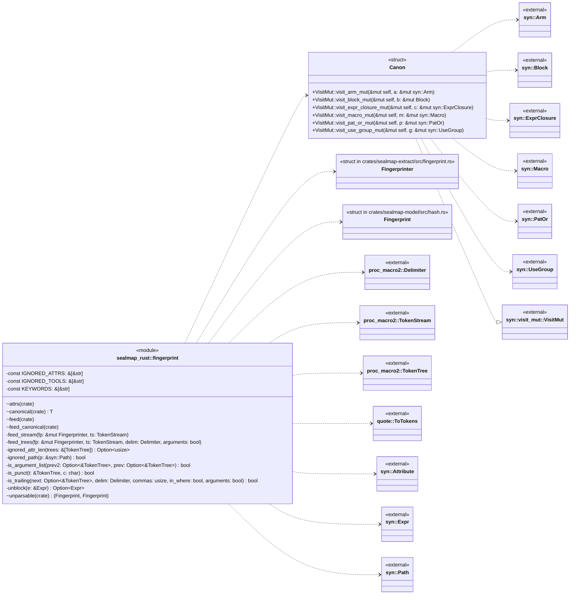

## `sym:cargo sealmap_rust . fingerprint/feed().`
`pub(crate) fn feed(fp: &mut Fingerprinter, node: &impl ToTokens)` · L44-L47
> Feed a syn node's tokens.
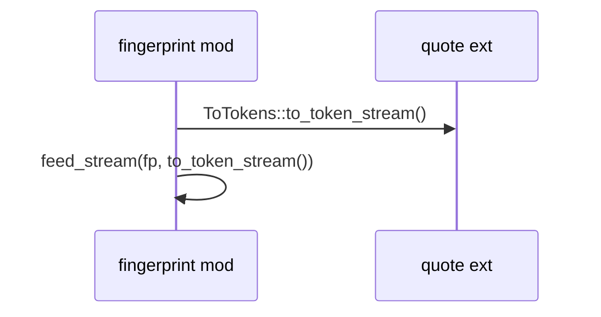

## `sym:cargo sealmap_rust . fingerprint/feed_canonical().`
`pub(crate) fn feed_canonical<T: Clone + ToTokens>(fp: &mut Fingerprinter, node: &T, visit: fn(&mut Canon, &mut T))` · L49-L52
> Feed a node after undoing formatter rewrites on a copy of it.
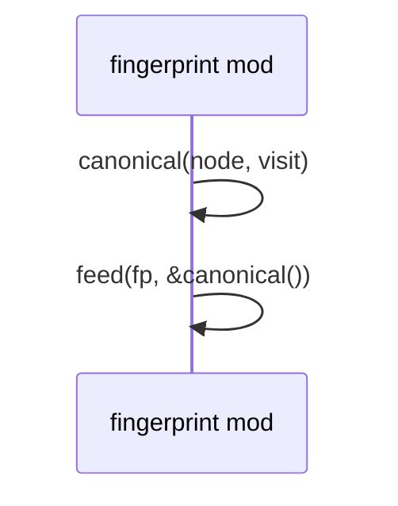

## `sym:cargo sealmap_rust . fingerprint/Canon#[VisitMut]visit_expr_closure_mut().`
`fn visit_expr_closure_mut(&mut self, c: &mut syn::ExprClosure)` · L80-L88
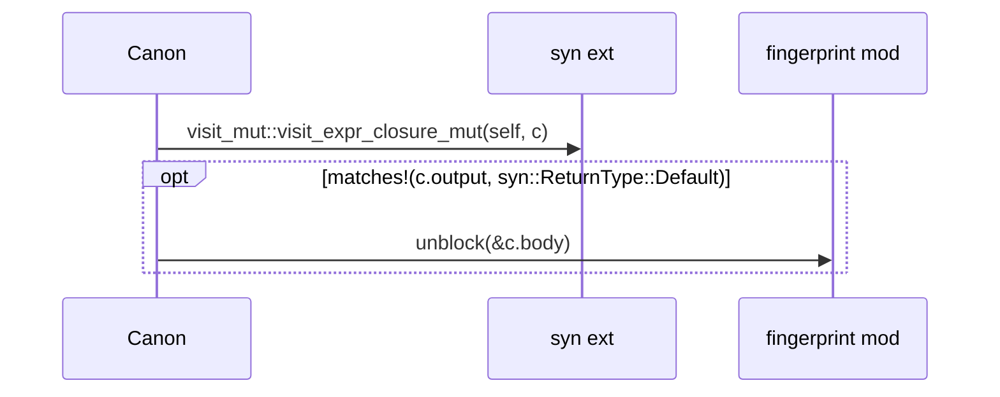

## `sym:cargo sealmap_rust . fingerprint/Canon#[VisitMut]visit_arm_mut().`
`fn visit_arm_mut(&mut self, a: &mut syn::Arm)` · L90-L96
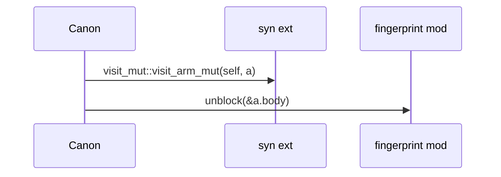

## `sym:cargo sealmap_rust . fingerprint/Canon#[VisitMut]visit_pat_or_mut().`
`fn visit_pat_or_mut(&mut self, p: &mut syn::PatOr)` · L98-L101
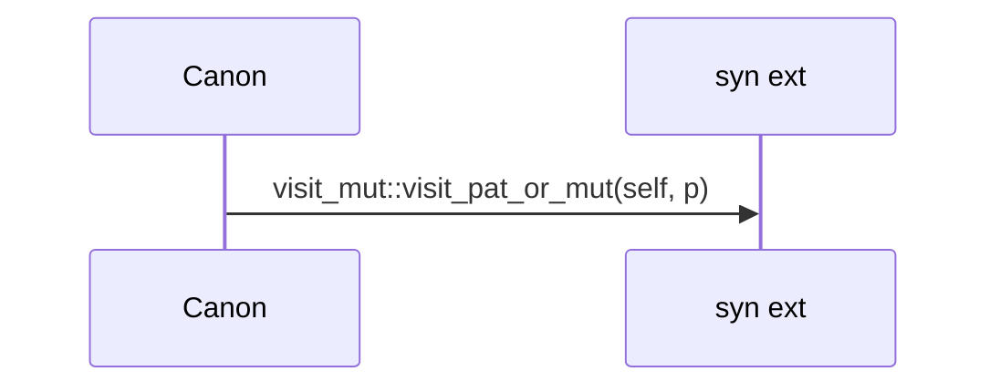

## `sym:cargo sealmap_rust . fingerprint/Canon#[VisitMut]visit_block_mut().`
`fn visit_block_mut(&mut self, b: &mut Block)` · L103-L109
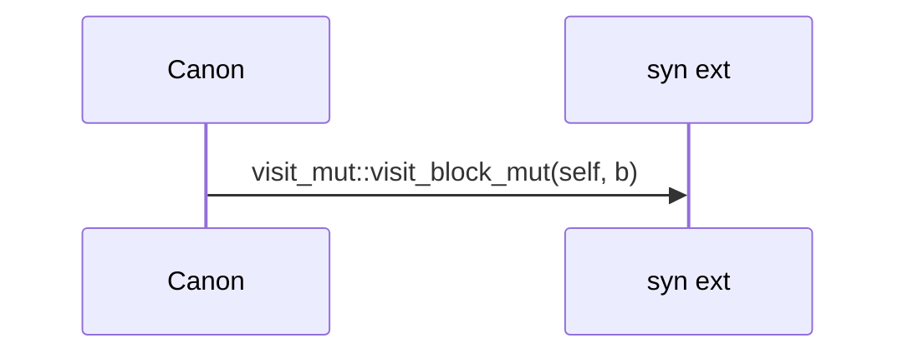

## `sym:cargo sealmap_rust . fingerprint/Canon#[VisitMut]visit_macro_mut().`
`fn visit_macro_mut(&mut self, m: &mut syn::Macro)` · L111-L124
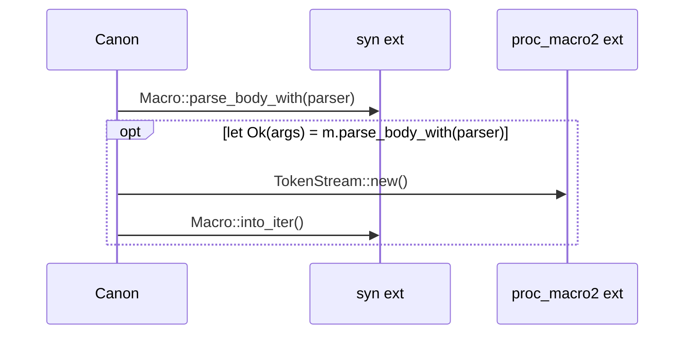

## `sym:cargo sealmap_rust . fingerprint/Canon#[VisitMut]visit_use_group_mut().`
`fn visit_use_group_mut(&mut self, g: &mut syn::UseGroup)` · L126-L131
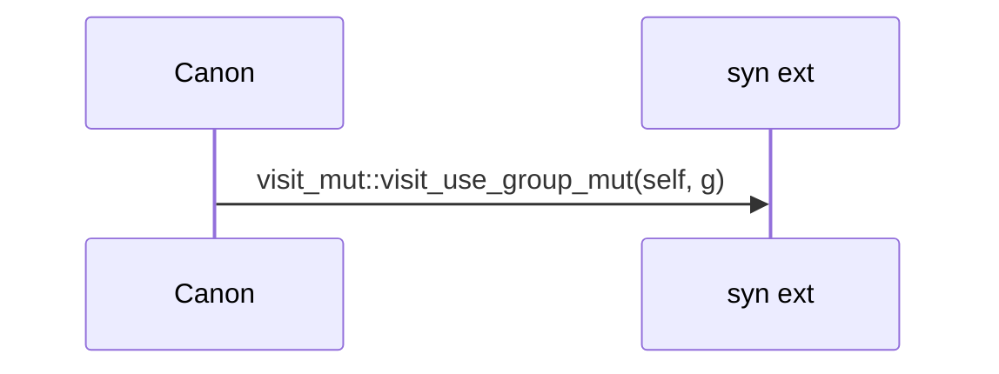

## `sym:cargo sealmap_rust . fingerprint/attrs().`
`pub(crate) fn attrs(fp: &mut Fingerprinter, attrs: &[Attribute])` · L134-L142
> Feed every attribute that matters.
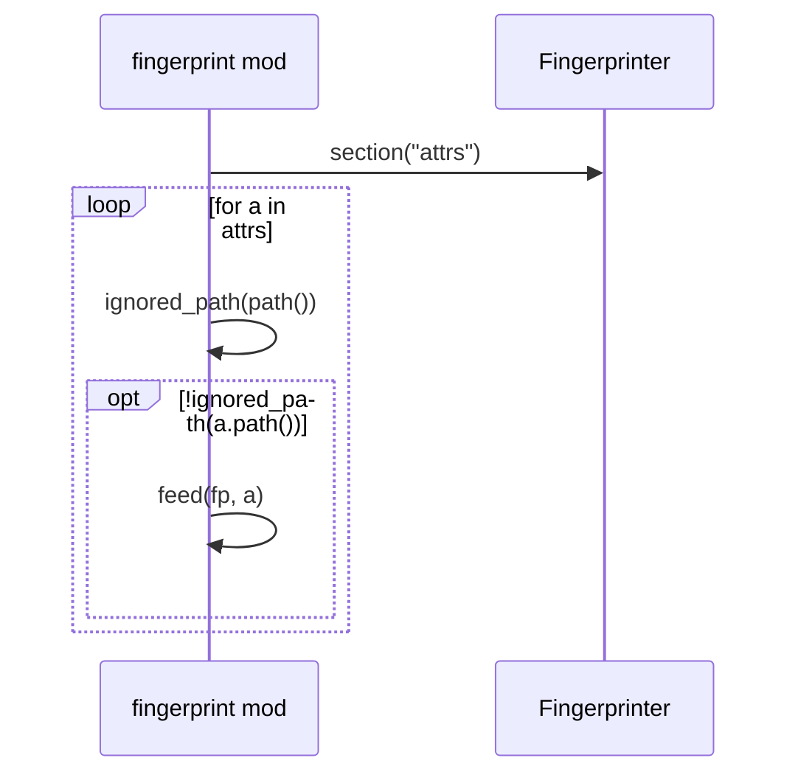

## `sym:cargo sealmap_rust . fingerprint/unparsable().`
`pub(crate) fn unparsable(name: &str, text: &str) -> (Fingerprint, Fingerprint)` · L144-L154
> The fingerprints of a module whose file did not parse: its name in the contract, its raw text as one literal in the body, so any edit shows.
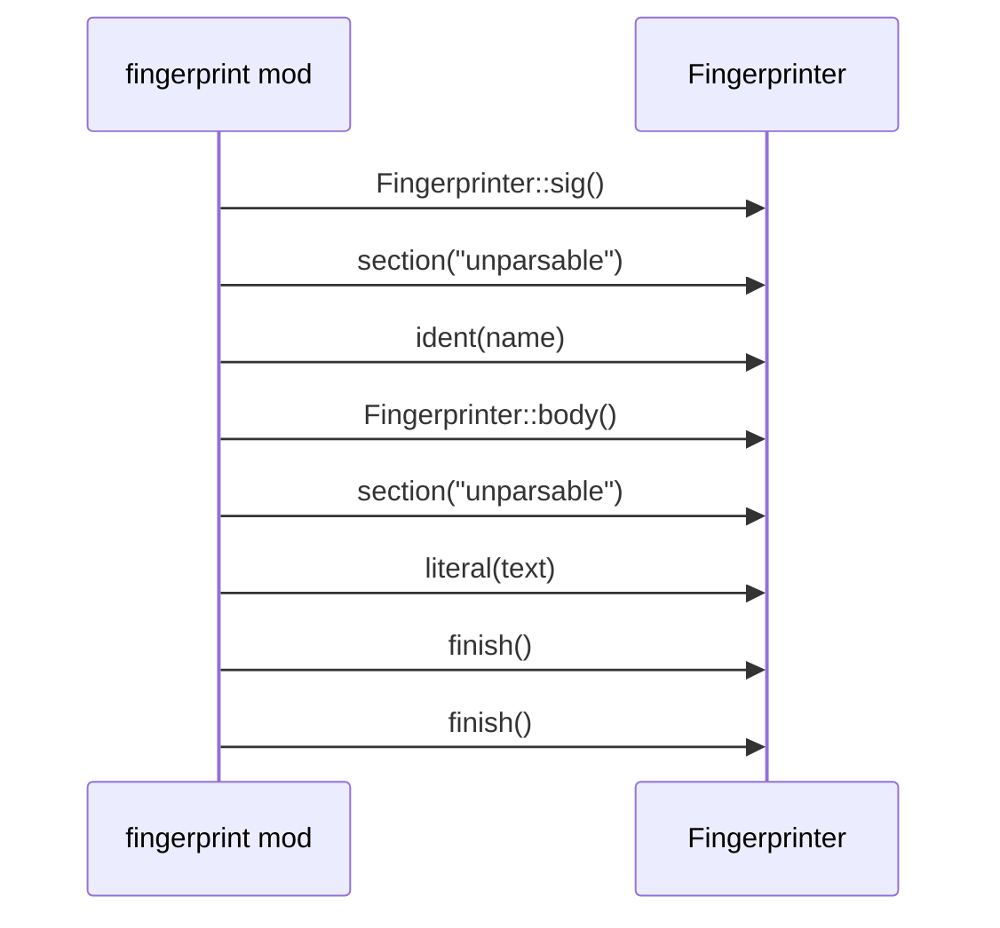

## `sym:cargo sealmap_rust . fingerprint/feed_stream().`
`fn feed_stream(fp: &mut Fingerprinter, ts: TokenStream)` · L171-L173
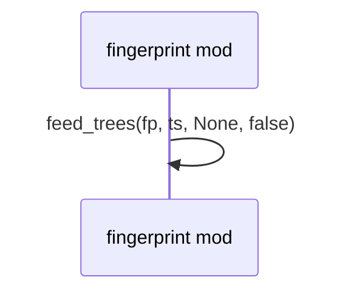

## `sym:cargo sealmap_rust . fingerprint/is_argument_list().`
`fn is_argument_list(prev2: Option<&TokenTree>, prev: Option<&TokenTree>) -> bool` · L175-L185
> Does a parenthesised group after `prev` (and `prev2` before it) hold an argument or parameter list rather than a tuple?
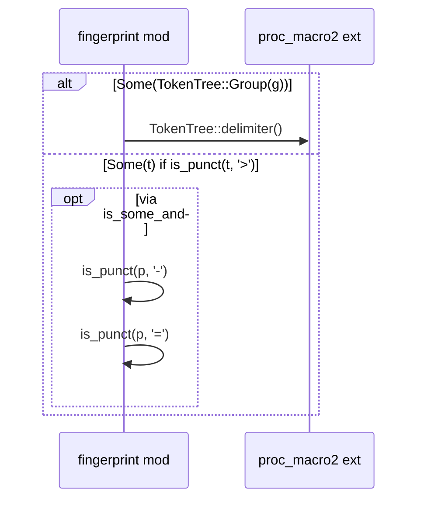

## `sym:cargo sealmap_rust . fingerprint/feed_trees().`
`fn feed_trees(fp: &mut Fingerprinter, ts: TokenStream, delim: Delimiter, arguments: bool)` · L187-L230
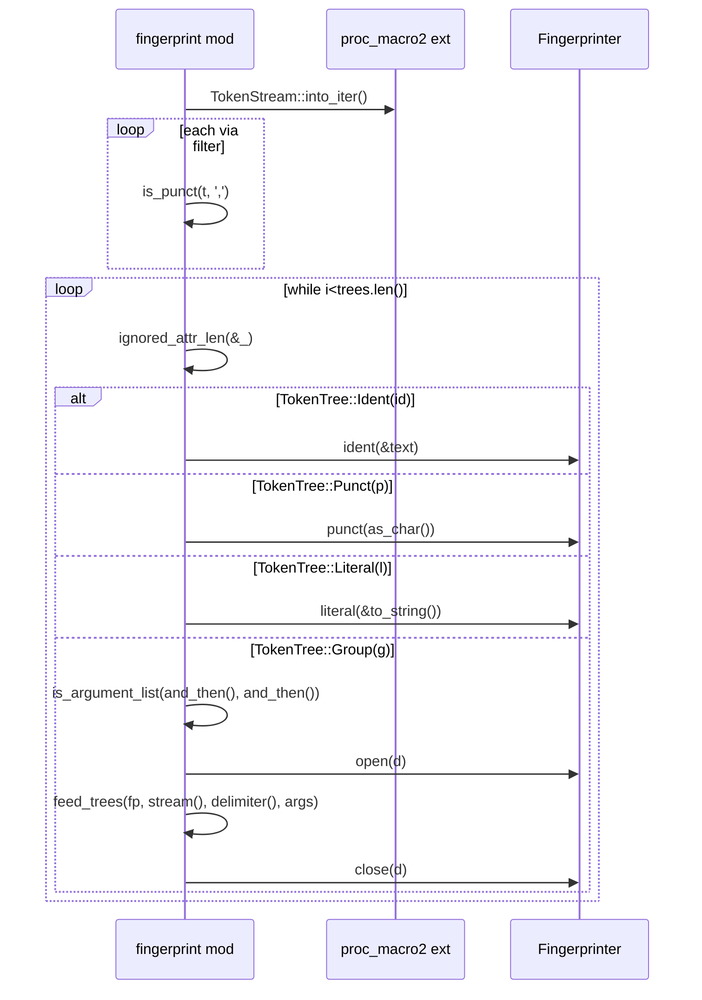

## `sym:cargo sealmap_rust . fingerprint/is_trailing().`
`fn is_trailing(next: Option<&TokenTree>, delim: Delimiter, commas: usize, in_where: bool, arguments: bool) -> bool` · L236-L246
> Is a comma followed by `next` (in a group delimited by `delim` holding `commas` top-level commas) a trailing comma that layout alone decides?
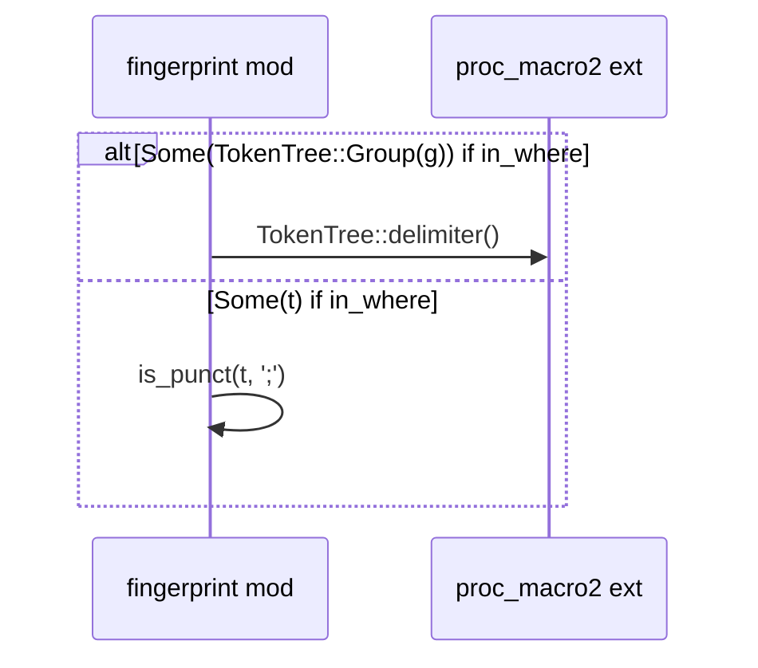

## `sym:cargo sealmap_rust . fingerprint/ignored_attr_len().`
`fn ignored_attr_len(trees: &[TokenTree]) -> Option<usize>` · L248-L270
> If `trees` starts with an ignored attribute (`#[doc = ..]`, `#![allow(..)]`, `#[clippy::x]`), the number of trees it spans.
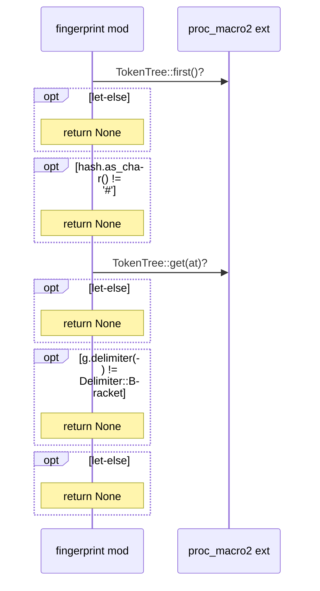
