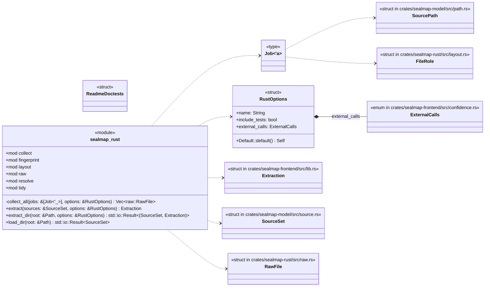
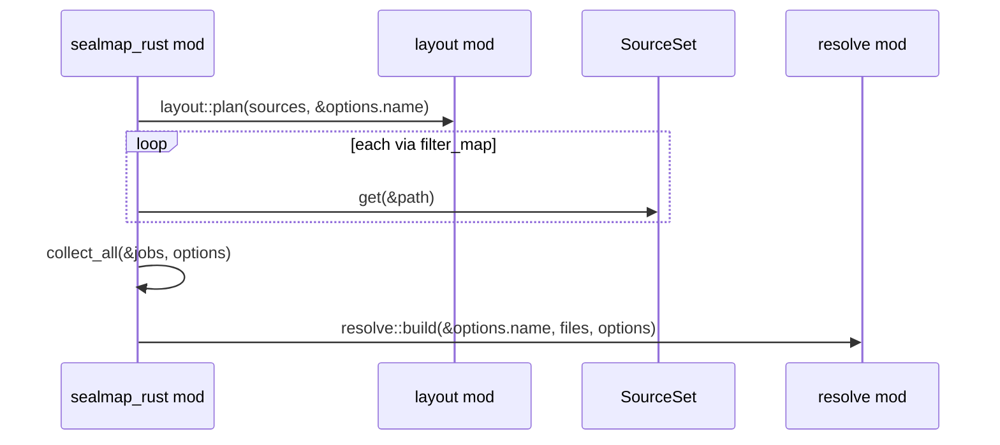
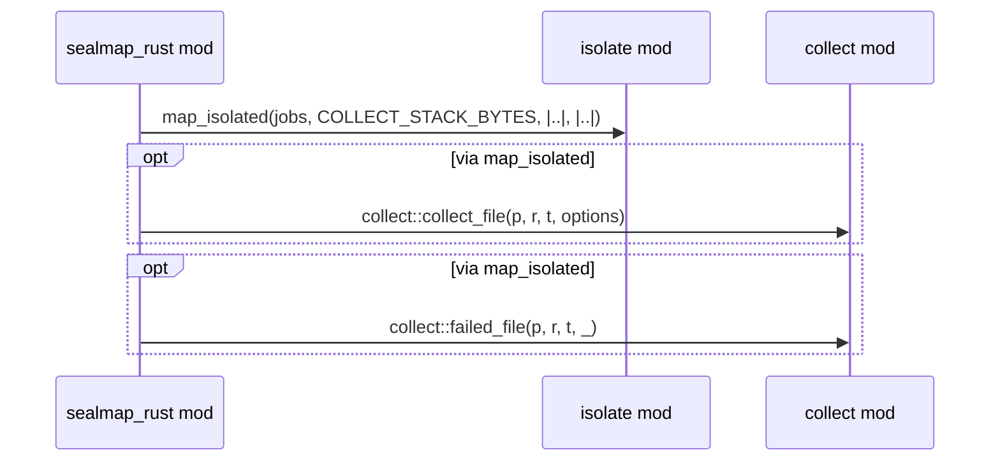
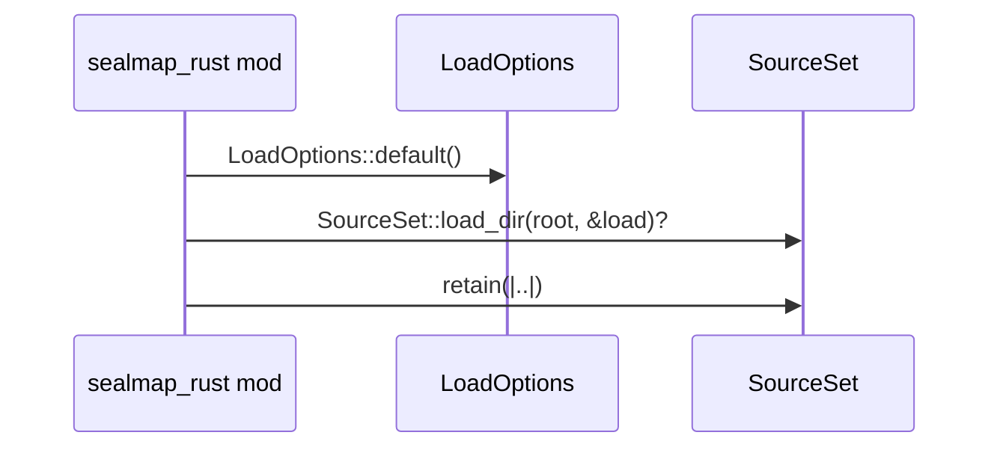
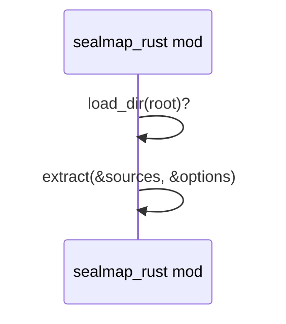

# `sym:cargo sealmap_rust .` · crates/sealmap-rust/src/lib.rs
> A pure-Rust frontend that turns Rust source into a [`sealmap_model::Codebase`]: modules, types, traits, functions and methods, the relations between them, and …

## structure

## `sym:cargo sealmap_rust . extract().`
`pub fn extract(sources: &SourceSet, options: &RustOptions) -> Extraction` · L148-L163
> Extract a [`Codebase`](sealmap_model::Codebase) from the `.rs` (and `Cargo.toml`) files in `sources`.

## `sym:cargo sealmap_rust . collect_all().`
`fn collect_all(jobs: &[Job<'_>], options: &RustOptions) -> Vec<raw::RawFile>` · L167-L177
> Pass 1 over every file, isolated per file (big stacks, panic guard; see [`sealmap_frontend::isolate`]).

## `sym:cargo sealmap_rust . load_dir().`
`pub fn load_dir(root: &Path) -> std::io::Result<SourceSet>` · L179-L187
> Load the `.rs` and `Cargo.toml` files under `root` (honouring `.gitignore`, skipping `target/`, hidden directories and the like) without extracting them.

## `sym:cargo sealmap_rust . extract_dir().`
`pub fn extract_dir(root: &Path, options: &RustOptions) -> std::io::Result<(SourceSet, Extraction)>` · L189-L205
> Load `root` from disk (`.rs` and `Cargo.toml` files, skipping `target/`, hidden directories and the like) and [`extract`] it.

