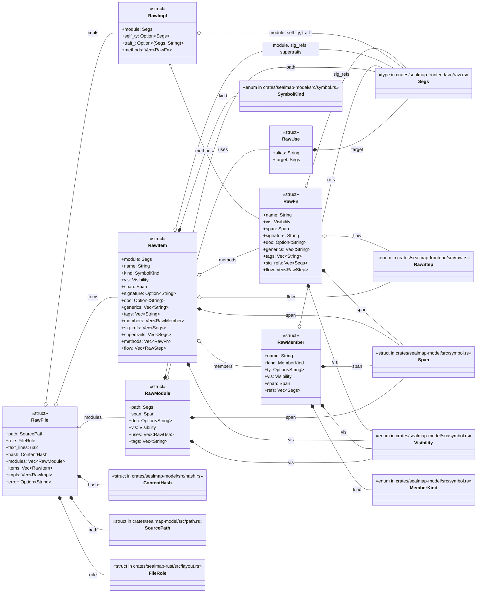

# `sealmap_rust::raw` · crates/sealmap-rust/src/raw.rs
> Pass-1 output: plain, unresolved data extracted from one file.

## structure

```mermaid
classDiagram
  direction LR
  class sealmap_rust__raw__RawFile["RawFile"] {
    <<struct>>
    +path: SourcePath
    +role: FileRole
    +text_lines: u32
    +hash: ContentHash
    +modules: Vec#lt;RawModule#gt;
    +items: Vec#lt;RawItem#gt;
    +impls: Vec#lt;RawImpl#gt;
    +error: Option#lt;String#gt;
  }
  class sealmap_rust__raw__RawFn["RawFn"] {
    <<struct>>
    +name: String
    +vis: Visibility
    +span: Span
    +signature: String
    +doc: Option#lt;String#gt;
    +generics: Vec#lt;String#gt;
    +tags: Vec#lt;String#gt;
    +sig_refs: Vec#lt;Segs#gt;
    +flow: Vec#lt;RawStep#gt;
  }
  class sealmap_rust__raw__RawImpl["RawImpl"] {
    <<struct>>
    +module: Segs
    +self_ty: Option#lt;Segs#gt;
    +trait_: Option#lt;#40;Segs, String#41;#gt;
    +methods: Vec#lt;RawFn#gt;
  }
  class sealmap_rust__raw__RawItem["RawItem"] {
    <<struct>>
    +module: Segs
    +name: String
    +kind: SymbolKind
    +vis: Visibility
    +span: Span
    +signature: Option#lt;String#gt;
    +doc: Option#lt;String#gt;
    +generics: Vec#lt;String#gt;
    +tags: Vec#lt;String#gt;
    +members: Vec#lt;RawMember#gt;
    +sig_refs: Vec#lt;Segs#gt;
    +supertraits: Vec#lt;Segs#gt;
    +methods: Vec#lt;RawFn#gt;
    +flow: Vec#lt;RawStep#gt;
  }
  class sealmap_rust__raw__RawMember["RawMember"] {
    <<struct>>
    +name: String
    +kind: MemberKind
    +ty: Option#lt;String#gt;
    +vis: Visibility
    +span: Span
    +refs: Vec#lt;Segs#gt;
  }
  class sealmap_rust__raw__RawModule["RawModule"] {
    <<struct>>
    +path: Segs
    +span: Span
    +doc: Option#lt;String#gt;
    +vis: Visibility
    +uses: Vec#lt;RawUse#gt;
    +tags: Vec#lt;String#gt;
  }
  class sealmap_rust__raw__RawUse["RawUse"] {
    <<struct>>
    +alias: String
    +target: Segs
  }
  class sealmap_model__hash__ContentHash["ContentHash"] {
    <<struct in crates/sealmap-model/src/hash.rs>>
  }
  class sealmap_model__path__SourcePath["SourcePath"] {
    <<struct in crates/sealmap-model/src/path.rs>>
  }
  class sealmap_rust__layout__FileRole["FileRole"] {
    <<struct in crates/sealmap-rust/src/layout.rs>>
  }
  class sealmap_frontend__raw__RawStep["RawStep"] {
    <<enum in crates/sealmap-frontend/src/raw.rs>>
  }
  class sealmap_frontend__raw__Segs["Segs"] {
    <<type in crates/sealmap-frontend/src/raw.rs>>
  }
  class sealmap_model__symbol__Span["Span"] {
    <<struct in crates/sealmap-model/src/symbol.rs>>
  }
  class sealmap_model__symbol__Visibility["Visibility"] {
    <<enum in crates/sealmap-model/src/symbol.rs>>
  }
  class sealmap_model__symbol__SymbolKind["SymbolKind"] {
    <<enum in crates/sealmap-model/src/symbol.rs>>
  }
  class sealmap_model__symbol__MemberKind["MemberKind"] {
    <<enum in crates/sealmap-model/src/symbol.rs>>
  }
  sealmap_rust__raw__RawFile *-- sealmap_model__hash__ContentHash : hash
  sealmap_rust__raw__RawFile *-- sealmap_model__path__SourcePath : path
  sealmap_rust__raw__RawFile *-- sealmap_rust__layout__FileRole : role
  sealmap_rust__raw__RawFile o-- sealmap_rust__raw__RawImpl : impls
  sealmap_rust__raw__RawFile o-- sealmap_rust__raw__RawItem : items
  sealmap_rust__raw__RawFile o-- sealmap_rust__raw__RawModule : modules
  sealmap_rust__raw__RawFn o-- sealmap_frontend__raw__RawStep : flow
  sealmap_rust__raw__RawFn o-- sealmap_frontend__raw__Segs : sig_refs
  sealmap_rust__raw__RawFn *-- sealmap_model__symbol__Span : span
  sealmap_rust__raw__RawFn *-- sealmap_model__symbol__Visibility : vis
  sealmap_rust__raw__RawImpl o-- sealmap_frontend__raw__Segs : module, self_ty, trait_
  sealmap_rust__raw__RawImpl o-- sealmap_rust__raw__RawFn : methods
  sealmap_rust__raw__RawItem o-- sealmap_frontend__raw__RawStep : flow
  sealmap_rust__raw__RawItem o-- sealmap_frontend__raw__Segs : module, sig_refs, supertraits
  sealmap_rust__raw__RawItem *-- sealmap_model__symbol__Span : span
  sealmap_rust__raw__RawItem *-- sealmap_model__symbol__SymbolKind : kind
  sealmap_rust__raw__RawItem *-- sealmap_model__symbol__Visibility : vis
  sealmap_rust__raw__RawItem o-- sealmap_rust__raw__RawFn : methods
  sealmap_rust__raw__RawItem o-- sealmap_rust__raw__RawMember : members
  sealmap_rust__raw__RawMember o-- sealmap_frontend__raw__Segs : refs
  sealmap_rust__raw__RawMember *-- sealmap_model__symbol__MemberKind : kind
  sealmap_rust__raw__RawMember *-- sealmap_model__symbol__Span : span
  sealmap_rust__raw__RawMember *-- sealmap_model__symbol__Visibility : vis
  sealmap_rust__raw__RawModule *-- sealmap_frontend__raw__Segs : path
  sealmap_rust__raw__RawModule *-- sealmap_model__symbol__Span : span
  sealmap_rust__raw__RawModule *-- sealmap_model__symbol__Visibility : vis
  sealmap_rust__raw__RawModule o-- sealmap_rust__raw__RawUse : uses
  sealmap_rust__raw__RawUse *-- sealmap_frontend__raw__Segs : target
```
