# `sealmap_rust::resolve` · crates/sealmap-rust/src/resolve.rs
> Pass 2: resolve raw paths against the whole workspace and build the model.

## structure
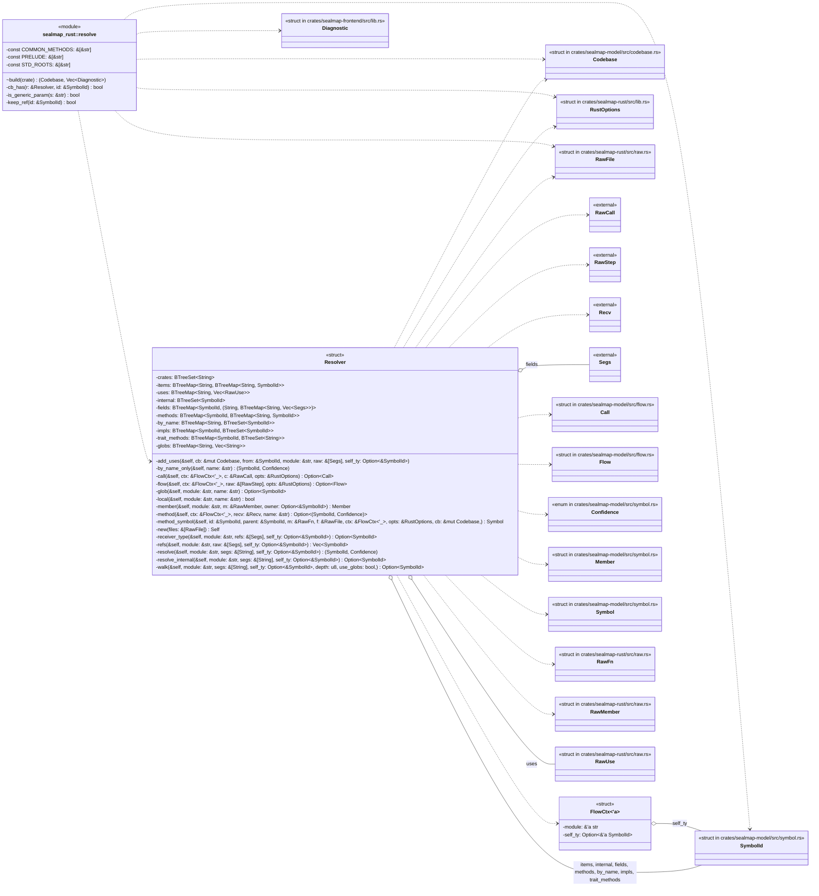

## `sealmap_rust::resolve::build`
`pub(crate) fn build(name: &str, files: Vec<RawFile>, opts: &RustOptions) -> (Codebase, Vec<Diagnostic>)` · L211-L315
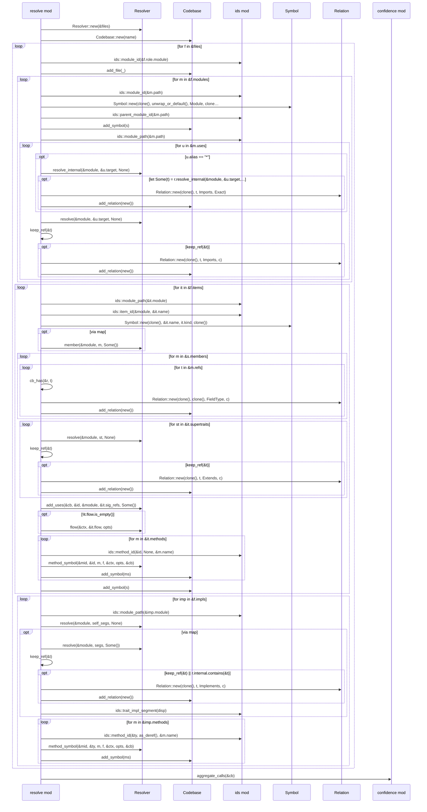

## `sealmap_rust::resolve::keep_ref`
`fn keep_ref(id: &SymbolId) -> bool` · L321-L325
> Keep a resolved reference as a relation target? Drops std and prelude.
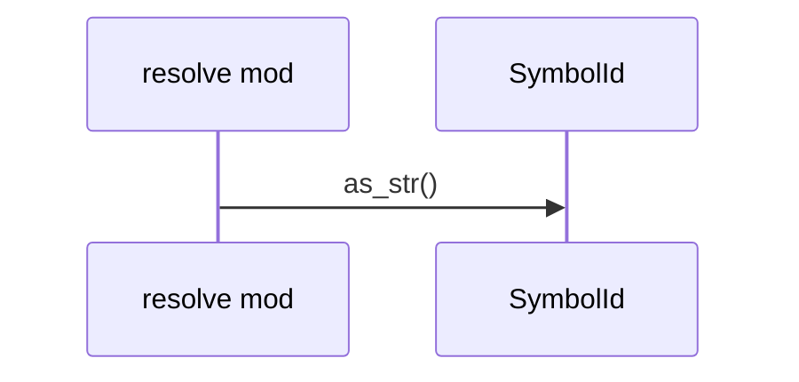

## `sealmap_rust::resolve::Resolver::new`
`fn new(files: &[RawFile]) -> Self` · L358-L453
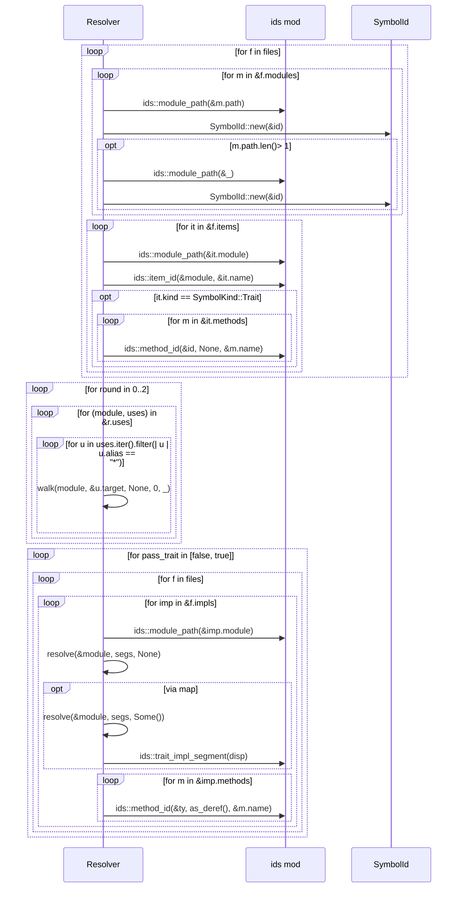

## `sealmap_rust::resolve::Resolver::resolve`
`fn resolve(&self, module: &str, segs: &[String], self_ty: Option<&SymbolId>) -> (SymbolId, Confidence)` · L455-L467
> Resolve `segs` as written in `module`.
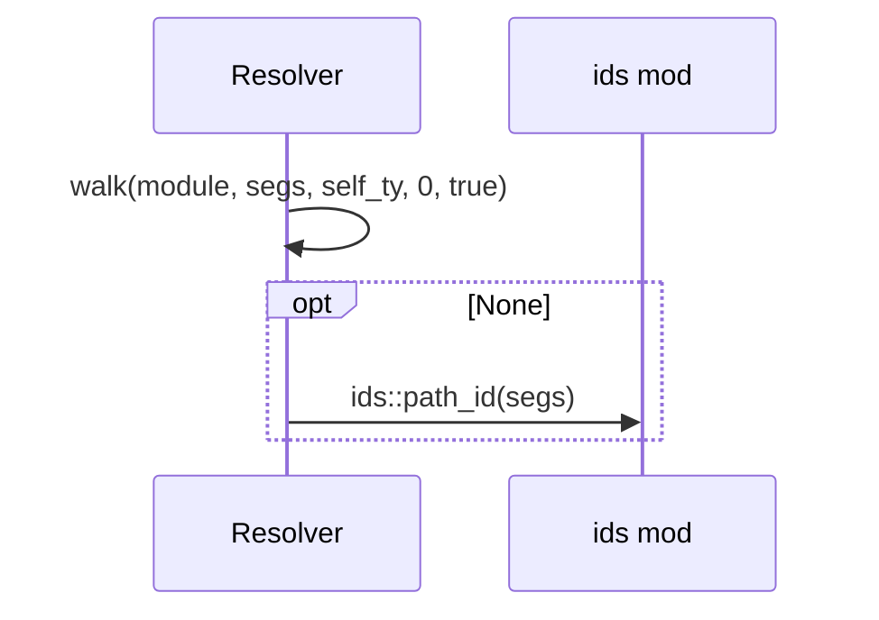

## `sealmap_rust::resolve::Resolver::resolve_internal`
`fn resolve_internal(&self, module: &str, segs: &[String], self_ty: Option<&SymbolId>) -> Option<SymbolId>` · L469-L471
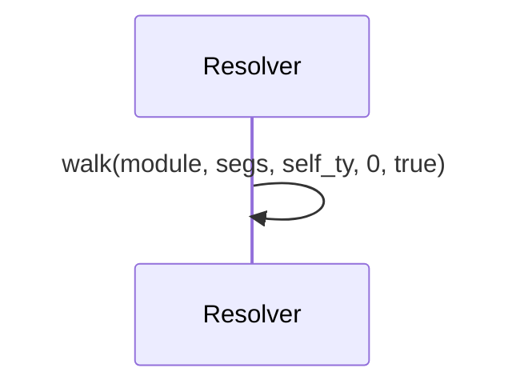

## `sealmap_rust::resolve::Resolver::walk`
`fn walk(&self, module: &str, segs: &[String], self_ty: Option<&SymbolId>, depth: u8, use_globs: bool,) -> Option<SymbolId>` · L473-L539
> `use_globs` is false only while the glob table itself is being built.
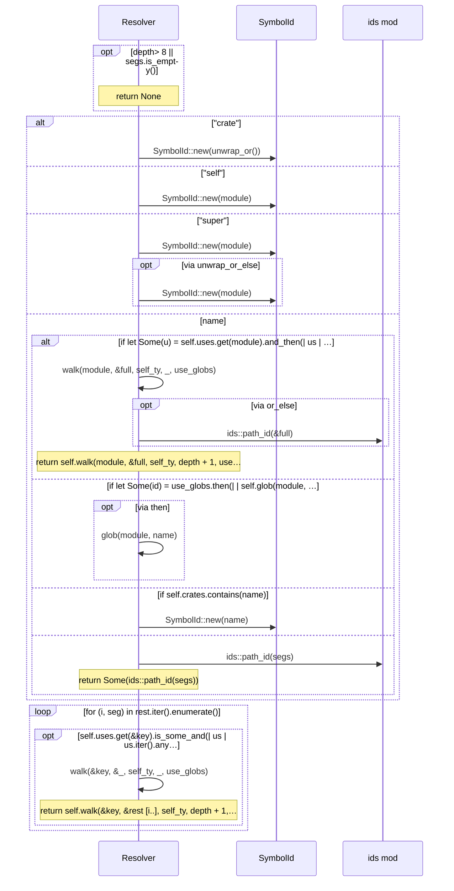

## `sealmap_rust::resolve::Resolver::refs`
`fn refs(&self, module: &str, raw: &[Segs], self_ty: Option<&SymbolId>) -> Vec<SymbolId>` · L562-L582
> Resolve a list of raw type refs to kept relation targets.
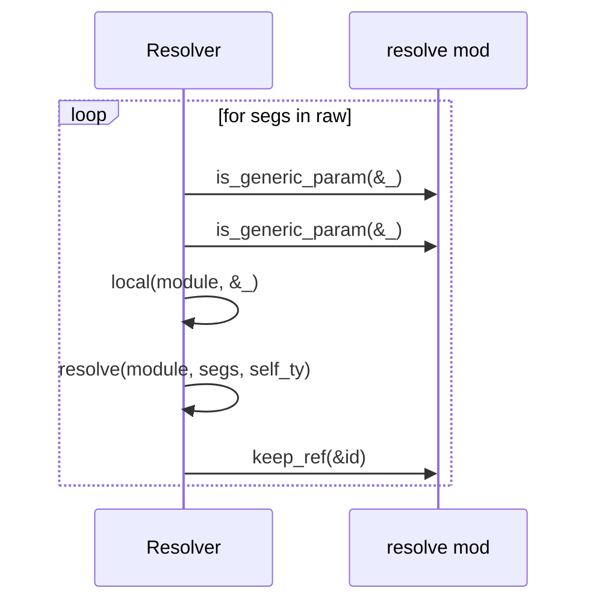

## `sealmap_rust::resolve::Resolver::member`
`fn member(&self, module: &str, m: &RawMember, owner: Option<&SymbolId>) -> Member` · L590-L599
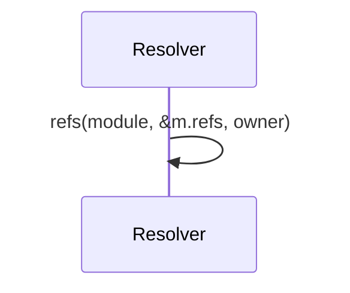

## `sealmap_rust::resolve::Resolver::add_uses`
`fn add_uses(&self, cb: &mut Codebase, from: &SymbolId, module: &str, raw: &[Segs], self_ty: Option<&SymbolId>)` · L601-L606
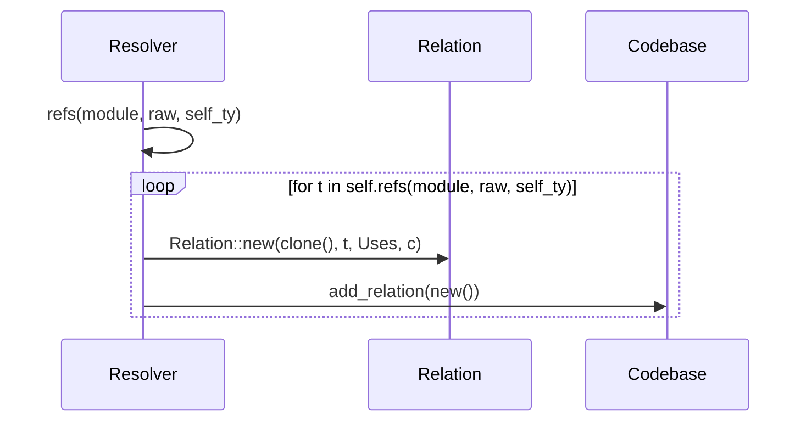

## `sealmap_rust::resolve::Resolver::method_symbol`
`fn method_symbol(&self, id: &SymbolId, parent: &SymbolId, m: &RawFn, f: &RawFile, ctx: &FlowCtx<'_>, opts: &RustOptions, cb: &mut Codebase,) -> Symbol` · L608-L632
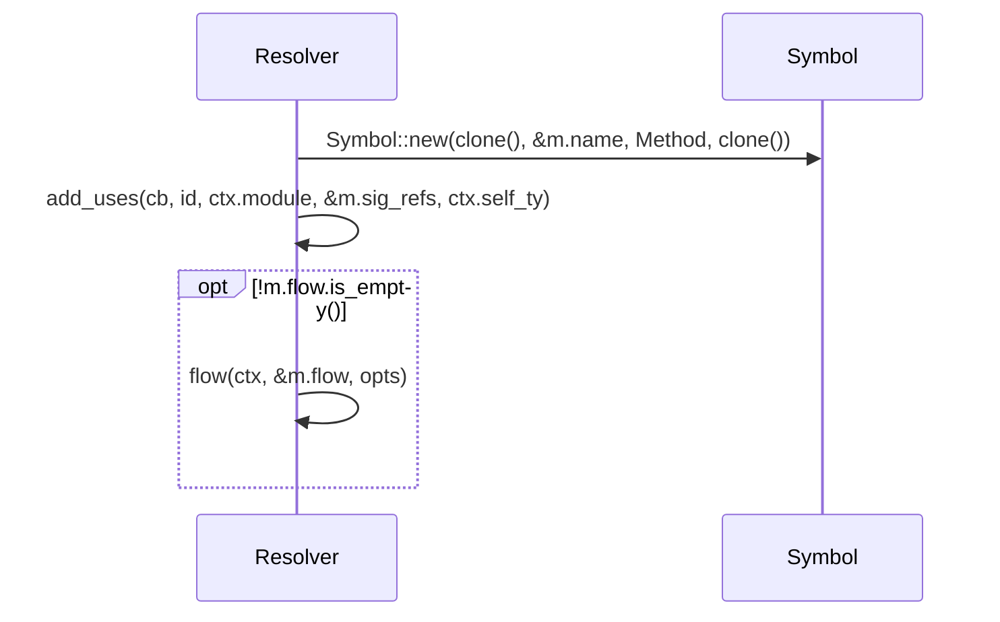

## `sealmap_rust::resolve::Resolver::flow`
`fn flow(&self, ctx: &FlowCtx<'_>, raw: &[RawStep], opts: &RustOptions) -> Option<Flow>` · L634-L636
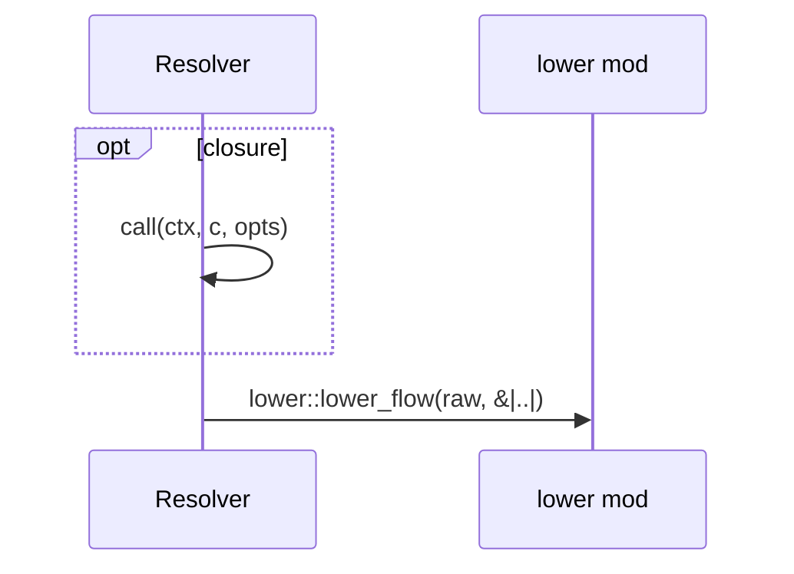

## `sealmap_rust::resolve::Resolver::call`
`fn call(&self, ctx: &FlowCtx<'_>, c: &RawCall, opts: &RustOptions) -> Option<Call>` · L638-L662
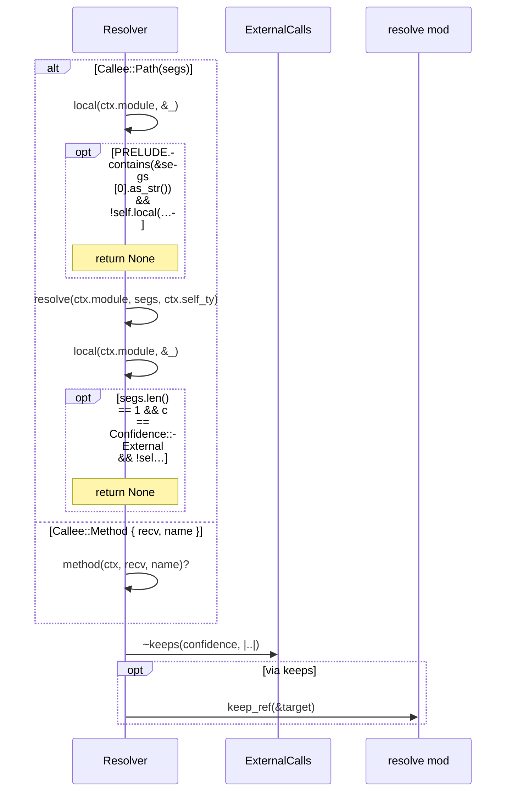

## `sealmap_rust::resolve::Resolver::method`
`fn method(&self, ctx: &FlowCtx<'_>, recv: &Recv, name: &str) -> Option<(SymbolId, Confidence)>` · L664-L695
> Resolve a method call.
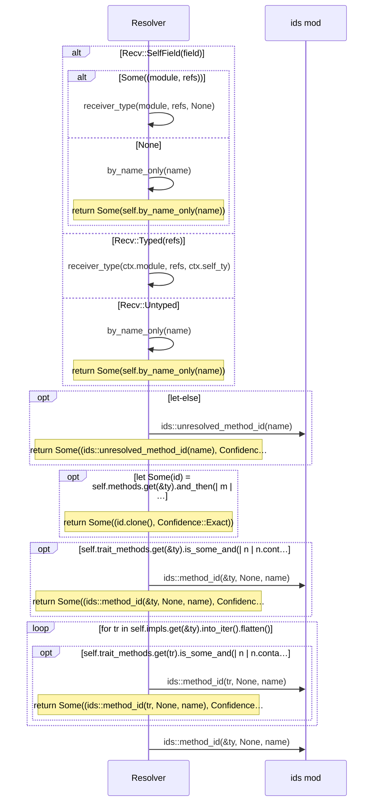

## `sealmap_rust::resolve::Resolver::receiver_type`
`fn receiver_type(&self, module: &str, refs: &[Segs], self_ty: Option<&SymbolId>) -> Option<SymbolId>` · L697-L715
> The type a method is called on, from the declared type's paths (outermost first).
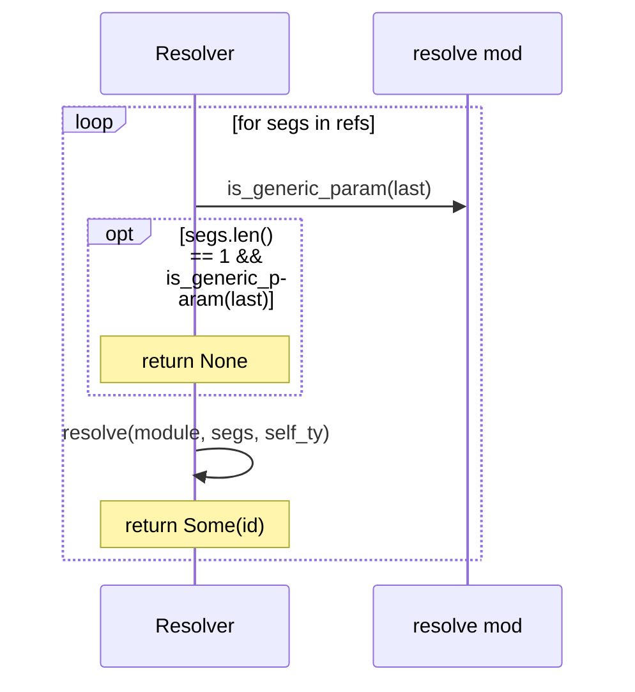

## `sealmap_rust::resolve::Resolver::by_name_only`
`fn by_name_only(&self, name: &str) -> (SymbolId, Confidence)` · L717-L728
> Unknown receiver: accept a unique, distinctive internal method name.
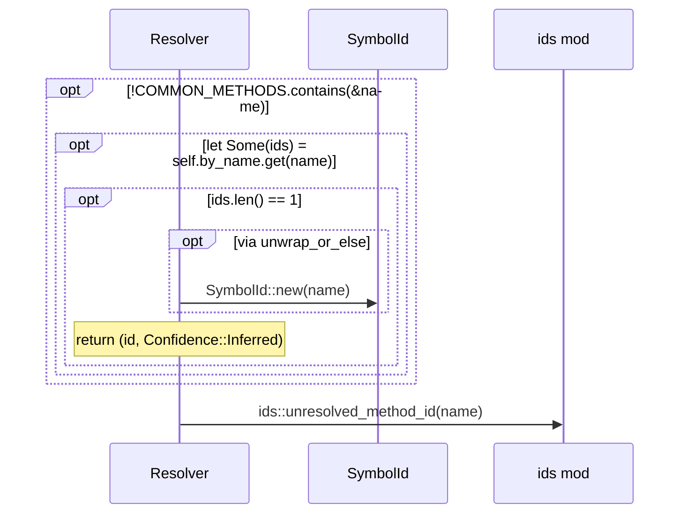
