# `sym:cargo sealmap_rust . resolve/` · crates/sealmap-rust/src/resolve.rs
> Pass 2: resolve raw paths against the whole workspace and build the model.

## structure
```mermaid
classDiagram
  direction LR
  class sealmap_rust__resolve___tFields["Fields"] {
    <<struct>>
    -module: SymbolId
    -params: Vec#lt;String#gt;
    -refs: BTreeMap#lt;String, Vec#lt;Segs#gt;#gt;
    -field(&self, name: &str) Option#lt;#40;&SymbolId, InScope#lt;'_#gt;, &[Segs]#41;#gt;
  }
  class sealmap_rust__resolve___tFlowCtx["FlowCtx#lt;'a#gt;"] {
    <<struct>>
    -module: &'a SymbolId
    -self_ty: Option#lt;&'a SymbolId#gt;
    -params: InScope#lt;'a#gt;
  }
  class sealmap_rust__resolve___tInScope["InScope#lt;'a#gt;"] {
    <<struct>>
    -enclosing: &'a [String]
    -own: &'a [String]
    -contains(&self, name: &str) bool
    -heads(&self, segs: &[String]) bool
    -of(own: &'a [String]) Self
    -with(self, own: &'a [String]) Self
  }
  class sealmap_rust__resolve___tNs["Ns"] {
    <<enum>>
    Type
    Value
  }
  class sealmap_rust__resolve___tResolver["Resolver"] {
    <<struct>>
    -crates: BTreeSet#lt;String#gt;
    -items: BTreeMap#lt;SymbolId, BTreeMap#lt;String, Slots#gt;#gt;
    -uses: BTreeMap#lt;SymbolId, Vec#lt;RawUse#gt;#gt;
    -internal: BTreeSet#lt;SymbolId#gt;
    -fields: BTreeMap#lt;SymbolId, Fields#gt;
    -methods: BTreeMap#lt;SymbolId, BTreeMap#lt;String, SymbolId#gt;#gt;
    -by_name: BTreeMap#lt;String, BTreeSet#lt;SymbolId#gt;#gt;
    -impls: BTreeMap#lt;SymbolId, BTreeSet#lt;SymbolId#gt;#gt;
    -trait_methods: BTreeMap#lt;SymbolId, BTreeSet#lt;String#gt;#gt;
    -globs: BTreeMap#lt;SymbolId, Vec#lt;SymbolId#gt;#gt;
    -add_uses(&self, cb: &mut Codebase, from: &SymbolId, module: &SymbolId, raw: &[Segs], self_ty: Option#lt;&SymbolId#gt;, params: InScope#lt;'_#gt;,)
    -by_name_only(&self, name: &str) #40;SymbolId, Confidence#41;
    -call(&self, ctx: &FlowCtx#lt;'_#gt;, c: &RawCall, opts: &RustOptions) Option#lt;Call#gt;
    -flow(&self, ctx: &FlowCtx#lt;'_#gt;, raw: &[RawStep], opts: &RustOptions) Option#lt;Flow#gt;
    -glob(&self, module: &SymbolId, name: &str, ns: Ns) Option#lt;SymbolId#gt;
    -internal_origin(&self, ctx: &FlowCtx#lt;'_#gt;, origin: &Recv) bool
    -item(&self, module: &SymbolId, name: &str, ns: Ns) Option#lt;&SymbolId#gt;
    -local(&self, module: &SymbolId, name: &str) bool
    -member(&self, module: &SymbolId, m: &RawMember, owner: Option#lt;&SymbolId#gt;, params: InScope#lt;'_#gt;) Member
    -method(&self, ctx: &FlowCtx#lt;'_#gt;, recv: &Recv, name: &str) Option#lt;#40;SymbolId, Confidence#41;#gt;
    -method_symbol(&self, id: &SymbolId, parent: &SymbolId, m: &RawFn, f: &RawFile, ctx: &FlowCtx#lt;'_#gt;, opts: &RustOptions, cb: &mut Codebase,) Symbol
    -new(files: &[RawFile]) Self
    -receiver_type(&self, module: &SymbolId, refs: &[Segs], self_ty: Option#lt;&SymbolId#gt;, params: InScope#lt;'_#gt;,) Option#lt;SymbolId#gt;
    -refs(&self, module: &SymbolId, raw: &[Segs], self_ty: Option#lt;&SymbolId#gt;, params: InScope#lt;'_#gt;) Vec#lt;SymbolId#gt;
    -resolve(&self, module: &SymbolId, segs: &[String], self_ty: Option#lt;&SymbolId#gt;, ns: Ns,) #40;SymbolId, Confidence#41;
    -resolve_in(&self, module: &SymbolId, segs: &[String], self_ty: Option#lt;&SymbolId#gt;, ns: Ns, params: InScope#lt;'_#gt;,) #40;SymbolId, Confidence#41;
    -resolve_internal(&self, module: &SymbolId, segs: &[String], self_ty: Option#lt;&SymbolId#gt;) Option#lt;SymbolId#gt;
    -walk(&self, module: &SymbolId, segs: &[String], self_ty: Option#lt;&SymbolId#gt;, ns: Ns, depth: u8, use_globs: bool,) Option#lt;SymbolId#gt;
  }
  class sealmap_rust__resolve___tSlots["Slots"] {
    <<struct>>
    -ty: Option#lt;SymbolId#gt;
    -value: Option#lt;SymbolId#gt;
    -get(&self, ns: Ns) Option#lt;&SymbolId#gt;
    -insert(&mut self, kind: SymbolKind, id: SymbolId)
  }
  class sealmap_rust__resolve["sealmap_rust::resolve"] {
    <<module>>
    -const COMMON_METHODS: &[&str]
    -const PRELUDE: &[&str]
    -const STD_ROOTS: &[&str]
    ~build(crate) #40;Codebase, Vec#lt;Diagnostic#gt;#41;
    -crate_package(krate: &str) Package
    -impl_method(module: &SymbolId, ty: &SymbolId, imp: &RawImpl, name: &str) SymbolId
    -keep_ref(id: &SymbolId) bool
    -module_sym(segments: &[String]) SymbolId
    -undefined_member(ty: &SymbolId, name: &str) SymbolId
  }
  class sealmap_extract___tDiagnostic["Diagnostic"] {
    <<struct in crates/sealmap-extract/src/lib.rs>>
  }
  class sealmap_model__codebase___tCodebase["Codebase"] {
    <<struct in crates/sealmap-model/src/codebase.rs>>
  }
  class sealmap_model__sym___tPackage["Package"] {
    <<struct in crates/sealmap-model/src/sym.rs>>
  }
  class sealmap_model__sym___tSymbolId["SymbolId"] {
    <<struct in crates/sealmap-model/src/sym.rs>>
  }
  class sealmap_rust___tRustOptions["RustOptions"] {
    <<struct in crates/sealmap-rust/src/lib.rs>>
  }
  class sealmap_rust__raw___tRawFile["RawFile"] {
    <<struct in crates/sealmap-rust/src/raw.rs>>
  }
  class sealmap_rust__raw___tRawImpl["RawImpl"] {
    <<struct in crates/sealmap-rust/src/raw.rs>>
  }
  class _Segs["Segs"] {
    <<external>>
  }
  class sealmap_model__flow___tCall["Call"] {
    <<struct in crates/sealmap-model/src/flow.rs>>
  }
  class sealmap_model__flow___tFlow["Flow"] {
    <<struct in crates/sealmap-model/src/flow.rs>>
  }
  class sealmap_model__symbol___tConfidence["Confidence"] {
    <<enum in crates/sealmap-model/src/symbol.rs>>
  }
  class sealmap_model__symbol___tMember["Member"] {
    <<struct in crates/sealmap-model/src/symbol.rs>>
  }
  class sealmap_model__symbol___tSymbol["Symbol"] {
    <<struct in crates/sealmap-model/src/symbol.rs>>
  }
  class sealmap_rust__raw___tRawFn["RawFn"] {
    <<struct in crates/sealmap-rust/src/raw.rs>>
  }
  class sealmap_rust__raw___tRawMember["RawMember"] {
    <<struct in crates/sealmap-rust/src/raw.rs>>
  }
  class sealmap_rust__raw___tRawUse["RawUse"] {
    <<struct in crates/sealmap-rust/src/raw.rs>>
  }
  class _RawCall["RawCall"] {
    <<external>>
  }
  class _RawStep["RawStep"] {
    <<external>>
  }
  class _Recv["Recv"] {
    <<external>>
  }
  class sealmap_model__symbol___tSymbolKind["SymbolKind"] {
    <<enum in crates/sealmap-model/src/symbol.rs>>
  }
  sealmap_rust__resolve ..> sealmap_extract___tDiagnostic
  sealmap_rust__resolve ..> sealmap_model__codebase___tCodebase
  sealmap_rust__resolve ..> sealmap_model__sym___tPackage
  sealmap_rust__resolve ..> sealmap_model__sym___tSymbolId
  sealmap_rust__resolve ..> sealmap_rust___tRustOptions
  sealmap_rust__resolve ..> sealmap_rust__raw___tRawFile
  sealmap_rust__resolve ..> sealmap_rust__raw___tRawImpl
  sealmap_rust__resolve___tFields *-- sealmap_model__sym___tSymbolId : module
  sealmap_rust__resolve___tFields ..> sealmap_rust__resolve___tInScope
  sealmap_rust__resolve___tFields o-- _Segs : refs
  sealmap_rust__resolve___tFlowCtx o-- sealmap_model__sym___tSymbolId : module, self_ty
  sealmap_rust__resolve___tFlowCtx *-- sealmap_rust__resolve___tInScope : params
  sealmap_rust__resolve___tResolver ..> sealmap_model__codebase___tCodebase
  sealmap_rust__resolve___tResolver ..> sealmap_model__flow___tCall
  sealmap_rust__resolve___tResolver ..> sealmap_model__flow___tFlow
  sealmap_rust__resolve___tResolver o-- sealmap_model__sym___tSymbolId : items, uses, internal, fields, methods, by_name, impls, trait_methods, globs
  sealmap_rust__resolve___tResolver ..> sealmap_model__symbol___tConfidence
  sealmap_rust__resolve___tResolver ..> sealmap_model__symbol___tMember
  sealmap_rust__resolve___tResolver ..> sealmap_model__symbol___tSymbol
  sealmap_rust__resolve___tResolver ..> sealmap_rust___tRustOptions
  sealmap_rust__resolve___tResolver ..> sealmap_rust__raw___tRawFile
  sealmap_rust__resolve___tResolver ..> sealmap_rust__raw___tRawFn
  sealmap_rust__resolve___tResolver ..> sealmap_rust__raw___tRawMember
  sealmap_rust__resolve___tResolver o-- sealmap_rust__raw___tRawUse : uses
  sealmap_rust__resolve___tResolver o-- sealmap_rust__resolve___tFields : fields
  sealmap_rust__resolve___tResolver ..> sealmap_rust__resolve___tFlowCtx
  sealmap_rust__resolve___tResolver ..> sealmap_rust__resolve___tInScope
  sealmap_rust__resolve___tResolver ..> sealmap_rust__resolve___tNs
  sealmap_rust__resolve___tResolver o-- sealmap_rust__resolve___tSlots : items
  sealmap_rust__resolve___tResolver ..> _RawCall
  sealmap_rust__resolve___tResolver ..> _RawStep
  sealmap_rust__resolve___tResolver ..> _Recv
  sealmap_rust__resolve___tResolver ..> _Segs
  sealmap_rust__resolve___tSlots o-- sealmap_model__sym___tSymbolId : ty, value
  sealmap_rust__resolve___tSlots ..> sealmap_model__symbol___tSymbolKind
  sealmap_rust__resolve___tSlots ..> sealmap_rust__resolve___tNs
```

## `sym:cargo sealmap_rust . resolve/build().`
`pub(crate) fn build(name: &str, files: Vec<RawFile>, opts: &RustOptions) -> (Codebase, Vec<Diagnostic>)` · L212-L320
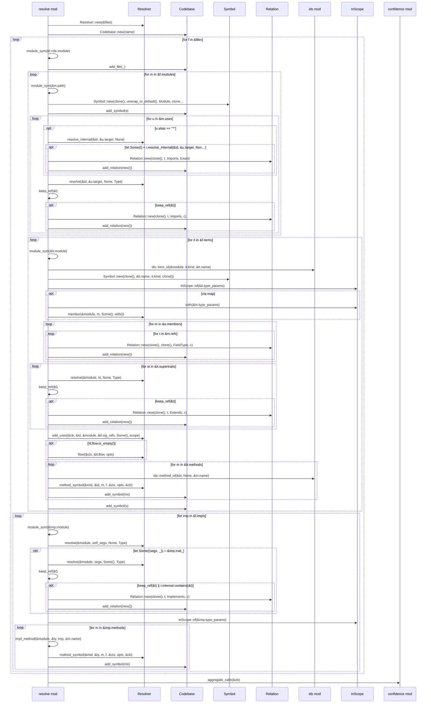

## `sym:cargo sealmap_rust . resolve/module_sym().`
`fn module_sym(segments: &[String]) -> SymbolId` · L322-L327
> The id of the module at `segments` (crate name first), in the `cargo` package named by the crate.
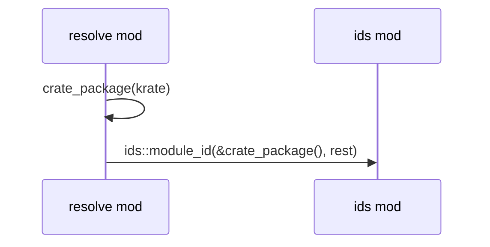

## `sym:cargo sealmap_rust . resolve/crate_package().`
`fn crate_package(krate: &str) -> Package` · L329-L331
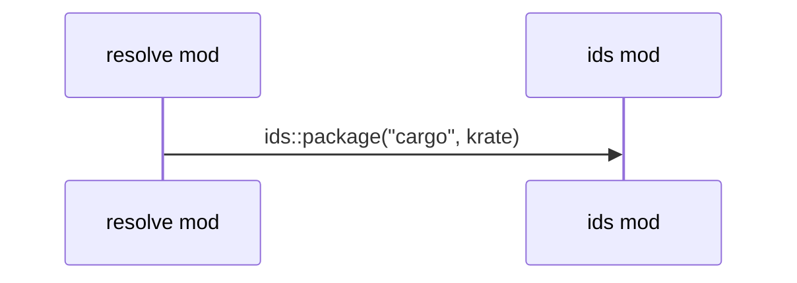

## `sym:cargo sealmap_rust . resolve/impl_method().`
`fn impl_method(module: &SymbolId, ty: &SymbolId, imp: &RawImpl, name: &str) -> SymbolId` · L333-L339
> The id of method `name` from impl block `imp` whose self type resolved to `ty`.
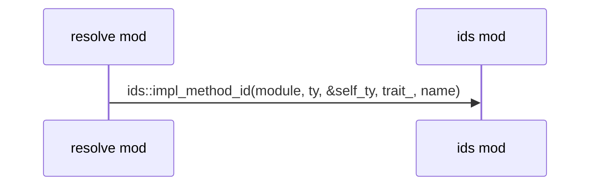

## `sym:cargo sealmap_rust . resolve/undefined_member().`
`fn undefined_member(ty: &SymbolId, name: &str) -> SymbolId` · L341-L345
> The id of member `name` of `ty` when the codebase does not define it: a method under a global type, or the path extended by the name.
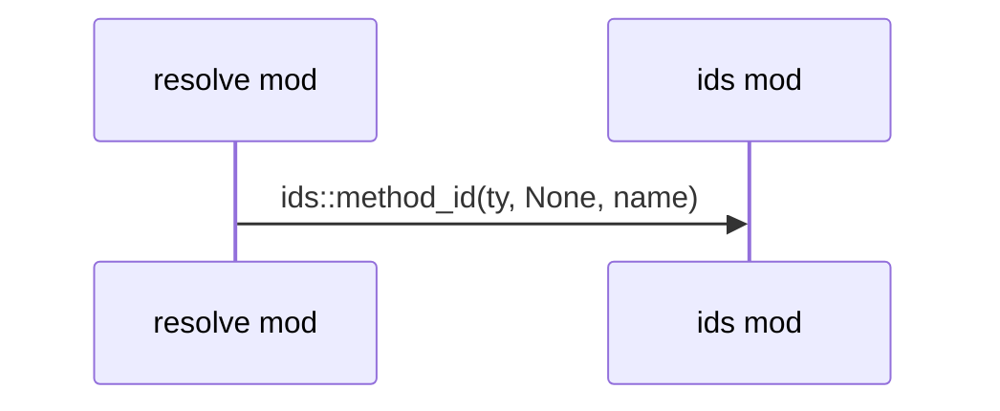

## `sym:cargo sealmap_rust . resolve/keep_ref().`
`fn keep_ref(id: &SymbolId) -> bool` · L347-L352
> Keep a resolved reference as a relation target? Drops std and prelude.
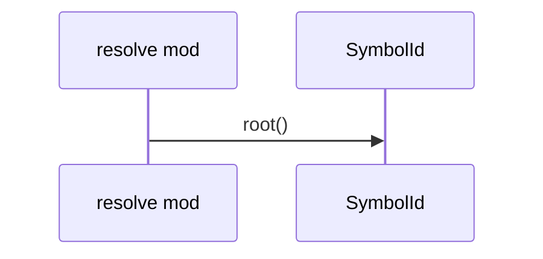

## `sym:cargo sealmap_rust . resolve/InScope#heads().`
`fn heads(&self, segs: &[String]) -> bool` · L429-L432
> Does `segs` start at a generic parameter (`T`, `T::Output`)?
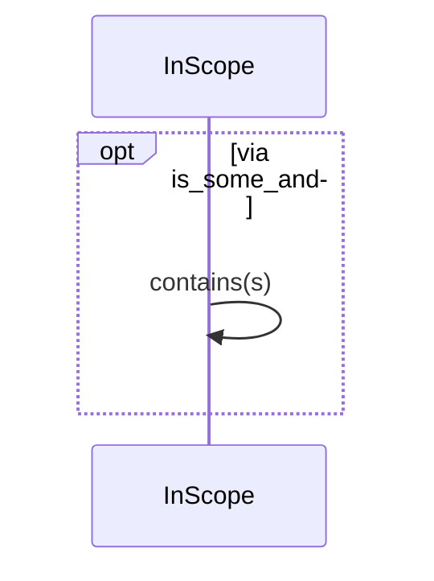

## `sym:cargo sealmap_rust . resolve/Fields#field().`
`fn field(&self, name: &str) -> Option<(&SymbolId, InScope<'_>, &[Segs])>` · L443-L446
> The module, generic scope and raw refs of field `name`.
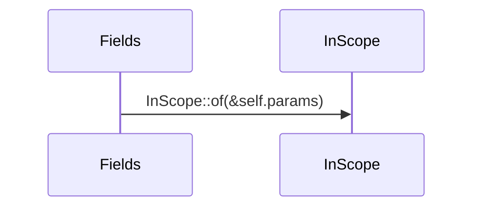

## `sym:cargo sealmap_rust . resolve/Resolver#new().`
`fn new(files: &[RawFile]) -> Self` · L476-L572
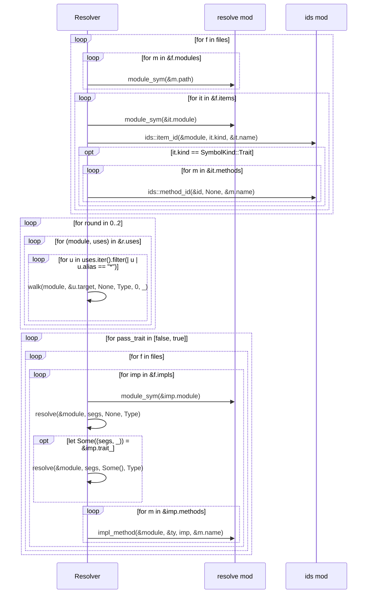

## `sym:cargo sealmap_rust . resolve/Resolver#resolve().`
`fn resolve(&self, module: &SymbolId, segs: &[String], self_ty: Option<&SymbolId>, ns: Ns,) -> (SymbolId, Confidence)` · L574-L593
> Resolve `segs` as written in `module`, looking the final segment up in `ns` first.
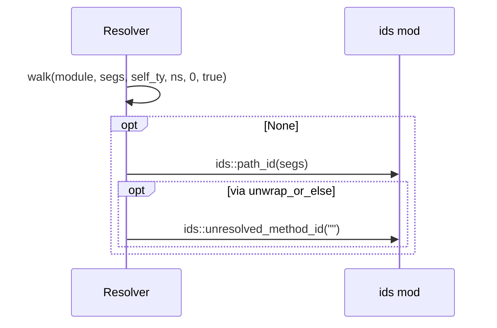

## `sym:cargo sealmap_rust . resolve/Resolver#resolve_in().`
`fn resolve_in(&self, module: &SymbolId, segs: &[String], self_ty: Option<&SymbolId>, ns: Ns, params: InScope<'_>,) -> (SymbolId, Confidence)` · L595-L611
> [`Self::resolve`] for a path written where the generic parameters `params` are in scope.
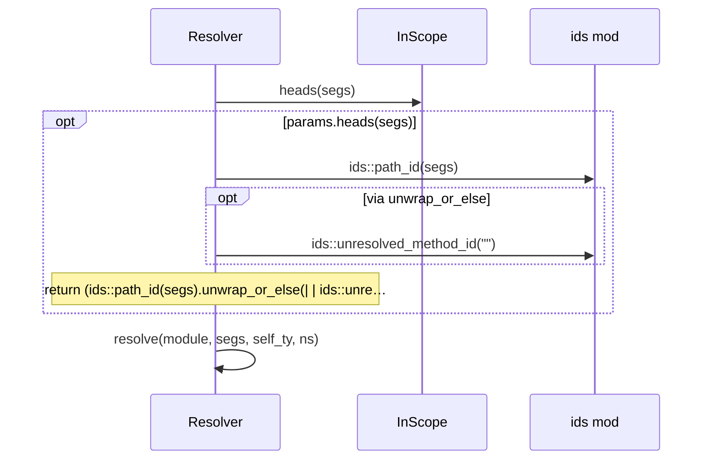

## `sym:cargo sealmap_rust . resolve/Resolver#resolve_internal().`
`fn resolve_internal(&self, module: &SymbolId, segs: &[String], self_ty: Option<&SymbolId>) -> Option<SymbolId>` · L613-L615
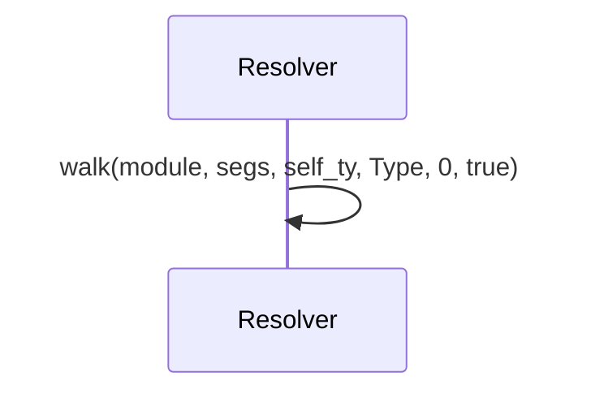

## `sym:cargo sealmap_rust . resolve/Resolver#walk().`
`fn walk(&self, module: &SymbolId, segs: &[String], self_ty: Option<&SymbolId>, ns: Ns, depth: u8, use_globs: bool,) -> Option<SymbolId>` · L622-L703
> `use_globs` is false only while the glob table itself is being built.
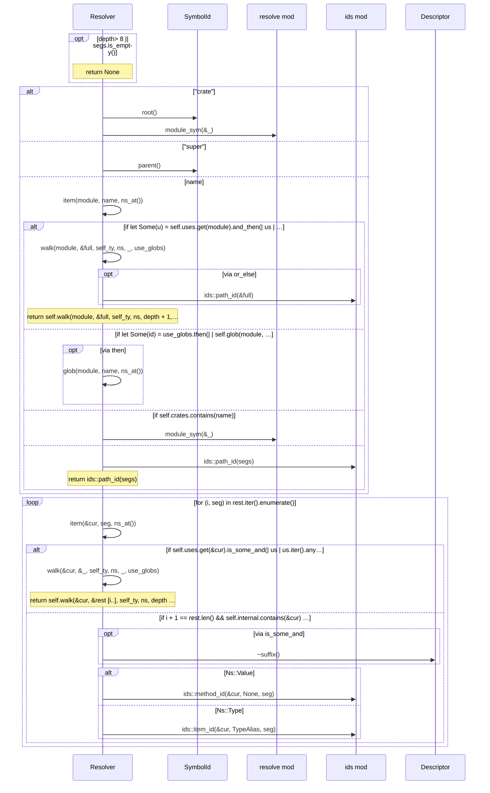

## `sym:cargo sealmap_rust . resolve/Resolver#glob().`
`fn glob(&self, module: &SymbolId, name: &str, ns: Ns) -> Option<SymbolId>` · L705-L724
> Find `name` through `module`'s glob imports, following glob chains (`pub use inner::*` re-exports) breadth-first.
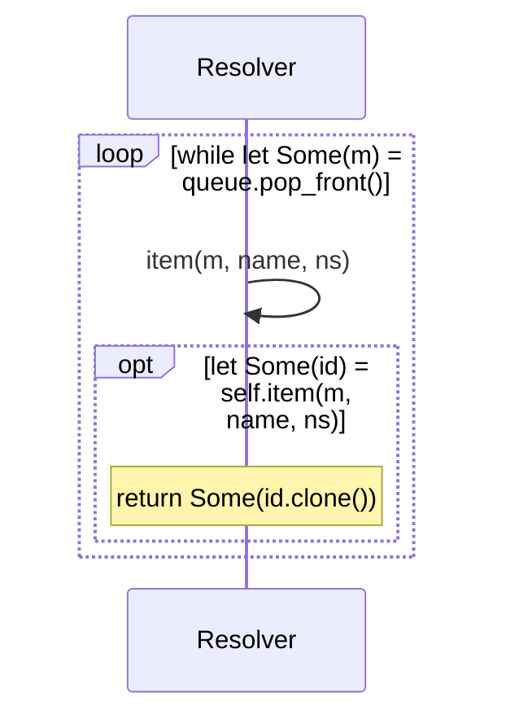

## `sym:cargo sealmap_rust . resolve/Resolver#refs().`
`fn refs(&self, module: &SymbolId, raw: &[Segs], self_ty: Option<&SymbolId>, params: InScope<'_>) -> Vec<SymbolId>` · L726-L744
> Resolve a list of raw type refs to kept relation targets.
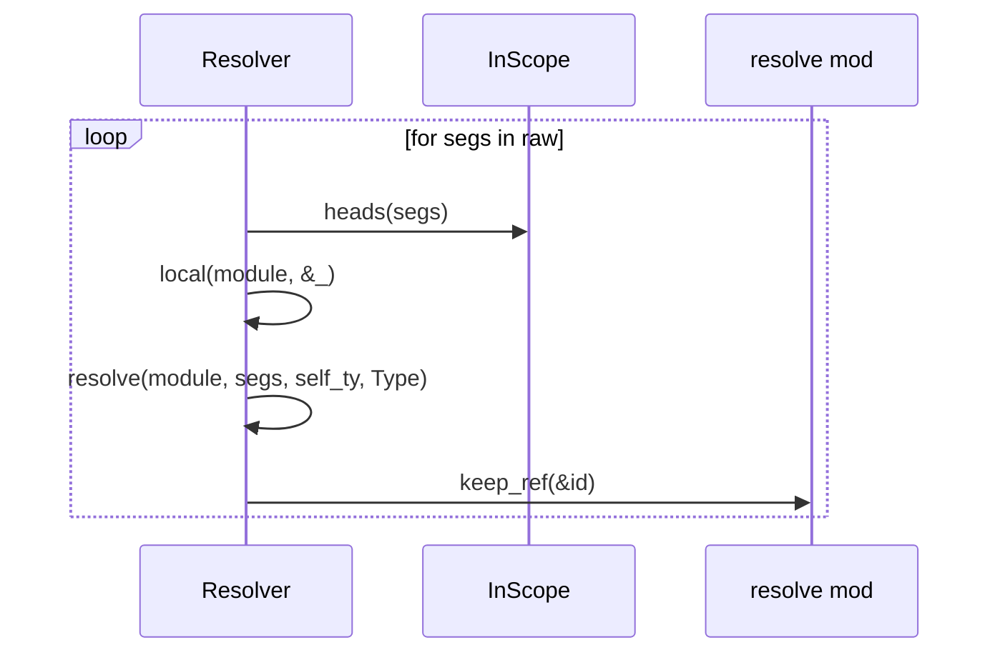

## `sym:cargo sealmap_rust . resolve/Resolver#member().`
`fn member(&self, module: &SymbolId, m: &RawMember, owner: Option<&SymbolId>, params: InScope<'_>) -> Member` · L752-L761
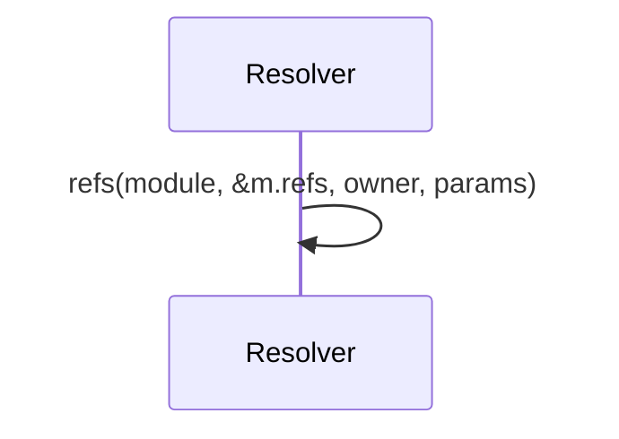

## `sym:cargo sealmap_rust . resolve/Resolver#add_uses().`
`fn add_uses(&self, cb: &mut Codebase, from: &SymbolId, module: &SymbolId, raw: &[Segs], self_ty: Option<&SymbolId>, params: InScope<'_>,)` · L763-L776
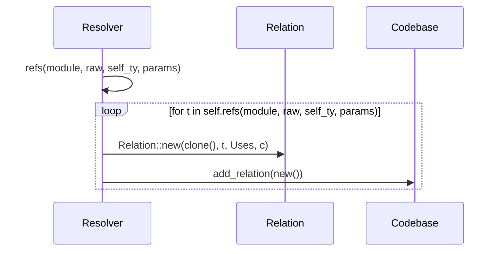

## `sym:cargo sealmap_rust . resolve/Resolver#method_symbol().`
`fn method_symbol(&self, id: &SymbolId, parent: &SymbolId, m: &RawFn, f: &RawFile, ctx: &FlowCtx<'_>, opts: &RustOptions, cb: &mut Codebase,) -> Symbol` · L778-L805
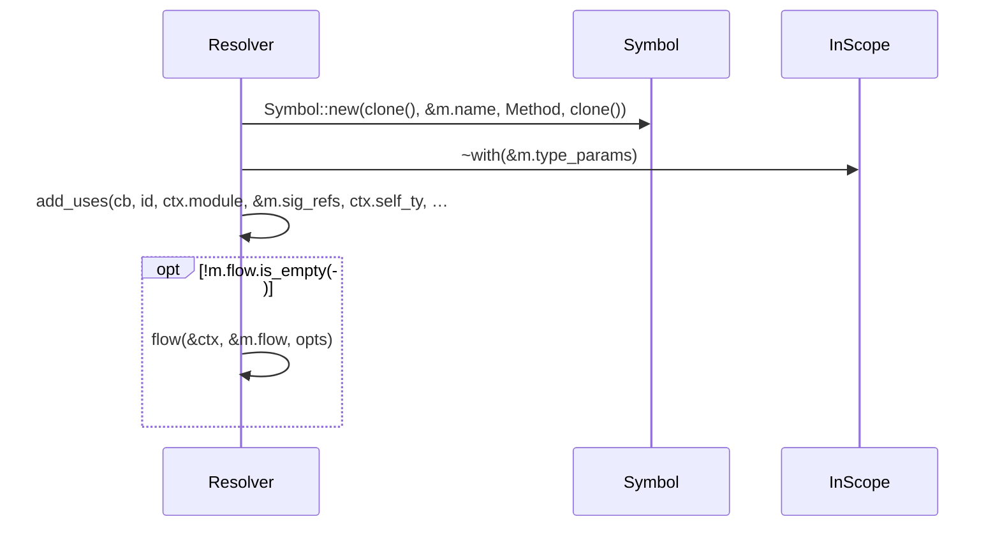

## `sym:cargo sealmap_rust . resolve/Resolver#flow().`
`fn flow(&self, ctx: &FlowCtx<'_>, raw: &[RawStep], opts: &RustOptions) -> Option<Flow>` · L807-L809
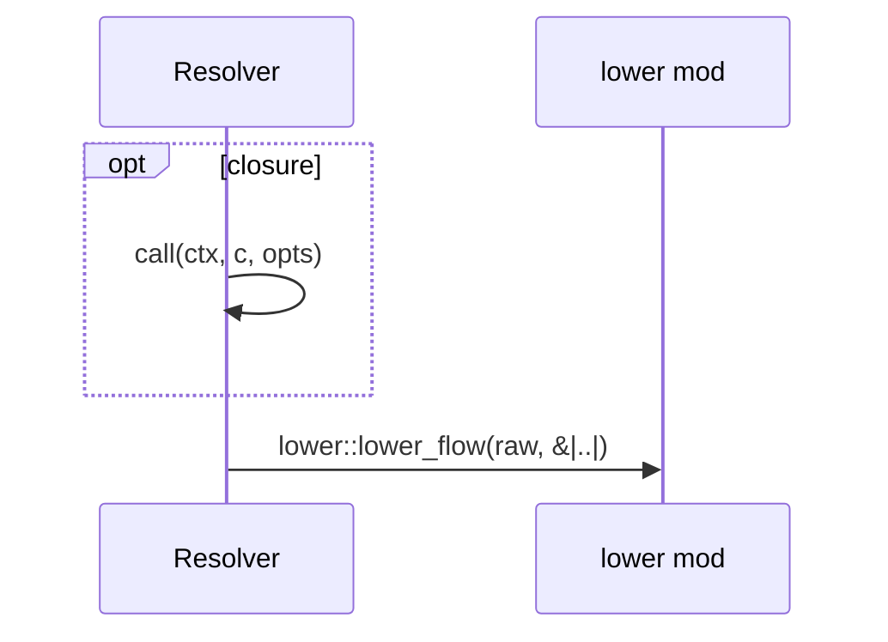

## `sym:cargo sealmap_rust . resolve/Resolver#call().`
`fn call(&self, ctx: &FlowCtx<'_>, c: &RawCall, opts: &RustOptions) -> Option<Call>` · L811-L836
```mermaid
sequenceDiagram
  participant sealmap_rust__resolve___tResolver as Resolver
  participant sealmap_extract__confidence___tExternalCalls as ExternalCalls
  participant sealmap_rust__resolve as resolve mod
  alt Callee::Path(segs)
    sealmap_rust__resolve___tResolver->>sealmap_rust__resolve___tResolver: local(ctx.module, &_)
    opt PRELUDE.contains(&segs [0].as_str()) && !self.local(…
      Note over sealmap_rust__resolve___tResolver: return None
    end
    sealmap_rust__resolve___tResolver->>sealmap_rust__resolve___tResolver: resolve_in(ctx.module, segs, ctx.self_ty, Value, ctx.pa…
    sealmap_rust__resolve___tResolver->>sealmap_rust__resolve___tResolver: local(ctx.module, &_)
    opt segs.len() == 1 && c == Confidence::External && !sel…
      Note over sealmap_rust__resolve___tResolver: return None
    end
  else Callee::Method { recv, name }
    sealmap_rust__resolve___tResolver->>sealmap_rust__resolve___tResolver: method(ctx, recv, name)?
  end
  sealmap_rust__resolve___tResolver->>sealmap_extract__confidence___tExternalCalls: ~keeps(confidence, |..|)
  opt via keeps
    sealmap_rust__resolve___tResolver->>sealmap_rust__resolve: keep_ref(&target)
  end
```

## `sym:cargo sealmap_rust . resolve/Resolver#method().`
`fn method(&self, ctx: &FlowCtx<'_>, recv: &Recv, name: &str) -> Option<(SymbolId, Confidence)>` · L838-L873
> Resolve a method call.
```mermaid
sequenceDiagram
  participant sealmap_rust__resolve___tResolver as Resolver
  participant sealmap_extract__ids as ids mod
  participant sealmap_rust__resolve as resolve mod
  alt Recv::SelfField(field)
    alt Some((module, params, refs))
      sealmap_rust__resolve___tResolver->>sealmap_rust__resolve___tResolver: receiver_type(module, refs, None, params)
    else None
      sealmap_rust__resolve___tResolver->>sealmap_rust__resolve___tResolver: by_name_only(name)
      Note over sealmap_rust__resolve___tResolver: return Some(self.by_name_only(name))
    end
  else Recv::Typed(refs)
    sealmap_rust__resolve___tResolver->>sealmap_rust__resolve___tResolver: receiver_type(ctx.module, refs, ctx.self_ty, ctx.params)
  else Recv::Untyped
    sealmap_rust__resolve___tResolver->>sealmap_rust__resolve___tResolver: by_name_only(name)
    Note over sealmap_rust__resolve___tResolver: return Some(self.by_name_only(name))
  else Recv::Derived(origin)
    sealmap_rust__resolve___tResolver->>sealmap_rust__resolve___tResolver: internal_origin(ctx, origin)
    alt self.internal_origin(ctx, origin)
      sealmap_rust__resolve___tResolver->>sealmap_rust__resolve___tResolver: by_name_only(name)
    else
      sealmap_rust__resolve___tResolver->>sealmap_extract__ids: ids::unresolved_method_id(name)
    end
    Note over sealmap_rust__resolve___tResolver: return Some(if self.internal_origin(ctx, origin) { self…
  end
  opt let-else
    sealmap_rust__resolve___tResolver->>sealmap_extract__ids: ids::unresolved_method_id(name)
    Note over sealmap_rust__resolve___tResolver: return Some((ids::unresolved_method_id(name), Confidenc…
  end
  opt let Some(id) = self.methods.get(&ty).and_then(| m | …
    Note over sealmap_rust__resolve___tResolver: return Some((id.clone(), Confidence::Exact))
  end
  opt self.trait_methods.get(&ty).is_some_and(| n | n.cont…
    sealmap_rust__resolve___tResolver->>sealmap_extract__ids: ids::method_id(&ty, None, name)
    Note over sealmap_rust__resolve___tResolver: return Some((ids::method_id(&ty, None, name), Confidenc…
  end
  loop for tr in self.impls.get(&ty).into_iter().flatten()
    opt self.trait_methods.get(tr).is_some_and(| n | n.conta…
      sealmap_rust__resolve___tResolver->>sealmap_extract__ids: ids::method_id(tr, None, name)
      Note over sealmap_rust__resolve___tResolver: return Some((ids::method_id(tr, None, name), Confidence…
    end
  end
  sealmap_rust__resolve___tResolver->>sealmap_rust__resolve: undefined_member(&ty, name)
```

## `sym:cargo sealmap_rust . resolve/Resolver#internal_origin().`
`fn internal_origin(&self, ctx: &FlowCtx<'_>, origin: &Recv) -> bool` · L875-L897
> Does a [`Recv::Derived`] value come from code in the analysed codebase? `self`, a field or typed value whose type mentions an internal type, an internal functi…
```mermaid
sequenceDiagram
  participant sealmap_rust__resolve___tResolver as Resolver
  opt closure
    loop each via any
      sealmap_rust__resolve___tResolver->>sealmap_rust__resolve___tResolver: resolve_in(module, segs, self_ty, Type, params)
    end
  end
  alt Recv::Returned(segs)
    sealmap_rust__resolve___tResolver->>sealmap_rust__resolve___tResolver: resolve_in(ctx.module, segs, ctx.self_ty, Value, ctx.pa…
  else Recv::Derived(inner) | Recv::Computed(inner)
    sealmap_rust__resolve___tResolver->>sealmap_rust__resolve___tResolver: internal_origin(ctx, inner)
  end
```

## `sym:cargo sealmap_rust . resolve/Resolver#receiver_type().`
`fn receiver_type(&self, module: &SymbolId, refs: &[Segs], self_ty: Option<&SymbolId>, params: InScope<'_>,) -> Option<SymbolId>` · L899-L924
> The type a method is called on, from the declared type's paths (outermost first).
```mermaid
sequenceDiagram
  participant sealmap_rust__resolve___tResolver as Resolver
  participant sealmap_rust__resolve___tInScope as InScope
  loop for segs in refs
    sealmap_rust__resolve___tResolver->>sealmap_rust__resolve___tInScope: contains(last)
    opt segs.len() == 1 && params.contains(last)
      Note over sealmap_rust__resolve___tResolver: return None
    end
    sealmap_rust__resolve___tResolver->>sealmap_rust__resolve___tResolver: resolve_in(module, segs, self_ty, Type, params)
    Note over sealmap_rust__resolve___tResolver: return Some(id)
  end
```

## `sym:cargo sealmap_rust . resolve/Resolver#by_name_only().`
`fn by_name_only(&self, name: &str) -> (SymbolId, Confidence)` · L926-L938
> Unknown receiver: accept a unique, distinctive internal method name.
```mermaid
sequenceDiagram
  participant sealmap_rust__resolve___tResolver as Resolver
  participant sealmap_extract__ids as ids mod
  opt !COMMON_METHODS.contains(&name)
    opt let Some(ids) = self.by_name.get(name)
      opt ids.len() == 1
        opt let Some(id) = ids.iter().next()
          Note over sealmap_rust__resolve___tResolver: return (id.clone(), Confidence::Inferred)
        end
      end
    end
  end
  sealmap_rust__resolve___tResolver->>sealmap_extract__ids: ids::unresolved_method_id(name)
```
