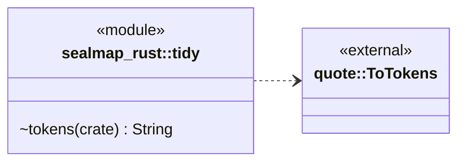
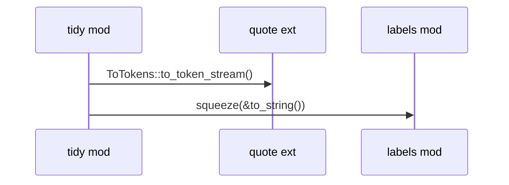

# `sym:cargo sealmap_rust . tidy/` · crates/sealmap-rust/src/tidy.rs
> Compact printing of syn nodes, through the shared label rules.

## structure

## `sym:cargo sealmap_rust . tidy/tokens().`
`pub(crate) fn tokens(node: &impl ToTokens) -> String` · L6-L9
> Print any syn node compactly (see [`squeeze`]).

