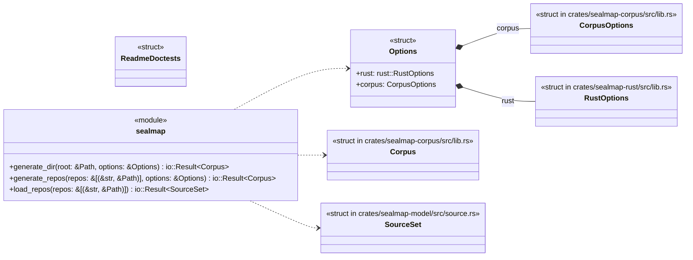
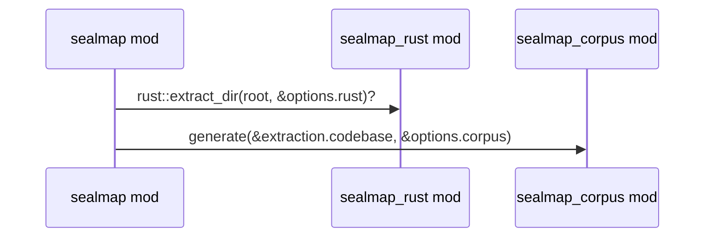
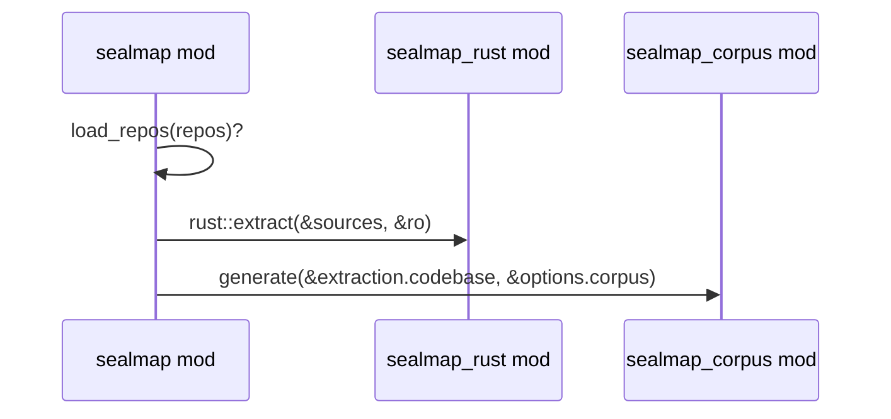
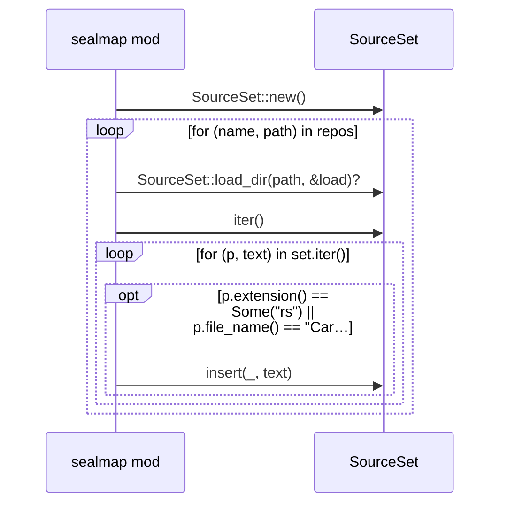

# `sym:cargo sealmap .` · crates/sealmap/src/lib.rs
> Deterministic, dense **codebase → Mermaid** generation for LLM agents.

## structure

## `sym:cargo sealmap . generate_dir().`
`pub fn generate_dir(root: &Path, options: &Options) -> io::Result<Corpus>` · L94-L98
> Load, extract and project a single directory.

## `sym:cargo sealmap . generate_repos().`
`pub fn generate_repos(repos: &[(&str, &Path)], options: &Options) -> io::Result<Corpus>` · L100-L111
> Load several repositories as one codebase.

## `sym:cargo sealmap . load_repos().`
`pub fn load_repos(repos: &[(&str, &Path)]) -> io::Result<SourceSet>` · L113-L126
> Load several repositories into one [`SourceSet`] under `<name>/` prefixes.

