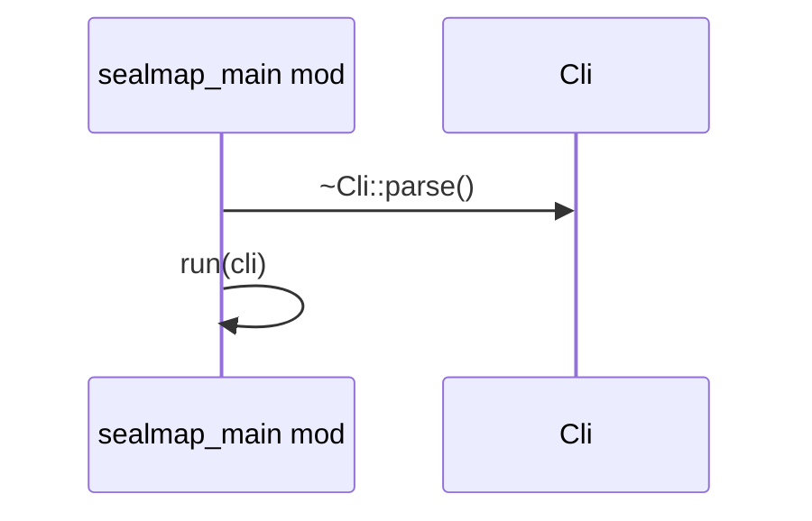
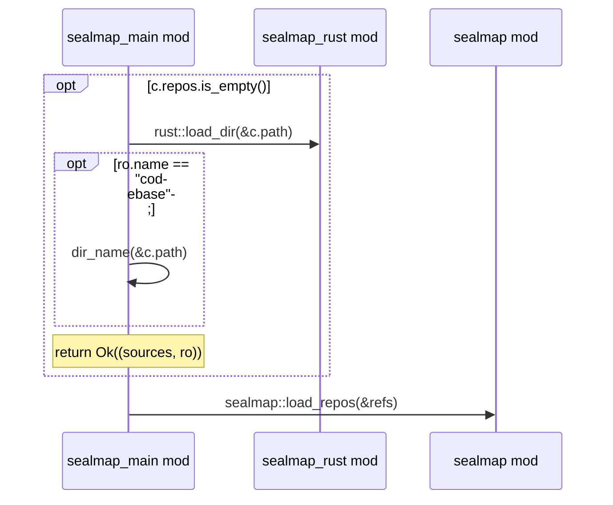

# `sealmap_main` · crates/sealmap/src/main.rs
> `sealmap` command-line tool.

## structure

## `sealmap_main::main`
`fn main() -> ExitCode` · L75-L84

## `sealmap_main::run`
`fn run(cli: Cli) -> Result<ExitCode, String>` · L86-L151

## `sealmap_main::load`
`fn load(c: &Common, opts: &Options) -> Result<(SourceSet, sealmap::rust::RustOptions), String>` · L153-L175

