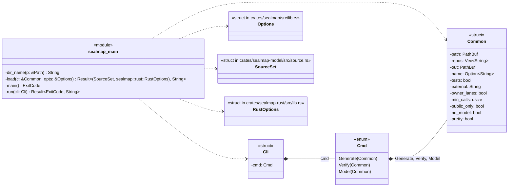
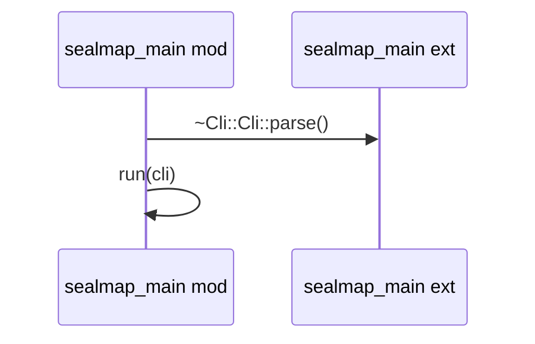
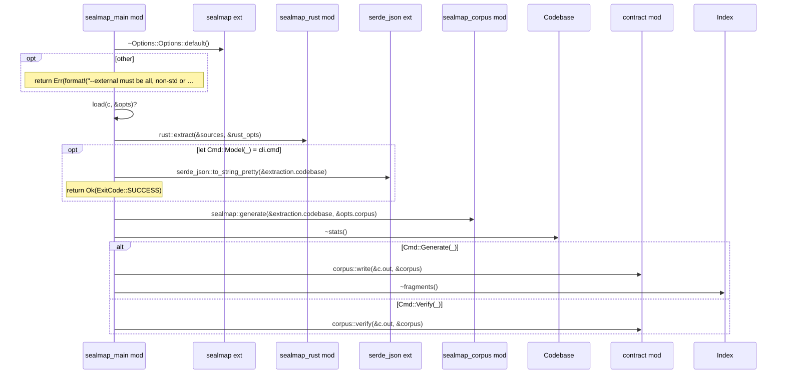
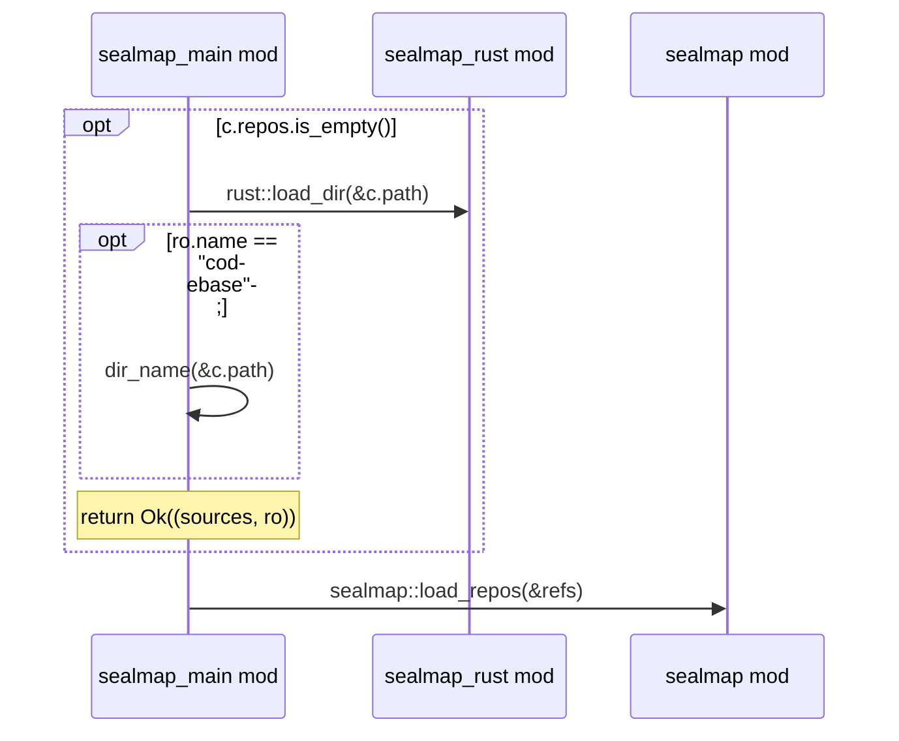

# `sym:cargo sealmap_main .` · crates/sealmap/src/main.rs
> `sealmap` command-line tool.

## structure

## `sym:cargo sealmap_main . main().`
`fn main() -> ExitCode` · L75-L84

## `sym:cargo sealmap_main . run().`
`fn run(cli: Cli) -> Result<ExitCode, String>` · L86-L151

## `sym:cargo sealmap_main . load().`
`fn load(c: &Common, opts: &Options) -> Result<(SourceSet, sealmap::rust::RustOptions), String>` · L153-L175

